# Monero Inheritence Management (VaultWarden Emergency Contacts)

```
TLDR: using Vaultwarden you can automatically send a mail containing what your monero wallet's seed phrase to whoever should obtain your monero after you pass away.
```


## **Introduction**

Uncle Rich has worked hard his entire life and has managed to save a large amount of Monero. Now approaching the later years of his life, he is worried about what will become of his financial legacy. Having no kids of his own, he decides he wants to pass on his wealth to the closest thing to a son he has, his Nephew Nick. Uncle Rich figures the easiest way to do this is by giving Nephew Nick the seedphrase to his wallet but Uncle Rich wants to transfer his wealth only after he passes away. The critical question thus becomes "How does one securely share a secret from beyond the grave?" In this article we will see how to do exactly that, specifically using **Vaultwarden** , and its **Emergency Contacts** feature. 

## **Overview**

In order to avoid relying on third parties, we need a sovereign solution that is FOSS, self-hostable, end-to-end encrypted and that stores data in a zero-knowledge environment. Vaultwarden is the ideal candidate for this task as it is an alternative server implementation of Bitwarden that is written in Rust and is memory-safe. It is more light-weight than the full Bitwarden stack and can be easily deployed on a VPS for less than €5 per month. 

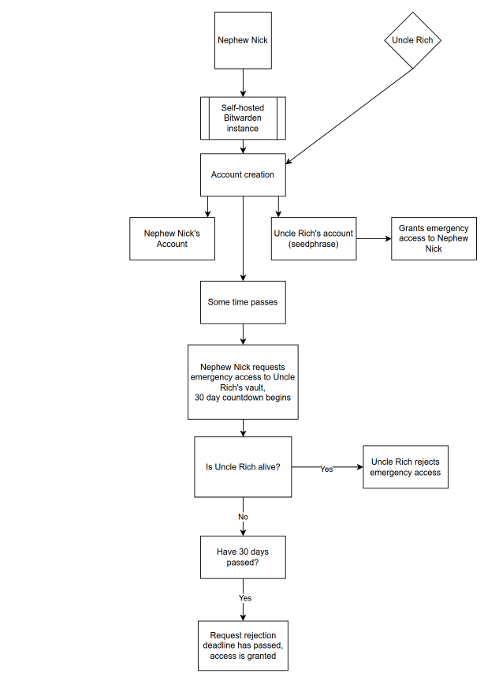

Nephew Nick will start by setting up a self-hosted instance where both Uncle Rich and him will create an account. After setting up a reliable notification system, Uncle Rich will grant Nephew Nick Emergency Access to his account, where he has his seedphrase stored. After Nephew Nick accepts Emergency Access, everything will be set in place. In the future, when Nephew Nick requests access to Uncle Rich's vault, Uncle Rich will receive a notification and have a predetermined amount of time to reject the Emergency Access request. If Uncle Rich is still alive at this point, that is trivially easy to do. If Uncle Rich is no longer with us, he will not be able to reject the Emergency Access request. As a result, after the allotted time has expired, Nephew Nick will be notified his request has been granted and will be able to access Uncle Rich's vault where the seedphrase lies. 

## **Prerequisites**

Starting from Nephew Nick's perspective: 


Prerequisites:   
\- A [domain name](../anondomain/index.md) \- Nephew Nick purchased one anonymously using Monero on **Njalla** using their onion link.   
\- A [VPS](../anonymousremoteserver/index.md) \- Nephew Nick purchased one anonymously using Monero on **Kyun** using their onion link. Specs consisting of 1 core and 2 GB of memory are more than enough to self-host everything needed for the setup.   
  
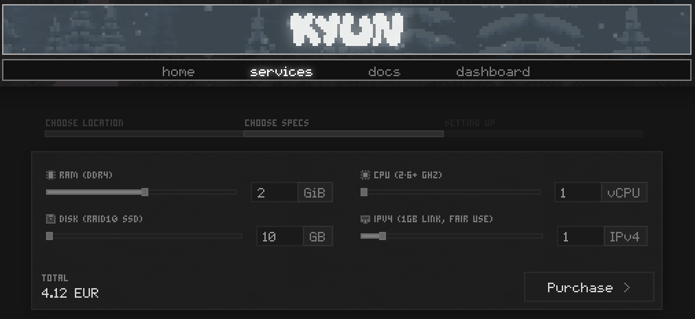

Nephew Nick knows that Uncle Rich is getting quite old. Uncle Rich is still capable of using a computer but in order for this setup to work it must provide as little friction as possible. As such, we will keep things simple and use email notifications from a self-hosted server. While not overtly private, email is a suitable option in this case given its ease of use and because it is being used strictly for notifications with no sensitive information is being transmitted. Setting up a self-hosted mail server has been [covered before](../mailprivate/index.md), however, in this article we will do things a little different in line with running all of our services independently as docker containers. All publicly accessible services will be protected by SSL and we will use Traefik reverse proxy both to automatically procure wildcard SSL certificates and renew them, and also to route traffic to each respective subdomain. Let's get started. 

## **DNS Setup**

Nephew Nick will start by setting up DNS records on Njalla (note: no trailing dot is needed). Required are A records pointing to the VPS IP address for xmronly.com, *.xmronly.com, and mail.xmronly.com. An MX record for mail.xmronly.com is also required as shown. 

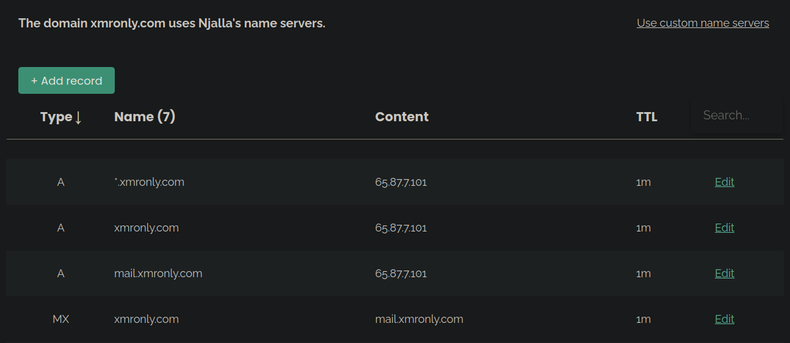

Over on Kyun, Nephew Nick will set a reverse DNS to point to mail.xmronly.com. 


With this complete, Nephew Nick can test the DNS records to make sure they are set up correctly and have propagated. With the expected outputs as shown below, we're ready to move on. 
    
    
    ~ ❯ dig @1.1.1.1 +short MX xmronly.com
    10 mail.xmronly.com.
    ~ ❯ dig @1.1.1.1 +short A mail.xmronly.com
    65.87.7.101
    ~ ❯ dig @1.1.1.1 +short -x 65.87.7.101
    mail.xmronly.com.
    

## **Infrastructure Setup**

Nephew Nick will SSH into the VPS and install docker. For instructions on how to install docker and verify it is working, check [this tutorial](../docker-intro/index.md#installation).

With docker installed, let's specify a docker network for our containers to use and let's create the required directories to segregate each service we'll be using. 
    
    
    # Create a docker network
    docker network create proxy
    
    # Create directories for each separate service
    mkdir -p docker/{traefik,mailserver,vaultwarden}
    

Next we'll set up a docker-compose file (**traefik.yml**) in /docker/traefik and tell it to grab an SSL certificate for our mail subdomain mail.xmronly.com. We'll deploy a tiny container (whoami) at this subdomain to test it works correctly. Note: a DNS challenge is required for Traefik to obtain wildcard SSL certificates, and any of a [number of DNS providers](https://doc.traefik.io/traefik/https/acme/#providers) will suffice with an access token obtained from your account with that provider. 
    
    
    services:
      traefik:
        image: docker.io/traefik:latest
        container_name: traefik
        ports:
          - '80:80'
          - '443:443'
        command:
          - '--api=true'
          - '--api.dashboard=false' 
          - '--providers.docker=true'
          - '--providers.docker.exposedbydefault=false'
          - '--certificatesresolvers.letsencrypt.acme.dnschallenge=true'
          - '--certificatesresolvers.letsencrypt.acme.dnschallenge.provider=njalla'
          - '--certificatesresolvers.letsencrypt.acme.email=email_goes_here'
          - '--certificatesresolvers.letsencrypt.acme.dnschallenge.delayBeforeCheck=2s'
          - '--certificatesresolvers.letsencrypt.acme.dnschallenge.resolvers=1.1.1.1:53,8.8.8.8:53'
          - '--certificatesresolvers.letsencrypt.acme.storage=/acme/acme.json'
          - '--entrypoints.web.address=:80'
          - '--entrypoints.web.http.redirections.entrypoint.to=websecure'
          - '--entrypoints.web.http.redirections.entrypoint.scheme=https'
          - '--entrypoints.websecure.address=:443'
          - '--entrypoints.websecure.http.tls=true'
          - '--entrypoints.websecure.http.tls.certResolver=letsencrypt'
          - '--entrypoints.websecure.http.tls.domains[0].main=xmronly.com'
          - '--entrypoints.websecure.http.tls.domains[0].sans=*.xmronly.com'
        environment:
          - 'NJALLA_TOKEN=token_goes_here'
        volumes:
          - ./acme/:/acme
          - /var/run/docker.sock:/var/run/docker.sock:ro
        labels:
          - 'traefik.enable=true'
          - 'traefik.http.routers.traefik.entryPoints=websecure'
          - 'traefik.http.routers.traefik.service=api@internal'
        restart: unless-stopped
        networks: 
        - 'proxy'
    
      whoami:
        image: docker.io/traefik/whoami:latest
        labels:
          - 'traefik.enable=true'
          - 'traefik.http.routers.whoami.entrypoints=websecure'
          - 'traefik.http.routers.whoami.rule=Host(`mail.xmronly.com`)'
        restart: unless-stopped
        networks:
          - proxy
    
    networks:
      proxy:
        external: true
    

Start the containers with **docker compose -f traefik.yml up -d** then navigate to https://mail.xmronly.com and verify the SSL certificate is present. 

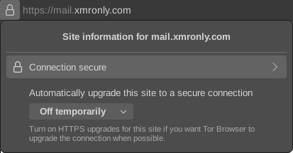

Next we'll set up a docker-compose file (**mailserver.yml**) in /docker/mailserver. 
    
    
    services:
      mailserver:
        image: ghcr.io/docker-mailserver/docker-mailserver:latest
        container_name: mailserver
        hostname: mail.xmronly.com
        ports:
          - "25:25"    # SMTP  (explicit TLS => STARTTLS, Authentication is DISABLED => use port 465/587 instead)
          - "143:143"  # IMAP4 (explicit TLS => STARTTLS)
          - "465:465"  # ESMTP (implicit TLS)
          - "587:587"  # ESMTP (explicit TLS => STARTTLS)
          - "993:993"  # IMAP4 (implicit TLS)
        volumes:
          - ./data/mailserver/mail-data/:/var/mail/
          - ./data/mailserver/mail-state/:/var/mail-state/
          - ./data/mailserver/mail-logs/:/var/log/mail/
          - ./data/mailserver/config/:/tmp/docker-mailserver/
          - /etc/localtime:/etc/localtime:ro
          - /root/docker/traefik/acme/acme.json:/etc/letsencrypt/acme.json:ro #specify path
        environment:
          - "SSL_TYPE=letsencrypt"
          - "SSL_DOMAIN=mail.xmronly.com"
          - "ENABLE_FAIL2BAN=1"
        restart: unless-stopped
        stop_grace_period: 1m
        cap_add:
          - NET_ADMIN
        healthcheck:
          test: "ss --listening --tcp | grep -P 'LISTEN.+:smtp' || exit 1"
          timeout: 3s
          retries: 0
        networks: 
        - 'proxy'
    
    networks:
      proxy:
        external: true
    

Start the container with **docker compose -f mailserver.yml up -d** , then add a user and configure the DKIM settings. 
    
    
    # Add a user
    docker exec mailserver setup email add no-reply@xmronly.com password_goes_here
    
    # Generate the DKIM configuration
    docker exec mailserver setup config dkim
    

To obtain the DKIM info, navigate to docker/mailserver/data/dms/config/opendkim/keys/xmronly.com/mail.txt and copy the info removing all quotes/punctuation such that you are left with an output (that you will need to copy later) that looks like this: 
    
    
    v=DKIM1; k=rsa; p=MIIBIjANBgkqhkifHSvSJUf3e17tNhF1lPPsNfEGtrwywCmXS5GvAuzsP29n9k/Tp5sUKFnT63o0Z9r3pC7sSuAWo3x9N38XmYlSwoztODvM5WEfHSvSJUf3e17tNhF1lPPsNfEGtrwywCmXS5GvAuzsP29n9k/Tp5sUKFnT63o0Z9r3pC7
    

Back on Njalla, add a TXT record using the following: 
    
    
    Name: @
    Content: v=spf1 mx ~all
    

Add another TXT record using the following: 
    
    
    Name: _dmarc
    Content: v=DMARC1; p=none; sp=none; fo=0; adkim=r; aspf=r; pct=100; rf=afrf; ri=86400; rua=mailto:dmarc.report@xmronly.com; ruf=mailto:dmarc.report@xmronly.com
    

Finally, add a TXT record using the DKIM information from above: 
    
    
    Name: mail._domainkey
    Content: v=DKIM1; k=rsa; p=MIIBIjANBgkqhkifHSvSJUf3...
    

With everything complete, your DNS should look like this: 


Finally, restart the mailserver for these changes to take effect. 
    
    
    docker compose -f mailserver.yml down
    docker compose -f mailserver.yml up -d
    

You can confirm everything is working correctly by configuring Thunderbird to use your mail server and sending out a test email on **https://mail-tester.com**. 

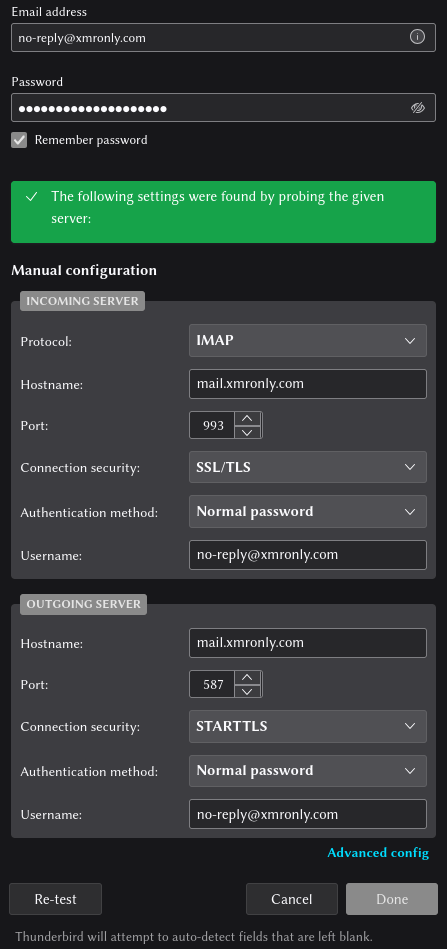 

The last step is to set up a docker-compose file (**vaultwarden.yml**) in /docker/vaultwarden. 
    
    
    services:
      vaultwarden:
        image: vaultwarden/server:latest
        container_name: vaultwarden
        volumes:
          - ./data/:/data/
        labels:
          - 'traefik.enable=true'
          - 'traefik.http.routers.vaultwarden.entryPoints=websecure'
          - 'traefik.http.routers.vaultwarden.rule=Host(`vaultwarden.xmronly.com`)'
        environment:
          - 'DOMAIN=https://vaultwarden.xmronly.com'
          - 'SIGNUPS_ALLOWED=true'
          - 'SMTP_HOST=mail.xmronly.com'
          - 'SMTP_FROM=no-reply@xmronly.com'
          - 'SMTP_SECURITY=starttls'
          - 'SMTP_USERNAME=no-reply@xmronly.com'
          - 'SMTP_PASSWORD=password_goes_here'
        restart: unless-stopped
        networks:
          - proxy
    
    networks:
      proxy:
        external: true
    

Start the container with **docker compose -f vaultwarden.yml up -d**. With the final piece of the infrastructure in place, Nephew Nick and Uncle Rich can now proceed to creating their accounts. 

## **Vaultwarden Setup (Nephew Nick)**

Continuing with the same perspective, Nephew Nick will head to **https://vaultwarden.xmronly.com** and start by creating an account then using it to sign in. 

 

When prompted, Nephew Nick will verify his email address. 

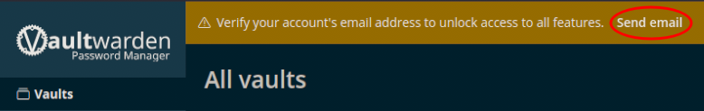 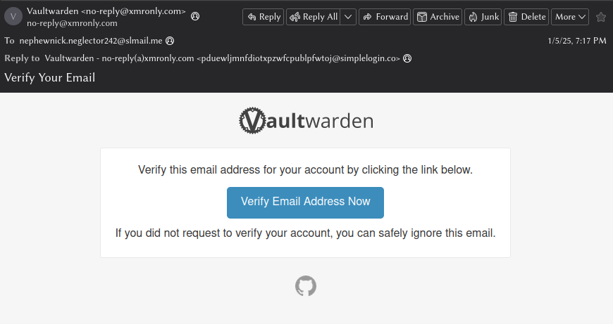

With verification complete, Nephew Nick will confirm his account fingerprint phrase as this information will be needed for a future step. This is located on the sidebar under Settings -> My account. 


## **Vaultwarden Setup (Uncle Rich)**

Switching over to Uncle Rich's perspective now: 


Uncle Rich will start by creating an account and then using it to sign in. 

 

When prompted, Uncle Rich will verify his email address. 

 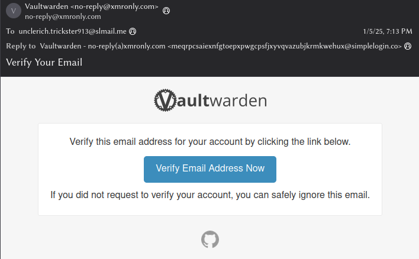

With verification complete, Uncle Rich can proceed to set up an entry containing his seedphrase. 

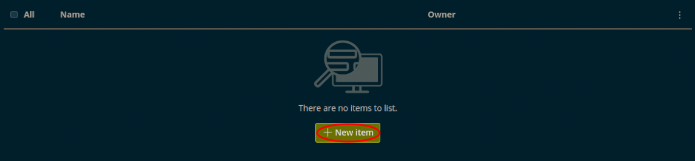 

Next, Uncle Rich will add Nephew Nick as an Emergency Contact. This is found on the sidebar under Settings -> Emergency access. 

 

## **Vaultwarden Setup (Accepting Emergency Access)**

Switching back to Nephew Nick's perspective now: 


Nephew Nick receives an email notification that Uncle Rich has invited him to be an Emergency Contact. Clicking the link prompts a log in, automatically accepting the request. 

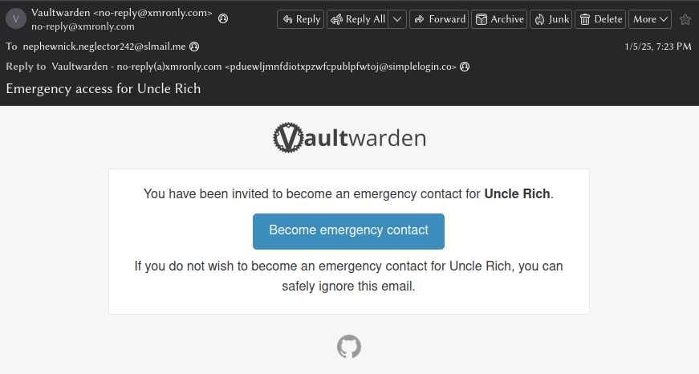 

Upon signing in, there is a notification indicating that the invitation has been accepted and that Nephew Nick's identity must be confirmed (by Uncle Rich). Nephew Nick can see the status of his designation as an Emergency Contact under Settings -> Emergency access on the sidebar. 

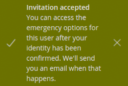 

## **Vaultwarden Setup (Confirming Identity)**

Switching back to Uncle Rich's perspective now: 


Uncle Rich receives an email notification that Nephew Nick has accepted the invitation to become an Emergency Contact and that Uncle Rich must confirm his identity. 


Uncle Rich logs in and navigates to Settings -> Emergency access on the sidebar. Next he clicks on Options -> Confirm to make Nephew Nick a Trusted Emergency Contact. Lastly, Uncle Rich confirms with Nephew Nick that his account fingerprint phrase matches from the previous step and clicks Confirm. 

 

## **Vaultwarden Setup (Requesting Access)**

Switching back to Nephew Nick's perspective now: 


Nephew Nick receives an email notification that he has been confirmed as an Emergency Contact for Uncle Rich. 

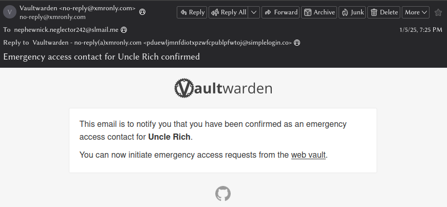

With that, the setup is fully complete. Nephew Nick is able to request Emergency Access and Uncle Rich can reject it according to his wishes as long as he is still alive. 

  
  
  


[Some times passes...] 

  
  
  


Nephew Nick has not heard from Uncle Rich in a long time and fears the worst has happened. After signing in, he navigates to Settings -> Emergency access on the sidebar and requests Emergency Access to Uncle Rich's vault. 

 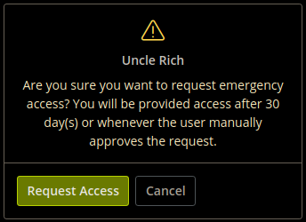

## **Obtaining Access (Scenario 1: Rejection)**

Switching back to Uncle Rich's perspective now: 


Uncle Rich receives an email notification that Nephew Nick has requested Emergency Access. Being that Uncle Rich is still alive and doesn't want access to his Monero seedphrase to be granted until he has passed away, he will reject the request. 


After logging into his account, Uncle Rich navigates to Settings -> Emergency access in the side bar and rejects Nephew Nick's request. 


From Nephew Nick's perspective, he will receive an email notification saying his request has been rejected by Uncle Rich. Nephew Nick can confidently conclude that Uncle Rich is therefore still alive and can try to visit him in person. 

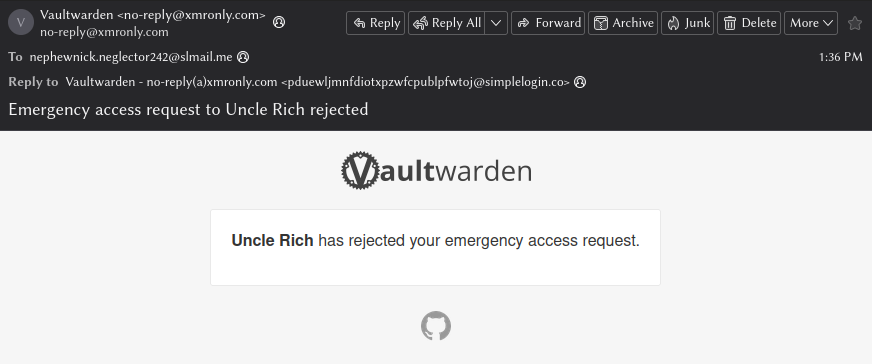

## **Obtaining Access (Scenario 2: Acceptance)**

In this scenario, Uncle Rich indeed has passed away. 


From Nephew Nick's perspective, there is nothing to do but wait for the 30 day interval to expire. After 30 days have passed, Nephew Nick receives an email. Note: the text of this notification is the confusingly same wheter Uncle Rich has manually approved access or wheter the timeframe has expired. 

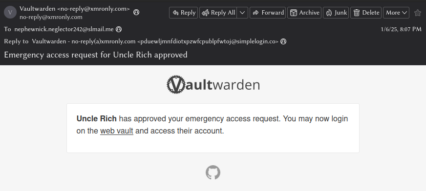

Nephew Nick signs into his account and navigates to Settings -> Emergency access. He is now able to view Uncle Rich's vault. 

 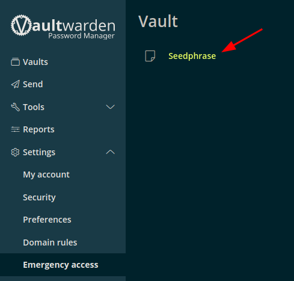

And just like that Nephew Nick has received Uncle Rich's seedphrase! 


## **Restoring a Wallet from Seedphrase**

Nephew Nick opens up his Monero Wallet GUI and navigates to "Restore wallet from keys or mnemonic seed" 


He gives the wallet a name and chooses a location to save it. Finally Nephew Nick input's Uncle Rich's seedphrase. 


Proceeding to the next screen, Nephew Nick inputs a strong password and saves it in his password manager. 


Finally, he selects a node for the connection. Connecting to your own node is recommended but in this example we will use a remote node. 


With the connection established, all that is left to do is to wait synchronization to finish. 


Nephew Nick has successfully restored Uncle Rich's wallet using the seedphrase! 


