# How to setup your Monero wallet

```
TLDR: you can setup your Monero wallet on either Linux, Whonix or Tails to transact privately and anonymously.
```


In this tutorial we're going to take a look at how to setup a monero wallet
locally, how to receive some monero there, and how to send monero to someone
else.

## _OPSEC Recommendations:_

  1. Hardware : (Personal Computer / Laptop)

  2. Host OS: [Linux](../linux/index.md)

  3. Hypervisor: [libvirtd QEMU/KVM](../hypervisorsetup/index.md)

  4. Virtual Machine: [Linux](../hypervisorsetup/index.md) or [Whonix](../whonixqemuvms/index.md) or [Tails](../tailsqemuvm/index.md)
  


I recommend using this setup into one of the above mentioned VMs, either for
[Private use](../privacy/index.md), or [Anonymous use](../anonymityexplained/index.md), as per the [4 basic OPSEC levels](../opsec4levels/index.md).

## **Wallet Setup**

**GUI Wallet Setup**

Now on whonix there can be some issues with syncing to the monero nodes over
the CLI monero wallet, due to the slow tor network and connection timeouts, So
we'll first cover how to install the GUI monero wallet:

First let's download the monero GUI wallet from [https://getmonero.org](https://getmonero.org/downloads/index.md): (.onion address: [http://monerotoruzizulg5ttgat2emf4d6fbmiea25detrmmy7erypseyteyd.onion](http://monerotoruzizulg5ttgat2emf4d6fbmiea25detrmmy7erypseyteyd.onion/downloads/index.md))


Then we unpack it on the desktop and run the appimage:

    
    
    [ Whonix ] [ /dev/pts/5 ] [~]
    → mv /home/user/.tb/tor-browser/Browser/Downloads/monero-gui-linux-x64-v0.18.3.3.tar.bz2 ~/Desktop/
    
    [ Whonix ] [ /dev/pts/5 ] [~/Desktop]
    → cd Desktop
    
    
    [ Whonix ] [ /dev/pts/5 ] [~/Desktop]
    → tar -xvf monero-gui-linux-x64*.tar.bz2                                                                                                                                                                                                                            (2)
    monero-gui-v0.18.3.3/
    monero-gui-v0.18.3.3/LICENSE
    monero-gui-v0.18.3.3/extras/
    monero-gui-v0.18.3.3/extras/monero-blockchain-ancestry
    
    [...]
    
    monero-gui-v0.18.3.3/monero-wallet-gui
    monero-gui-v0.18.3.3/monero-wallet-gui.AppImage
    monero-gui-v0.18.3.3/monerod
    
    [ Whonix ] [ /dev/pts/5 ] [~/Desktop]
    → cd monero-gui-v0.18.3.3
    
    [ Whonix ] [ /dev/pts/5 ] [~/Desktop/monero-gui-v0.18.3.3]
    → ls
    LICENSE  extras  monero-gui-wallet-guide.pdf  monero-wallet-gui  monero-wallet-gui.AppImage  monerod
    
    [ Whonix ] [ /dev/pts/5 ] [~/Desktop/monero-gui-v0.18.3.3]
    → ./monero-wallet-gui.AppImage                                                                                                                                                                                                                                             (130)
    2024-04-27 09:57:47.456 W Qt:5.15.13 GUI:- | screen: 3840x2160 - available: QSize(3840, 2129) - dpi: 96 - ratio:2.22803
    2024-04-27 09:57:49.847 W qrc:/qt-project.org/imports/QtQuick/Dialogs/DefaultFileDialog.qml:413:17: QML ToolButton: Binding loop detected for property "implicitHeight"
    2024-04-27 09:57:49.850 W qrc:/qt-project.org/imports/QtQuick/Dialogs/DefaultFileDialog.qml:309:21: QML Button: Binding loop detected for property "implicitHeight"
    
    

Now that the archive is extracted, make sure that the monero wallet gets added
to the list of software of your OS:

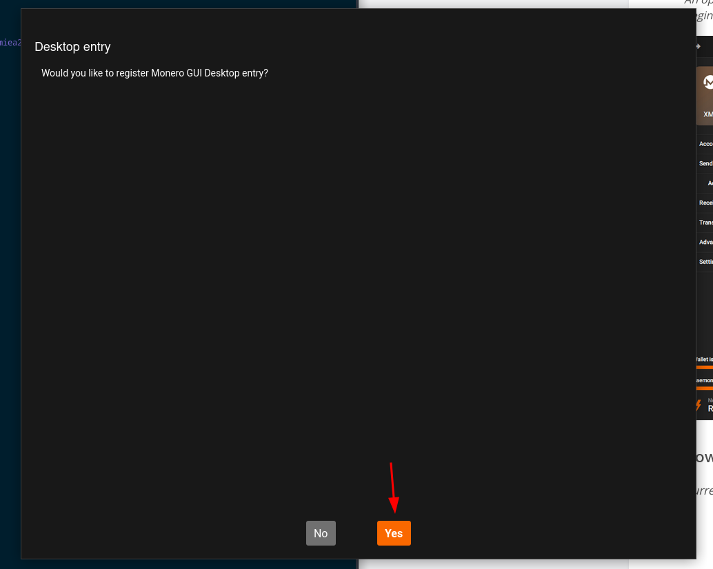 

Here we use advanced mode as we want to choose our node:

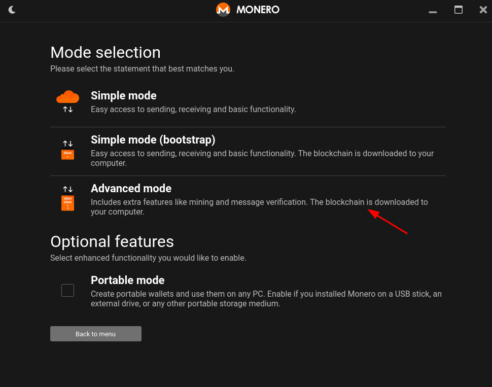 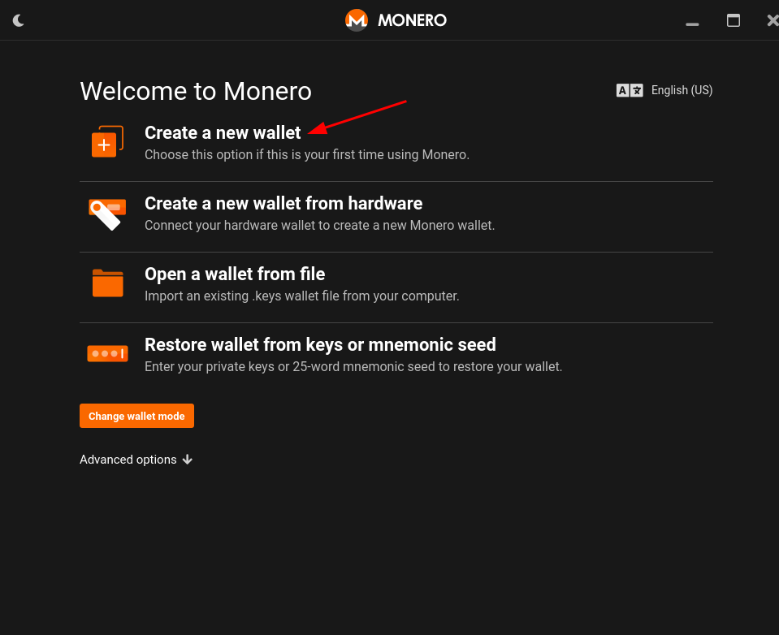 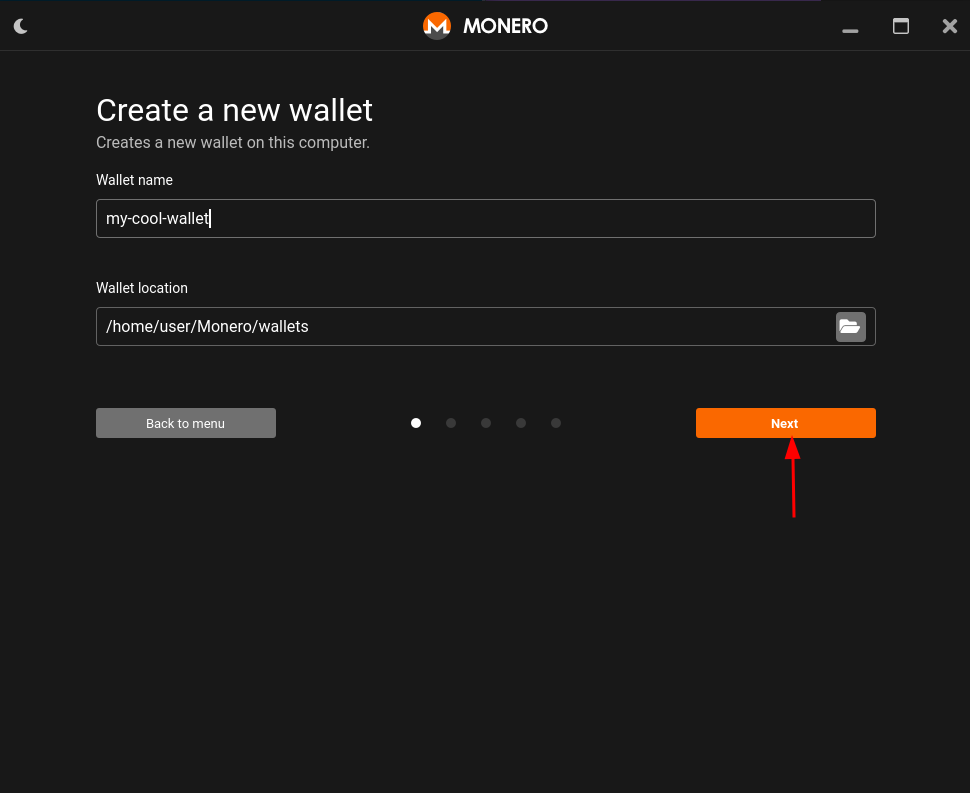 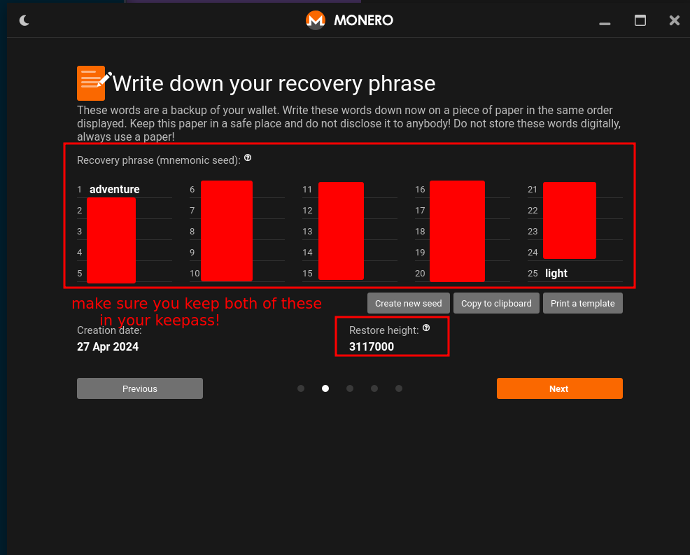

Here very important, make sure you save your monero mnemonic phrase (recovery
phrase) into your keepass, along with the recovery height, :

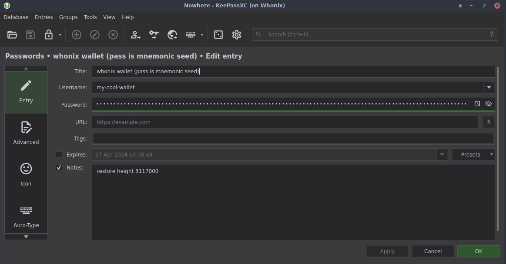 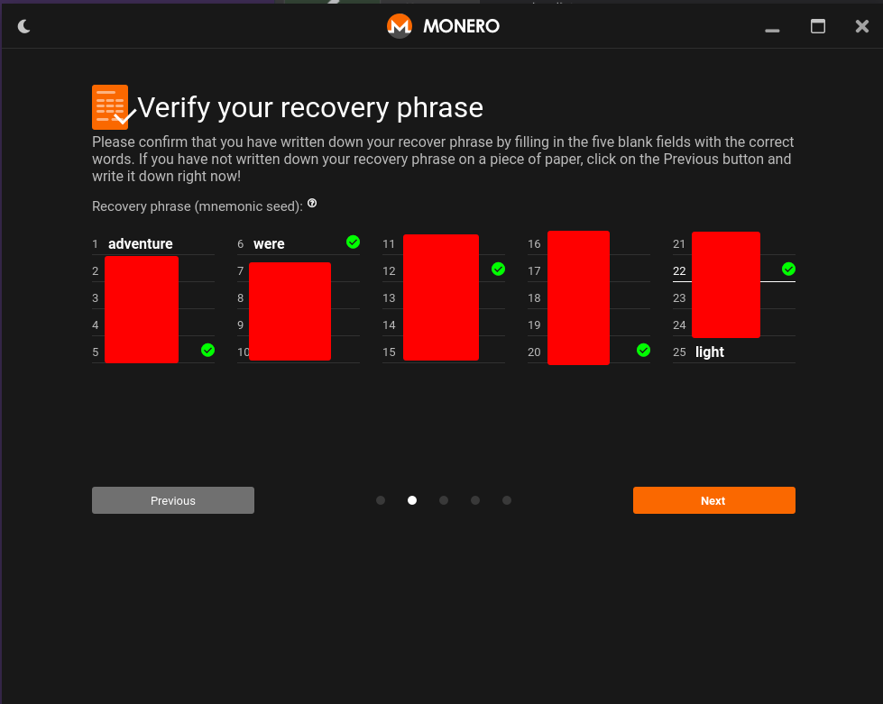

Then have a wallet password (local password) to open your wallet locally::

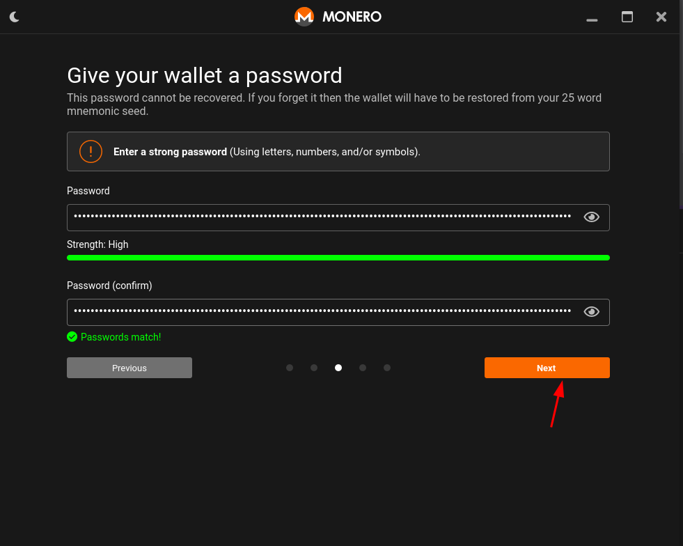  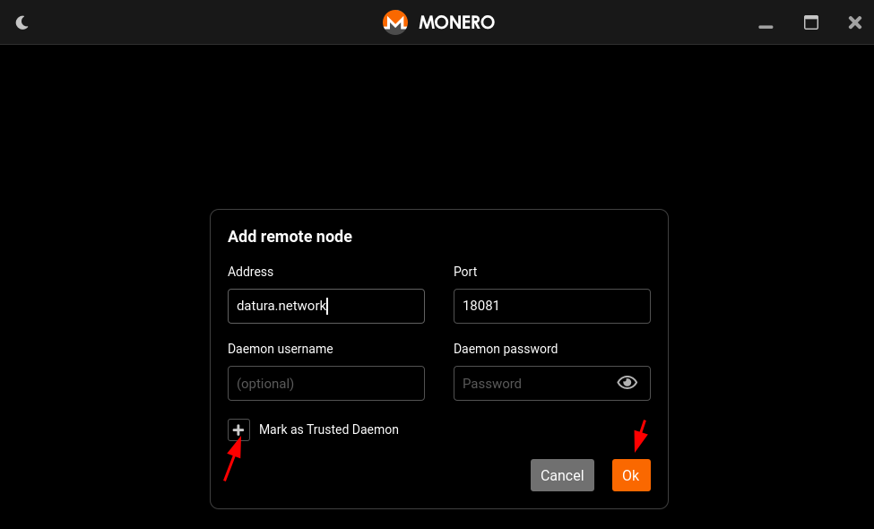

Here we pick a clearnet monero node (if you don't want to, scroll down to know
how to setup a .onion monero node)

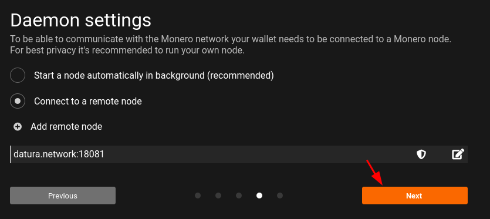 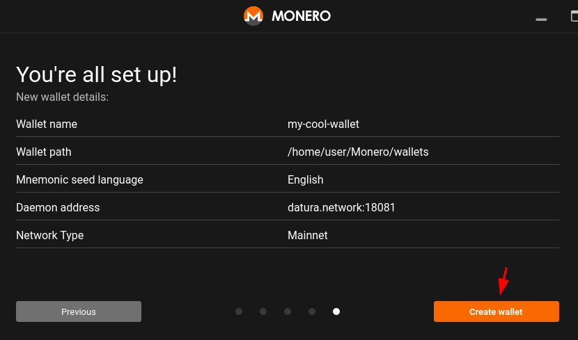 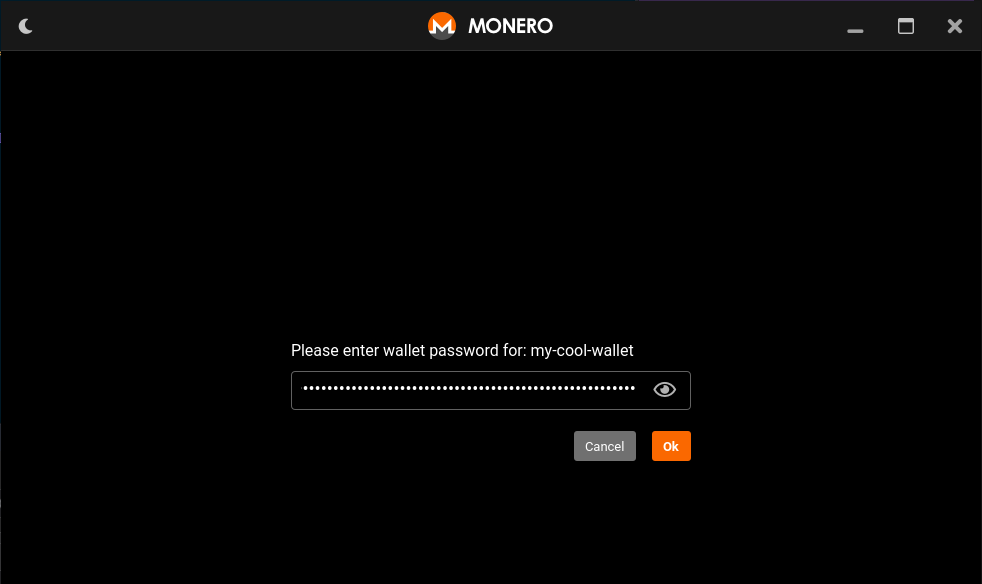 

Here just wait for the monero wallet to finish synchronizing with the monero
node:

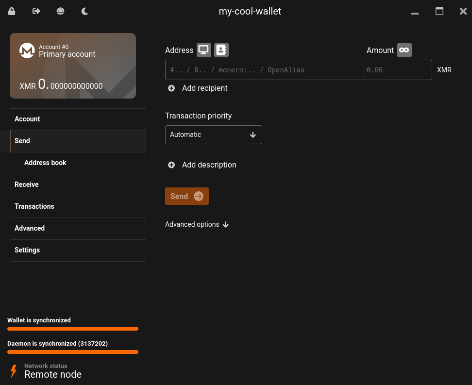

Now here you can use the monero wallet like that without going through tor
(but here we're in whonix so it goes through tor anyway), if you want to use
.onion monero nodes you will need to enable the SOCKS5 proxy option inside the
wallet:

 

Now with this setup we can use .onion monero nodes as follows (either pick one
you trust from
[https://monero.fail/](https://monero.fail/?chain=monero&network=mainnet&onion=on)
for example my .onion monero node at this URL:
**http://nowherejezfoltodf4jiyl6r56jnzintap5vyjlia7fkirfsnfizflqd.onion:18081**
or more preferably [(as Chainalysis is running an unknown amount of malicious
nodes)](../chainalysisattempts/index.md), host your own monero node as
explained in [this tutorial.](../monero2024/index.md)

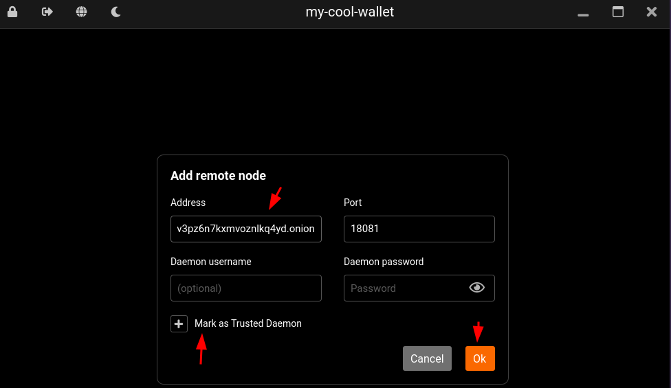

Here again, wait for the monero wallet to finish synchronizing to be able to
receive and send monero:

 

Now that we're setup let's get some monero somewhere:

_Sidenote:_ **if you want to get your first monero** and you don't have any
crypto / fiat to start with, **check out the["earn
XMR"](https://xmrbazaar.com/search/earn-xmr/) section in xmrbazaar.com.** For
example, i offer monero to whoever contributes new blogposts to the OPSEC
section of my blog in this offer [here](https://xmrbazaar.com/listing/UsWA/).

Now that you received some monero, you can send them to whoever has a XMR
address like i do:

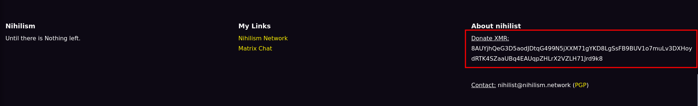

for example if you want to donate a few leftovers moneros like this feel free
to do so:


Keep in mind that services that ask you to pay monero, they will ask you to
send an EXACT monero amount for purchases (ex: 0.763011 XMR), that is
intentional, do not send more than requested as it is used to know from which
customer the monero comes from.

**BONUS: CLI Wallet Setup**

If you want to get the full Haxx0r vibes, you can install the monero CLI
wallet aswell:

    
    
    [ mainpc ] [ /dev/pts/2 ] [~/Desktop]
    → apt install monero -y
    
    [ mainpc ] [ /dev/pts/2 ] [~/Desktop]
    → monero-wallet-cli --version
    Monero 'Fluorine Fermi' (v0.18.0.0-unknown)
    
    

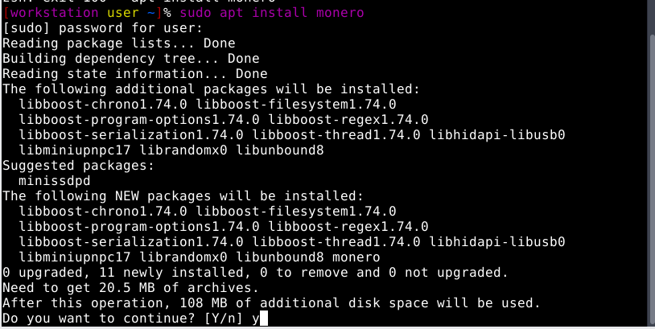

Once it finishes installing, create your monero wallet:


If you're doing it from a whonix VM, then say no to mining and use an onion-
based monero daemon (if not on a whonix VM, then use a clearnet monero node),
like the one i'm hosting, you can find a full list of other ones on
[monero.fail](https://monero.fail/) or on
[xmr.nowhere.moe](https://xmr.nowhere.moe/) :

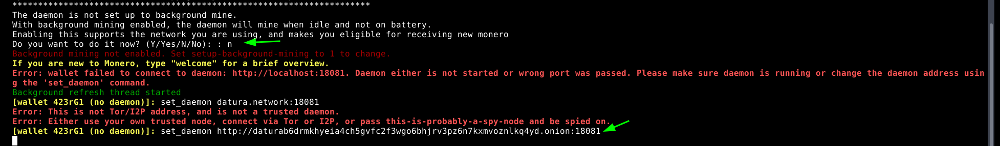

Wait for it to finish synchronizing, then you can go get some monero from a
vendor on localmonero.co (by giving them a wallet address you'd have created:

    
    
    apt install monero -y
    
    monero-wallet-cli
    #follow the instructions to create your wallet
    #synchronize it with this command:
    set_daemon http://uyjehlovjudh2wlvkp5a2seme5vgqc4o463atkv2ulsovloqrqw2icyd.onion:18081 trusted
    #then wait for the daemon to finish synchronizing, and type "refresh" regularly to make sure that it synchronizes with the node, expect to type that command a few times as tor connections are unstable at times.
    
    #OR you can use a clearnet monero node, but this is not recommended because you may be spied on!
    
    [wallet 49vq93 (no daemon)]: set_daemon  http://nowhere.moe:18081
    Error: This is not Tor/I2P address, and is not a trusted daemon.
    Error: Either use your own trusted node, connect via Tor or I2P, or pass this-is-probably-a-spy-node and be spied on.
    
    [wallet 49vq93 (no daemon)]: set_daemon http://nowhere.moe:18081 this-is-probably-a-spy-node
    Warning: connecting to a non-local daemon without SSL, passive adversaries will be able to spy on you.
    Daemon set to http://nowhere.moe:18081, untrusted
    [wallet 49vq93 (out of sync)]: refresh
    Starting refresh...
    
    [wallet 49vq93 (out of sync)]: refresh
    Starting refresh...
    Refresh done, blocks received: 19388
    Currently selected account: [0] Primary account
    Tag: (No tag assigned)
    Balance: 0.000000000000, unlocked balance: 0.000000000000
    
    

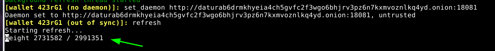

Once that's done, you can order monero from a non-KYC exchange [here](https://kycnot.me/?type=exchange) (out of which i recommend using [Haveno DEX](../haveno-client-f2f/index.md).

You're going to need to create a monero address first like so:

    
    
    [wallet 49vq93]: help
    
    Important commands:
    
    "welcome" - Show welcome message.
    "help all" - Show the list of all available commands.
    "help <****command>" - Show a command's documentation.
    "apropos <****keyword>" - Show commands related to a keyword.
    
    "wallet_info" - Show wallet main address and other info.
    "balance" - Show balance.
    "address all" - Show all addresses.
    "address new" - Create new subaddress.
    "transfer <****address> " - Send XMR to an address.
    "show_transfers [in|out|pending|failed|pool]" - Show transactions.
    "sweep_all <****address>" - Send whole balance to another wallet.
    "seed" - Show secret 25 words that can be used to recover this wallet.
    "refresh" - Synchronize wallet with the Monero network.
    "status" - Check current status of wallet.
    "version" - Check software version.
    "exit" - Exit wallet.
    
    "donate <****amount>" - Donate XMR to the development team.
    
    [wallet 49vq93 (out of sync)]: address new
    1  85j1rw64XoMhrXc55kwdCdFAmXaiU23MHYf1VBSLExTve5WM1NeFfw13wXrDeUumj48h5G4nuw3tuAxqpw5WyXniE8pE8uK  (Untitled address)
    [wallet 49vq93 (out of sync)]: address new localmonero
    2  89uyMGJunXfSC375iEptD2WLCb5uidKJSEuUYL3n5fRMg6ccM7L5prSUi9YGgGFPS5T8Z95BJh93HKykUYWECmNfJhNFb9z  localmonero


in this case, we'll use the
**89uyMGJunXfSC375iEptD2WLCb5uidKJSEuUYL3n5fRMg6ccM7L5prSUi9YGgGFPS5T8Z95BJh93HKykUYWECmNfJhNFb9z**
address for all trades on haveno DEX. **DO NOT USE IT ELSEWHERE! just like passwords, you want to have one per service**. If you want to receive monero from another place, create a new address.

Check out my other tutorials on Decentralised Finances below:

  1. [**✅ How to setup your Monero wallet**](../monero2024/index.md)
  2. [✅ Why can't I trust Centralised Exchanges, and random Monero nodes ?](../chainalysisattempts/index.md)
  3. [✅ Haveno Decentralised Exchange direct Fiat -> XMR transaction ⭐](../haveno-client-f2f/index.md)
  4. [✅ Haveno DEX Dispute resolution (Fiat -> XMR) ](../haveno-arbitrator/index.md)
  5. [✅ Haveno DEX Bank Transfer (ex: SEPA) -> XMR transaction ](../haveno-sepa/index.md)
  6. [✅ Haveno DEX Cash By Mail -> XMR transaction ⭐](../haveno-cashbymail/index.md)

