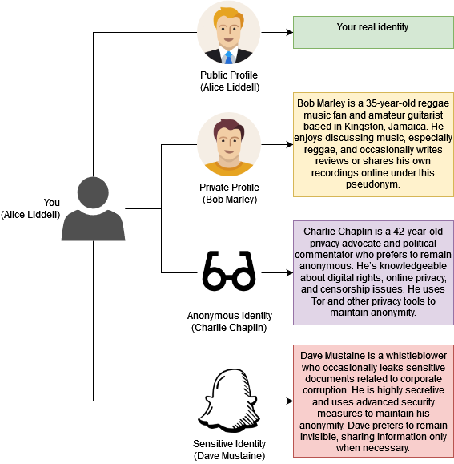

# How to Maintain Multiple Identities Online

```
TLDR: One identity per virtual machine.
```

In this tutorial, we’ll guide you through setting up and managing multiple online identities to enhance your privacy and security. We’ll discuss why this is crucial, how to establish distinct personas, and the steps you need to keep them isolated from each other.


## **OPSEC Recommendations**

Each identity should have a distinct virtual environment, using a dedicated VM with specific configurations:

  * **Public Identity:**
    * Hardware: Laptop / Desktop Computer
    * Host OS: Any preferred OS
    * VM: [Basic Windows VM](../hypervisorsetup/index.md)
  * **Private Identity:**
    * Hardware: Laptop / Desktop Computer
    * Host OS: [Linux](../linux/index.md) (e.g., Debian)
    * VM: Linux-based VM (Debian or Ubuntu)
  * **Anonymous Identity:**
    * Hardware: Laptop / Desktop Computer
    * Host OS: [Linux](../linux/index.md) (eg. Debian)
    * VM: [Whonix QEMU](../whonixqemuvms/index.md) with Tor integration
  * **Sensitive Identity:**
    * Hardware: Laptop / Desktop Computer
    * Host OS: [Linux](../linux/index.md)
    * VM: [Whonix QEMU](../whonixqemuvms/index.md), with VeraCrypt hidden volume


Refer to our guide on [Internet Use Segmentation](../internetsegmentation/index.md) for detailed setup instructions.

### **Why Maintain Multiple Online Identities?**

In the digital age, entities like advertisers, corporations, and hackers constantly monitor online activity. Using a single identity for everything allows these actors to build comprehensive profiles about you, threatening your privacy.

Multiple identities help compartmentalize your activities. This approach minimizes the risk of data leakage, prevents profiling, and puts you in control of what information is shared.

### **What We'll Be Doing**

We’ll create multiple VMs dedicated to different types of internet activities:

  * **Public Identity:** Real-world activities linked to your true identity.
  * **Private Identity:** Privacy-focused activities that don’t require anonymity.
  * **Anonymous Identity:** Activities requiring anonymity (e.g., whistleblowing).
  * **Sensitive Identity:** Highly secure activities where plausible deniability is crucial.


Each identity will have a unique persona, distinct writing style, and separate digital environment. Complete isolation will be maintained by using separate VMs and following strict operational security practices.

## **Setting Up Multiple Identities**

Start by defining distinct identities with clear boundaries:

  * **Public Identity (Alice Liddell):** Real name, linked to real-world activities.
  * **Private Identity (Bob Marley):** Pseudonym, may reveal the real name if necessary.
  * **Anonymous Identity (Charlie Chaplin):** No real identity linkage, anonymous persona.
  * **Sensitive Identity (Dave Mustaine):** Completely anonymous, sensitive activities only.


Each identity should exhibit different behaviors and writing styles to avoid detection via linguistic analysis.

## **Building the Characters**

Follow these principles when building each character:

  * **Distinctiveness:** Each identity should have unique traits and online behavior.
  * **Separation:** Identities should never interact or reference each other.
  * **Isolation:** Services, accounts, or data should not be shared across identities. Your identities should never interact in any way, nor should they know about each others existence.
  * **Dedicated VM for Each Identity:** Use separate VMs as described in the OPSEC section.


Below is a diagram showing how to build each character:



**Example Character Profiles:**

  * **Alice Liddell:** Tech enthusiast, writes formally on open-source software forums. Formal, technical, and informative. Uses industry-specific jargon and includes references to technical documentation.
  * **Bob Marley:** Music fan, uses casual language, active on music-related forums. Conversational and relaxed, often using slang or informal language. References musical terms and uses expressive language.
  * **Charlie Chaplin:** Anonymity advocate, terse language, posts in privacy-focused communities. Terse, direct, and factual. Avoids personal anecdotes and uses technical language related to privacy and security.
  * **Dave Mustaine:** Security expert, concise and secretive, uses encrypted channels only. Short, concise, and serious. Uses formal language and avoids any expressions that might reveal personal details or writing habits.


### **Character Interaction (Example)**

While these characters should never interact in reality, the following example illustrates how different identities can be made to appear distinct even when discussing the same topic. The brief interaction below is provided for demonstration purposes.

**Forum Topic:** "Is Basic Security Enough for Online Privacy?"

> **Alice Liddell:** "Basic security is a good start, but it's crucial to adopt more advanced measures as your digital footprint grows."
> 
> **Bob Marley:** "tru but who wants to stress over all that? just keep it simple and dont click on sketchy stuff and youll be fine, mon."

This example showcases the differences between Alice and Bob:

  * **Alice Liddell:** Uses a formal and cautious approach, advocating for the adoption of advanced security practices as an essential step.
  * **Bob Marley:** Takes a laid-back attitude, suggesting that keeping things simple and using common sense is sufficient.


The differences in tone, vocabulary, and approach clearly distinguish the two characters, reinforcing the separation between their online personas.

## **Stylometry: Risks and Real-World Cases**

Stylometry analyzes writing style to link identities. Consider these real-world examples:

  * [J.K. Rowling](https://www.smithsonianmag.com/science-nature/how-did-computers-uncover-jk-rowlings-pseudonym-180949824/): Revealed as the author of *The Cuckoo's Calling* through linguistic clues.
  * [Ted Kaczynski](https://theconversation.com/how-the-unabombers-unique-linguistic-fingerprints-led-to-his-capture-207681): The Unabomber was caught due to similarities in writing style.


To mitigate stylometry risks:

  * Vary your writing style, sentence structure, and vocabulary or use a local LLM to rewrite your messages before sending them.
  * Avoid using distinctive punctuation or spelling patterns.
  * Use paraphrasing tools or AI assistance to diversify your style.


### **Conclusion**

By following this tutorial, you’ve created multiple isolated online identities, each with its own dedicated environment and persona. This approach enhances your online privacy and security by compartmentalizing your digital life.

Always maintain discipline in keeping these identities separate, and regularly update your systems to protect against emerging threats. With careful implementation, you can take control of your digital presence.

### **What You've Accomplished**

\- Established distinct identities with unique personas.  
\- Configured virtual machines for each identity.  
\- Implemented robust operational security practices.

