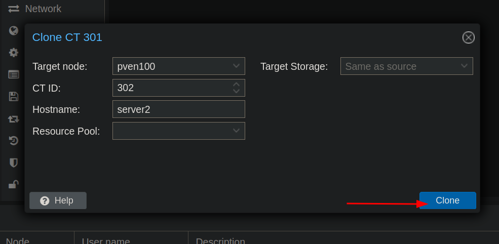
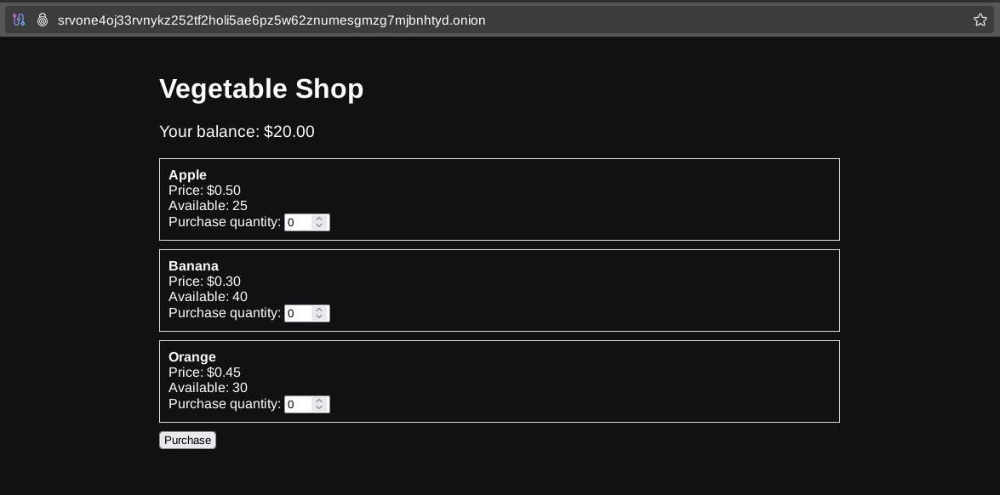
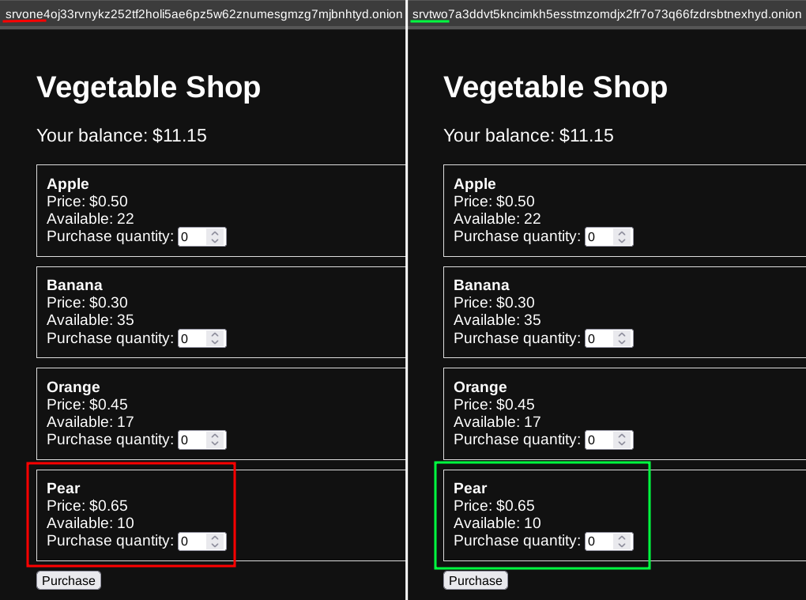
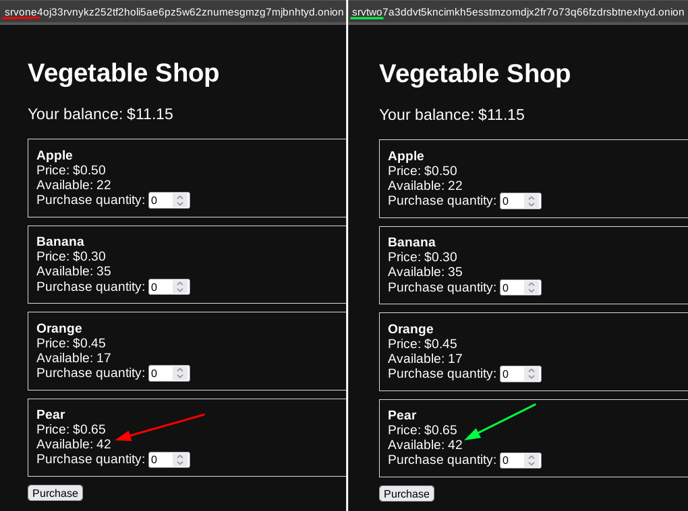

# How to setup a MySQL Master-Master replication over Tor

```
TLDR you can replicate MySQL databases in a Master-Master configuration over Tor. (Maintaining Serverside Anonymity on either side)
```

<video controls loop>
    <source src="0.mp4" type="video/mp4">
</video>


## **Introduction**


Your dark net [vegetable shop](../tornginxphpmysql/index.md) turned out to be a **wild success**!  
With the influx of new users placing orders, you might want to consider high availability and replication across different locations. MySQL has a built-in mechanism for automatic replication between database instances, requiring only a TCP connection and an account with replication permissions.

This works by having the **Master** DB send all queries to the **Slave** DB for execution. This setup is useful for real-time database backups through **Master-Slave** replication.

In this guide, we will configure MySQL **Master-Master** replication over Tor. In this configuration, each database acts as both **Master** and **Slave** , automatically replicating queries between them via a Tor connection.


## **Overview**

This guide assumes you already have the stack from the [last tutorial](../tornginxphpmysql/index.md) running.  


We will synchronize databases automatically between our two hidden services. If a user makes a purchase on one server, the second server will be notified immediately, executing the same SQL query on both databases. All communication between servers will occur over the Tor network, providing authentication and encryption without opening ports or generating SSL certificates. 

The MariaDB server running on each machine will connect to an onion address using socat as a background service configured with systemd, since it cannot utilize the socks5 proxy provided by the Tor client directly. 

For each server, we will later generate two onion v3 vanity URLs:  


  * **Public Hidden Service URL** \- This is used for accessing the hidden service as a client. Place this URL in your NGINX configuration to expose the vegetable shop service at port **80**.
  

  * **Internal Hidden Service URL** \- Used exclusively for inter-service communication.


Note that you can use only numbers **2-7** in the onion URL, as they are not part of the [base32 alphabet](https://en.wikipedia.org/wiki/Base32) used for encoding onion URLs. In this guide, I use words like **one** and **two** instead.

Below is a table showing what ports and services will be active on each server: 

- | Server 1 | Server 2  
---|---|---  
Hostname | server1 | server2  
Local HTTP (NGINX) port | 4440 | 4440  
Public HS URL | srvone[...].onion | srvtwo[...].onion  
External HTTP port | 80 | 80  
Internal* HS URL | intone[...].onion | inttwo[...].onion  
Local MySQL port | 3306 | 3306  
MySQL HS port | 33061 | 33062  
  
* The **Internal Hidden Service** is used exclusively for inter-server communication, and its URL should remain private.

Here is a full diagram of what we aim to achieve: 


## **Prerequisites**

To follow this guide, you need two instances running the stack set up in the [previous tutorial](../tornginxphpmysql/index.md). In production, it's recommended to place them on different servers and networks for high availability. However, for demonstration purposes, you may use [Proxmox VE](https://www.proxmox.com/en/).

If using Proxmox, after setting up the vegetable store once, you can clone it to create a second instance. 

    
  


Ensure you have socat installed on both servers:
    
    
    oxeo@serverN:~$ sudo apt update
    oxeo@serverN:~$ sudo apt install socat
    

## **Part 1**

The steps listed below should be executed on your first server. The second part of this guide will include commands for the second server with slight modifications, but they are mostly the same.  
This part contains explanations of how things work; the second part is primarily a list of commands.

## **MySQL Service Configuration**

You need to create a location for storing relay and binlog log files: 
    
    
    oxeo@server1:~$ sudo mkdir /var/log/mysql
    oxeo@server1:~$ sudo chown mysql:mysql /var/log/mysql
    

Now edit the **/etc/mysql/mariadb.conf.d/50-server.cnf** adding the following lines under the **[mysqld]** section: 
    
    
    [mysqld]
    server-id = 1
    log_bin = /var/log/mysql/mysql-bin.log
    binlog-ignore-db = test
    binlog-ignore-db = information_schema
    replicate-ignore-db = test
    replicate-ignore-db = information_schema
    relay-log = "mysql-relay-log"
    auto-increment-increment = 2
    auto-increment-offset = 1
    

  * **server-id** \- sets a unique identifier for this MySQL server instance within a replication setup. Each server in a replication topology must have a distinct server-id. 
  * **log_bin** \- specifies the path to hold binary logging data used by **Master** to queue SQL events to send. 
  * **binlog-ignore-db** \- excludes metadata and testing databases from being logged in binlog. 
  * **replicate-ignore-db** \- same thing but prevents replication of those databases. 
  * **relay-log** \- specifies the path for relay log data used by the **Slave** to queue events received from **Master**. 
  * **auto-increment-increment** \- the same as number of master nodes, it ensures every second row insertion to prevent write collisions. 
  * **auto-increment-offset** \- the same as current server number, sets the first row index to write into. In our setup it will write odd rowse for server 1 and even for server 2. 


Restart the MariaDB service to apply these changes: 
    
    
    oxeo@server1:~$ sudo systemctl restart mariadb
    

## **MySQL Replication User**

Add a replication user on the first server using MySQL shell. 
    
    
    oxeo@server1:~$ sudo mysql
    [...]
    MariaDB [(none)]> CREATE USER 'repl'@'%' IDENTIFIED BY 'YOUR_GENERATED_SLAVE_PASSWORD';
    Query OK, 0 rows affected (0.001 sec)
    
    MariaDB [(none)]> grant replication slave on *.* to 'repl'@'%';
    Query OK, 0 rows affected (0.001 sec)
    

You can generate a reasonably secure slave password with the following command: 
    
    
    oxeo@server1:~$ tr -dc 'A-Za-z0-9' < /dev/urandom | head -c 12 && echo
    3adaQtXsu50w
    

Replace **YOUR_GENERATED_SLAVE_PASSWORD** with the generated password and note it down for configuring the second server. 

## **Tor Configuration**

To make our MySQL instance accessible to the second server, create another hidden service in **/etc/tor/torrc**. You should have two hidden services: one public and one internal.  
On the internal hidden service, we will also expose SSH which will come handy later. 
    
    
    HiddenServiceDir /var/lib/tor/veggie_service/
    HiddenServicePort 80 127.0.0.1:4440
    
    HiddenServiceDir /var/lib/tor/internal_service/
    HiddenServicePort 33061 127.0.0.1:3306
    HiddenServicePort 22 127.0.0.1:22
    

Restart the Tor daemon to apply these changes (Tor will automatically create necessary directories and set permissions): 
    
    
    oxeo@server1:~$ sudo systemctl restart tor
    

Verify that the directories were successfully created. 
    
    
    oxeo@server1:~$ sudo ls -la /var/lib/tor/internal_service
    total 23
    drwx--S--- 3 debian-tor debian-tor  6 Feb 16 17:23 .
    drwx--S--- 5 debian-tor debian-tor 11 Feb 16 17:23 ..
    drwx--S--- 2 debian-tor debian-tor  2 Feb 16 17:23 authorized_clients
    -rw------- 1 debian-tor debian-tor 63 Feb 16 17:23 hostname
    -rw------- 1 debian-tor debian-tor 64 Feb 16 17:23 hs_ed25519_public_key
    -rw------- 1 debian-tor debian-tor 96 Feb 16 17:23 hs_ed25519_secret_key
    

Of course automatically generated hidden service hostname will be random so you need to [generate vanity URLs](../torwebsite/index.md) for **srvone[...].onion** and **intone[...].onion** and copy appropriate keys to **/var/lib/tor/veggie_service** and **/var/lib/tor/internal_service** respectively. 

If you haven't already, update the **server_name** also in **/etc/nginx/sites-available/veggie-shop.conf** : 
    
    
    server {
        listen 127.0.0.1:4440;
        server_name srvone4oj33rvnykz252tf2holi5ae6pz5w62znumesgmzg7mjbnhtyd.onion;
        root /srv/shop/;
        index index.php;
    
        location / {
            try_files $uri $uri/ =404;
        }
    
        location ~ \.php$ {
            include snippets/fastcgi-php.conf;
            fastcgi_pass unix:/var/run/php/php-fpm.sock;
        }
    }
    

Restart Nginx and Tor once again, then verify you can access your veggie shop under new onion URL: 
    
    
    oxeo@server1:~$ sudo systemctl restart tor nginx
    



## **Socat Forwarding Service**

Now we need to create a systemd service forwarding MySQL traffic to the onion address.  
Here's how it will look like from the perspective of first server:  


To achieve this, create a new systemd service by creating file under **/etc/systemd/system/socat-tor.service** with following contents: 
    
    
    [Unit]
    Description=Socat TCP Listener to SOCKS4A Proxy
    After=network.target tor.service
    Requires=tor.service
    
    [Service]
    ExecStart=/usr/bin/socat TCP-LISTEN:33062,fork,bind=127.0.0.1 SOCKS4A:127.0.0.1:inttwo6kfloukru2ggozocyhce25fnomlx76du7rugbnj5v46iydtdqd.onion:33062,socksport=9050
    Restart=always
    
    [Install]
    WantedBy=multi-user.target
    

Remember to replace **inttwo[...].onion** with your actual second server internal URL. 

And enable the service: 
    
    
    oxeo@server1:~$ sudo systemctl daemon-reload
    oxeo@server1:~$ sudo systemctl enable --now socat-tor
    

## **Part 2**

Now log into your 2nd server and run the commands listed below. They're mostly the same with very slight differences. When you need to change something I will add a note but generally, if you get stuck on something, you should look it up in the first part. 

## **MySQL Service Configuration**
    
    
    oxeo@server2:~$ sudo mkdir /var/log/mysql
    oxeo@server2:~$ sudo chown mysql:mysql /var/log/mysql
    

**/etc/mysql/mariadb.conf.d/50-server.cnf** : 
    
    
    [mysqld]
    server-id = 2
    log_bin = /var/log/mysql/mysql-bin.log
    binlog-ignore-db = test
    binlog-ignore-db = information_schema
    replicate-ignore-db = test
    replicate-ignore-db = information_schema
    relay-log = "mysql-relay-log"
    auto-increment-increment = 2
    auto-increment-offset = 2
    
    
    
    oxeo@server2:~$ sudo systemctl restart mariadb
    

## **MySQL Replication User**

Now you can open MySQL shell on the first server and add replication user. 
    
    
    oxeo@server2:~$ sudo mysql
    [...]
    
    MariaDB [(none)]> CREATE USER 'repl'@'%' IDENTIFIED BY 'YOUR_GENERATED_SLAVE_PASSWORD';
    Query OK, 0 rows affected (0.001 sec)
    
    MariaDB [(none)]> grant replication slave on *.* to 'repl'@'%';
    Query OK, 0 rows affected (0.001 sec)
    

Replace **YOUR_GENERATED_SLAVE_PASSWORD** with the one you generated earlier. 

## **Tor Configuration**

Add to **/etc/tor/torrc** : 
    
    
    HiddenServiceDir /var/lib/tor/veggie_service/
    HiddenServicePort 80 127.0.0.1:4440
    
    HiddenServiceDir /var/lib/tor/internal_service/
    HiddenServicePort 33062 127.0.0.1:3306
    HiddenServicePort 22 127.0.0.1:22
    
    
    
    oxeo@server2:~$ sudo systemctl restart tor
    
    
    
    oxeo@server2:~$ sudo ls -la /var/lib/tor/internal_service
    total 23
    drwx--S--- 3 debian-tor debian-tor  6 Feb 16 17:23 .
    drwx--S--- 5 debian-tor debian-tor 11 Feb 16 17:23 ..
    drwx--S--- 2 debian-tor debian-tor  2 Feb 16 17:23 authorized_clients
    -rw------- 1 debian-tor debian-tor 63 Feb 16 17:23 hostname
    -rw------- 1 debian-tor debian-tor 64 Feb 16 17:23 hs_ed25519_public_key
    -rw------- 1 debian-tor debian-tor 96 Feb 16 17:23 hs_ed25519_secret_key
    

[Generate vanity URLs](../torwebsite/index.md#generate-vanity-onion-v3-url) for **srvtwo[...].onion** and **inttwo[...].onion** and copy appropriate keys to **/var/lib/tor/veggie_service** and **/var/lib/tor/internal_service** respectively. 

**/etc/nginx/sites-available/veggie-shop.conf** : 
    
    
    server {
        listen 127.0.0.1:4440;
        server_name srvtwo7a3ddvt5kncimkh5esstmzomdjx2fr7o73q66fzdrsbtnexhyd.onion;
        root /srv/shop/;
        index index.php;
    
        location / {
            try_files $uri $uri/ =404;
        }
    
        location ~ \.php$ {
            include snippets/fastcgi-php.conf;
            fastcgi_pass unix:/var/run/php/php-fpm.sock;
        }
    }
    
    
    
    oxeo@server1:~$ sudo systemctl restart tor nginx
    

## **Socat Forwarding Service**

**/etc/systemd/system/socat-tor.service** : 
    
    
    [Unit]
    Description=Socat TCP Listener to SOCKS4A Proxy
    After=network.target tor.service
    Requires=tor.service
    
    [Service]
    ExecStart=/usr/bin/socat TCP-LISTEN:33061,fork,bind=127.0.0.1 SOCKS4A:127.0.0.1:intone74u43zmapi3a3k3vesrvyhcfmqp6alzgzwhv6oz32bn63jjbad.onion:33061,socksport=9050
    Restart=always
    
    [Install]
    WantedBy=multi-user.target
    

Remember to replace **intone[...].onion** with your actual first server internal URL. 
    
    
    oxeo@server2:~$ sudo systemctl daemon-reload
    oxeo@server2:~$ sudo systemctl enable --now socat-tor
    

## **Part 3 - MySQL Master Configuration**

To enable **Master-Master** replication, both databases must be synchronized. Export the database from the first server and restore it on the second one. 

Dump the database on the first server and calculate its MD5 checksum: 
    
    
    oxeo@server1:~$ sudo mysqldump -uroot --all-databases --master-data > master1dump.sql
    oxeo@server1:~$ md5sum master1dump.sql
    40c3cfa7e778cc276b6a3b670a3823a6
    

Transfer the dump to your second server using **SCP** (a wrapper over SSH enabling file transfer). To not reveal your public IP address, we will connect via the internal hidden service with **torsocks**. Remember to replace **int[...].onion** URLs with ones you generated. 

First, transfer from the first server to your computer:
    
    
    oxeo@main-pc:~$ torsocks scp oxeo@intone74u43zmapi3a3k3vesrvyhcfmqp6alzgzwhv6oz32bn63jjbad.onion:/home/oxeo/master1dump.sql /tmp/master1dump.sql
    master1dump.sql                                       100% 2428KB 1.1MB/s   00:03
    

Then, transfer from your computer to the second server:
    
    
    oxeo@main-pc:~$ torsocks scp /tmp/master1dump.sql oxeo@inttwo6kfloukru2ggozocyhce25fnomlx76du7rugbnj5v46iydtdqd.onion:/home/oxeo/master1dump.sql
    master1dump.sql                                       100% 2428KB 1.4MB/s   00:02 
    

Verify the MD5 checksum on the second server and restore the database if it matches:
    
    
    oxeo@server2:~$ md5sum master1dump.sql
    40c3cfa7e778cc276b6a3b670a3823a6
    oxeo@server2:~$ sudo mysql -u root < master1dump.sql
    

Finally, enable the **Master** role on each database. Here are the commands for the first server: 
    
    
    oxeo@server1:~$ sudo mysql
    [...]
    
    MariaDB [(none)]> STOP SLAVE;
    Query OK, 0 rows affected (0.001 sec)
    
    MariaDB [(none)]> SHOW MASTER STATUS;
    +------------------+----------+--------------+-------------------------+
    | File             | Position | Binlog_Do_DB | Binlog_Ignore_DB        |
    +------------------+----------+--------------+-------------------------+
    | mysql-bin.000001 |      328 |              | test,information_schema |
    +------------------+----------+--------------+-------------------------+
    1 row in set (0.000 sec)
    
    MariaDB [(none)]> CHANGE MASTER TO master_host = '127.0.0.1', master_user = 'repl', master_port=33062, master_password='YOUR_GENERATED_SLAVE_PASSWORD', master_log_file = 'mysql-bin.000001', master_log_pos = 2490521;
    Query OK, 0 rows affected, 1 warning (0.004 sec)
    
    MariaDB [(none)]> START SLAVE;
    Query OK, 0 rows affected (0.001 sec)
    

And on the second server: 
    
    
    oxeo@server2:~$ sudo mysql
    [...]
    
    MariaDB [(none)]> STOP SLAVE;
    Query OK, 0 rows affected (0.001 sec)
    
    MariaDB [(none)]> SHOW MASTER STATUS;
    +------------------+----------+--------------+-------------------------+
    | File             | Position | Binlog_Do_DB | Binlog_Ignore_DB        |
    +------------------+----------+--------------+-------------------------+
    | mysql-bin.000001 |  2490521 |              | test,information_schema |
    +------------------+----------+--------------+-------------------------+
    1 row in set (0.000 sec)
    
    MariaDB [(none)]> CHANGE MASTER TO master_host = '127.0.0.1', master_user = 'repl', master_port=33061, master_password='YOUR_GENERATED_SLAVE_PASSWORD', master_log_file = 'mysql-bin.000001', master_log_pos = 328;
    Query OK, 0 rows affected, 1 warning (0.022 sec)
    
    MariaDB [(none)]> START SLAVE;
    Query OK, 0 rows affected (0.001 sec)
    

Replace **YOUR_GENERATED_SLAVE_PASSWORD** with the one you generated earlier. 

Now a breakdown of what they do: 

  * **STOP SLAVE** \- stops the **Slave** role. We need to stop it temporarily when configuring **Master** parameters. 
  

  * **SHOW MASTER STATUS** \- displays information about the binary log status of **Master** server. Here, the **Position** column is the most important. It indicates the position within the binary log file where replication or recovery would begin. In the next command you need to put the **Position** value from the 2nd database into the **master_log_pos** of the 1st database. And the other way around for the **master_log_pos** on 2nd database. 
  

  * **CHANGE MASTER TO [...]** \- tells the database to connect to **Master** at socat forwared port with the password we configured for **repl** user. The replication should start from **master_log_pos** as described above. 
  

  * **START SLAVE** \- starts the **Slave** role with a newly configured **Master**. 


## **Testing Replication**

Now to test if both databases are synchronized, we will modify the data directly on one database and verify that both services are updated after reloading the site. 
    
    
    oxeo@server1:~$ sudo mysql
    [...]
    
    MariaDB [(none)]> USE veggie_shop;
    Database changed
    MariaDB [veggie_shop]> INSERT INTO products (name, price, quantity) VALUES ('Pear', 0.65, 10);
    Query OK, 1 row affected (0.005 sec)
    

   
  


Changes to the second database should be replicated as well so we'll test it by updating the number of pears. 
    
    
    oxeo@server2:~$ sudo mysql
    [...]
    
    MariaDB [(none)]> USE veggie_shop;
    Database changed
    MariaDB [veggie_shop]> UPDATE products SET quantity = 42 WHERE name = 'Pear';
    Query OK, 1 row affected (0.002 sec)
    Rows matched: 1  Changed: 1  Warnings: 0
    



## **Troubleshooting**

If for whatever reason your replication works only in one way or doesn't work at all, you can check the system journal: 
    
    
    oxeo@server1:~$ sudo journalctl -xe
    [...]
    Feb 16 20:27:55 server1 /etc/mysql/debian-start[392]: Upgrading MySQL tables if necessary.
    Feb 16 20:27:55 server1 /etc/mysql/debian-start[433]: Triggering myisam-recover for all MyISAM tables and aria-recover for all Aria tables
    Feb 16 20:27:58 server1 mariadbd[311]: 2025-02-16 20:27:58 5 [Note] Slave I/O thread: connected to master 'repl@127.0.0.1:33062',replication started in log 'mysql-bin.000003' at position 682
    Feb 16 20:29:57 server1 mariadbd[311]: 2025-02-16 20:29:57 38 [Note] Start binlog_dump to slave_server(2), pos(mysql-bin.000003, 1022), using_gtid(0), gtid('')
    [...]
    

You can also check the listening ports using the **ss** command. Here's how it should look like: 
    
    
    oxeo@server1:~$ sudo ss -tulp
    Netid  State   Recv-Q  Send-Q     Local Address:Port       Peer Address:Port  Process                                                                           
    udp    UNCONN  0       0                0.0.0.0:bootpc          0.0.0.0:*      users:(("dhclient",pid=93,fd=7))                                                 
    tcp    LISTEN  0       5              127.0.0.1:33062           0.0.0.0:*      users:(("socat",pid=156,fd=5))                                                   
    tcp    LISTEN  0       100            127.0.0.1:smtp            0.0.0.0:*      users:(("master",pid=445,fd=13))                                                 
    tcp    LISTEN  0       80             127.0.0.1:mysql           0.0.0.0:*      users:(("mariadbd",pid=311,fd=25))                                               
    tcp    LISTEN  0       511            127.0.0.1:4440            0.0.0.0:*      users:(("nginx",pid=9278,fd=5),("nginx",pid=9277,fd=5),("nginx",pid=9276,fd=5))  
    tcp    LISTEN  0       4096           127.0.0.1:9050            0.0.0.0:*      users:(("tor",pid=187,fd=6))                                                     
    tcp    LISTEN  0       100                [::1]:smtp               [::]:*      users:(("master",pid=445,fd=14))                                                 
    tcp    LISTEN  0       4096                   *:ssh                   *:*      users:(("sshd",pid=175,fd=3),("systemd",pid=1,fd=39))
    

## **Closing Remarks**

**Congratulations!** \- You have just succesfully configured MySQL replication over Tor. Not many people ever achieved that ;) 

If you need even more security for inter-server communication, you could configure [Client Authorization](https://community.torproject.org/onion-services/advanced/client-auth/). Nowadays it [shouldn't be necessary](https://forum.torproject.org/t/is-there-an-index-for-onion-domains/6893/3) unless your internal onion URL has been compromised. It provides additional protection by requiring a private key approved by your Hidden Service to access internal services. 

In the next tutorial of this series, we will configure [Onionbalance](https://onionservices.torproject.org/apps/base/onionbalance/) \- a service that automatically distributes requests over multiple backends on the same onion URL. 

**Additional resources**

  * [MySQL master-slave replication over SSH tunnel](https://andrewhofmans.com/blog/how-to/mysql-master-slave-replication-over-ssh-tunnel/)


