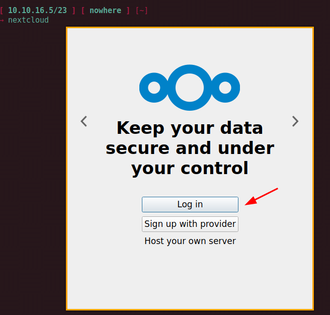
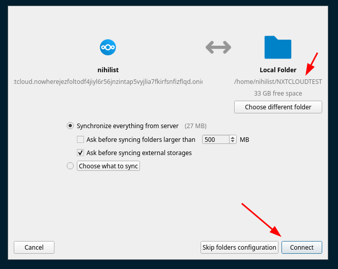
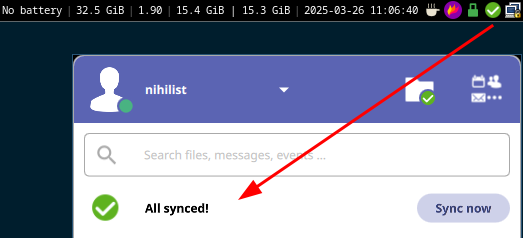

# Nextcloud .onion Setup (Anonymous File Hosting)

```
TLDR: You can synchronize a folder accross multiple devices, while maintaining both clientside and serverside anonymity.
```


In this tutorial we're going to cover how you can install an .onion only Nextcloud instance, Nextcloud is a FOSS alternative to replace popular file hosting websites like google cloud or onedrive, which can be ideal to make sure that your files are backed up somewhere, all while preserving anonymity. I recommend self-hosting this service at home, that way you make sure that your personal data stays at your home, rather than making it readable by an adversary on a remote server.

Nextcloud is an indispensable tool for productivity, as you're going to see:


What we are trying to achieve here, is **a setup where we can have a single folder synchronized on multiple devices,** so that any change done from any of those devices, to that same folder, gets to be automatically shared and synchronized accross all of the other devices aswell. And of course, we're going to achieve that while maintaining our anonymity, by routing all traffic through Tor. 

**Sidenote:** We are self-hosting a nextcloud instance for privacy purposes, because we don't want an adversary to be able to see what our files contain, from VPSes for example.

## **Serverside Setup**

You need to have docker installed on your server. If you don't, follow the steps from [docker installation tutorial](../docker-intro/index.md#installation) and make sure it's working properly.

Then, to install nextcloud we're going to use docker compose as follows (as the root user):
    
    [ Wonderland ] [ /dev/pts/9 ] [/srv/nextcloud]
    → sudo -i
    
    [ Wonderland ] [ /dev/pts/9 ] [/srv/nextcloud]
    → vim docker-compose.yml
    
    [ Wonderland ] [ /dev/pts/7 ] [/srv/nextcloud]
    → cat docker-compose.yml
    networks:
      tor-nxtcld:
        driver: bridge
        ipam:
          config:
            - subnet: 10.7.0.0/24
              gateway: 10.7.0.1
    
    services:
      db:
        image: mariadb:latest
        restart: always
        command: --transaction-isolation=READ-COMMITTED
        networks:
          tor-nxtcld:
            ipv4_address: 10.7.0.2
        volumes:
          - db:/var/lib/mysql
        environment:
          - MYSQL_ROOT_PASSWORD=P@SSW0RD
          - MYSQL_PASSWORD=P@SSW0RD
          - MYSQL_DATABASE=nextcloud
          - MYSQL_USER=nextcloud
    
      redis:
        image: redis:alpine
        restart: always
    
      app:
        image: nextcloud:latest
        restart: always
        networks:
          tor-nxtcld:
            ipv4_address: 10.7.0.3
        ports:
          - 127.0.0.1:9639:80
        depends_on:
          - redis
          - db
        volumes:
          - nextcloud:/var/www/html
        environment:
          - MYSQL_PASSWORD=P@SSW0RD
          - MYSQL_DATABASE=nextcloud
          - MYSQL_USER=nextcloud
          - MYSQL_HOST=db
          - NEXTCLOUD_TRUSTED_DOMAINS=nxtcloud.nowherejezfoltodf4jiyl6r56jnzintap5vyjlia7fkirfsnfizflqd.onion
          - OVERWRITEHOSTPROTOCOL=http
          - OVERWRITEHOST=nxtcloud.nowherejezfoltodf4jiyl6r56jnzintap5vyjlia7fkirfsnfizflqd.onion
          - PROXY=tor-nxtcld:9050
    
      tor-nxtcld:
        image: osminogin/tor-simple
        container_name: tor-nxtcld
        volumes:
          - ./tor-data:/var/lib/tor
          - ./tor-data/torrc:/etc/tor
        networks:
          tor-nxtcld:
            ipv4_address: 10.7.0.4
    
    volumes:
      nextcloud:
      db:
    
    

Don't forget to replace the "P@SSW0RD" with a password of your own, and that docker-compose.yaml will expose the nextcloud service on local port 9639, so let's run `docker compose up -d` to run the service.

As you can see in the docker-compose.yml file, there is a tor container, this is to make sure that the nextcloud connects to the internet through Tor (see the PROXY environment variable), to protect the serverside anonymity.
    
    
    [ Wonderland ] [ /dev/pts/9 ] [/srv/nextcloud]
    → docker compose up -d
    Starting nextcloud_redis_1 ... done
    Starting nextcloud_db_1    ... done
    Starting nextcloud_app_1   ... done
    

Then we also setup the torrc config to make sure that our nextcloud instance also goes through tor for every external connections it has to make:
    
    
    [ Wonderland ] [ /dev/pts/10 ] [/srv/nextcloud]
    → cd tor-data
    
    [ Wonderland ] [ /dev/pts/10 ] [/srv/nextcloud/tor-data]
    → ls
    torrc
    
    [ Wonderland ] [ /dev/pts/10 ] [/srv/nextcloud/tor-data]
    → vim torrc/torrc
    
    [ Wonderland ] [ /dev/pts/10 ] [/srv/nextcloud/tor-data]
    → cat torrc/torrc
     SOCKSPort 0.0.0.0:9050
    
    

Then we setup the nginx config to be able to access the nextcloud service accordingly. (obviously, replace the onion domain [with your own onion domain](../torwebsite/index.md)):
    
    
    [ Wonderland ] [ /dev/pts/9 ] [/srv/nextcloud]
    → vim /etc/nginx/sites-available/nxtcloud.conf
    
    [ Wonderland ] [ /dev/pts/10 ] [/srv/nextcloud/tor-data]
    → cat /etc/nginx/sites-available/nxtcloud.conf
    upstream nxtcloudbackend {
            server 127.0.0.1:9639;
    }
    
    server {
            ######## TOR WEBSITE ########
            listen 4443;
            listen [::]:4443;
            server_name nxtcloud.nowherejezfoltodf4jiyl6r56jnzintap5vyjlia7fkirfsnfizflqd.onion;
    
            location / {
                proxy_pass http://nxtcloudbackend;
                proxy_headers_hash_max_size 512;
                proxy_headers_hash_bucket_size 64;
                proxy_set_header Host $host;
                proxy_set_header X-Forwarded-Proto $scheme;
                proxy_set_header X-Real-IP $remote_addr;
                proxy_set_header X-Forwarded-For $proxy_add_x_forwarded_for;
    
                #proxy_http_version 1.1;
                #proxy_set_header Upgrade $http_upgrade;
                #proxy_set_header Connection "Upgrade";
                client_max_body_size 20G;
            }
    }
    
    [ Wonderland ] [ /dev/pts/9 ] [/srv/nextcloud]
    → ln -s /etc/nginx/sites-available/nxtcloud.conf /etc/nginx/sites-enabled
    
    [ Wonderland ] [ /dev/pts/9 ] [/srv/nextcloud]
    → nginx -t
    nginx: the configuration file /etc/nginx/nginx.conf syntax is ok
    nginx: configuration file /etc/nginx/nginx.conf test is successful
    
    [ Wonderland ] [ /dev/pts/9 ] [/srv/nextcloud]
    → nginx -s reload
    2025/03/26 09:46:30 [notice] 2097639#2097639: signal process started
    
    

Make sure that you follow [this tutorial](../torwebsite/index.md) to know how to have your own custom onion domain name:
    
    
    [ Wonderland ] [ /dev/pts/3 ] [~]
    → cat /etc/tor/torrc
    
    HiddenServiceDir /var/lib/tor/onions/nowherejezfoltodf4jiyl6r56jnzintap5vyjlia7fkirfsnfizflqd.onion/
    HiddenServicePort 80 127.0.0.1:4443
    SocksPort 127.0.0.1:9050
    
    [ Wonderland ] [ /dev/pts/3 ] [~]
    → systemctl restart tor@default
    
    

then you can proceed with accessing your nextcloud instance:

     

Then here we can edit the nextcloud appearance aswell:

 

So when you want to login, it'll look like that:


Once logged in, you can drag and drop files from your computer directly into the nextcloud web interface:


And that's it! You now have a nextcloud instance working via .onion to easily save your files remotely.

## **Keeping Nextcloud Updated**

In order to upgrade your nextcloud, you can run the following docker compose commands, and also add it to cron to run automatically every day at midnight: 
    
    
    [ Wonderland ] [ /dev/pts/9 ] [/srv/nextcloud]
    → docker compose -f /srv/nextcloud/docker-compose.yml pull ;  docker compose -f /srv/nextcloud/docker-compose.yml restart
    
    Pulling db         ... done
    Pulling redis      ... done
    Pulling app        ... done
    Pulling tor-nxtcld ... done
    Restarting tor-nxtcld        ... done
    Restarting nextcloud_app_1   ... done
    Restarting nextcloud_redis_1 ... done
    Restarting nextcloud_db_1    ... done
    
    [ Wonderland ] [ /dev/pts/9 ] [/srv/nextcloud]
    → crontab -e
    
    #nextcloud
    @daily docker compose -f /srv/nextcloud/docker-compose.yml pull ;  docker compose -f /srv/nextcloud/docker-compose.yml restart
    
    :wq
    

## **Clientside Setup**

Now to avoid having to always open the web browser to send and download files from your nextcloud instance, you can use the nextcloud desktop application, which will synchronize the nextcloud folders you want locally, as you'll see this is VERY convenient:
    
    
    [ cloud ] [ /dev/pts/1 ] [/snap/bin]
    → apt install tor nextcloud-desktop -y
    
    



Here as you try to login you'll first see that it can't resolve the .onion domain, which is normal as you need to tell nextcloud to use the local tor socks5 proxy, available on 127.0.01:9050


Afterward, you need to copy the authorization link into the tor browser to validate the request:

 

Once you have granted access, you can start to sync your nextcloud instance files locally:



Once logged in you can check the progress in the system tray:


Then let it sync, it can take a while due to the low bandwidth of Tor.



And that's it ! You now have a local folder that is synchronized with your nextcloud instance, that you can browse locally to find the files we uploaded earlier:
    
    
    [ Mainpc-PrivateVM-Debian12 ] [ /dev/pts/32 ] [~]
    → ls -lash ~/NXTCLOUDTEST
    total 7.3M
    4.0K drwxr-xr-x  5 nihilist nihilist 4.0K Mar 26 11:05 .
    4.0K drwx------ 51 nihilist nihilist 4.0K Mar 26 11:08 ..
    1.7M -rw-r--r--  1 nihilist nihilist 1.7M Feb 11  2024 1636794560654-0.jpg
    324K -rw-r--r--  1 nihilist nihilist 324K Feb 11  2024 1637121021316-0.jpg
    772K -rw-r--r--  1 nihilist nihilist 772K Feb 11  2024 1637722778473-0.jpg
    476K -rw-r--r--  1 nihilist nihilist 473K Feb 11  2024 1637722778473-1.jpg
    112K -rw-r--r--  1 nihilist nihilist 111K Jul 13  2024 alice.jpg
    444K -rw-r--r--  1 nihilist nihilist 444K Feb  6 18:22 appart.png
    836K -rw-r--r--  1 nihilist nihilist 833K Aug  9  2024 bitcoinispartofthesystemneo.png
    100K -rw-r--r--  1 nihilist nihilist  99K Dec 15 10:19 bunker.jpg
     88K -rw-r--r--  1 nihilist nihilist  87K Jul 13  2024 catclock.gif
       0 -rw-r--r--  1 nihilist nihilist    0 Mar 26 11:04 .nextcloudsync.log
    4.0K drwxr-xr-x  3 nihilist nihilist 4.0K Mar 26 10:51 nowhere-logos
    4.0K drwxr-xr-x  2 nihilist nihilist 4.0K Mar 26 10:52 PAPES
    4.0K -rw-r--r--  1 nihilist nihilist 4.0K Mar 26 11:04 .sync_9855fab54d67.db
    2.5M -rw-r--r--  1 nihilist nihilist 2.5M Mar 26 11:05 .sync_9855fab54d67.db-wal
    4.0K drwxr-xr-x  2 nihilist nihilist 4.0K Mar 26 10:52 xmrbazaar
    
    


Productivity-wise this is a perfect tool to keep updating files on the same place, from multiple devices. To showcase a basic change, we're going to copy another folder in there:


And here as you can see the changes are automatically getting picked up by the nextcloud desktop client, and synchronized to the nextcloud server automatically aswell.

_Post script:_ check out [this tutorial](../../productivity/macrotime/index.md) on how to synchronize the nextcloud .onion CalDAV calendar on both desktop and mobile

