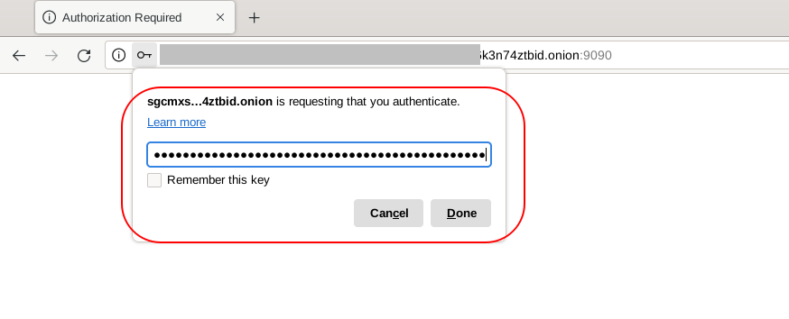

# Restricting Onion Service Access with Client Authorization

```
TLDR: you can restrict the access to hidden services based on which Tor client tries to access it, in case if it's supposed to remain a private service instead of a public one.
```

## Why is this important?

When you create your onion services, there is **no manner by which your service address may be easily discovered**, unless you public the onion somewhere or give it to others, so in most cases, client auth is **not really necessary**. More info [**here (Tor Forum Onion)**](https://v236xhqtyullodhf26szyjepvkbv6iitrhjgrqj4avaoukebkk6n6syd.onion/t/is-there-an-index-for-onion-domains/6893/3)

However, you may want to let other people like close friends use your services too, but you don't want just anyone to access them either. In this case you can use onion-based client authorization.

We'll generate Public/Private keypairs for each client that wants to connect to an onion. The public will be on the server, and the private will be on the client, proving they own the keypair and are authorized for access.


We'll also give you some scripts so you can completely automate this too, making it very easy to authorized several people at once.

In this tutorial, we'll of course refer to the machine hosting the onion service as the server, and the one(s) connecting as the client.

## Intro

If you don't already have some onion services and want to make some quick ones to test client authorization for yourself, follow this other guide's sections [here](../homeserver-onion/index.md#method-1-ssh-over-onion-on-command-line) and [here](../homeserver-onion/index.md#method-2-cockpit-web-ui-management). We will use these as examples for this guide

This guide assumed you're using Debian-based distros for both your client and server. And that you have some experience navigating [the Linux commandline](../linuxbasics/index.md).

## Generating the Keys

Before we do generate the keys, **please note that this can be done from anywhere**. So maybe your friend should only know their private key or you want to have a copy also, this is your choice. But the next section is required to be performed on the server.

First we need to install a couple packages, `openssl` and `basez`:
```
sudo apt install openssl basez
```

Create a private key then format it to Base32 (32 character string):
```
# Create key
openssl genpkey -algorithm x25519 -out /tmp/k1.prv.pem

# Format to Base 32
cat /tmp/k1.prv.pem | grep -v " PRIVATE KEY" | base64pem -d | tail --bytes=32 | base32 | sed 's/=//g' > /tmp/k1.prv.key
```

Create a public from the private key and format to Base 32 as well
```
# Does both things in one command
openssl pkey -in /tmp/k1.prv.pem -pubout | grep -v " PUBLIC KEY" | base64pem -d | tail --bytes=32 | base32 | sed 's/=//g' > /tmp/k1.pub.key
```

Now let's output both our **public and private keys**:
```
cat /tmp/k1.pub.key
# outputs something like IRAHFA3R6ZL2LK2JCVRJ433ELOP2Z6WZATKVXFZDQCUV7H5UHA6A

cat /tmp/k1.prv.key
# outputs something like OAARG7J7D24JYBPJUEZI7G7EKU3O7O4TMLR64KZZRWU23I7TSZ4Q
```

Save your keys somewhere as in a text file, then remove the temporary keyfiles:
```
rm -v /tmp/k1.pub.key
rm -v /tmp/k1.prv.key
```

## Configure the Server for Authorization

We're going to setup authorization for the Cockpit service that we mentioned at the start of this guide.

On the server start by creating file inside the `authorized_clients` folder which is inside your onion service's folder. So for our example service:
```
sudo nano /var/lib/tor/cockpit/authorized_clients/alice.auth
```

You can name the file whatever you like, generally the name should refer to your client, but it must end in `.auth`. Inside we'll put a line that corresponds to this format:
```
descriptor:x25519:<Public Key>
```
The Public Key is of course the one we just generated in the previous section.

So the full line will look something like this, but you'll replace the public key with your own:

```
descriptor:x25519:IRAHFA3R6ZL2LK2JCVRJ433ELOP2Z6WZATKVXFZDQCUV7H5UHA6A
```

`Ctrl+S` and `Ctrl+X` to save and exit nano. Now restart your Tor daemon in order to make the changes take effect: **`sudo systemctl restart tor`**.

## Access Service with Tor Browser

On our client (or on our server) open Tor browser (with a fresh identity) and put in the proper onion and port for your Cockpit service. The Tor browser will try to connect, then ask you for a private key. Paste the key we outputted in the Generating Keys section. Once we do we'll access the onion service successfully.




## Access Service with Tor Daemon

Now we're going to setup authorization for our server's SSH service.

First we're going to put the same public key as before into another file, this time located at `/var/lib/tor/ssh/authorized_clients/alice.auth` with the same format as before, so that the SSH service knows to allow this key. Then restart your Tor daemon.

On our client now, we're going to try and SSH into the service:
```
$ torsocks ssh user@mysshonion.onion
1753734329 ERROR torsocks[34574]: General SOCKS server failure (in socks5_recv_connect_reply() at socks5.c:527)
ssh: connect to host mysshonion.onion port 22: Connection refused
```

As you can see, it doesn't work. So now we have to authorize ourselves to get it working.

We need to modify our Tor config file: `sudo nano /etc/tor/torrc`

And add this line to the end of our config:
```
ClientOnionAuthDir /var/lib/tor/onion_auth
```

This directory will hold all our authorization files. Of course we also need to create that directory:
```
sudo mkdir /var/lib/tor/onion_auth
```

Now we'll make an authorization file. This file will authorize us to access a specific onion with the private key that corresponds to the public key we have in our server's configuration:
```
sudo nano /var/lib/tor/onion_auth/homeserver_ssh.auth_private
```
The file must end with `.auth_private`. The name of the file can be whatever you like but generally should refer to the server and service you're accessing.

In the file, we're going to paste a line that corresponds to this format:
```
<onion address without the .onion>:descriptor:x25519:<Private Key>
```

So it will look something like this:
```
go3tanhatcvzv7t7sjs4swihpzpdz5x4x6eesy3y3l5pxy27hkjnxwqd:descriptor:x25519:OAARG7J7D24JYBPJUEZI7H7EUU3O7O4TMLR64KZZRWU23I7TSZ4Q
```
Now restart your Tor daemon. If your daemon is throwing errors, go to the Troubleshooting section

Once your daemon is started up, you can try to SSH into your homeserver again.

```
$ torsocks ssh user@go3tanhatcvzv7t7sjs4swihpzpdz5x4x6eesy3y3l5pxy27hkjnxwqd.onion
user@go3tanhatcvzv7t7sjs4swihpzpdz5x4x6eesy3y3l5pxy27hkjnxwqd.onion's password: 

Web console: https://homeserver:9090/ or https://192.168.9.129:9090/

Last login: Mon Jul 28 from 127.0.0.1
user@homeserver:~$  # puts us into our homeserver shell
```

And now it works!

Next, we'll show you how to automate this process with scripts

## Automate with Scripts

Below is the server-side script. As it says in the commend the script needs to be made executable. Then you can run it with `./server-script` (assuming that's what your file is called)
```
#!/bin/bash

# Make this script executable: `chmod +x server-script`

echo "This script is meant to be run on the server. Assumes you have openssl and basez packages installed."
echo ""

echo "Name of the onion service (under /var/lib/tor): "
read SERVICE_NAME

echo "What would you like to call the name of your client who's connecting to your service? (all lowercase, no spaces): "
read CLIENT_NAME
echo ""

# generate private key
openssl genpkey -algorithm x25519 -out /tmp/k_$CLIENT_NAME.prv.pem

# convert private key to base 32
cat /tmp/k_$CLIENT_NAME.prv.pem | grep -v " PRIVATE KEY" | base64pem -d | tail --bytes=32 | base32 | sed 's/=//g' > /tmp/k_$CLIENT_NAME.prv.key

# make public key from private key and convert to base 32
openssl pkey -in /tmp/k_$CLIENT_NAME.prv.pem -pubout | grep -v " PUBLIC KEY" | base64pem -d | tail --bytes=32 | base32 | sed 's/=//g' > /tmp/k_$CLIENT_NAME.pub.key

echo "Public key for $CLIENT_NAME: $(cat /tmp/k_$CLIENT_NAME.pub.key)"
PUB_KEY=`cat /tmp/k_$CLIENT_NAME.pub.key`

echo "private key for $CLIENT_NAME: $(cat /tmp/k_$CLIENT_NAME.prv.key)"

# Put the proper string into the authorized client file
echo "descriptor:x25519:$PUB_KEY" | sudo tee /var/lib/tor/$SERVICE_NAME/authorized_clients/$CLIENT_NAME.auth

# restart daemon
sudo systemctl restart tor

echo "Created /var/lib/tor/$SERVICE_NAME/authorized_clients/$CLIENT_NAME.auth"

echo "Now take your private key and input it into the client script"
```

And here is the client script. Of course be sure to follow the pre-requisites if you didn't already in the tutorial above.

```
#!/bin/bash

# Make this script executable: `chmod +x client-script`

echo "This script is meant to be run on the client. Assumes you have already done these steps:"
echo "1. add the line 'ClientOnionAuthDir /var/lib/tor/onion_auth' to your /etc/tor/torrc file"
echo "2. created that directory using 'sudo mkdir /var/lib/tor/onion_auth'"
echo "3. restarted your tor daemon to make sure that the changes have taken effect with no error"
echo ""

echo "Name of the onion service (whatever name you like, lowercase and no spaces, i.e homeserver-ssh): "
read SERVICE_NAME

echo "What is the service's onion address without the .onion domain: "
read ONION_HASH

echo "What is your private key: "
read PRIV_KEY
echo ""

# Place the formatted string into the authorization file
echo "$ONION_HASH:descriptor:x25519:$PRIV_KEY" | sudo tee /var/lib/tor/onion_auth/$SERVICE_NAME.auth_private

#restart tor daemon to make these changes take affect
sudo systemctl restart tor

echo "Created authorization to service "$SERVICE_NAME" at $ONION_HASH.onion: /var/lib/tor/onion_auth/$SERVICE_NAME.auth_private"

```

## Troubleshooting

When you restart your Tor daemon on your client, and you get errors you can run `journalctl -xeu tor.service`. You may see errors like this:

```
Fixing permissions on directory /var/lib/tor/onion_auth
Could not chmod directory /var/lib/tor/onion_auth: Operation not permitted
```

This is because your distro isn't creating directories properly with the right permissions. Specifically for the directory we made for our auth files `/var/lib/tor/onion_auth`.

First see who owns the directory `/var/lib/tor`:
```
$ sudo ls -l /var/lib/tor
total 55076
-rw-------. 1 toranon toranon    20442 Jun  3 08:40 cached-certs
```

It's owned by `toranon`. The usename also might be something like `debian-tor`.

Delete the onion auth directory. Then recreate it but assign it to the right user and right permissions, then recreate your `.auth_private` file, then restart your Tor daemon:
```
rm -rf /var/lib/tor/onion_auth
sudo -u toranon mkdir /var/lib/tor/onion_auth
sudo chmod 700 -R /var/lib/tor/onion_auth
# recreate auth_private here
sudo systemctl restart tor
```
