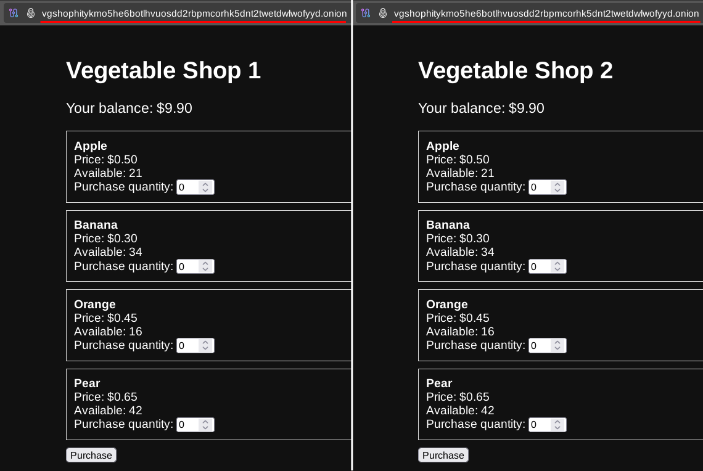
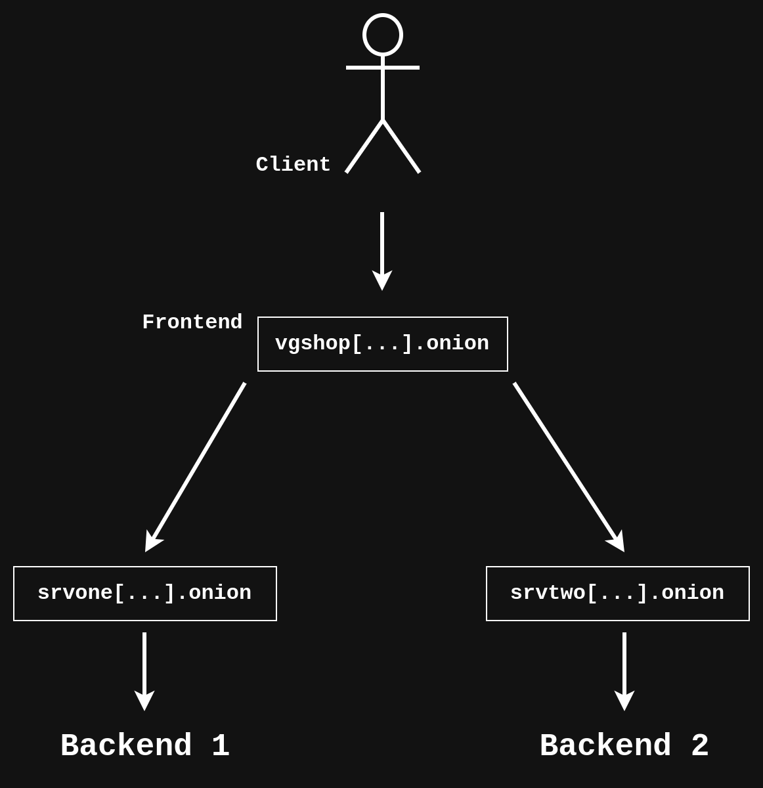
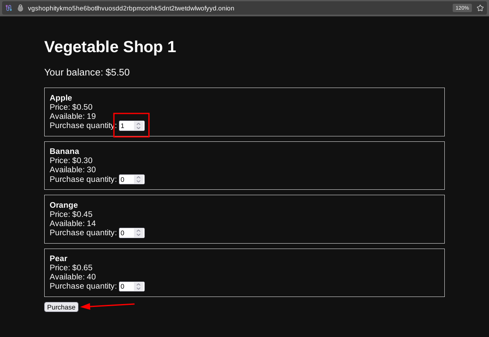
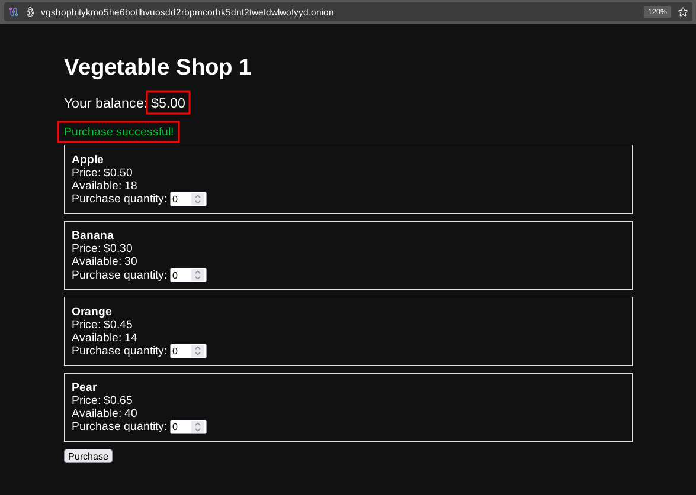
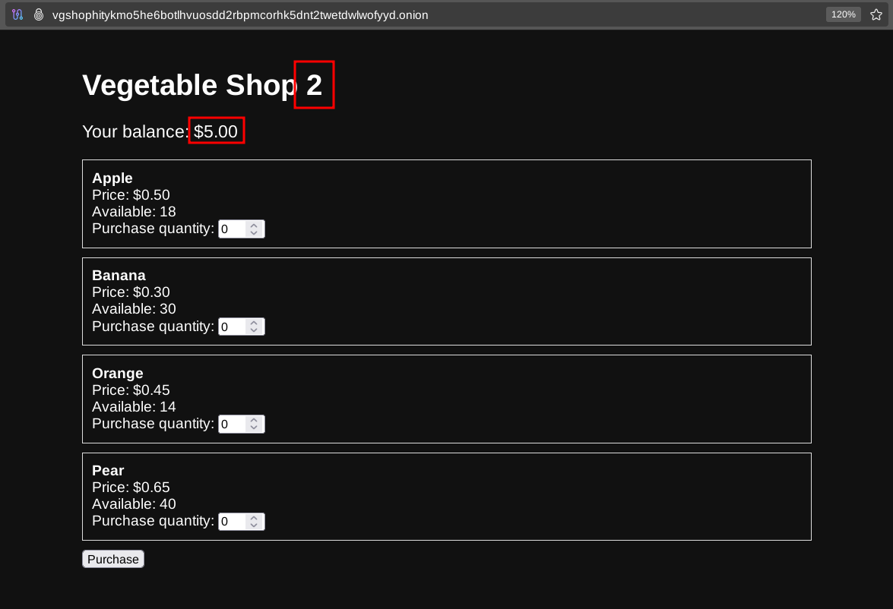
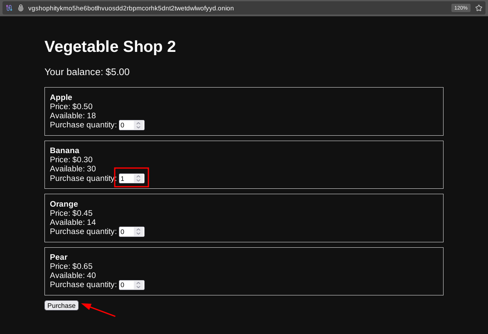
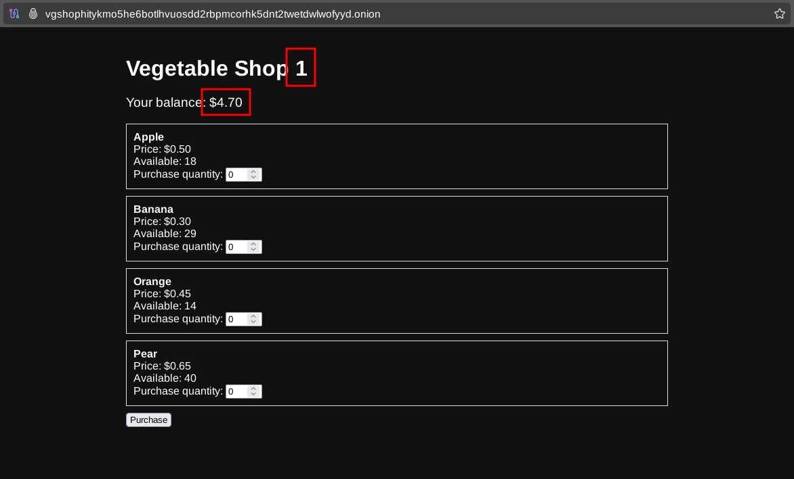

# OnionBalance for .onion domains load balancing

```
TLDR: you can load balance hidden services on the vanity v3 onion domain level by using OnionBalance
```




## **Introduction**


In our [last tutorial](../mysqlmastermaster/index.md), after setting up database replication between two instances of our vegetable shop, you might be wondering if there's a way for clients to access the service via a single frontend. Practically, this means users will go to your main onion v3 URL and may be presented with different backend instances in a transparent manner. 

When one backend instance becomes unavailable, users will still be able to access the service on other backends. After the unavailable backend comes back online, changes made during its offline period will be automatically replicated to the database. It will also resume participating in load balancing. 

## **Overview**

[Onionbalance](https://github.com/torproject/onionbalance) leverages the way Tor Hidden Service discovery works under the hood. In short, Tor uses a [Distributed Hash Table (DHT)](https://en.wikipedia.org/wiki/Distributed_hash_table) where hidden services are published. Onionbalance makes the frontend address resolve to multiple backend addresses in a manner similar to [Round Robin](https://en.wikipedia.org/wiki/Round-robin_DNS). It functions much like how [CDNs](https://en.wikipedia.org/wiki/Content_delivery_network) work on the clearnet, but it is free and does not rely on any third parties. [Here](https://onionservices.torproject.org/apps/base/onionbalance/design/index.md) is a more detailed explanation of how Onionbalance achieves load balancing in practice. 

At the end of this guide, we'll have a load-balanced frontend URL. There is simplified diagram of how this works: 

   
  


User accessing the frontend gets transparently redirected to either of the backends.  
  
A more detailed version presenting how clients get connected to the load-balanced service over Tor: 

   
  


From an end user's perspective: 

  * **1** \- Tor client makes a request to the Distributed Hash Table (DHT) with the address of vegetable shop.
  

  * **2** \- The DHT returns a descriptor with multiple backend addresses. Tor client chooses one of the addresses.
  

  * **3** \- Tor client connects to the choosen backend.
  

  * **4** \- Tor client passes the HTTP data to the browser and displays the store interface returned by one of the backends.
  


## **Prerequisites**

To start, you need to have two working servers running our vegetable shop with a replicated database as we did [here](../mysqlmastermaster/index.md). 

You should also know the public onion v3 URLs set up for our vegetable shop instances. Here, this will be **srvone[...].onion** for the first server and **srvtwo[...].onion** for the second server. 

Onionbalance frontends can also be located on different servers than backends. If you want to run the frontend on a separate server, you'll need to [install Tor](../torwebsite/index.md) on it (running as a client in default configuration). In this guide, I will assume that we are running frontends on the same servers as backends (**frontN** is the same as **serverN**). 

Additionally, I [generated](../torwebsite/index.md) another domain **vgshop[...].onion**. It will be used for Onionbalance frontends; clients should use it to access your service from now on. Requests coming to this URL will be load balanced and distributed across available backends. 

To start, install the **onionbalance** package on each frontend server: 
    
    
    oxeo@frontN:~$ sudo apt update
    oxeo@frontN:~$ sudo apt install onionbalance
    

## **Frontend Configuration**

Edit the **/etc/onionbalance/config.yaml** file: 
    
    
    services:
    - instances:
      - address: srvone4oj33rvnykz252tf2holi5ae6pz5w62znumesgmzg7mjbnhtyd.onion
        name: server1
      - address: srvtwo7a3ddvt5kncimkh5esstmzomdjx2fr7o73q66fzdrsbtnexhyd.onion
        name: server2
      key: vgshophitykmo5he6botlhvuosdd2rbpmcorhk5dnt2twetdwlwofyyd.key
    

Remember to replace: 

  * **srvone[...].onion** \- public onion URL of the first backend server.
  * **srvtwo[...].onion** \- public onion URL of the second backend server.
  * **vgshop[...].onion** \- public frontend onion URL that you have generated for this tutorial.


Now, on each frontend server you want to configure, place the **private key** (usually stored in **hs_ed25519_secret_key**) of the **vgshop[...].onion** service into **/etc/onionbalance/vgshophitykmo5he6botlhvuosdd2rbpmcorhk5dnt2twetdwlwofyyd.key**.  
Replace the URL part with the actual frontend onion URL. It should match whatever you put in **/etc/onionbalance/config.yaml** as a **key**. 

Edit the **/etc/tor/torrc** adding the following line: 
    
    
    ControlPort 127.0.0.1:9051
    

This will be used by the onionbalance service to control the Tor daemon over a local port. 

## **Tor Daemon Configuration**

With the frontends configured, you now need to log into your backend servers and modify the **/etc/tor/torrc** file. Insert this line below your public hidden service configuration: 
    
    
    HiddenServiceOnionbalanceInstance 1
    

After editing, it should look something like this: 
    
    
    [...]
    HiddenServiceDir /var/lib/tor/veggie_service/
    HiddenServicePort 80 127.0.0.1:4440
    HiddenServiceOnionbalanceInstance 1
    
    HiddenServiceDir /var/lib/tor/internal_service/
    HiddenServicePort 33061 127.0.0.1:3306
    HiddenServicePort 22 127.0.0.1:22
    [...]
    

Now, create a new file under **/var/lib/tor/veggie_service/ob_config** , substituting the URL with one you set for the frontend: 
    
    
    MasterOnionAddress vgshophitykmo5he6botlhvuosdd2rbpmcorhk5dnt2twetdwlwofyyd.onion
    

Finally, restart the **tor** service on each backend: 
    
    
    oxeo@serverN:~$ sudo systemctl restart tor
    

## **Final Adjustments**

Both services will soon be accessible under the **vgshop[...].onion**. To differentiate between them, you can change the header to indicate which backend is being accessed. 

On the first backend server: 
    
    
    oxeo@server1:~$ sudo sed -i 's/Vegetable Shop/Vegetable Shop 1/' /srv/shop/index.php
    

On the second backend server: 
    
    
    oxeo@server2:~$ sudo sed -i 's/Vegetable Shop/Vegetable Shop 2/' /srv/shop/index.php
    

Finally, on each frontend, restart the **tor** and **onionbalance** services: 
    
    
    oxeo@frontN:~$ sudo systemctl restart tor onionbalance
    

## **Showcase and Verification**

To verify our setup, go to **vgshop[...].onion**. You should be presented with one of your backend instances. In our case, it's **srvone[...].onion**. 

Now, purchase any product and take note of the balance after the operation. 

    
  


Wait a few seconds for the state to be replicated, then stop **tor** and **onionbalance** on the backend where you made the purchase. This simulates our backend going offline. 
    
    
    oxeo@server1:~$ sudo systemctl stop tor onionbalance
    

Then refresh the page. 

   
  


If the website is still up and points to the other backend, this means Onionbalance works as intended. If the account balance was updated, then the database was replicated successfully as well. 

You can now make a purchase on the other "working" server and take note of that balance too. 

   
  


Start services on the "offline" server to bring it online again. 
    
    
    oxeo@server1:~$ sudo systemctl start tor onionbalance
    

Wait a few minutes for the servers to synchronize, then make the other server unavailable. Refresh the website once again. 
    
    
    oxeo@server2:~$ sudo systemctl stop tor onionbalance
    

   
  


If the balance appears correct on the first server, then everything works as expected! 

## **Closing Remarks**

**Congratulations!** \- You now have a fully working, highly available service on the **"Dark Web"**. 

It's important to note onionbalance doesn't support [Proof of Work mechanism](https://blog.torproject.org/introducing-proof-of-work-defense-for-onion-services/) Tor uses to combat DDoS attacks. However the work is ongoing and you can track progress in [this issue](https://gitlab.torproject.org/tpo/onion-services/onionbalance/-/issues/13). 

If you want to learn more, explore advanced setups, or troubleshoot any issues, read the [Onionbalance wiki](https://onionservices.torproject.org/apps/base/onionbalance/tutorial/index.md) from [The Onion Services Ecosystem](https://onionservices.torproject.org). 

