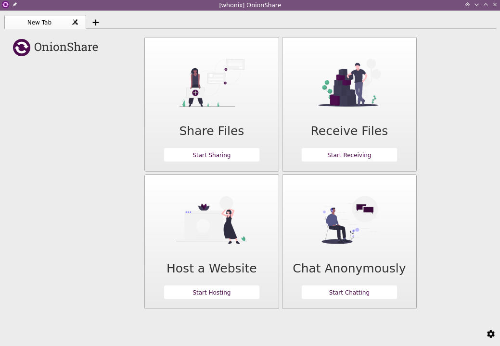
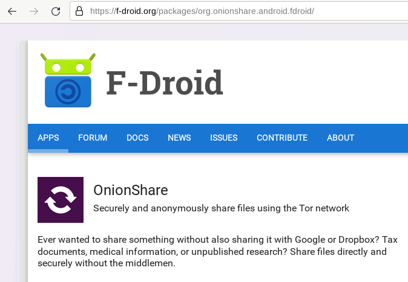
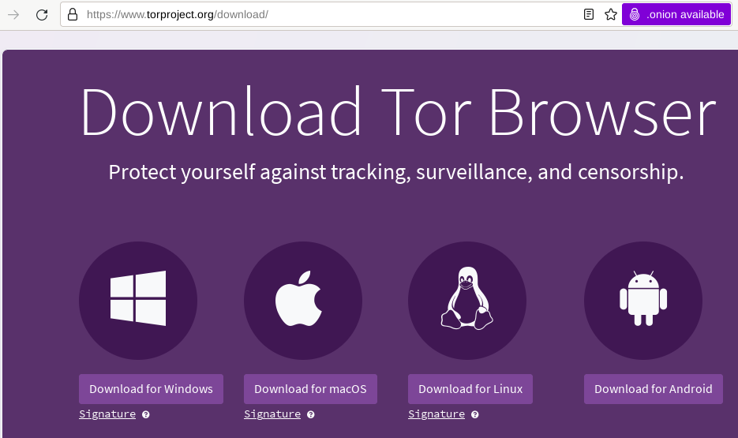
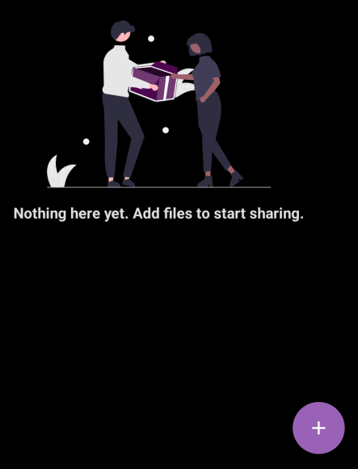
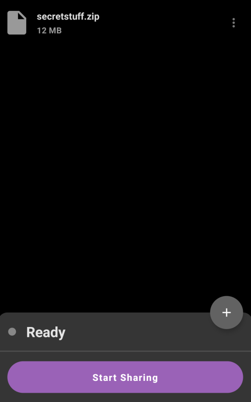
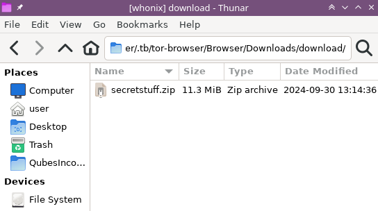

# How to share files anonymously using OnionShare

```
TLDR: you can send small files anonymously using Onionshare
```


OnionShare is a free and open-source cross-platform tool that utilises the TOR network to anonymously share files (send and receive), host an onion website and create a simple chat room. Installation and setup is extremely simple and users only need the TOR browser for access, making OnionShare a quick and easy way to utilise the TOR network for various stasks. Additionally, OnionShare can also be a great way of bypassing network restrictions in cases where other file-sharing methods are not permitted and includes it's own full-featured TOR client with support for TOR bridges for situations where censorship circumvention is required..




OnionShare can easily be installed on various Linux distributions (by following the offical instructions at <https://onionshare.org/#download>). For Debian-based distro's (including [Whonix](https://www.whonix.org/)), simply run the following apt command in a terminal:
    
    
    sudo apt install onionshare
    


For installation on an Android device (running Graphene OS), it's recommended to download via F-Droid (<https://f-droid.org/packages/org.onionshare.android.fdroid/>) or the direct APK download link provided on the F-Droid page, e.g. <https://f-droid.org/repo/org.onionshare.android.fdroid_214.apk>



In this tutorial we'll be sharing a file from our Graphene OS Android device and downloading the file on our [Whonix](https://www.whonix.org/) machine (that includes TOR browser as its default web-browser). If you're using a different machine, be sure to download the official TOR browser from <https://www.torproject.org/>



To begin, we'll open OnionShare on our Graphene OS device then click on the "+" icon in the bottom right-corner to select the file (or multiple files) we want to share. We then click the "Start Sharing" button at the bottom of the screen to generate the one-time-use Onion URL where our file will be shared

 

Back in our Whonix VM, we navigate to the Onion URL to view the file available for download


As shown below, we can see the name and size of the file being shared from our Graphene OS device along with a "Download Files" button in the top right-corner, which we click to initiate the download. Note: Onionshare zips up all available files into one archive named "download.zip" for ease of bulk downloading.


After the download completes, we extract the downloaded "download.zip" file to gain access to our original "secretstuff.zip" file containing the files we need from our Graphene OS device, concluding this tutorial.



