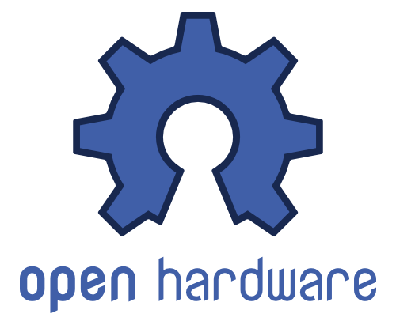
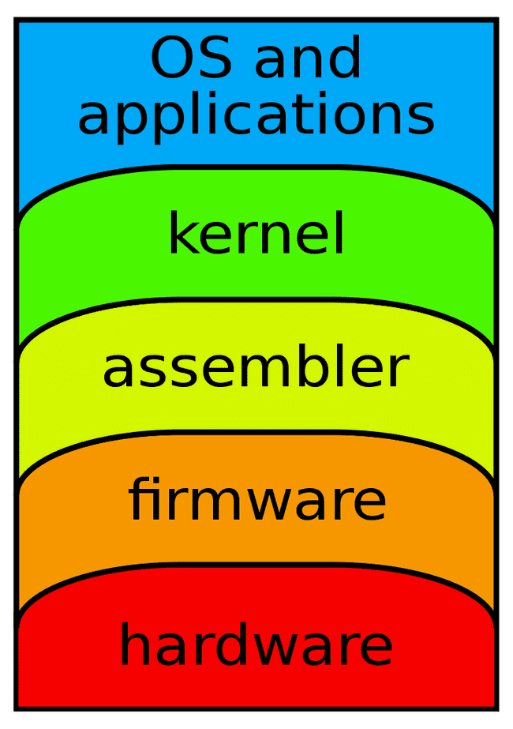
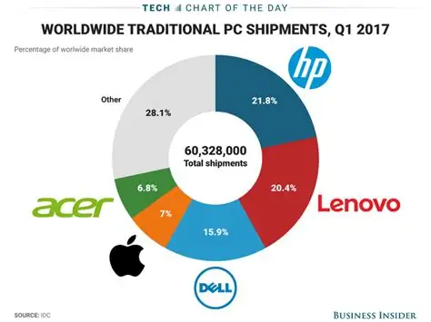

# The lack of Open Source Hardware (CPUs, Motherboards, GPUs) 

```
TLDR: we do with what we have at our disposal. But ideally open hardware CPUs, Motherboards and GPUs would guarantee the lack of hardware backdoors
```




## **Why Open Source Hardware is vital**

When we're talking [Privacy](../privacy/index.md), we have one key requirement: It must be open source. **If you don't know/ can't know the inner details of your system, then you can't tell if the manufacturer has the ability to spy on you through the product**. It is a matter of Transparency, to be able to verify if you are not being spied on, you must be able to inspect the ins and outs of your system in it's entirety. Only after having verified the entire system can you proclaim that you have privacy (from the manufacturer in this case) while using the system. 



When we're talking Computers, we have these 5 basic layers:

  1. _Layer 4: OS and Applications_ (ex: [matrix chat](https://github.com/element-hq/synapse), firefox, etc)

  2. _Layer 3: Kernel_ (ex: [the Linux Kernel](https://github.com/torvalds/linux) (written in C))

  3. _Layer 2: Assembler_ (ex: [Direct CPU instructions](../../hacking/asm/7.md) derived from the C compilation)

  4. **_Layer 1: Firmware_** (ex: low-level software to provide control over CPU, motherboard, GPU, etc)

  5. **_Layer 0: Hardware_** (ex: your motherboard, CPU, GPU, Ethernet port etc)


The problem is, **if you have closed-source hardware (such as an Intel or AMD CPU, or a nvidia graphics card, or a msi motherboard)** , you can at most have open-source software and protocols all the way down to layer 2, **but not further below.** That's because you have hardware manufacturers creating products, but they are keeping the method as to how they create them a proprietary secret. Because you can't audit it yourself, you can't tell if there is any spyware baked into it or not. 


Take for example AMD's [PSP](https://en.wikipedia.org/wiki/AMD_Platform_Security_Processor) or Intel's [Management Engine](https://en.wikipedia.org/wiki/Intel_Management_Engine), which are both alleged backdoors implemented directly in consumers' CPUs. In the case of Intel's processor chipsets, **all CPUs since 2008 are to be considered backdoored by Intel ME, and there's nothing you can do about it, without knowing intel's secret way to disable it.**[[1]](https://www.intel.com/content/www/us/en/developer/articles/guide/getting-started-with-active-management-technology.html)[[2]](https://www.intel.com/content/www/us/en/support/articles/000005974/software/chipset-software.html)[[3]](https://www.eff.org/deeplinks/2017/05/intels-management-engine-security-hazard-and-users-need-way-disable-it) It is located in the Platform Controller Hub of modern Intel motherboards. 

check out [this video](https://iv.nowhere.moe/watch?v=0o8Co1ekemU&listen=false) for a deep dive into Intel's Management Engine from 36c3 chaoswest 2019.

Regarding non-free firmware, even Debian has been forced to accept this reality in 2022 in their [general resolution vote](https://www.debian.org/vote/2022/vote_003). In short, they now ship non-free firmware by default because 99.999999% of the people out there are running closed-source hardware CPUs, or GPUs, etc.

_TLDR:_ if you use closed-source hardware, you won't be able to get open source firmware for the CPU, GPU or motherboard. **You cannot ever be 100% sure that your hardware itself contains a spying mechanism, because you can't check it yourself, be it in your motherboard, CPU, GPU, or network interfaces.**

## **The Closed-Source Hardware Monopoly upon the market**

Hardware production is a much more costly endeavor than software production, given the energy and techniques required to create the electronic components to produce computers. Profit companies don't want to share their production secrets just like software companies to avoid competition and soak up all the profits they can get.

Let's look currently at what's the status of hardware on the market, are there that many open source options ? 




In short, no, **the market is currently utterly dominated and saturated by these profit companies, which are all selling closed-source hardware.** Open source hardware as a concept is not even a thing for them, it's all proprietary hardware, and firmware, this applies to Graphics Cards, CPUs, Motherboards, and Computers in general. 

## **The current status of Open Source Hardware on the market**

You can count companies that sell open source hardware on your fingers currently, they are of a very rare breed. We have the example of MNT Reform


Here we have the example of MNT reform, selling a laptop that you can entirely repair (by buying the hardware parts) yourself. from the batteries, to the Keyboard, to the monitor, hell, even the motherboard, **but still even here the CPU and it's firmware are not open source** [[1]](https://source.mnt.re/reform/mnt-reform-raspberry-pi-cm4-som/-/blob/main/stdp2600-firmware/STDP2600_HDMI2DP_STD_RC3_3.hex?ref_type=heads). For the rest, they try to maintain the open hardware requirement. They ship the laptop with all the electrical schematics for you to look through them and see if it holds true that they aren't spying on you.

Check out [this video](https://iv.nowhere.moe/watch?v=_DA0Jr4WH-4) for a full unbox review of the mnt reform laptop.

Performance wise, can this compare to consumer grade laptops ? Sadly, not yet. Not even close. In the future if this project picks up steam big time, you might see competitors to Intel and AMD's monopoly.

Another top candidate coming up slowly is the Open [RISC-V CPU architecture](https://riscv.org/), aimed at dethroning the 2 CPU giants. But the project is still trying to pick up speed and adoption currently.


While i am very hopeful that with enough education spreading out the need for open hardware in the industry, for individuals' right to privacy, the market will change for the better. But the fact remains that the main manufacturers are under false democracies, where individual liberties are trampled on every day. The only thing they care about is profit, not your individual freedoms.

Therefore i'll conclude with the following: **Even for Privacy purposes, We use the tools that we have at our disposal currently, even if it means using open-source software on closed-source hardware** , until the market finally embraces fully open-source software, and fully open-source hardware.

