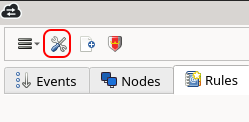
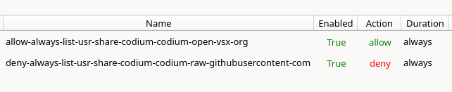

# Ensuring Your Privacy is Intact with OpenSnitch

```
TLDR: You can use OpenSnitch to either allow or prevent unexpected connections as they occur, on your computer directly.
```

In this tutorial we're going to learn what OpenSnitch is, why we need it, and how to use it, to keep a tight grip on your privacy

This tutorials requires that you know basic Linux commands and how to generally navigate your operating system.

## The Issue: Software Making Network Requests

As freedom-lovers we use a lot of FOSS software. And although it's up to us to research that software and try to read the code as much as possible to see if there is anything anti-privacy or malicious, let's be honest, we don't always read everything or do a full analysis.

Additionally, even though a piece of software might be FOSS and well-meaning, developers often make mistakes or generally aren't thinking about people with higher OpSec. So they may code in requests that could disrupt that.

In these situations, the best thing you can do is control whether or not that software can connect to the network. Especially when we are running a [private VM](../whonixqemuvms/index.md) with high OpSec, we cannot afford to make any network requests that we don't first approve of.

## So What's the Solution?

Many FOSS software, if they respect privacy, will often give you options within the application to turn off or on certain functionalities that make network requests. But this isn't reliable as some apps do and some don't. Plus they may make requests at first startup that can't be avoided at all.

If you are using [Flatpak](https://flathub.org/) then you have a very convenient option to use [Flatseal](https://flathub.org/apps/com.github.tchx84.Flatseal) to easily cut off Network access with the flick of a switch for a particular app. But of course this doesn't cover other non-Flatpak apps.


So what's the answer? **OpenSnitch Firewall**.

OpenSnitch tracks all network requests going in and out of your system, logging them for you, and can ask you for permission for every application that tries to connect to the network.


## How can I use OpenSnitch?

We'll show you how to install and use it. Also check out the [OpenSnitch Github](https://github.com/evilsocket/opensnitch) for more information.

Before starting this installation, I highly recommend that you close all your applications unless absolutely necessary, so you don't become overwhelmed with OpenSnitch dialogues asking you to handle all the outbound network requests that your apps are doing.

### Installation on Kicksecure

If you're running Kicksecure you can simply run this command:

```
apt install opensnitch
```

This command can also be used to check if OpenSnitch is available in your distro's repositories.

### Installation on other Debian-based Linux (i.e. Whonix VM)

1. Navigate to the [latest release on github](https://github.com/evilsocket/opensnitch/releases/latest) and download the `opensnitch` and `opensnitch-ui` DEB packages

      

2. Open your terminal and navigate to the directory where you downloaded these packages. Then run this command to install them (make sure the package names are correct to ones you downloaded, do not just blindly run this command):

      ```
      sudo apt install ./opensnitch_1.7.1-1_amd64.deb ./python3-opensnitch-ui_1.7.1-1_all.deb
      ```

3. Make sure the firewall daemon is enabled so it will always start when you boot your machine, and start the service so it's running (the service might also be called `opensnitchd`):
      ```
      sudo systemctl enable --now opensnitch
      sudo systemctl start opensnitch
      ```

4. Execute `opensnitch-ui` from the terminal or launch it from your Application Launcher, in order to bring up the user interface

5. When you start the UI, you might start getting dialogues asking you to Allow/Deny certain system processes. If they look like they are part of your normal system, you can just Allow them all, or just Deny them all and change your decision later, don't worry.

### Initial Setup

I'll give you a couple settings you definitely want to change, the rest is up to you to customize.

1. At the top-left of the window click the settings icon to bring up Preferences. 

      
   
2. Under the "Pop-ups" tab, set the Default Timeout to 99 to ensure you have ample time to react when OpenSnitch asks you to handle network connections. I also recommend to use the Default Options I've set here, which we'll explain more later

      

3. Under the "UI" tab, click on "General" and "Autostart GUI upon login" so that OpenSnitch always opens when you log into your system. Click Save.
   
      

### Using OpenSnitch (Simple)

Now we're going to show you the easiest way to use OpenSnitch, by interacting with code IDE application, VS Codium. Throughout these screenshots you may see some unimportant info blocked out to preserve the this post author's privacy.

When you start up an application after installing OpenSnitch, if that app connects to the internet, you will get a popup like this:


You can see the default options we set in the preferences are picked by default. These options mean that this application (from this executable) will always (forever) have its network requests blocked (Deny). And of course you can Allow and that means that all this app's requests will forever be permitted.

**This is the simplest way to use OpenSnitch. Simply click Allow or Deny for each app that wants to connect.**

Go back to main OpenSnitch UI window and go to the Rules tab. Here you can see the rule that was automatically created and enabled when we clicked Deny on the previous pop-up. You can right-click to edit the rule like Allowing instead of Denying, or to delete the rule (deleting the rule will cause OpenSnitch to ask you again about that app).


Now click the Events tab. Here we can see all the network requests OpenSnitch is denying. New ones will immediately appear at the top as they are attempted. Also you can use the search box at the bottom to narrow the list down to only the application you are interested in.


### Using OpenSnitch (Advanced)

Sometimes, we want to use an application but we don't want to completely revoke all networking. We may just want to allow requests to certain domains, in order to allow bare minimum functionality while reducing our overall network footprint.

Let's start over our VS Codium example. Instead of clicking Allow or Deny right away, we can click the "+" button. Then, we can activate the Destination IP checkbox. After we click Deny, the rule that is automatically created essentially says "Always block VS Codium from making requests to the domain raw.githubusercontent.com".


After, VS Codium wants to connect to a different domain now. But this time we want the app to be able to access this domain. So we do the same thing as above, but click Allow. So the created rule says: "Always allow VS Codium to make requests to the domain open-vsx.org"


And here under our Rules tab on the main window we can see the rules created:



Additionally, if we go to our Events tab, we can see that indeed OpenSnitch blocked the domain we said to block, and allowed the one we said to allow:


## Conclusion

That's all you need to get started using OpenSnitch! Keep monitoring that Events tab from time to time to see what your apps are connecting to. Also remember that if you feel fatigue from constantly allowing and denying, remember it will get less and less as you cover all the apps and processes on your system.

