# Anonymity - Self-Hosted LLM Hidden Service

```
TLDR: ChatGPT and similar services harvest your data for their own profit, replace them with a self-hosted LLM service, that you can run on your own Homeserver, as long as it has a powerful-enough GPU.
```

 


## **Current state of LLMs**

If you've been on the internet recently, there's a high chance you heard about Large Language Models. Most notable companies in this field include OpenAI, Google, Antropic and xAI. To access their models you typically need to communicate with the service via an API. Such use while convenient, means user has little to no knowledge about how the data sent there is stored and used.

Additionally, when users submit data through these services, it might be embedded into future models. Companies often train new models on a variety of user-submitted data, which can include any text inputs you've provided. This raises serious privacy concerns, as personal information could inadvertently become part of the training set for subsequent AI models. AI giants will often say they're trying to respect your privacy with data "anonymization" and other techniques, but we all know how this works in practice. See: [Anthropic's Privacy Policy](https://privacy.anthropic.com/en/articles/10023555-how-do-you-use-personal-data-in-model-training) and [OpenAI explaining](https://help.openai.com/en/articles/5722486-how-your-data-is-used-to-improve-model-performance) how they "improve model performance" with users data.

The vast amount of sensitive user data stored can have devastating consequences if a leak occurs. In AI space it's not uncommon to leak data either via compromised servers or models themselves. In the past year alone companies suffering such leaks include: [OpenAI](https://www.spiceworks.com/tech/artificial-intelligence/news/chatgpt-leaks-sensitive-user-data-openai-suspects-hack/), [Anthropic](https://venturebeat.com/ai/anthropic-confirms-it-suffered-a-data-leak/) and [DeepSeek](https://www.wiz.io/blog/wiz-research-uncovers-exposed-deepseek-database-leak).

**Assume all conversations with online chatbots can be public at any time.**


### Claude 4 Opus contacting authorities

On 22nd May 2025, a researcher from Anthropic posted a tweet talking about their latest model release.


He stated the model can be instructed to automatically report **"immoral behavior"** to relevant authorities using command line tools. While this is not implemented in mainline Claude 4 Opus model yet, it shows the direction large AI companies want to go in (see [AI alignment](https://en.wikipedia.org/wiki/AI_alignment)).

After facing severe backlash from users, Sam Bowman deleted his post. ([archived](https://xcancel.com/sleepinyourhat/status/1925627033771504009))

If you want to learn more, [Sam Bent](../index.md#wall-of-fame-as-of-may-2025) made a [YouTube video](https://www.youtube.com/watch?v=apvxd7RODDI) on this situation.

## **Privacy LLM frontends**

A partial solution to those problems could be a service that aggregates multiple model APIs and anonymizes their users. A bit like [searxng](https://github.com/searxng/searxng) does for search engines.
AI companies can't know who exactly uses their models since the amount of metadata is heavily limited. 

There're several such services including [ppq.ai](https://ppq.ai), [NanoGPT](https://nano-gpt.com) or [DuckDuckGo chat](https://duck.ai). This is only a partial solution since your conversation contents can still be saved and used for later training by large AI companies. 


## **Open LLMs Primer**

Another option available is to self-host LLM on your own infrastructure. This will effectively prevent sending your data from being sent to third parties.


  
It can work fully offline on device but you'll need to have the required resources. You also have to understand certain more advanced concepts related to LLMs. 

**Parameter Count**  
Each open model has specified number of parameters. This can range from 0.5 billion (qwen 2.5) to even 671 billion (deepseek r1). The more parameters model has, the more knowledge can be packed into it. This comes at a cost of more physical RAM/VRAM memory being used. Newer generation models are fairly capable even at 8 billion parameters but it's not uncommon to use 12, 14 or 32 B ones. 

**Quantization (improving memory usage)**  
Usually the **model + context** needs to fit into RAM/VRAM memory. Each model parameter can be represented with certain precision. For example, **FP16** uses 16 bits (2 bytes) of memory to store a single parameter, while **Q4_0** uses only 4 bits. This means that FP16 model will use ~4x of the memory compared to Q4_0. Of course using Q4_0 will introduce some rounding error in quantization step, but it's usually not a big deal. Look at the graph below to see how different quantization parameters affect [model accuracy and memory usage of llama 3.1 8B](https://huggingface.co/ThomasBaruzier/Meta-Llama-3.1-8B-Instruct-GGUF): 

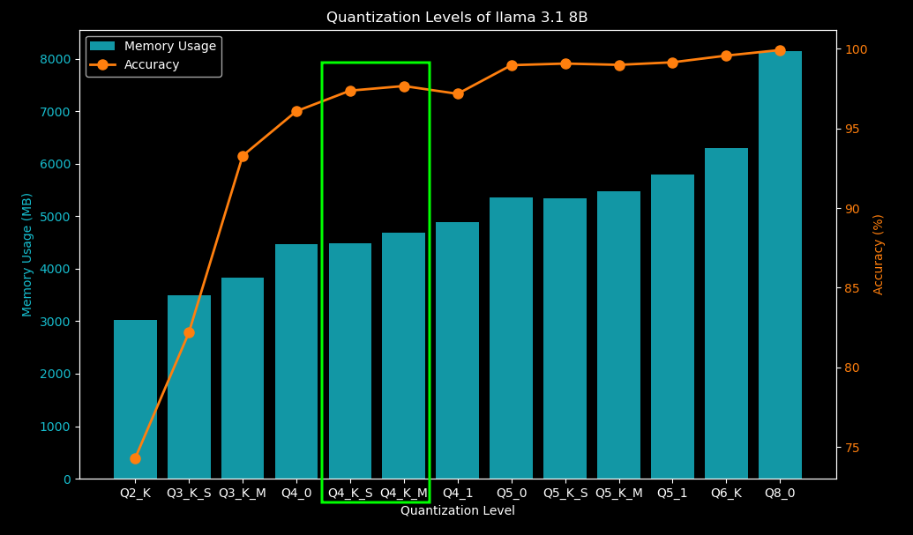

  
I highlighted the **Q4_K_S** and **Q4_K_M** quantization methods since they're usually offer the best balance between model size and accuracy. They usually use a bit more than 4 bits per parameter, but have better precision than plain **Q4_0**. If you're pulling model from ollama without specifying the precision, there's a high chance that you'll get **Q4_K_M** variant since it has been the default for some time. 

The rough formula for calculating memory usage of an Q4_K_M quantized LLM would be: **[n billion parameters] * (4.5 / 8) + [context window size]**.  
For 8B model, we would require around 6 GB VRAM/RAM to comfortably run it as Q4_K_M. 

**Context size**  
Context size is the number of tokens that LLM remembers from previous messages to generate a response. It's usually measured in tokens.  
In ollama it's usually set to 2048 tokens, which is around 1200 words or 6 kilobytes of text. With larger sizes, more memory is required to store the context. Also, the models have a context size limit (ex. 16k tokens for Phi4, 128k for Gemma 3). If the context size is too small, the LLM may forget what it was doing before. Take a look at this simplified example:  
  
  
In order to generate a correct response, the entire prompt should fit into the context window:  
  
  
We'll show how to check prompt length and set appropriate context size in Open WebUI a bit later on. 

**Open LLMs - Past and Present**  
Ever since [LLaMA 1 was leaked](https://www.theverge.com/2023/3/8/23629362/meta-ai-language-model-llama-leak-online-misuse) on 4chan in February 2023, we started seeing more and more companies caring about so called "open" LLMs. Those can be downloaded and run on users computer without any restrictions.  
In early 2025 we also heard A LOT about deepseek-r1. An open reasoning LLM that tried to compete with OpenAI's ChatGPT. While it wasn't Deepseeks first model (their earlier work includes deepseek-coder, deepseek-v2.5 MoE and deepseek-v3), the hype was global. It brought a lot of attention to open LLM ecosystem and made proprietary AI companies loose billions.  
Personally, I was interested in Open LLMs since their inception - when ollama project based on llama.cpp was born. Here're some of my picks for best self-hostable models currently available on ollama: 

-| Gemma 3 | Phi4 | Granite 3.2* | Qwen 2.5 | llama 3.1  
---|---|---|---|---|---  
Trained by | Google | Microsoft | IBM | Alibaba | Meta  
Released on | 03-2025 | 12-2024 | 02-2025 | 09-2024 | 07-2024  
Parameter count | 12B | 14B | 8B | 14B | 8B  
Size (Q4_K_M) | 8.1 GB | 9.1 GB | 4.9 GB | 9.0 GB | 4.9 GB  
Other variants | 1B, 4B, 27B | Phi4-mini 4B | Vision 2B, 2B | 0.5B, 1.5B, 3B, 7B, 32B, 72B, Qwen-coder | 70B, 405B  
Good at | Reasoning, explaining concepts, light programming, vision, translation | Instruction following, programming, complex tasks, translation | General tasks, light programming, translation | Translation, general tasks | General tasks  
Bad at | - | - | Complex tasks | Instruction following | Complex tasks, instruction following  

\* - while I was writing this tutorial, Granite 3.3 was released 

## **Use-Cases**

Contrary to what companies in the field often say - AI isn't a silver bullet. It won't solve all most problems we face as privacy conscious people.  
However when it comes to self-hosted models, there are some good use-cases even for privacy and anonymity. We already discussed how [stylometry protection](../stylometry/index.md) can be achieved with an LLM running locally.

**Translation** \- LLMs provide high-quality, real-time translations, allowing for communication across languages without external data leaks.  
**Rewriting** \- They assist in paraphrasing content to protect against stylometry or improving the flow.  
**Solving Problems** \- LLMs can be used as personal assistants to answer every day questions and help with personal issues.  
**Programming Aid** \- Developers use them for code suggestions and debugging without exposing their sensitive codebases.

It's crucial to stress that AI can hallucinate (make stuff up) thus it's never to be fully trusted with anything important. **You should always check the information in reputable sources in case of any doubts**.

## **Prerequisites**

To follow this tutorial, you'll need an AMD64 system running Debian 12. Although ollama can work on CPU only, the performance will be much worse than having model that fits in GPU's VRAM.  
To comfortably use an 8B model, it's strongly advised to have a dedicated GPU with at least 6GB of VRAM. You can check the supported GPU models [here](https://github.com/ollama/ollama/blob/main/docs/gpu.md).

This tutorial showcases ollama setup with Nvidia drivers, but AMD GPUs are also supported.

Here is how your setup may look like in the end of this tutorial: 


  
In case you decide to go with Proxmox VE hypervisor, you just need to PCI passthrough appropriate GPU inside the **Hardware > Add > PCI device** :

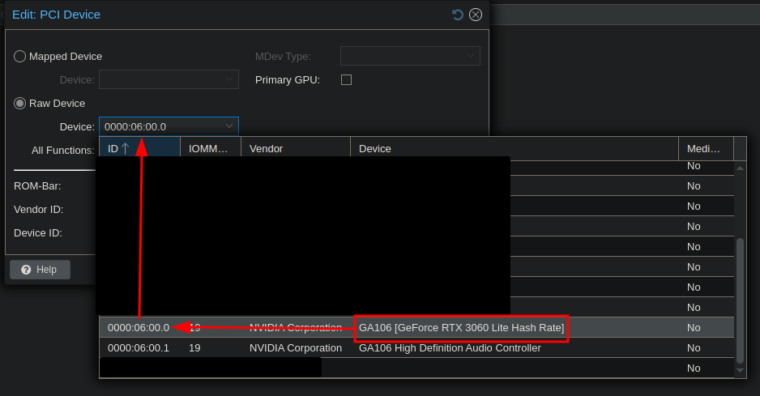

  
If you want to expose Open WebUI via Tor to access it remotely, you should have an [onion v3 vanity address and Tor installed](../torwebsite/index.md).

## **Docker Setup**

Follow the steps from [this tutorial](../docker-intro/index.md#installation) to install docker and make sure it's working on your system.

## **Nvidia Driver and Container Toolkit**

Update your package list to include `contrib non-free` at the end of every line in **/etc/apt/sources.list** :
    
    
    deb http://deb.debian.org/debian/ bookworm main non-free-firmware non-free contrib
    deb-src http://deb.debian.org/debian/ bookworm main non-free-firmware non-free contrib
    
    deb http://security.debian.org/debian-security bookworm-security main non-free-firmware non-free contrib
    deb-src http://security.debian.org/debian-security bookworm-security main non-free-firmware non-free contrib
    
    deb http://deb.debian.org/debian/ bookworm-updates main non-free-firmware non-free contrib
    deb-src http://deb.debian.org/debian/ bookworm-updates main non-free-firmware non-free contrib

Now install Nvidia driver and some utilities:
    
    
    oxeo@andromeda:~$ sudo apt update
    oxeo@andromeda:~$ sudo apt install gnupg2 curl linux-headers-amd64 nvidia-driver firmware-misc-nonfree
    

Then install Nvidia Container Toolkit as described [here](https://docs.nvidia.com/datacenter/cloud-native/container-toolkit/latest/install-guide.html):
    
    
    oxeo@andromeda:~$ curl -fsSL https://nvidia.github.io/libnvidia-container/gpgkey | sudo gpg --dearmor -o /usr/share/keyrings/nvidia-container-toolkit-keyring.gpg \
      && curl -s -L https://nvidia.github.io/libnvidia-container/stable/deb/nvidia-container-toolkit.list | \
        sed 's#deb https://#deb [signed-by=/usr/share/keyrings/nvidia-container-toolkit-keyring.gpg] https://#g' | \
        sudo tee /etc/apt/sources.list.d/nvidia-container-toolkit.list
    oxeo@andromeda:~$ sudo apt update
    oxeo@andromeda:~$ sudo apt install nvidia-container-toolkit
    

Finally, reboot the system:
    
    
    oxeo@andromeda:~$ sudo systemctl reboot
    

To verify driver installation, execute:
    
    
    oxeo@andromeda:~$ nvidia-smi
    Fri Apr 18 16:43:30 2025       
    +---------------------------------------------------------------------------------------+
    | NVIDIA-SMI 535.216.01             Driver Version: 535.216.01   CUDA Version: 12.2     |
    |-----------------------------------------+----------------------+----------------------+
    | GPU  Name                 Persistence-M | Bus-Id        Disp.A | Volatile Uncorr. ECC |
    | Fan  Temp   Perf          Pwr:Usage/Cap |         Memory-Usage | GPU-Util  Compute M. |
    |                                         |                      |               MIG M. |
    |=========================================+======================+======================|
    |   0  NVIDIA GeForce RTX 3060        On  | 00000000:00:10.0 Off |                  N/A |
    |  0%   36C    P0              37W / 170W |      1MiB / 12288MiB |      0%      Default |
    |                                         |                      |                  N/A |
    +-----------------------------------------+----------------------+----------------------+
                                                                                             
    +---------------------------------------------------------------------------------------+
    | Processes:                                                                            |
    |  GPU   GI   CI        PID   Type   Process name                            GPU Memory |
    |        ID   ID                                                             Usage      |
    |=======================================================================================|
    |  No running processes found                                                           |
    +---------------------------------------------------------------------------------------+
    

And to activate Nvidia support in Docker:
    
    
    oxeo@andromeda:~$ sudo nvidia-ctk runtime configure --runtime=docker
    INFO[0000] Config file does not exist; using empty config 
    INFO[0000] Wrote updated config to /etc/docker/daemon.json 
    INFO[0000] It is recommended that docker daemon be restarted.
    oxeo@andromeda:~$ sudo systemctl restart docker
    oxeo@andromeda:~$ docker run --rm --runtime=nvidia --gpus all ubuntu nvidia-smi
    Unable to find image 'ubuntu:latest' locally
    latest: Pulling from library/ubuntu
    2726e237d1a3: Pull complete 
    Digest: sha256:1e622c5f073b4f6bfad6632f2616c7f59ef256e96fe78bf6a595d1dc4376ac02
    Status: Downloaded newer image for ubuntu:latest
    Fri Apr 18 20:46:43 2025       
    +---------------------------------------------------------------------------------------+
    | NVIDIA-SMI 535.216.01             Driver Version: 535.216.01   CUDA Version: 12.2     |
    |-----------------------------------------+----------------------+----------------------+
    | GPU  Name                 Persistence-M | Bus-Id        Disp.A | Volatile Uncorr. ECC |
    | Fan  Temp   Perf          Pwr:Usage/Cap |         Memory-Usage | GPU-Util  Compute M. |
    |                                         |                      |               MIG M. |
    |=========================================+======================+======================|
    |   0  NVIDIA GeForce RTX 3060        On  | 00000000:00:10.0 Off |                  N/A |
    |  0%   37C    P8              11W / 170W |      1MiB / 12288MiB |      0%      Default |
    |                                         |                      |                  N/A |
    +-----------------------------------------+----------------------+----------------------+
                                                                                             
    +---------------------------------------------------------------------------------------+
    | Processes:                                                                            |
    |  GPU   GI   CI        PID   Type   Process name                            GPU Memory |
    |        ID   ID                                                             Usage      |
    |=======================================================================================|
    |  No running processes found                                                           |
    +---------------------------------------------------------------------------------------+
    

_Sidenote:_ If you are getting an [error](https://github.com/NVIDIA/libnvidia-container/issues/176) at this step (as Nihilist experienced on a [Kicksecure Host OS](../linux/index.md)), you may need change the bpf_jit_harden value in sysctl to get it to work:
    
    
    [user ~]% sudo sysctl -w net.core.bpf_jit_harden=1
    [user ~]% sudo vim /etc/sysctl.d/91-nvidia-docker.conf 
    [user ~]% cat /etc/sysctl.d/91-nvidia-docker.conf  
    net.core.bpf_jit_harden=1
    
    [user ~]% docker run --rm --runtime=nvidia --gpus all ubuntu nvidia-smi
    
    

## **Open WebUI Docker Stack**

Create a docker-compose.yml file in **~/openwebui-stack** with the following contents. This setup uses ollama for LLM management and open-webui as the user interface.
    
    
    services:
      ollama:
        image: ollama/ollama
        container_name: ollama
        volumes:
          - ollama:/root/.ollama
        pull_policy: always
        ports:
          - 127.0.0.1:11434:11434
        tty: true
        restart: unless-stopped
        deploy:
          resources:
            reservations:
              devices:
                - driver: nvidia
                  count: 1
                  capabilities:
                    - gpu
    
      open-webui:
        image: ghcr.io/open-webui/open-webui:main
        container_name: open-webui
        volumes:
          - open-webui:/app/backend/data
        depends_on:
          - ollama
        ports:
          - 127.0.0.1:3000:8080  # Remove "127.0.0.1:" to access from LAN
        environment:
          - 'OLLAMA_BASE_URL=http://ollama:11434'
          - 'WEBUI_SECRET_KEY='
        extra_hosts:
          - host.docker.internal:host-gateway
        restart: unless-stopped
    
      # make sure you don't have watchtower already running as a container
      # then it's not required to put it here
      watchtower:
        image: containrrr/watchtower
        restart: unless-stopped
        volumes:
          - /var/run/docker.sock:/var/run/docker.sock
        command: --interval 14400 --cleanup
    
    volumes:
      ollama: {}
      open-webui: {}
    

To start the stack:
    
    
    oxeo@andromeda:~$ cd ~/openwebui-stack
    oxeo@andromeda:~/openwebui-stack$ docker compose up -d
    

## **Exposing Hidden Service**

To expose open-webui via Tor, edit your **/etc/tor/torrc** file:
    
    
    HiddenServiceDir /var/lib/tor/openwebui_service/
    HiddenServicePort 80 127.0.0.1:3000
    

Restart Tor and check the generated hostname:
    
    
    oxeo@andromeda:~$ sudo systemctl restart tor
    oxeo@andromeda:~$ sudo cat /var/lib/tor/openwebui_service/hostname
    webui3r7zacusoxddubpqriedoljyaiow6plausfwd6hjpjajuydh4id.onion
    

In case of any doubts, we already showcased how to expose hidden service with your custom vanity url [here](../torwebsite/index.md). 

## **Initial Open WebUI Configuration**

Go to the local IP or onion address of the Open WebUI and create admin account once you're asked to. You don't need to put any real data but save it somewhere so that you can login later. 

 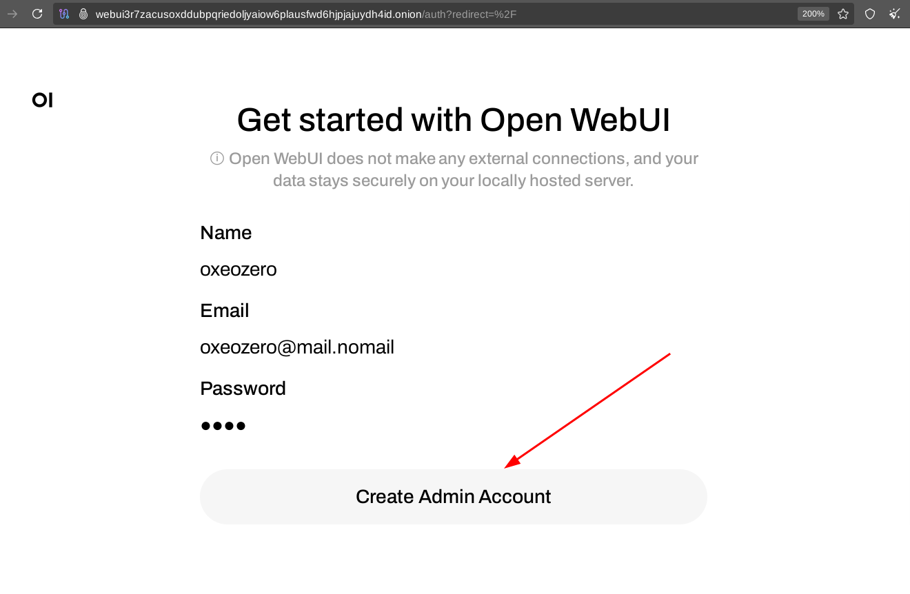

  
After that, you should be greeted with Open WebUI main interface and changelog popup. You can close it. 


  
Then, we'll go into the settings page and change theme to dark mode. 

 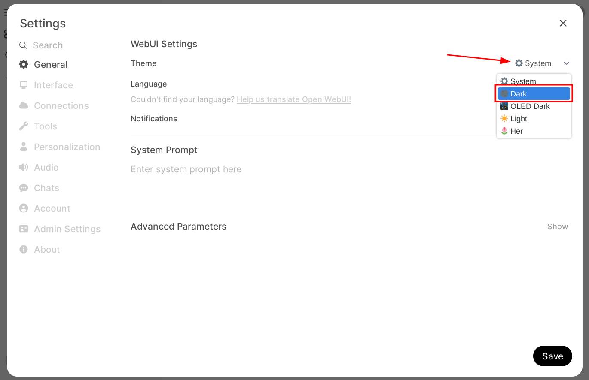

  
Go to the **Admin settings** and proceed with next steps. 

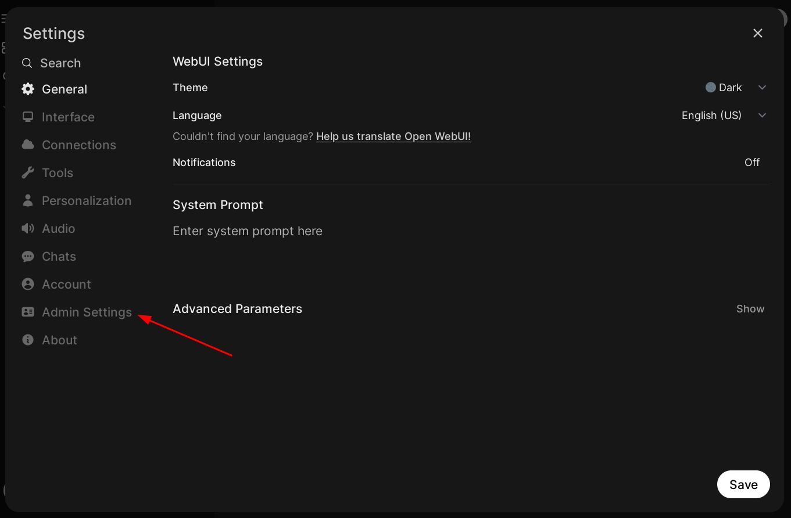

## **Downloading a Model**

To see available models, head to [ollama library](https://ollama.com/library). Sadly they block Tor traffic so if you have to use Tor, use their [chinese mirror](https://ollama.org.cn/library).  
Next, pick a model you want to download. In our case, we want **Gemma 3**. Then click on **Tags** to see all available variants. 

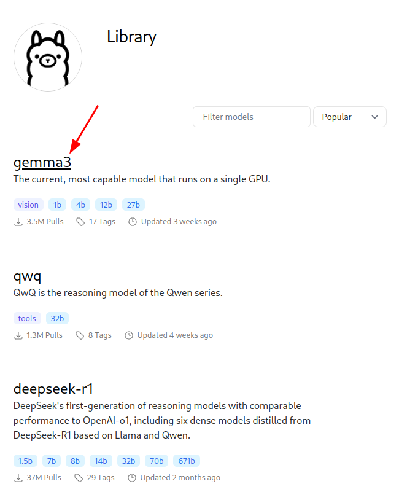 

  
Now, you'll see different sizes and quantization variants the model is available in. We want to download **12B** variant in **Q4_K_M** quantization. Comparing the hashes, we see the default **gemma3:12b** is the same as **gemma3:12b-it-q4_K_M**. Additionally, you can see that if we put just **gemma3** , we would get the **4B** variant.

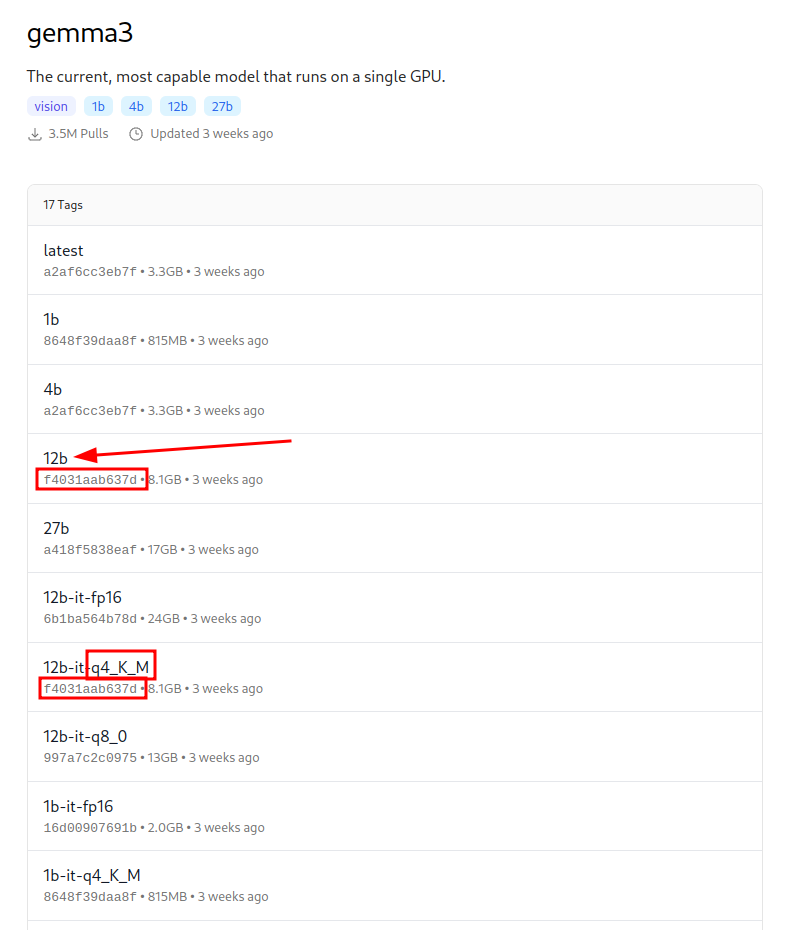

  
Then, copy the model name we got after clicking on desired variant. If you want to download it via ollama CLI, we also get the full command. In our case Open WebUI needs to know just the **model_name:size**. 

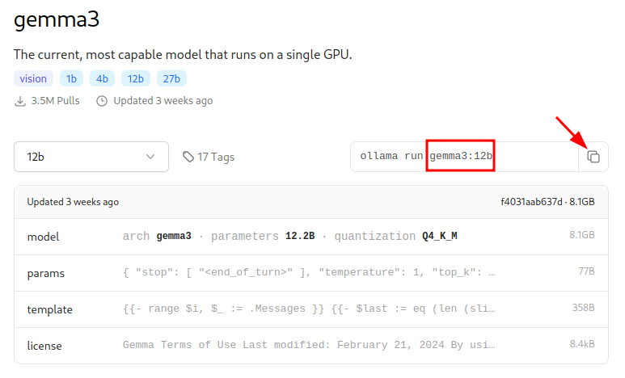

  
Now, go back to Open WebUI's **Admin Settings** we opened in the previous section and click on **Models** tab, then the download icon: 

   
  
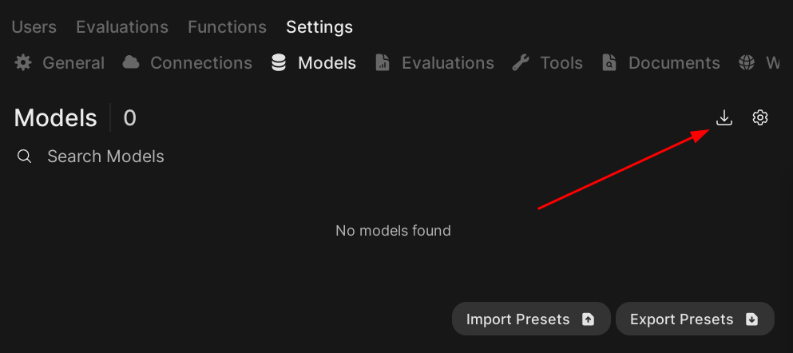

  
In the **Enter model tag** field, type **gemma3:12b** and click the download icon again. It will automatically pull the appropriate model from the [ollama library](https://ollama.com/library). 

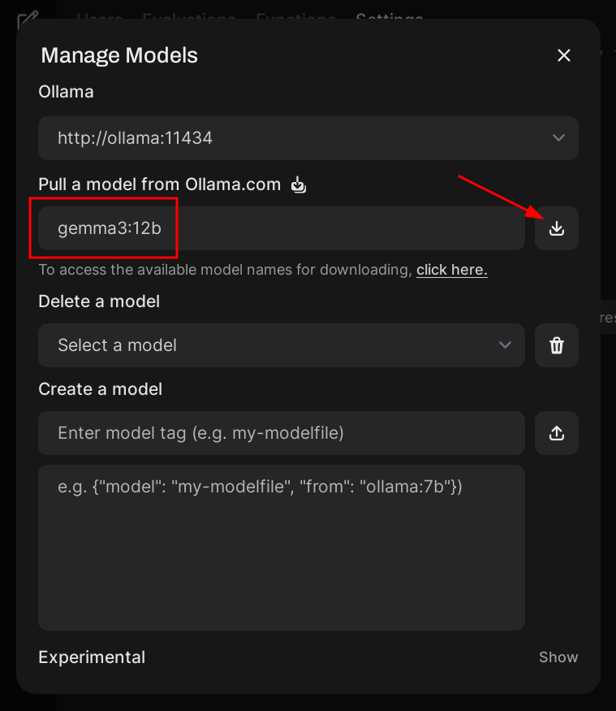

  
After that, just wait for the model download to complete. 


  
Once the progress bar reaches 100%, the model should be added to your library automatically.  
Go to the main page again and check if it's available now. 

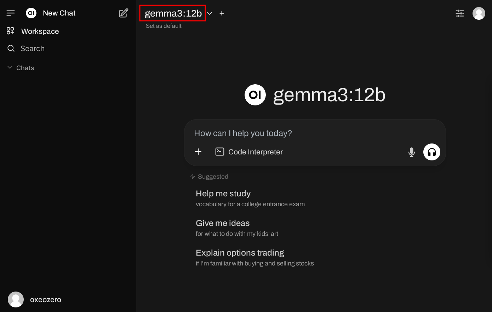

## **Running a Model**

  
You can now ask the model about something and it should respond after it gets loaded into memory. 


  
After the answer is generated, you can click on the **(i)** icon to see statistics. Here we got 32 tokens per second (around 10 words per second). If the response is slow (like 1 token per second) it probably means that either model didn't entirely fit into GPUs memory or the GPU isn't being used at all. Check the troubleshooting section for more details.  
We can also see that in our prompt (_"What are the benefits and drawbacks of using Tor network?"_) there were 20 tokens (**prompt_tokens**) and the generated answer had 1222 tokens (**eval_count**). In total our conversation took 1242 tokens which is less than default window size of 2048. 

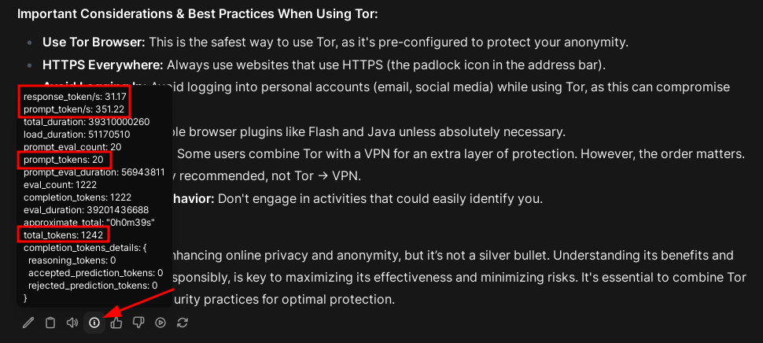

  
With longer prompt, the context window may be filled up which causes the model to forget what was at the beginning of conversation. 

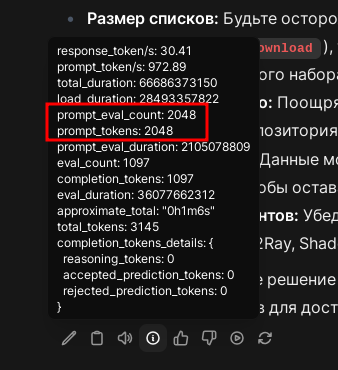

  
If **prompt_tokens** is 2048, we need to increase window size. To do that, click on the settings icon next to the user and change **Context Length (Ollama)** parameter. 

  
  


  
Here, we see the **prompt_tokens** is now less than the context window size we set. This means entire prompt was evaluated without truncating anything. However this comes with the expense of slightly higher memory usage. Here you can see a comparison between **context_size=2048** and **context_size=8192** :  
 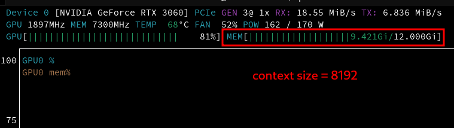

It's also worth noting Gemma3 is a **multimodal** model which effectively means it can understand text as well as images. There're only a few other open models with vision capabilities including llama 3.2 9B and granite3.2 vision 2B. 

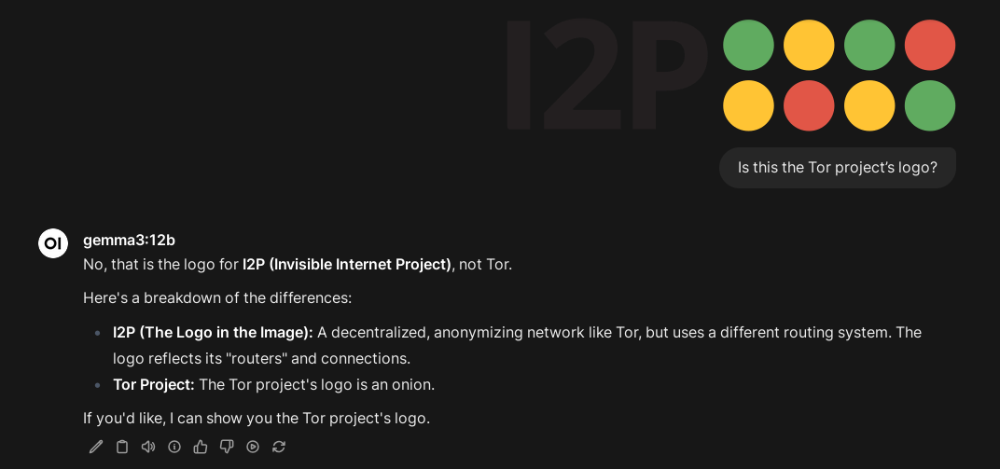

  
Finally - all your past conversations will be visible in the sidepanel on the left. You can search them by keywords or remove sensitive ones. 


## **Model Benchmarks**

Click on any question to see full model's response.

## Gemma3 (12B)

Q1 - Why is the water blue?
    
    
    > Why is the water blue? Answer in few short sentences.
    
    
    Water absorbs longer wavelengths of light (reds and yellows) more readily than shorter wavelengths (blues and violets). This means blue light is scattered and reflected back, making water appear blue to our eyes. The effect is more noticeable in deeper water where more light is scattered.

Q2 - Tor vs VPN
    
    
    > How does Tor differ from a VPN service? Is it better for privacy? Answer in few short sentences.
    
    
    Tor and VPNs both offer online anonymity, but work differently. A VPN encrypts your traffic and routes it through a server controlled by the VPN provider, masking your IP address. Tor routes your traffic through a network of volunteer-operated relays, making it much harder to trace. Generally, Tor offers stronger privacy than a VPN, but can be slower due to its layered routing.

Q3 - Fixing Python script
    
    
    > Fix mistakes in this Python code:
    ```python  
    #!/usr/bin/python3
    import io     
    f = open('a.txt', 'r')
    bio = BytesIO()
    for byte in f.read:
        bio.write(bytes([byte ^ 6]))
    f.close()
    bio.seek(0)
    print(bio.read())  
    ```
    Don't output anything more than the corrected script.
    
    
    ```python
    #!/usr/bin/python3
    import io
    from io import BytesIO
    
    f = open('a.txt', 'r')
    bio = BytesIO()
    for byte in f.read():
        bio.write(bytes([byte ^ 6]))
    f.close()
    bio.seek(0)
    print(bio.read())
    ```

Q4 - Indentifying C vulnerability
    
    
    > Do you see any vulnerability in this C code?
    ```c
    #include 
    #include 
    #include 
    
    void print_text(const char* inbuf) {
      char newbuf[64] = {0};
      strncpy(newbuf, inbuf, 0x3f);
      printf(newbuf);
    }
    
    int main(int argc, char** argv) {
      if (argc > 1) {
        print_text(argv[1]);
      }
      return 0;
    }
    ```
    Keep your answer short. Just a few sentences about what you identified.
    
    
    The code has a format string vulnerability. `printf(newbuf)` uses user-controlled data (`newbuf`) as the format string, allowing an attacker to potentially read from or write to arbitrary memory locations. `strncpy` limits the copy to 60 bytes, but the format string vulnerability remains because `printf` can interpret those bytes as format specifiers.

Q5 - Russian-English translation
    
    
    > Translate to english:  
    ```
    Заметил что через какое-то время перестает работать i2pd. Пока не перезапустишь сервис, либо не нажмешь в админке перезагрузку конфигов. Это известный баг? Или я что-то не так настроил?Обновился до последней версии. Ни чего не поменялось. У меня. mac os сборка. Из интересного даже локал хост с консолью не открывается, точнее он это делает раз через раз. Но когда открывается показывает что тунели есть. Ведет себя буд-то утечка памяти, или что то такое. 
    ```
    Only output the translation, nothing else.
    
    
    I've noticed that I2pd stops working after a while. I have to restart the service or reload the configuration in the admin panel to get it working again. Is this a known bug? Or am I configuring something incorrectly? I updated to the latest version, and nothing has changed. I'm running on macOS. Interestingly, even localhost with the console doesn't open consistently; it works sometimes, but when it does, it shows that tunnels are present. It behaves as if there's a memory leak or something like that.
    

## Gemma3 (4B)

Q1 - Why is the water blue?
    
    
    > Why is the water blue? Answer in few short sentences.
    
    
    Water appears blue due to a phenomenon called Rayleigh scattering. Sunlight is made of all colors, and when it hits water molecules, shorter wavelengths like blue and violet are scattered more than longer wavelengths. Our eyes perceive this scattered blue light, making water look blue.
    
    Essentially, the water is scattering sunlight, and blue light is scattered more effectively than other colors.

Q2 - Tor vs VPN
    
    
    > How does Tor differ from a VPN service? Is it better for privacy? Answer in few short sentences.
    
    
    Okay, here's a breakdown of the differences and privacy comparison:
    
    Tor (The Onion Router) and VPNs (Virtual Private Networks) both enhance online privacy, but they do so in different ways. A VPN encrypts your internet traffic and routes it through a single server, masking your IP address from websites. Tor, on the other hand, bounces your traffic through a network of relays, making it far more difficult to trace your activity back to you. Tor is generally considered better for overall privacy due to its layered encryption and distributed nature, while a VPN primarily focuses on protecting your connection between your device and the VPN server.

Q3 - Fixing Python script
    
    
    > Fix mistakes in this Python code:
    ```python  
    #!/usr/bin/python3
    import io     
    f = open('a.txt', 'r')
    bio = BytesIO()
    for byte in f.read:
        bio.write(bytes([byte ^ 6]))
    f.close()
    bio.seek(0)
    print(bio.read())  
    ```
    Don't output anything more than the corrected script.
    
    
    ```python
    #!/usr/bin/python3
    import io
    from io import BytesIO
    
    f = open('a.txt', 'r')
    bio = BytesIO()
    for byte in f.read():
        bio.write(bytes([byte ^ 6]))
    f.close()
    bio.seek(0)
    print(bio.read())
    ```

Q4 - Indentifying C vulnerability
    
    
    > Do you see any vulnerability in this C code?
    ```c
    #include 
    #include 
    #include 
    
    void print_text(const char* inbuf) {
      char newbuf[64] = {0};
      strncpy(newbuf, inbuf, 0x3f);
      printf(newbuf);
    }
    
    int main(int argc, char** argv) {
      if (argc > 1) {
        print_text(argv[1]);
      }
      return 0;
    }
    ```
    Keep your answer short. Just a few sentences about what you identified.
    
    
    The code is vulnerable to a format string vulnerability. The `strncpy` function with a size of 0x3f (63) copies the input string into `newbuf` without null-termination, and then `printf` is called directly with this potentially unformatted string as the format string.  This allows an attacker to control the format string and read or write arbitrary memory locations.

Q5 - Russian-English translation
    
    
    > Translate to english:  
    ```
    Заметил что через какое-то время перестает работать i2pd. Пока не перезапустишь сервис, либо не нажмешь в админке перезагрузку конфигов. Это известный баг? Или я что-то не так настроил?Обновился до последней версии. Ни чего не поменялось. У меня. mac os сборка. Из интересного даже локал хост с консолью не открывается, точнее он это делает раз через раз. Но когда открывается показывает что тунели есть. Ведет себя буд-то утечка памяти, или что то такое. 
    ```
    Only output the translation, nothing else.
    
    
    I’ve noticed that i2pd stops working after a certain period of time. It only stops working until I restart the service or reload the configs in the admin panel. Is this a known bug? Or am I doing something wrong? I updated to the latest version and nothing changed. I have a macOS build. Interestingly, even localhost with the console doesn’t open, rather it does this sporadically. But when it opens, it shows that the tunnels are present. It acts as if there’s a memory leak, or something like that.
    

## Gemma3 (1B)

Q1 - Why is the water blue?
    
    
    > Why is the water blue? Answer in few short sentences.
    
    
    Water appears blue due to the way sunlight interacts with its molecules. Water molecules absorb red and yellow light, but they reflect blue light, making it appear blue to our eyes.

Q2 - Tor vs VPN
    
    
    > How does Tor differ from a VPN service? Is it better for privacy? Answer in few short sentences.
    Tor is a decentralized network that routes traffic through multiple relays, offering stronger anonymity but slower speeds.
    
    
    A VPN encrypts your internet traffic and routes it through a server, masking your IP address but potentially less secure. Ultimately, Tor is generally considered better for privacy due to its focus on anonymity, while a VPN provides a more convenient and faster solution.

Q3 - Fixing Python script
    
    
    > Fix mistakes in this Python code:
    ```python  
    #!/usr/bin/python3
    import io     
    f = open('a.txt', 'r')
    bio = BytesIO()
    for byte in f.read:
        bio.write(bytes([byte ^ 6]))
    f.close()
    bio.seek(0)
    print(bio.read())  
    ```
    Don't output anything more than the corrected script.
    
    
    ```python
    #!/usr/bin/python3
    import io
    f = open('a.txt', 'r')
    bio = io.BytesIO(f.read())
    for byte in bio:
        bio.seek(0)
    print(byte)
    ```

Q4 - Indentifying C vulnerability
    
    
    > Do you see any vulnerability in this C code?
    ```c
    #include 
    #include 
    #include 
    
    void print_text(const char* inbuf) {
      char newbuf[64] = {0};
      strncpy(newbuf, inbuf, 0x3f);
      printf(newbuf);
    }
    
    int main(int argc, char** argv) {
      if (argc > 1) {
        print_text(argv[1]);
      }
      return 0;
    }
    ```
    Keep your answer short. Just a few sentences about what you identified.
    
    
    The code is vulnerable to a buffer overflow because `strncpy` doesn't perform a length check and can write beyond the bounds of `newbuf`.  If `inbuf` is longer than 63 characters, the program will overwrite memory, potentially leading to a crash or security exploit.

Q5 - Russian-English translation
    
    
    > Translate to english:
    ```
    Заметил что через какое-то время перестает работать i2pd. Пока не перезапустишь сервис, либо не нажмешь в админке перезагрузку конфигов. Это известный баг? Или я что-то не так настроил?Обновился до последней версии. Ни чего не поменялось. У меня. mac os сборка. Из интересного даже локал хост с консолью не открывается, точнее он это делает раз через раз. Но когда открывается показывает что тунели есть. Ведет себя буд-то утечка памяти, или что то такое. 
    ```
    Only output the translation, nothing else.
    
    
    “I’ve noticed that i2pd service stops working after a while. You need to restart the service, or press the admin panel to restart the configuration. Is this a known bug? Or am I setting something wrong? I’ve updated to the latest version. Nothing has changed. I’m on a Mac OS build. Even local host with a console doesn’t open – it happens every time. But when it opens, it shows that tunnels are present. It’s behaving as if it’s leaking memory, or something else. ”

## Phi4 (14B)

Q1 - Why is the water blue?
    
    
    > Why is the water blue? Answer in few short sentences.
    
    
    Water appears blue primarily because of how it absorbs and scatters sunlight. Pure water absorbs colors at the red end of the light spectrum more efficiently than those at the blue end, which are scattered and reflected back to our eyes. In large volumes, such as oceans or deep lakes, this effect becomes noticeable, giving water its characteristic blue color. Additionally, substances like algae or minerals in natural bodies of water can enhance the bluish hue.

Q2 - Tor vs VPN
    
    
    > How does Tor differ from a VPN service? Is it better for privacy? Answer in few short sentences.
    
    
    
    Tor (The Onion Router) and VPNs (Virtual Private Networks) both enhance online privacy but operate differently. Tor routes your internet traffic through multiple volunteer-operated servers, encrypting data at each step, to obscure your IP address and location, making it highly effective for anonymous browsing. However, it can be slower due to this multi-layered routing process.
    
    In contrast, a VPN encrypts your internet connection between your device and a single server run by the VPN provider, masking your real IP address and allowing you to appear as if you're accessing the internet from the server's location. This is generally faster than Tor but relies on trust in the VPN provider since they can see your traffic.
    
    Tor offers higher anonymity due to its decentralized nature, while VPNs are better for speed and ease of use. Neither is universally "better" for privacy; the choice depends on specific needs, such as wheter you prioritize maximum anonymity or a balance between privacy and performance.

Q3 - Fixing Python script
    
    
    > Fix mistakes in this Python code:
    ```python  
    #!/usr/bin/python3
    import io     
    f = open('a.txt', 'r')
    bio = BytesIO()
    for byte in f.read:
        bio.write(bytes([byte ^ 6]))
    f.close()
    bio.seek(0)
    print(bio.read())  
    ```
    Don't output anything more than the corrected script.
    
    
    ```python
    #!/usr/bin/python3
    import io
    
    f = open('a.txt', 'rb')
    bio = io.BytesIO()
    
    for byte in f.read():
        bio.write(bytes([byte ^ 6]))
    
    f.close()
    bio.seek(0)
    print(bio.read())
    ```

Q4 - Indentifying C vulnerability
    
    
    > Do you see any vulnerability in this C code?
    ```c
    #include 
    #include 
    #include 
    
    void print_text(const char* inbuf) {
      char newbuf[64] = {0};
      strncpy(newbuf, inbuf, 0x3f);
      printf(newbuf);
    }
    
    int main(int argc, char** argv) {
      if (argc > 1) {
        print_text(argv[1]);
      }
      return 0;
    }
    ```
    Keep your answer short. Just a few sentences about what you identified.
    
    
    Yes, the code contains a vulnerability due to improper use of `strncpy`. Although it limits copying to `0x3f` (63) characters, `newbuf` has room for one more character (the null terminator). After using `strncpy`, there's no guarantee that `newbuf` is null-terminated if the source string is longer than 63 characters. This can lead to undefined behavior when `printf(newbuf)` is called, potentially resulting in a buffer overflow or a crash if non-null bytes follow.
    
    Additionally, the use of `printf(newbuf)` with an untrusted input (`inbuf`) without format specifiers allows for format string vulnerabilities, as it directly uses the contents of `newbuf` as a format string, which could be manipulated to execute arbitrary code.

Q5 - Russian-English translation
    
    
    > Translate to english:  
    ```
    Заметил что через какое-то время перестает работать i2pd. Пока не перезапустишь сервис, либо не нажмешь в админке перезагрузку конфигов. Это известный баг? Или я что-то не так настроил?Обновился до последней версии. Ни чего не поменялось. У меня. mac os сборка. Из интересного даже локал хост с консолью не открывается, точнее он это делает раз через раз. Но когда открывается показывает что тунели есть. Ведет себя буд-то утечка памяти, или что то такое. 
    ```
    Only output the translation, nothing else.
    
    
    I've noticed that i2pd stops working after some time. It only resumes when you restart the service or refresh the configuration in the admin panel. Is this a known bug, or is something wrong with my setup? I updated to the latest version, but it hasn't changed anything for me on Mac OS. Interestingly, localhost from the console doesn't consistently open; it works intermittently. When it does open, it shows that tunnels exist. It behaves as if there's a memory leak or something similar.
    

## Phi4-mini (4B)

Q1 - Why is the water blue?
    
    
    > Why is the water blue? Answer in few short sentences.
    
    
    Water appears blue because it absorbs light at all other wavelengths more strongly than green, reflecting and transmitting most of that wavelength back to our eyes as we see it shining through or bouncing off its surface. Blue contains a shorter wave length which makes this visible effect stronger compared with longer colors such as red when the water is illuminated by white sunlight.

Q2 - Tor vs VPN
    
    
    > How does Tor differ from a VPN service? Is it better for privacy? Answer in few short sentences.
    
    
    Tor anonymizes internet traffic by routing data through multiple volunteer-operated servers, providing strong anonymity and resisting network surveillance or censorship effectively.
    
    VPN services also encrypt your connection but route all of your device's Internet-bound connections to the selected server; they can bypass geographic restrictions more directly than Tor.
    
    While both offer privacy benefits over standard browsing on public Wi-Fi networks (or even home ISPs), VPNs may still be detectable and are typically less anonymous because each request appears as coming from their own IP address. Tor, by contrast, is inherently designed for anonymity but might result in slower connection speeds due to its complex routing process.
    
    In terms of privacy alone:
    
    For complete online anonymity: TOR
    For a balance between speed/security/privacy with broader usage support and less impact on connections: VPNs.

Q3 - Fixing Python script
    
    
    > Fix mistakes in this Python code:
    ```python  
    #!/usr/bin/python3
    import io     
    f = open('a.txt', 'r')
    bio = BytesIO()
    for byte in f.read:
        bio.write(bytes([byte ^ 6]))
    f.close()
    bio.seek(0)
    print(bio.read())  
    ```
    Don't output anything more than the corrected script.
    
    
    ```python
    #!/usr/bin/python3
    import io
    
    with open('a.txt', 'rb') as f:  # Open file in binary mode for reading bytes.
        bio = BytesIO()
        
    for byte in f:
            modified_byte = byte ^ 6      # XOR operation on each byte with the constant (6).
            encoded_modified_byte = modified_byte.to_bytes(1, byteorder='little')
            
            if len(encoded_modified_byte) == 0:       # Check for empty result due to zero-byte.
                bio.write(b'\x00')                 # Write a single null character in case of such an occurrence.
    
            else:
                bio.write(encoded_modified_byte)
                
    bio.seek(0)
    
    # Read and decode from BytesIO back into readable format
    decoded_output = b''.join([bytes.fromhex(hex(byte ^ 6)[2:]) for byte in bio.getvalue()])
    print(decoded_output.decode('utf-8', errors='ignore'))
    ```
    
    Note:
    1. The file is opened using `'rb'` mode to handle bytes properly.
    2. Added an XOR operation with a constant (6).
    3. Converted each modified byte back into `BytesIO`.
    4. Decoded the final output correctly for readability.
    
    This corrected script reads from 'a.txt', modifies its content by performing bitwise operations on every character, and prints out encoded characters in hexadecimal format converted to readable text while ignoring errors related to decoding non-UTF-8 characters properly (i.e., using `errors='ignore'`).
    
    Make sure your environment has access permissions for reading the file. Adjust any error handling as per specific requirements or data formats present within 'a.txt'.
    

Q4 - Indentifying C vulnerability
    
    
    > Do you see any vulnerability in this C code?
    ```c
    #include 
    #include 
    #include 
    
    void print_text(const char* inbuf) {
      char newbuf[64] = {0};
      strncpy(newbuf, inbuf, 0x3f);
      printf(newbuf);
    }
    
    int main(int argc, char** argv) {
      if (argc > 1) {
        print_text(argv[1]);
      }
      return 0;
    }
    ```
    Keep your answer short. Just a few sentences about what you identified.
    
    
    Yes, there's an issue with the use of `strncpy`. If `inbuf` contains more than or equal to 64 characters (the size limit minus one for null terminator), it won't be properly copied into `newbuf`, leading to undefined behavior when accessing its contents later on in your code due to a potential buffer overflow vulnerability.

Q5 - Russian-English translation
    
    
    > Translate to english:  
    ```
    Заметил что через какое-то время перестает работать i2pd. Пока не перезапустишь сервис, либо не нажмешь в админке перезагрузку конфигов. Это известный баг? Или я что-то не так настроил?Обновился до последней версии. Ни чего не поменялось. У меня. mac os сборка. Из интересного даже локал хост с консолью не открывается, точнее он это делает раз через раз. Но когда открывается показывает что тунели есть. Ведет себя буд-то утечка памяти, или что то такое. 
    ```
    Only output the translation, nothing else.
    
    
    Noticed that i2pd stops working after some time unless you restart the service or refresh configurations in admin mode. Is this a known bug? Or did I misconfigure something?
    
    Updated to the latest version; no changes were made on my end.
    
    On macOS build (I'm not sure what it is). Interestingly, even when connecting locally with console doesn't always open - more precisely: it's intermittent behavior but sometimes tunnels are detected which indicates memory leaks or similar issues.

## Granite 3.2 (8B)

Q1 - Why is the water blue?
    
    
    > Why is the water blue? Answer in few short sentences.
    
    
    Water itself appears colorless. The blue appearance is due to water absorbing light from all wavelengths except blue, which gets scattered, making it appear blue. This phenomenon is known as Rayleigh scattering.

Q2 - Tor vs VPN
    
    
    > How does Tor differ from a VPN service? Is it better for privacy? Answer in few short sentences.
    
    
    Tor and VPNs both enhance online anonymity but function differently. Tor routes traffic through a network of volunteer-operated servers (nodes), encrypting data multiple times, making it harder to trace the origin. A VPN, on the other hand, securely tunnels your internet connection to a server operated by the service provider. While both provide privacy, Tor's multi-layered approach may offer more robust anonymity against sophisticated tracking attempts, although it can be slower and less reliable than a VPN. However, for general online activities, a reputable VPN is usually sufficient and offers better speeds.

Q3 - Fixing Python script
    
    
    > Fix mistakes in this Python code:
    ```python  
    #!/usr/bin/python3
    import io     
    f = open('a.txt', 'r')
    bio = BytesIO()
    for byte in f.read:
        bio.write(bytes([byte ^ 6]))
    f.close()
    bio.seek(0)
    print(bio.read())  
    ```
    Don't output anything more than the corrected script.
    
    
    ```python  
    #!/usr/bin/python3
    import io     
    import os
    
    with open('a.txt', 'rb') as f:
        bio = io.BytesIO()
        for byte in f.read():
            bio.write(bytes([byte ^ 6]))
    bio.seek(0)
    print(bio.read().decode())  
    ```

Q4 - Indentifying C vulnerability
    
    
    > Do you see any vulnerability in this C code?
    ```c
    #include 
    #include 
    #include 
    
    void print_text(const char* inbuf) {
      char newbuf[64] = {0};
      strncpy(newbuf, inbuf, 0x3f);
      printf(newbuf);
    }
    
    int main(int argc, char** argv) {
      if (argc > 1) {
        print_text(argv[1]);
      }
      return 0;
    }
    ```
    Keep your answer short. Just a few sentences about what you identified.
    
    
    The code contains a potential buffer overflow vulnerability due to the use of `strncpy` in the `print_text` function. Although it limits copying up to 64 bytes (0x3f in hexadecimal), it does not null-terminate `newbuf` if the input string is longer than 62 characters, leading to unpredictable behavior or a crash. To fix this, replace `strncpy` with `strlcpy`, which guarantees null-termination and specifies the buffer size.

Q5 - Russian-English translation
    
    
    > Translate to english:  
    ```
    Заметил что через какое-то время перестает работать i2pd. Пока не перезапустишь сервис, либо не нажмешь в админке перезагрузку конфигов. Это известный баг? Или я что-то не так настроил?Обновился до последней версии. Ни чего не поменялось. У меня. mac os сборка. Из интересного даже локал хост с консолью не открывается, точнее он это делает раз через раз. Но когда открывается показывает что тунели есть. Ведет себя буд-то утечка памяти, или что то такое. 
    ```
    Only output the translation, nothing else.
    
    
    Noticed that after some time, i2pd stops working. Until you restart the service or press the reboot configs button in the admin panel, it doesn't work. Is this a known bug, or have I misconfigured something? I've updated to the latest version, but there's been no change for me on Mac OS build. Even the local host console can't be opened, it only works once every few times. But when it does open, it shows that tunnels exist. It seems like there might be a memory leak or similar issue.
    

## llama 3.1 (8B)

Q1 - Why is the water blue?
    
    
    > Why is the water blue? Answer in few short sentences.
    
    
    The color of water appears blue because:
    
    Water absorbs longer wavelengths of light, like red and orange
    It reflects shorter wavelengths, like blue and violet
    This is why our eyes see water as blue.

Q2 - Tor vs VPN
    
    
    > How does Tor differ from a VPN service? Is it better for privacy? Answer in few short sentences.
    
    
    Tor differs from a VPN (Virtual Private Network) in that it routes internet traffic through a network of volunteer-run servers, called relays, to anonymize and encrypt data. This makes it more difficult for anyone to track online activity, including governments and ISPs.
    
    Tor is generally considered better for privacy than a traditional VPN because:
    
    It provides stronger encryption
    It has a more decentralized architecture (volunteer-run relays vs. proprietary servers)
    It's designed specifically for anonymity, whereas many VPNs prioritize speed and accessibility over security
    However, Tor can be slower due to the multiple hops required to route traffic through its network.

Q3 - Fixing Python script
    
    
    > Fix mistakes in this Python code:
    ```python  
    #!/usr/bin/python3
    import io     
    f = open('a.txt', 'r')
    bio = BytesIO()
    for byte in f.read:
        bio.write(bytes([byte ^ 6]))
    f.close()
    bio.seek(0)
    print(bio.read())  
    ```
    Don't output anything more than the corrected script.
    
    
    ```python
    #!/usr/bin/python3
    import io
    
    with open('a.txt', 'r') as f:
        bio = io.BytesIO()
        for byte in f:
            bio.write(bytes([byte[0] ^ 6]))
    print(bio.getvalue())
    ```
    Note: In the original code, `f.read` was called without any arguments, which would return a generator object. I changed it to simply `for byte in f`, which will iterate over each line of the file. Also, `bio.write(bytes([byte ^ 6]))` should be `bio.write(bytes([byte[0] ^ 6]))`, because `byte` is already a single character (not a list or bytes), so we need to access its first element using `[0]`. Finally, I replaced `f.close()` with the context manager syntax `with open... as f:`, which ensures that the file is always properly closed.

Q4 - Indentifying C vulnerability
    
    
    > Do you see any vulnerability in this C code?
    ```c
    #include 
    #include 
    #include 
    
    void print_text(const char* inbuf) {
      char newbuf[64] = {0};
      strncpy(newbuf, inbuf, 0x3f);
      printf(newbuf);
    }
    
    int main(int argc, char** argv) {
      if (argc > 1) {
        print_text(argv[1]);
      }
      return 0;
    }
    ```
    Keep your answer short. Just a few sentences about what you identified.
    
    
    The code has two potential vulnerabilities:
    
    1. **Undefined Behavior**: The `strncpy` function is used with a count of 63 (0x3f), which may not be the maximum length of the `newbuf` array, potentially leading to buffer overflow.
    2. **Lack of Input Validation**: The `print_text` function does not check if `inbuf` is null before copying it to `newbuf`, allowing a potential NULL pointer dereference attack.

Q5 - Russian-English translation
    
    
    > Translate to english:  
    ```
    Заметил что через какое-то время перестает работать i2pd. Пока не перезапустишь сервис, либо не нажмешь в админке перезагрузку конфигов. Это известный баг? Или я что-то не так настроил?Обновился до последней версии. Ни чего не поменялось. У меня. mac os сборка. Из интересного даже локал хост с консолью не открывается, точнее он это делает раз через раз. Но когда открывается показывает что тунели есть. Ведет себя буд-то утечка памяти, или что то такое. 
    ```
    Only output the translation, nothing else.
    
    
    I noticed that after a certain period of time, i2pd stops working. Until you restart the service or click on "Reload Config" in the admin interface, it won't work again. Is this a known bug? Or did I misconfigure something? I've upgraded to the latest version. Nothing has changed. My system is running Mac OS with this build. Interestingly, even the local host with console doesn't open sometimes, but when it does, it shows that there are tunnels available. It behaves as if there's a memory leak or something like that.
    

## **Troubleshooting**

If you encounter issues with hardware acceleration on ollama, check: 

  * Ensure the NVIDIA driver is correctly installed and accessible within Docker.
  * Verify GPU resources are allocated by running **docker run --rm --runtime=nvidia --gpus all ubuntu nvidia-smi**.
  * Check logs with **docker compose logs -f** for any error messages.


## **[BONUS] LLM Web Search**

LLMs typically have pretty distant knowledge cutoff. Meaning if you ask about recent developments in some rapidly changing technology, they typically won't be able to answer you directly.  
The models presented here typically have the knowledge up to late 2023/early 2024 since they were trained somewhat around this time. 

With Open WebUI, models can search the web for up to date information about recent topics.  
The model is first asked to come up with search queries about the question being asked. The queries are sent to some traditional search engine (like duckduckgo, bing, google or a searxng instance). A webdriver working on the backend visits each result and aggregates knowledge in vector database which model then uses to enhance its response.  
In this section, we'll configure this feature to work entirely over Tor maintaining server side anonymity.

Here's the output from Gemma 3 without search capability: 

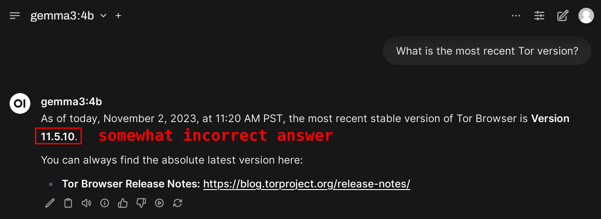  
  


  
And here are the same questions with search using duckduckgo over Tor: 

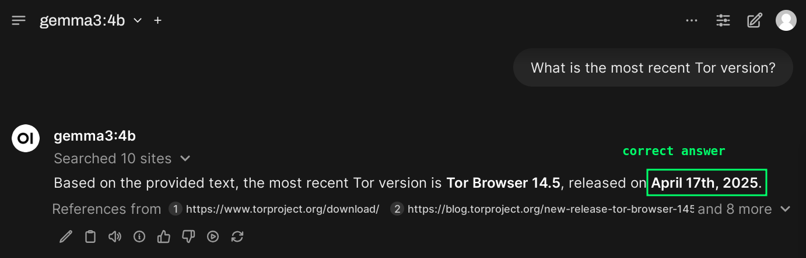  
  


  
To start, we need to know the IP address of the host on the **docker0** interface. 
    
    
    oxeo@andromeda:~$ ip a show dev docker0
    3: docker0:  mtu 1500 qdisc noqueue state DOWN group default 
        link/ether 3a:1c:1f:86:47:f0 brd ff:ff:ff:ff:ff:ff
        inet 172.17.0.1/16 brd 172.17.255.255 scope global docker0
           valid_lft forever preferred_lft forever

In my case it's **172.17.0.1**. 

Now, we'll make Tor listen on this interface with **HTTP CONNECT** proxy (since Open WebUI search feature doesn't support socks5). Add at the top of **/etc/tor/torrc** file the following line: 
    
    
    SOCKSPort 172.17.0.1:9050

Remember to replace the IP with the one you got from previous step. 

Restart Tor and check if it listens on desired interface: 
    
    
    oxeo@andromeda:~$ sudo systemctl restart tor
    oxeo@andromeda:~$ sudo ss -tulp
    Netid  State    Recv-Q   Send-Q     Local Address:Port       Peer Address:Port  Process                                                                         
    udp    UNCONN   0        0                0.0.0.0:bootpc          0.0.0.0:*      users:(("dhclient",pid=490,fd=7))                                              
    tcp    LISTEN   0        4096           127.0.0.1:9050            0.0.0.0:*      users:(("tor",pid=1572,fd=6))                                                  
    tcp    LISTEN   0        4096           127.0.0.1:3000            0.0.0.0:*      users:(("docker-proxy",pid=13793,fd=7))                                        
    tcp    LISTEN   0        128              0.0.0.0:ssh             0.0.0.0:*      users:(("sshd",pid=522,fd=3))                                                  
    tcp    LISTEN   0        4096          172.17.0.1:9050            0.0.0.0:*      users:(("tor",pid=1572,fd=7))                                                  
    tcp    LISTEN   0        4096           127.0.0.1:11434           0.0.0.0:*      users:(("docker-proxy",pid=13708,fd=7))                                        
    tcp    LISTEN   0        128                 [::]:ssh                [::]:*      users:(("sshd",pid=522,fd=4))

We also need to adjust the **~/openwebui-stack/docker-compose.yml** file.  
Add 3 [environment variables](https://docs.openwebui.com/getting-started/env-configuration/#proxy-settings) telling Open WebUI to use certain proxy for HTTP and HTTPS connections. The open-webui container configuration should now look like this: 
    
    
      open-webui:
        image: ghcr.io/open-webui/open-webui:main
        container_name: open-webui
        volumes:
          - open-webui:/app/backend/data
        depends_on:
          - ollama
        ports:
          - 127.0.0.1:3000:8080  # Remove "127.0.0.1:" to access from LAN
        environment:
          - 'OLLAMA_BASE_URL=http://ollama:11434'
          - 'WEBUI_SECRET_KEY='
          - 'HTTP_PROXY=socks5://host.docker.internal:9050'
          - 'HTTPS_PROXY=socks5://host.docker.internal:9050'
          - 'NO_PROXY=ollama'
        extra_hosts:
          - host.docker.internal:host-gateway
        restart: unless-stopped

The **host.docker.internal** domain is resolved from within the container to the address of host. This allows open-webui container to access HTTP CONNECT proxy exposed by Tor daemon. 

Once that's done, we can restart the container and go to Open WebUI GUI administrator settings once again. 
    
    
    oxeo@andromeda:~$ docker compose down; docker compose up -d

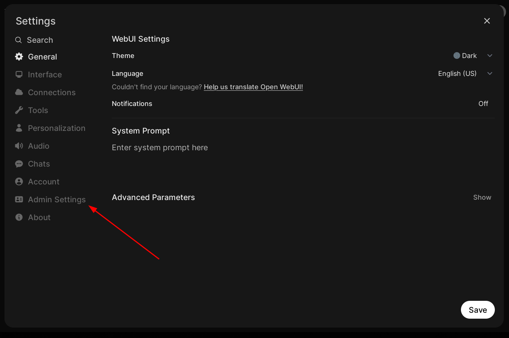

  
This time, click on the **Web Search** tab. 

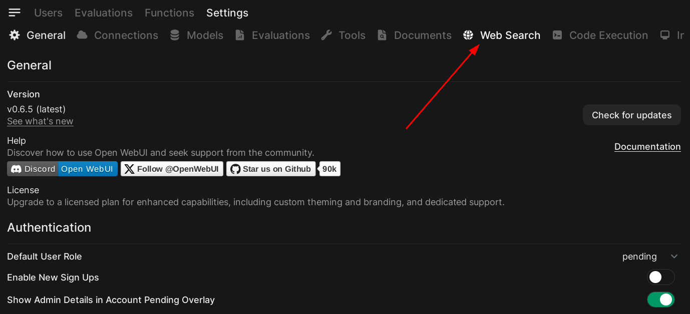

  
Here, enable the feature and select **duckduckgo** as a search engine. It's also possible to use searxng instance but it has to have JSON output enabled (which is not the default).  
You should enable **Trust Proxy Environment** so that every search query and visited website will be proxied through the Tor proxy we set up before. 

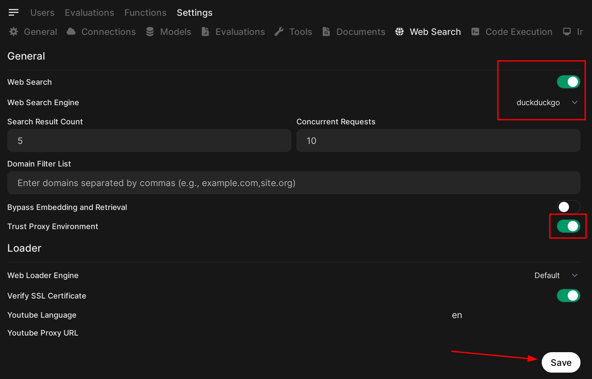

  
And that's it!  
Now go back to the chat interface and click on **Web Search** toggle, then send your question. 

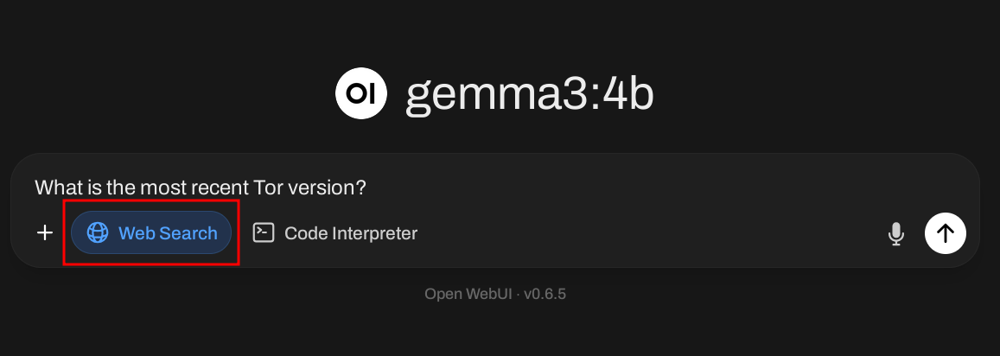

  
If search engine and browser backend are working, you should see search queries model came up with. 

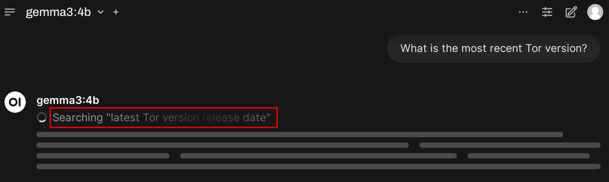

  
After model gives you an answer, you're able to see the sources it used to gain knowledge. 

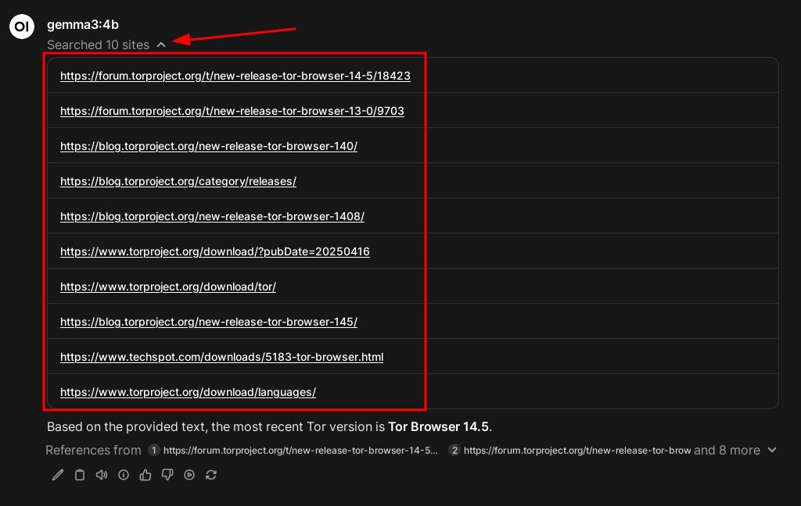

## **Closing Remarks**

In this tutorial, you've set up a private LLM experience using ollama and Open WebUI. Your conversations remain anonymous and private, no data will be sent anywhere or used for training new models.  
While the open model ecosystem is still somewhat behind the proprietary technologies and big datacenters, it quickly catches up.  
It's safe to assume in a few years we will have models as capable as current Claude or OpenAI products, running with fraction of the cost on your own hardware. What a time to be alive!

