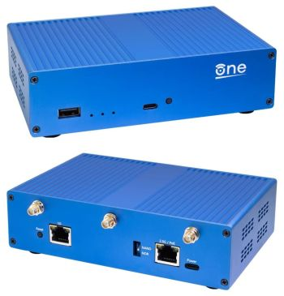
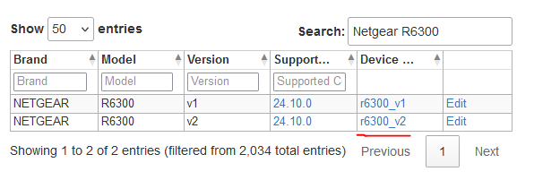

# How to have privacy on your Router (OpenWrt)

```
TLDR: your ISP spies on your local network from the closed-source Router that they give you, to prevent that, put an openwrt router you control in between theirs and your local network.
```

In this blogpost, we're going to explain why you would want to use an open-source router and showcase how to install open-source router firmware.


## **Why is an open-source router needed?**

* Closed-source software can pose a risk to privacy, security, and OPSEC in general. This applies not only to the software running on your computer, but also to your Wi-Fi router.
* With an open-source router, you can install additional software such as [dnscrypt](../dnscrypt/index.md#dnscrypt) that can further improve privacy.
* Open-source software is generally regarded to be more secure than closed-source software, read more about it in [this blogpost](../closedsource/index.md#security-in-foss).
* Closed-source software is [bad for privacy](../closedsource/index.md).
* Open-source router firmware typically offers many more features than the OEM firmware.

## **What happens when you use the router given to you by your ISP?**

If you use the router given to you by your ISP, your ISP controls the software running on your router.
Many modern routers come equipped with a protocol called [TR-069](https://en.wikipedia.org/wiki/TR-069).
TR-069 is a remote management protocol that comes with many features (all remote): configuration, firmware/update management, diagnostics, and logs retrieval.
If you use an ISP-branded router such as "Xfinity Gateway" or the "Spectrum WiFi 6 Router", your router definitely utilizes TR-069.

Many of these features can be used to collect additional information that the ISP would not otherwise be able to collect.
One *very simple* example includes logging DHCP operations, which can reveal the following:

1. The MAC address of every LAN device
2. The hostname of the device
3. The time(s) the device has connected/disconnected
4. Which MAC address operates which LAN IP address


The ISP-controlled router can see what devices are connecting to it, among other things.

## **How do you get privacy on your router?**

The solution is to control what software the router/gateway is running.
To do this, you need access to install and uninstall software on the router/gateway, which most routers unfortunately do not make possible.
The best way to do this right now is to install OpenWRT, a free and open-source Linux distribution for wireless routers.


## **Can't replace the ISP hardware?**
If you cannot replace your ISP router for whatever reason, there is still a solution to this problem.

Sometimes, you can't just replace the ISP router with your preferred device.
Although, you can still limit the amount of information the ISP router can collect by putting OpenWRT *in between* your LAN and your ISP router.
With this setup, the ISP router cannot see LAN devices, as it can only see your preferred router which is always connected (suppressing the ability to capture all the previously mentioned information).


## **Why OpenWRT?**

1. OpenWRT is free and open-source software.
2. OpenWRT supports many Wi-Fi routers, extenders, and other devices.
3. OpenWRT is exactly what it advertises itself as - "wireless freedom".  You now *actually* control the device.
4. Additional software can easily be added to OpenWRT, increasing the device's functionality beyond that of an ordinary Wi-Fi router.

## **How do I get OpenWRT?**

There are two options here:
1. Install OpenWRT on a supported device (see https://firmware-selector.openwrt.org/ and https://openwrt.org/toh/start for compatibility)
2. Purchase the OpenWRT One, an **[open-source hardware](../openhardware/index.md)** router which comes with OpenWRT preinstalled. https://one.openwrt.org




## **Checking if a device is supported**
To check if your device is supported by OpenWRT, you need to get some information about your device.
There is usually a sticker on the back or the bottom of the router, showing information such as the default Wi-Fi information, MAC address, model, and sometimes a hardware version.

An example supported router would be the Netgear R6300v2
* Brand: Netgear
* Model: R6300
* Hardware Version (important if present): v2


Put this information into https://openwrt.org/toh/start

If there is a *device page* for your device shown on the table of hardware, you should read that page to take note of any caveats to installing OpenWRT on it.
If your device does not show up on the table of hardware, it is not officially supported.



## **Installing OpenWRT**

*Note: It is very important that you install the correct firmware for your model and hardware version.  You can brick your router if you install an incorrect firmware image.*

*Note 2: **OpenWRT does not enable the wireless network by default.**  After installing, you will have to configure OpenWRT via a Ethernet/LAN port.*
*Alternatively, you can insert a first-boot script into a firmware image at https://firmware-selector.openwrt.org to set the SSID and password for a wireless network.*

1. Search your specific router model/build in the [firmware selector](https://firmware-selector.openwrt.org/) or the [table of hardware](https://openwrt.org/toh/start) as seen in the image above.
   * *If there is a **device page** for your device on the OpenWRT [table of hardware](https://openwrt.org/toh/start), you should read that page to take note of any caveats or alternate installation methods.*
2. If you are running OEM (default) firmware in your router, download the "factory" OpenWRT image.


### **Enabling Wi-Fi with first-boot script (optional)**
* Go to the [OpenWRT firmware selector](https://firmware-selector.openwrt.org/) and search your device model, as seen above  
* Click "Customize installed packages and/or first boot script" above the downloads selection  
* You will see "Installed Packages" and "uci-defaults" input boxes.  We will only touch uci-defaults, which is typically empty.  This is the general uci-defaults we want:
```
uci set wireless.@wifi-device[0].disabled="0"
uci set wireless.@wifi-iface[0].disabled="0"
uci set wireless.@wifi-iface[0].ssid="WIFI-NAME"
uci set wireless.@wifi-iface[0].key="WIFI_PASSWORD"
uci set wireless.@wifi-iface[0].encryption="psk2"
uci commit wireless
```
* With these uci-defaults in the input box, select "REQUEST BUILD"
* After you get the "Build successful" message, download the custom image.  


*Note: You should use a direct LAN cable connection to the router before continuing, unless a first-boot script has been added to your firmware image*

3. Navigate to your router's web control panel and log in (If you don't know the password, it's probably the default which you can find on the internet)


4. Navigate to the page for performing a firmware update on the router, it will usually be under "Administration"


5. You should have the option to browse the files on your computer to search for a firmware image to upload to the router.  Navigate to the location where you saved the OpenWRT firmware image and select it.

*Note: You will lose all connectivity during the update.*  
6. Upload the OpenWRT firmware and start the update. (*This takes up to 10 minutes, DO NOT UNPLUG THE ROUTER DURING THIS TIME.*)  

7. Connect to the router (via LAN cable, or via Wi-Fi if configured via first-boot script) and navigate to the router webpage again.  *You may need to clear the browser cache*


8. Log in with username "root" and empty password field.  You should click "Go to password configuration" to set the new root password.


**Congratulations!  You are now using open-source router firmware.**
This web interface of OpenWRT is called LuCI (Lua Configuration Interface)
* *LuCI will be mentioned later in this post (and maybe some others too) - know that this refers to the OpenWRT web interface.*  
Now that you have OpenWRT installed, the [user-guide](https://openwrt.org/docs/guide-quick-start/start) will be very helpful to you now.

# Configuration of OpenWRT
## Wireless (Wi-Fi)
Now we will show you the basics of enabling/configuring the Wi-Fi network.

To configure Wi-Fi, hover over Network on the top navigation menu of LuCI, and click "Wireless"


You will see the Wi-Fi radios on your device and their configurations.
Click "Edit" to modify a wireless configuration (or click "Add" from a radio to create a configuration)


### **Device Configuration**

For "Operating Frequency", select mode "N" or "AC" and set "Channel" to auto.  The width setting determines data rate and wireless distance (higher number means higher data rate, but less distance)

Maximum transmit power can usually be left at the driver default, but check your local laws about Wi-Fi power/strength.  
Country code should be set to the country the router will be operating in.  

### **Interface Configuration**

This is where you will set your Wi-Fi name and password (Under "General Setup" with mode "Access Point").  
Other modes can be used to do different things like "Client" mode, which will allow you to connect to a different Wi-Fi access point for internet connectivity (instead of using the WAN/Internet port), but we will show normal Wi-Fi Access Point configuration.

ESSID will be the network name broadcast by the router.

Network should be set to "lan".

### **Wireless security**

Encryption: Recommended WPA3-SAE, but some devices may require WPA2-PSK or WPA-PSK, a WPA2/WPA3 mixed mode is generally reliable.

Key: The Wi-Fi password.

KRACK countermeasures can be enabled, a security measure against [Key-Reinstallation-AttaCK](https://www.krackattacks.com)

Now we save our configuration at the bottom-right of the popup, then click "Save and Apply" at the bottom-right of the webpage.
After this, you can click "Enable" on the wireless configuration to start Wi-Fi.  You should now have full internet access from Wi-Fi.

## **SSH Access**
OpenWRT has the dropbear SSH server installed by default, we can enable access to it in LuCI
To enable the SSH server, hover over *System* and click *Administration* in the navigation bar.


From here, click "SSH Access" to get to the SSH configuration


When configuring the SSH server, you should specify LAN as the interface if you don't want people to access the SSH server from the internet (which you probably don't)

After clicking "Save & Apply", you should now be able to access the router via SSH using the root password you set earlier.


## **`opkg`**
`opkg` is OpenWRT's package manager, used to install and uninstall software from the router.  
The [official user guide](https://openwrt.org/docs/guide-user/additional-software/opkg) can help you understand how to use it via SSH/CLI.  
You can access it from LuCI by hovering over *System* and selecting *Software* in the navigation menu at the top of the page. 


`opkg` can also be accessed via command-line SSH:


Before interacting with opkg or installing software with it, you should run **`opkg update`** in SSH or click "Update lists" from the software page on LuCI.
This will ensure that your lists of available packages are up-to-date.  
After updating the package lists, you can search for packages by running **`opkg list | grep package-name`**, and install/remove packages with **`opkg install package`** and **`opkg remove package`**  
You can also search for *only installed* packages, by running **`opkg list-installed`** (optionally adding **`| grep package-name`** to the end of the command to see if a particular package is installed)

After this, we can install software.  For this example, we will install [nano](https://www.nano-editor.org/), a more user-friendly alternative text editor than the preinstalled `vi` command.  
We'll use LuCI this time:


Now you can access the `nano` text editor on the router via SSH, using the command `nano /path/to/file`

We can also remove software by switching from the "Available" tab to the "Installed" tab, search for the installed package you no longer want and simply click "Remove".


## **Firewall**
You can access the firewall settings in LuCI by hovering over *Network* and clicking on *Firewall* in the navigation menu at the top of the page.
From here, you can do lots of things:
* Enable features like SYN-flood protection and dropping invalid packets
* Change the default policy for traffic that matches no firewall rules on each zone
* Forward ports to expose a service running on a LAN device to the internet
* Set traffic rules to allow or deny traffic based on protocol, port, IP, MAC, limit matching, time restrictions, and more.

### **Zones**
A zone is a ruleset that covers specified devices/networks, allowing you to set up a zone with different rules from the ones used for other devices/interfaces/zones.  This allows you to segment your network and customize what traffic is allowed between each zone or between devices and the internet.

The input field chooses how to handle traffic that is directed *to* the router IP address.  
The output field chooses how to handle the traffic coming *from* the router IP address.  
Intra-zone Forwarding refers to the traffic that flows between devices *within the same zone*.  
Masquerading will replace the originating IP address with the router IP address in outgoing packets.

See [the user-guide](https://openwrt.org/docs/guide-user/firewall/start) page for more in-depth information.


