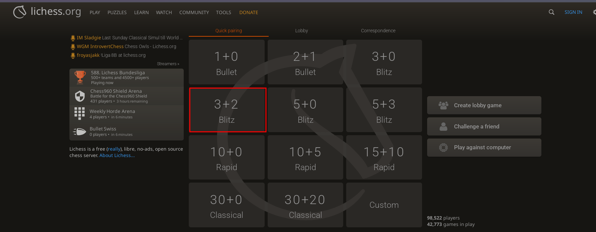
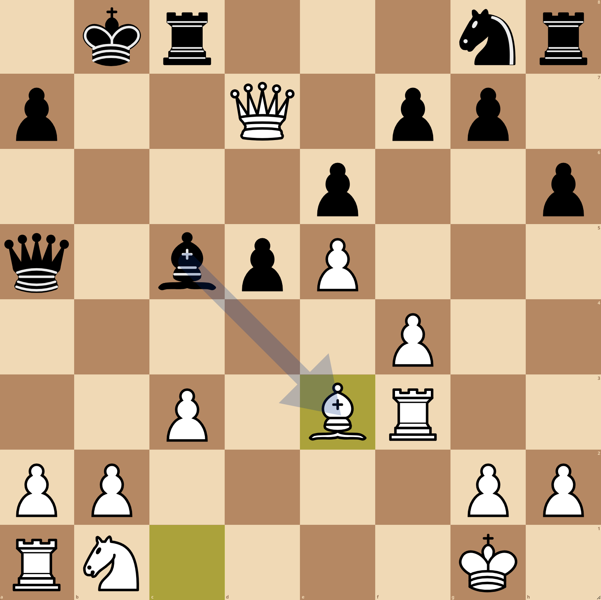
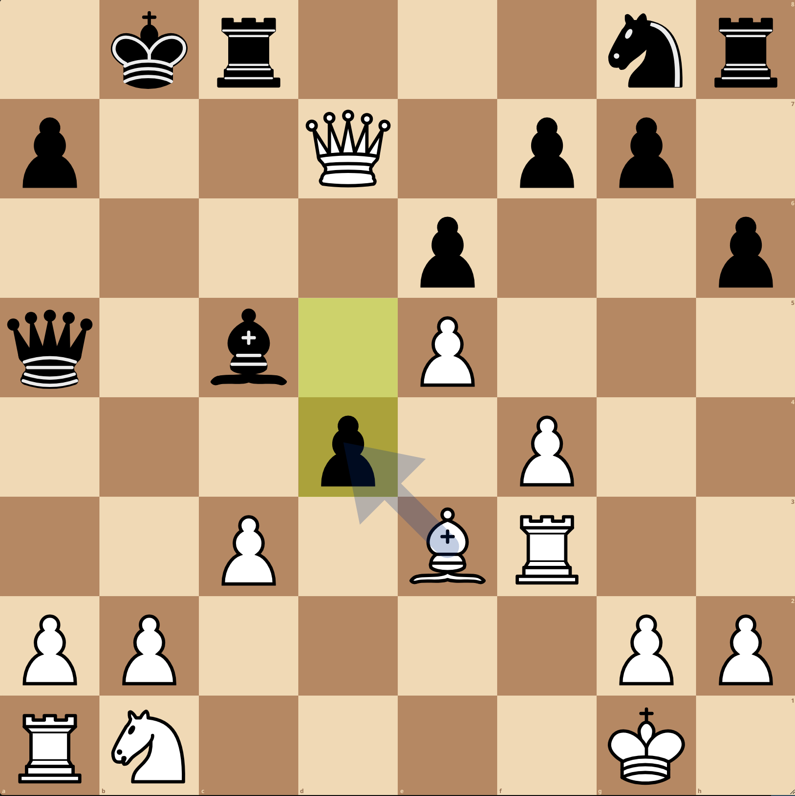
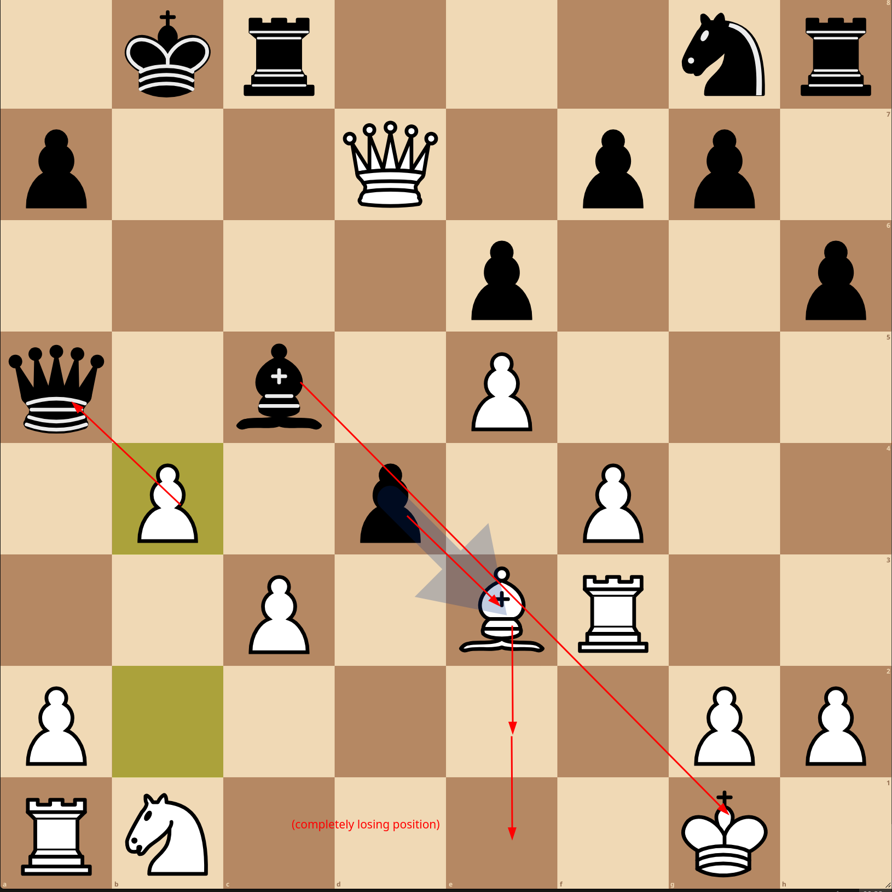
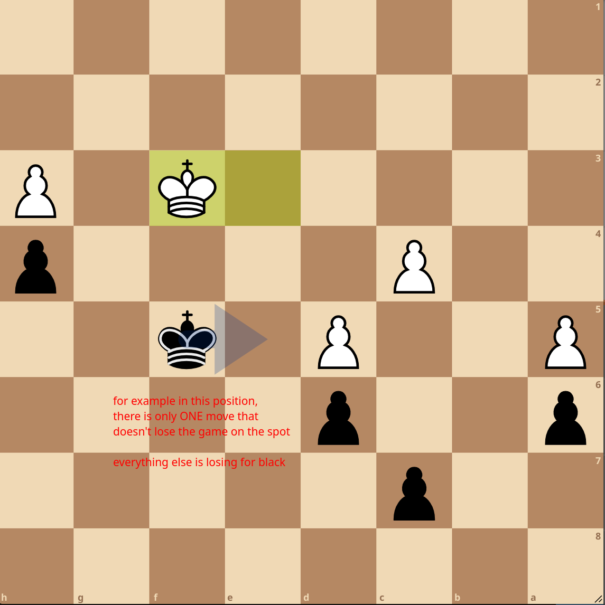
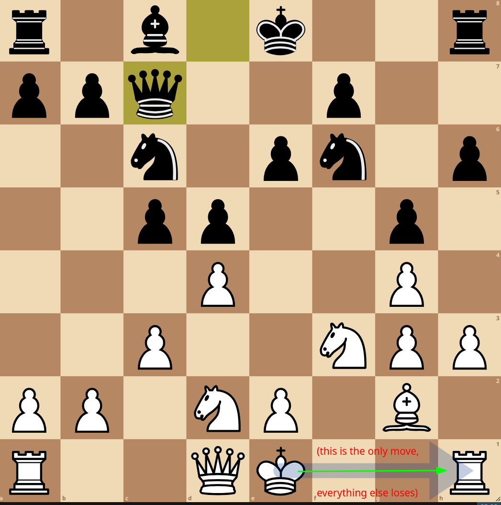
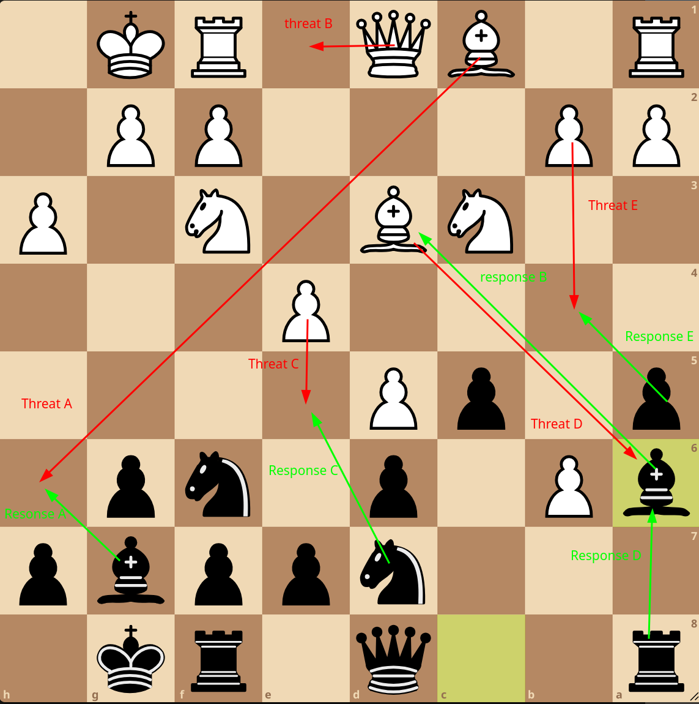
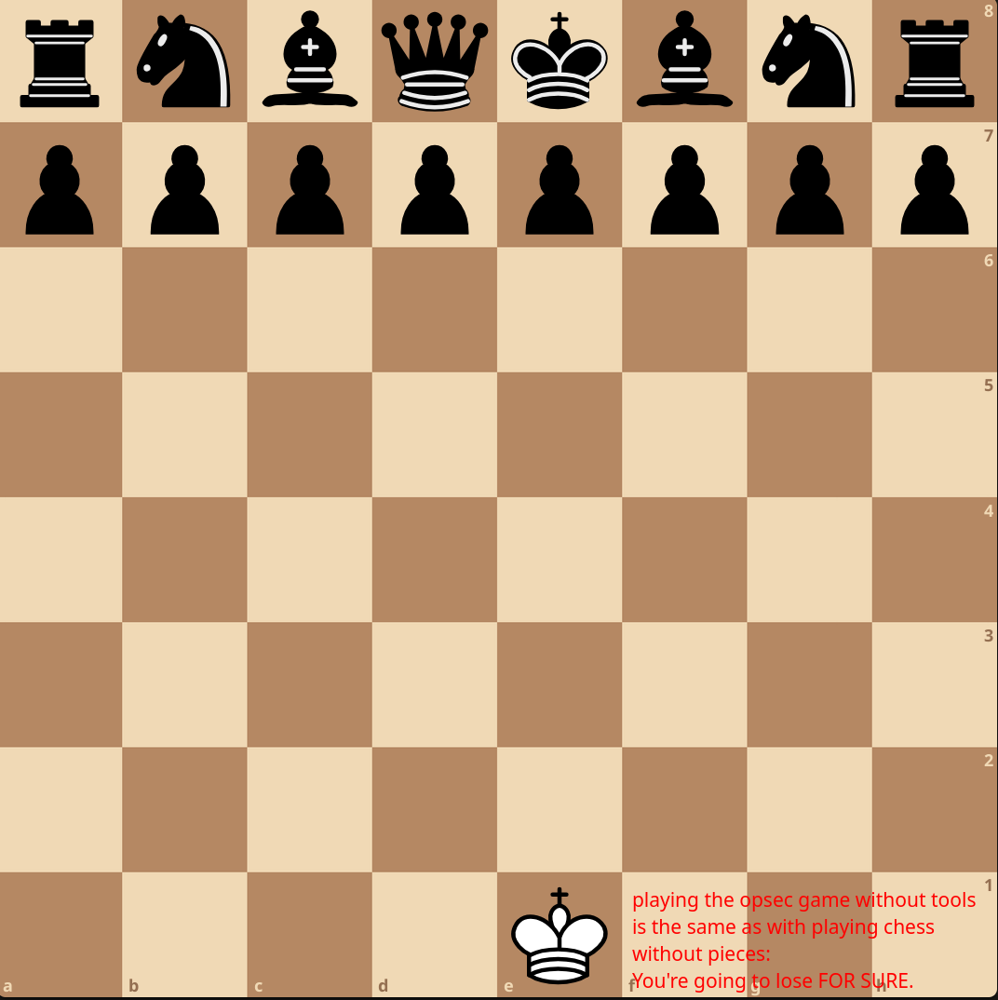

# Opsec is real-life Chess

## What is Chess ? 

it's a game, where you (the king) get to use tools (the other pieces), to destroy the other opponent. You can try it out right now on [lichess](https://lichess.org/), just play a quick game of 3+2 (meaning 3 minutes to play, with 2 seconds increment per move), it's just a few pieces and 64 squares, should be easy right ?

now unless if you've already been playing for a few years, you're most likely going to realize too late the enormous complexity of the game, and you might either run out of time, or get blown off the board.

Operational security is exactly like chess. It's you versus the adversary. There's no luck. If you don't correctly use every tool at your disposal in the right sequence, at the right time, in the correct context, you're simply going to get destroyed.

The context is super-super important. As the game progresses, your situation can change drastically with every move. For instance the position can be equal:

If your opponent does one wrong move you can be in a winning position:

**But the same holds true for you, if you do one wrong move you will end up in a losing position, even if you did everything correctly for the entire game**:

Chess is an especially brutal game for this reason, it takes enormous effort to get a winning position, and if you don't find the correct sequence of moves, in the correct order, at the correct moment, you're going to lose it all in an instant. There's no luck, it's all your doing, you're locked into the consequences of your previous choices. You either do what it takes to win, or you don't do what it takes and lose.

**If you don't know what you're doing, your position is invariably going to be worse and worse the more you keep going.**

90% of the time there is only ONE move that doesn't make you lose on the spot like in these examples:

it's very rare that you end up in a situation where every move wins for you, chess is very brutal because you could've been doing the correct moves for the entire game, but right there at the end you might just do one wrong move and you'd lose the game on the spot.

Opsec is chess but in real life, except that the stakes are different. you're not just playing an innocent harmless game, if you go for sensitive use without proper opsec, losing means that the adversary gets to know your true identity and you're getting locked up in jail.  

**And the adversary does not get to have any consequences for losing the game (meaning they didn't figure out who you are and abandon trying to catch you)**. The adversary can start the game all over again and keep going. They've been going at it ever since the beginning of the state's laws and law enforcement began. The opponent on the other side of the board has been playing this game long before you, and they will continue to play it long after you're gone.

Much like in chess, Opsec is a mindset. It's you versus them. **you need a proper response for everything that the adversary might try.** In chess it's called calculating, and i think you should get used to thinking like that:

For instance here the position is equal, **which means that for every threat there is a defense you can use.**

The thinking is as follows: 

- What if the adversary does A ? response A.
- What if the adversary does B ? response B.
- What if the adversary does C ? response C.
- and so on.

**If you don't have a proper response for every threat, you're going to lose the game, because the adversary IS going to use everything at his disposal to defeat you.**

If you don't use every tool at your disposal to protect yourself, you're essentially playing the game with a handicap, and for sure you're going to get smoked:

Now let's go over the 3 most common threats that the adversary is taking advantage of: 

- What if the adversary spies on what you do from the software that you use ?
- What if the adversary correlates your sensitive identity to your public identity ?
- What if the adversary busts down your door right now to seize your computer and force you to type a password ?

Just like above, those are 3 threats, which all have an appropriate response to defend against them:

- Response A: [Only using FOSS software](../closedsource/index.md)
- Response B: [Segregating identities on the VM level](../internetsegmentation/index.md)
- Response C: [Using Veracrypt hidden volumes](../veracrypt/index.md)

This is what operational security is there for, it's there to show you that there is a way to defend yourself against state-level adversaries, protecting yourself from their tyranny, making sure that they can't govern you anymore. 

Operational security is like playing chess but in real life, you go over all threats to your operation, and you go ahead and do what it takes to protect against every threat.

OPSEC is there to tell you what are the tools at your disposal, why you should use them, and how you can use them to effectively protect against ALL threats from the adversary.