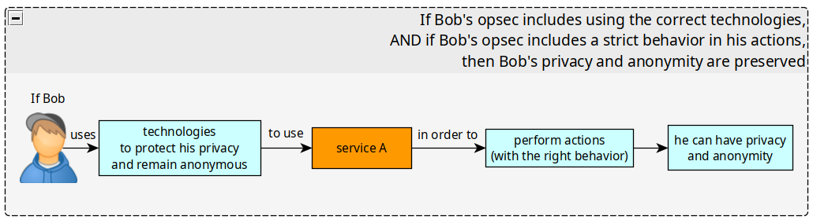
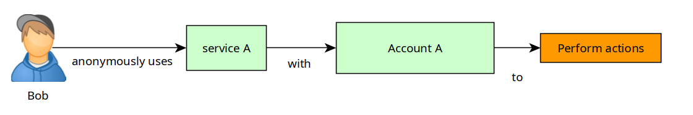
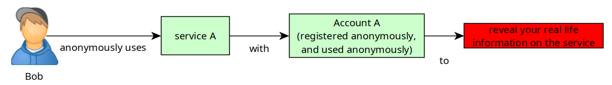
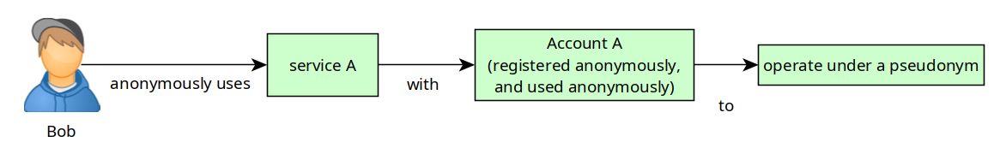
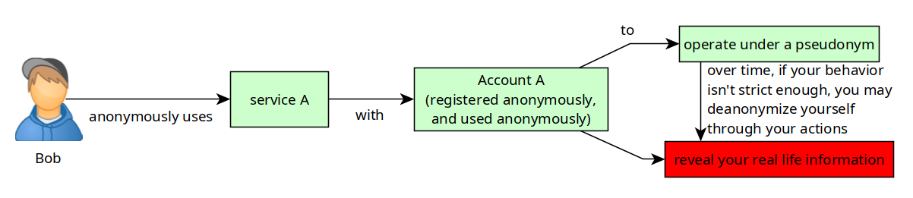
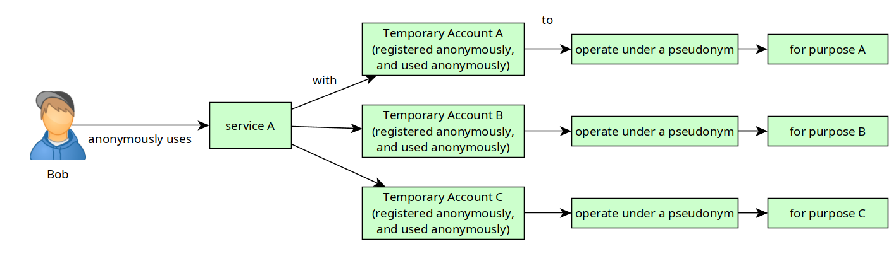

# OPSEC: Using the right Technology and Behavior

```
TLDR: 
- If you use the wrong technology, nothing can save you
- If you use the right technology with the wrong behavior, nothing can save you either.
```

OPSEC, or Operational Security, is a process aimed at identifying if your actions can be observed by an adversary. In this context, how good your OPSEC is, determines the level of your privacy and anonymity. 


By default, if you're not careful with the technology you use, your very ability to have privacy and anonymity is not possible. And if your behavior isn't strictly controlled to protect your anonymity while using those technologies, that can also compromise both privacy and anonymity.



If you wish to have Privacy and Anonymity online, you need to use the correct technologies, and to have the correct behavior when using them.


## **Improve your OPSEC using Technology**

The first and foremost step when you wish to protect your OPSEC, is to use the correct technologies that will let you have Privacy (lack of surveillance), and Anonymity (lack of identification). Be sure of one thing; **You will never have privacy, nor anonymity until you use the right technologies**.

We're going to cover 6 scenarios into which Bob tries to be anonymous online, as you will see, Bob's level of privacy and anonymity will vary greatly, based on what technologies he uses to access and use his account on nowhere.com

**Scenario 1: Closed source software, and no protection**

 _Technology used:_

  1. Host OS: Windows (closed source)

  2. Web Browser: google chrome (closed source)

  3. Internet Connection: direct connection via his Internet service provider


_Actions:_

  1. Bob uses his windows OS to open his web browser

  2. Bob uses the google chrome web browser to access nowhere.com

  3. Bob goes on nowhere.com and creates an account 

  4. Bob logs on his account and posts a comment


_Consequences:_

  1. Microsoft is aware of everything that Bob did with his windows OS

  2. Google is aware of everything that Bob did with his chrome web browser

  3. Bob's ISP is aware that Bob went on nowhere.com 

  4. the nowhere.com admins sees that Bob's home IP address logged into the account and posted a comment


_Summary:_ Bob posted a comment on nowhere.com **and Microsoft; Google; his ISP; and the nowhere.com admins are all aware that it is Bob that did it. Bob has no privacy, and no anonymity whatsoever.**

**Scenario 2: Closed source software, and using a VPN**

 _Technology used:_

  1. Host OS: Windows (closed source)

  2. Web Browser: google chrome (closed source)

  3. Internet Connection: using a VPN


_Actions:_

  1. Bob uses his windows OS to open his vpn connection

  2. Bob, once connected via his VPN, opens his google chrome web browser

  3. Bob uses the google chrome web browser to access nowhere.com

  4. Bob goes on nowhere.com and creates an account 

  5. Bob logs on his account and posts a comment


_Consequences:_

  1. Microsoft is aware of everything that Bob did with his windows OS

  2. Google is aware of everything that Bob did with his chrome web browser

  3. Bob's ISP is only aware that Bob connected to his VPN provider. 

  4. the VPN provider sees that Bob's home IP address connected to the service, and that Bob connected to nowhere.com

  5. the nowhere.com admins sees that the VPN IP address logged into the account and posted a comment


_Summary:_ Bob posted a comment on nowhere.com and Microsoft and Google are aware that it is Bob that did it, the VPN provider knows that Bob connected to nowhere.com, and the nowhere.com admins see that a VPN IP logged on the account and posted the comment. **Bob has only managed to gain privacy from his ISP, but he has only shifted the issue to his VPN provider. Bob still has no privacy, and no anonymity whatsoever.**

**Scenario 3: Open source software, and a VPN**

 _Technology used:_

  1. Host OS: Linux (open source)

  2. Web Browser: firefox (open source)

  3. Internet Connection: using a VPN


_Actions:_

  1. Bob uses his debian OS to open his vpn connection

  2. Bob, once connected via his VPN, opens his firefox web browser

  3. Bob uses the firefox web browser to access nowhere.com

  4. Bob goes on nowhere.com and creates an account 

  5. Bob logs on his account and posts a comment


_Consequences:_

  1. Only Bob can know what he did with his linux OS

  2. Only Bob can know what he did with his firefox web browser

  3. Bob's ISP is only aware that Bob connected to his VPN provider. 

  4. the VPN provider sees that Bob's home IP address connected to the service, and that Bob connected to nowhere.com

  5. the nowhere.com admins sees that the VPN IP address logged into the account and posted a comment


_Summary:_ Bob posted a comment on nowhere.com, his VPN provider knows that he connected to nowhere.com, and the nowhere.com admins are aware that someone used a VPN to do it. **Bob has managed to gain privacy from his ISP, but also from the companies that spied on him while he was using closed source software** (microsoft and google in this case), however **Bob is still being spied on by his VPN provider, and he has no anonymity whatsoever.**

**Scenario 4: Open source software, and Tor**

 _Technology used:_

  1. Host OS: Linux (open source)

  2. Web Browser: Tor browser (open source)

  3. Internet Connection: direct via ISP


_Actions:_

  1. Bob uses his debian OS to open his tor web browser

  2. Bob uses the tor web browser to access nowhere.com

  3. Bob goes on nowhere.com and creates an account 

  4. Bob logs on his account and posts a comment


_Consequences:_

  1. Only Bob can know what he did with his linux OS

  2. Only Bob can know what he did with his tor web browser

  3. Bob's ISP is only aware that Bob used Tor. 

  4. The tor entry node sees that Bob's home IP has connected, but cant tell where he tried to connect. 

  5. The tor middle node doesn't know who's connecting, nor where it's connecting. 

  6. The tor exit node doesn't know who's connecting, but knows that the traffic is going to nowhere.com (There is a very low chance that all 3 tor nodes (entry, middle and exit) collaborate to see that Bob's home IP address connected to nowhere.com)

  7. the nowhere.com admins sees that a Tor exit node IP has logged into the account and posted a comment


_Summary:_ Bob posted a comment on nowhere.com, and there is only a very low chance that an adversary knows that he connected to nowhere.com, and the nowhere.com admins are only aware that someone used Tor to do it. **Bob has managed to gain privacy, and has posted the comment anonymously. Bob's ISP knows that he used tor, but he doesn't know what he did with it.** the nowhere.com admins know that someone used tor to post a comment, but they don't know who did it.

## **Improve your OPSEC with your behavior**

Now, you are Bob, and you have decided that you would maintain your anonymity online for your use of nowhere.com as detailed in scenario 6 above: you use open source technology, and you use the tor browser.

You have implemented all the correct technologies as explained above and you have created your account on nowhere.com anonymously.

But still, **you may deanonymize yourself by having the wrong behavior with your actions!**



**Scenario 1: Self-Identification**



Situation: Bob has an account on nowhere.com

  1. Bob registered his account via Tor on nowhere.com

  2. Bob mentioned his real life name into the information of his account

  3. Bob mentioned where he lived on the account information too.


_Summary:_ Bob deanonymized himself by his actions, despite using the correct technology. He identified himself (or KYC'd himself) on nowhere.com

**Scenario 2: Pseudonymity**



Situation: Bob has an account on nowhere.com

  1. Bob registered his account via Tor on nowhere.com

  2. Bob uses a pseudonym into the information of his account

  3. Bob mentionned that his pseudonym lived in wonderland.


_Summary:_ Bob used the right technology, and then on the website he uses a pseudonym, and mentioned random useless information about his pseudonym. For now his anonymity is preserved.

**Scenario 3: When pseudonymity goes wrong**



Situation: Bob has an account on nowhere.com

  1. Bob registered his account via Tor on nowhere.com

  2. Bob uses a pseudonym into the information of his account

  3. Bob used this account to talk into many conversations over the years, and has built up a big reputation.

  4. Bob is drunk one night, and accidentally mentioned his real life name online.


_Summary:_ Bob used the right technology, and then on the website he used a pseudonym successfully for a few years, his anonymity was preserved all this time up until he got drunk and accidentally revealed who he was. From there, Bob can no longer be anonymous using that pseudonym.

**Scenario 4: Anonymity: when reputation doesn't matter**



Situation: Bob has an account on nowhere.com

  1. Bob regularly registers accounts via Tor on nowhere.com

  2. Bob enters different random names into the information of his accounts

  3. Bob strictly uses those accounts only for specific purposes.

  4. Bob talks into many conversations over the years, but using different accounts every week/month.

  5. Bob is never drunk when in front of the keyboard, and he is always careful to reveal nothing about his real life identity.


_Summary:_ Bob uses the right technology, and then on the website he preserves his anonymity by never revealing who he is, and by keeping multiple accounts on the same service for specific usecases, and only for limited amounts of time. In this case, Bob maintains anonymity without getting popular.

