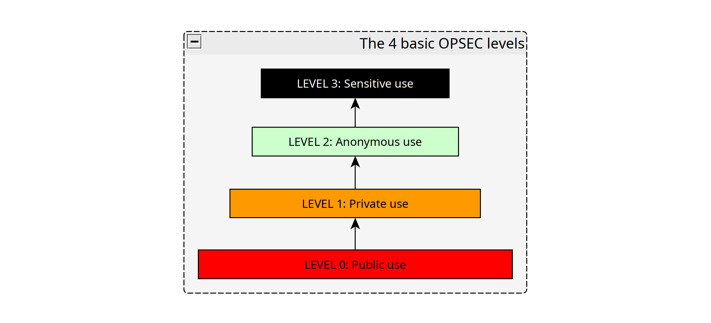
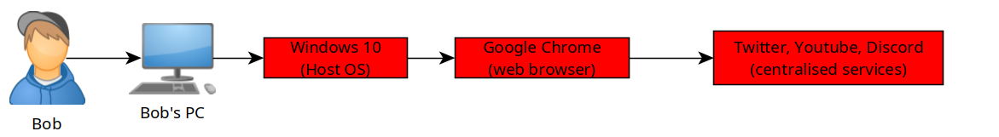
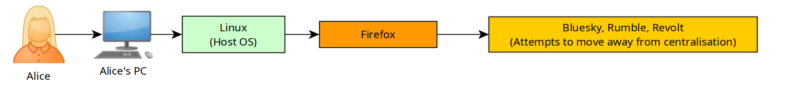
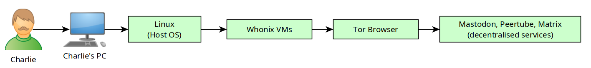
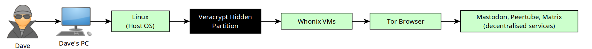

# Audit your OPSEC and determine the appropriate internet use

```
TLDR: to audit your own OPSEC, you must take into account Transparency, Surveillance, Centralisation, Anonymity and Deniability.
```

In this tutorial we're going to explore how you can audit your own level of Operational Security (also known as opsec), using the following 6 parameters:**Complexity, Transparency, Surveillance, Centralisation, Onymity, and Deniability**. The goal is to determine the level of Privacy, Anonymity and Deniability of your operations online to determine what you can do safely.


Based on those, we are able to determine **the most appropriate Internet use.**


Auditing your own OPSEC is an essential skill that you must possess, we're going to audit the 4 different setups below, to be able to determine where they fit. 

To do so, we are going to simplify it down to 4 OPSEC levels: **Public, Private, Anonymous and Sensitive**.



_Sidenote:_ If your setup is suitable only for public internet use, you CANNOT use it for any private use, and so on. 


## **Bob's Setup: Public Internet Use**



_**Complexity:**_ Bob didn't put any effort. He bought his PC and windows was pre-installed, and he used it as it was.

_Transparency:_ Bob uses windows as a host OS, and google chrome as his web browser. Both are closed-source, he does not know what his software is doing.

_Surveillance:_ Since bob uses closed-source software, he is under constant surveillance while using his computer.

_Centralisation:_ Bob uses popular services that are centralised in nature, he depends on the goodwill of others to use their services

_Onymity:_ Because there is no privacy, anonymity is impossible for Bob.

_Deniability:_ Bob cannot deny anything that he's doing on his computer, as he is under constant surveillance, without any possibility of anonymity.

_Conclusion:_ **Bob's setup is suitable only for Public internet use** , as he is under constant surveillance while using it.

## **Alice's Setup: Private Internet Use**



_Complexity:_ Alice has put some effort to get her current setup, she is willing to go out of her comfort zone to improve her OPSEC.

_Transparency:_ Alice only uses open source software (Linux and Firefox) she can see from the sourcecode that it only does what it should do.

_**Surveillance:**_ Alice has verified that the open source software that she was using wasn't spying on her

_Centralisation:_ Alice is starting to move away from centralised services, she's looking at other alternatives, but they are still centralised. 

_Onymity:_ Alice is exploring anonymity, but through a pseudonym online, she is not anonymous yet.

_Deniability:_ Alice cannot deny that she has used her current setup 

_Conclusion:_ **Alice's setup is suitable for Private use** , as she managed to remove surveillance from her setup.

## **Charlie's Setup: Anonymous Internet Use**



_Complexity:_ Charlie is willing to go at great lengths to improve his OPSEC

_Transparency:_ Charlie only uses open source software, that way he knows that the software he uses only does what he wants it to do.

_Surveillance:_ Charlie has verified that the software he is using, is not surveilling what he's doing

_Centralisation:_ Charlie has moved away from centralised services, and is using their decentralised counterpart from the fediverse 

_**Onymity:**_ Charlie is anonymous online, thanks to it's use of the tor network through Whonix and tor browser

_Deniability:_ Charlie, thanks to his use of anonymity technologies, may be able to deny that he has used this setup depending on the context. However if an adversary gets physical access to his computer, he won't be able to deny that he has ever used it.

_Conclusion:_ **Charlie's setup is suitable for Anonymous use** , as he managed to implement anonymity technologies into his setup.

## **Dave's Setup: Sensitive Internet Use**



_Complexity:_ Dave is willing to go at great lengths to improve his OPSEC

_Transparency:_ Dave only uses open source software, that way he knows that the software he uses only does what he wants it to do.

_Surveillance:_ Dave has verified that the software he is using, is not surveilling what he's doing

_Centralisation:_ Dave has moved away from centralised services, and is using their decentralised counterpart from the fediverse 

_Onymity:_ Dave is anonymous online, thanks to it's use of the tor network through Whonix and tor browser

_**Deniability:**_ Dave can deny that he has committed any anonymous activity, because the VM he uses is inside a veracrypt hidden volume, that he can deny the existance of. 

_Conclusion:_ **Dave's setup is suitable for Sensitive use** , as he managed to implement plausible deniability on top of anonymity technologies into his setup.

## **Recap of the 4 basic OPSEC levels**


Now as you can see, the higher the opsec level, the more complexity one must be willing to bear with, in order to increase their own operational security.

Take the 6 parameters into account before trying to use a specific setup for an inappropriate internet usage. If you want to have all of those 4 setups at once, check out my tutorial on [VM-based internet usage segmentation](../internetsegmentation/index.md)

