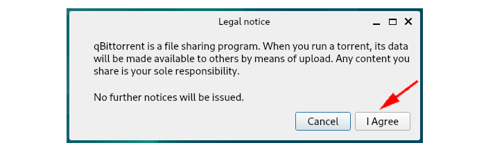
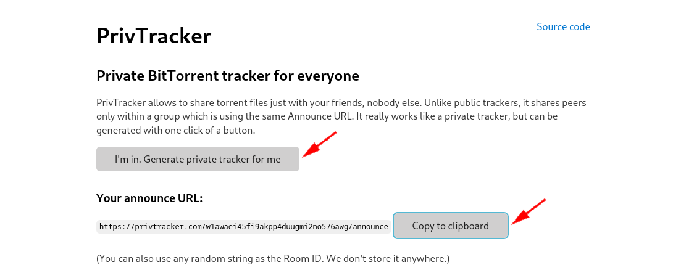

# Peer-to-Peer Large File Sharing (Torrents over VPN)

```
TLDR: you can share large files to the masses using Torrents over VPNs, preventing your ISP from knowing that you're doing so.
```


## **Introduction**

While many methods of sending files online exist, scaling file sending to accomodate larger and larger files can be a problem due to constraints on bandwidth, connection reliability and maintaining file integrity. To solve some of these issues, the technology of torrenting was born. At its core, torrenting simply involves taking a large file, breaking it into smaller chunks, transmitting those smaller chunks from one peer to another (hence P2P), and having the receiving party reconstruct those smaller chunks into the original file. The advantages here are that this process is decentralized, can be interrupted/resumed, and leechers can simultaneously download from multiple seeders thus speeding up the process. This process inherently relies on users' IP addresses for file transmission which are visible to anyone participating. As such, we must take precautions using a VPN to mask this information. In this article, we will explore how, after binding a VPN to their torrent clients, Sam the Seeder can privately share a large file with Larry the Leecher. 

## **Setup**

We start from the perspective of both Sam and Larry as both will complete these inital steps.   
 

It is presumed that both Sam and Larry have already purchased a subscription to a [VPN](https://blog.nowhere.moe/opsec/vpn/index.md). For this example we will use Proton VPN, but other [non-KYC VPNs](https://kycnot.me/?t=service&q=vpn) that accept Monero, such as Mullvad, may also be used. To start, they will sign in to their VPN client, ensure kill switch is enabled in the Settings, connect to their VPN and verify their IP address. 

Both Sam and Larry will install qBittorrent: 
    
    
    
    sudo apt install qbittorrent	
    
    

Sam and Larry will open up qBittorrent and be greeted with a one-time pop-up. 

Next, Sam and Larry need to bind their VPN to qBittorrent. Under Tools -> Preferences -> Advanced, there is an option to specify the network interface. Select tun0, then click OK. Note: this interface does not appear unless the VPN is connected. 

With this step complete, all qBittorrent traffic is routed through the VPN. Should the VPN disconnect, all current downloads/uploads will stop without revealing Sam or Larry's true IP address due to the kill switch option previously enabled. 

We will switch to Sam's perspective.   


Sam is now ready to share a file with Larry. He has a 10GB file of "linux ISOs" for which he will need to create a .torrent file. To help with this, Sam will use [PrivTracker](https://privtracker.com), a private BitTorrent tracker, to announce his .torrent file. Sam generates a private announce URL on the PrivTracker website and copies it to his clipboard. 

Additionally, it is possible to self-host PrivTracker on a VPS. Following the instructions on their [GitHub](https://github.com/meehow/privtracker), we need to run: 
    
    
    
    Build
    
    # Clone this repository.
    $ git clone https://github.com/meehow/privtracker.git
    
    # cd into the directory
    $ cd privtracker
    
    # Run go build
    $ go build
    
    Usage
    
    # Runs on port 1337 and redirects to privtracker.com by default.
    $ ./privtracker
    
    # Export PORT and DOMAIN variables to use custom values.
    $ export PORT=12345 DOMAIN=customprivtracker.com; ./privtracker
    
    

In qBittorrent, Sam will go to Tools -> Torrent Creator. He selects the desired file, checks the box to make it a private torrent, clicks the box to start seeding immediately, pastes the previous copied announce URL in the Trackers URLs section and clicks on Create Torrent. Once the process finishes, he clicks OK. 

Sam's qBittorrent client now shows he is now seeding the his 10GB file. Sam leaves his qBittorrent client running in order to be connectable and to seed the file to anyone connecting. 

Sam now starts a [SimpleX](https://blog.nowhere.moe/opsec/anonsimplex/index.md) chat with Larry using disappearing messages and sends the newly created .torrent file. 

We will switch to Larry's perspective.   


Larry adds the .torrent file to his qBittorrent client to begin downloading the 10GB file. Under File -> Add Torrent File, Larry selects the .torrent file he received and clicks Open. Larry chooses where to save the 10GB file then clicks OK. 

## **Conclusion**

Larry is now leeching the file that Sam is seeding! After a bit of time the transfer will be complete. Additionally, when inspecting the connecting peers, Larry is only able to see Sam's VPN IP address and vice versa. 

