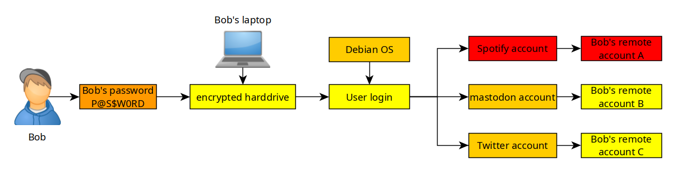
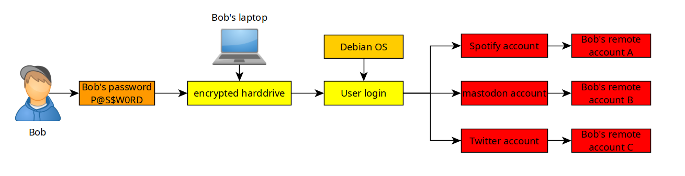
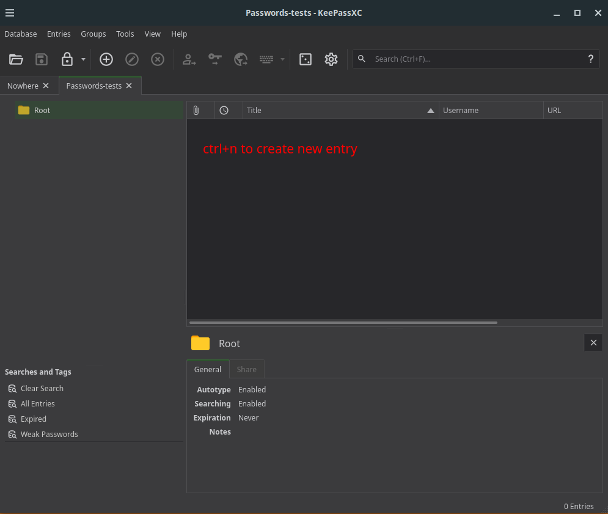
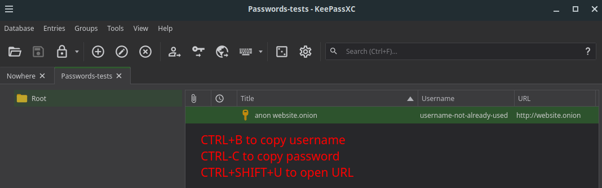
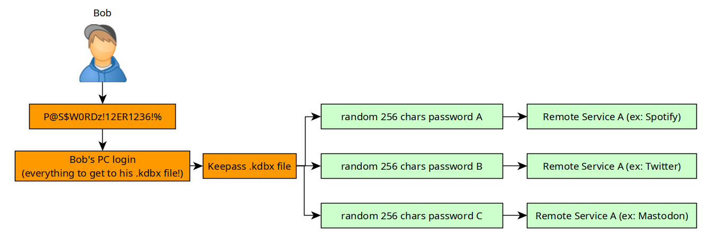

---
author:
  - meat
  - nihilist
date:
  - 2025-08-09
  - 2024-06-16
gitea_url: "http://gdatura24gtdy23lxd7ht3xzx6mi7mdlkabpvuefhrjn4t5jduviw5ad.onion/nihilist/the-opsec-bible/issues/83"
xmr:
  - 82sQHXtPaMzNkRxE5EruXZaMR4BXmASvBP62P3495EgcdvghEkv6C1d9cA98eizX6W1TGchUXCtAoZ8cVP4Qi7Nt4fP41FL
  - 8C1MNeB4KEHGApg6sPxFPn3NWERD3mPv7AjC8mCm1CJCXjoKnf36SYBdZ6ywCMdZRC4cxu7Uax3tufDqMXS2mLvHNCJzQZS
tags:
  - Clientside Privacy
---
# Password Management 101: How to use Keepass

```
TLDR: you only need to remember ONE master password to be able to login to every website you need to access.
```


## **What is password management, and Why use Keepass?**

If you have seen my [Offensive Security](../../hacking/index.md) blog section, or the numerous news regarding massive companies being hacked, you should be aware that no matter where you choose to put your data out there, nowhere is truly safe.

Now let's take the following example, Bob is being lazy (again), and he uses the same password for his laptop, all of his accounts online, and at some point he creates an account on "Spotify":


So Bob has one password for everything he does online. **What happens when one of those services (ex: Spotify) gets hacked ?**



First thing that happens, is that Bob's password gets leaked online publicly, his password may even end up in the popular password wordlists like in [seclists](https://github.com/danielmiessler/SecLists).

This means, that a potential hacker may gain access in not only bob's spotify account, **but also in all of his other accounts** , since Bob used the same password everywhere.



This could have been avoided if Bob had a different strong password for every service. That way, if one of those services got hacked, only one meaningless password would have been revealed. That is why Keepass is relevant here, because it will remember all of those passwords so that Bob doesn't have to.

## **How to install KeepassXC**

Bob can install KeepassXC using apt on debian:
    
    
    nihilist@mainpc:~/Nextcloud/blog$ sudo apt install keepassxc
    
    nihilist@mainpc:~/Nextcloud/blog$ which keepassxc
    /usr/bin/keepassxc
    
    nihilist@mainpc:~/Nextcloud/blog$ keepassxc
    
    

    

That way, Bob can have a unique, strong password for every website he registers an account onto. If one of them gets hacked, the adversary won't gain access to every other account that Bob has.



The only password reuse that there may be is only local to Bob's computer, where he uses a password to unlock his harddrive, log onto his host OS, and open his keepass file. The rest of remote logins are now managed and remembered by Keepass. 

Remember that having strong passwords is essential to counter brute force attacks.


## **Managing passwords for different identities with Keepass**
Different identities carry different risks. If your private or anonymous credentials are stored in the same place as your public ones, you're creating links between them.
The solution is to have a separate .kdbx file for each VM, each dedicated to a single identity.

This structure, [as previously seen](../internetsegmentation/index.md), prevents cross-contamination and reinforces mental boundaries.


## **Public use VM - Linus Torvalds**


Passwords used for work, subscriptions, shopping, and everyday browsing.

## **Private use VM - Nihilist**


Passwords used for services you don’t want linked to your real identity, maybe you’re in a support group, dealing with a medical issue, researching personal topics, or asking questions you’d rather keep private.

## **Anonymous use VM - ZacharyJr**


Passwords used for services that must not lead back to you, even pseudonymously, e.g. a forum you post on.

## **Sensitive use VM - DreadPirateRoberts**


Passwords used for sensitive matters, e.g. whistleblowing.

Remember that you shouldn't write your master passwords anywhere. If you are typing them once a day, you won't forget them.


## **Remotely accessing Keepass**


Sometimes you need to access your passwords on the go, but storing them in the cloud is a risk you can't afford. Google Drive, Dropbox, and iCloud all introduce trust and metadata problems. Even if your .kdbx file is encrypted, where and how it’s stored matters.

The solution is to sync your KeePass file using [Syncthing](../syncthinganon/index.md) and access it using AuthPass.

Syncthing keeps your .kdbx file synchronized across devices using encrypted connections and AuthPass is a password manager that can open .kdbx files, by combining them you will be able to update your password vault on your computer and securely access it on your phone.

## **Setting it up**

1. On your phone, install Syncthing and AuthPass from F-Droid


2. On your computer, install syncthing and open it

3. Click on "Actions" and then "Show ID"


4. On your phone, open Syncthing, go to "Devices" and click "Add Device"


5. Either scan the QR-Code on your computer or paste the ID, and name the device


6. On your computer, click "Add Device"


7. On your phone, create a folder for KeePass, choose a path and allow your device


8. On your computer, click "Add"


9. Choose the path and click "Save"


10. Open your file manager and move the .kbdx file to the KeePass folder


11. On your phone, you will see there's one file in that folder, click on the icon


12. Click on the 3 dots and open the file with AuthPass


13. Enter the master password


14. Now you can access your passwords


Next, Bob learns to use [PGP encryption](../pgp/index.md) using Gnupg.
