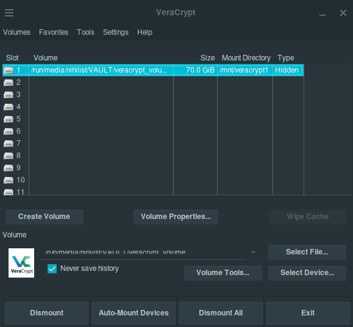
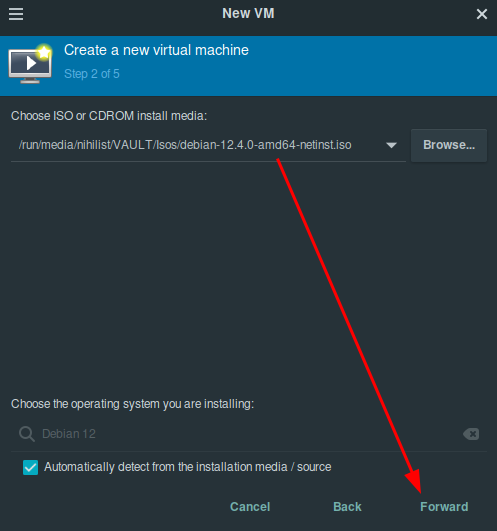
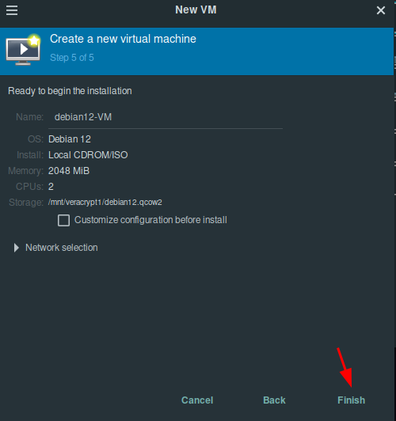
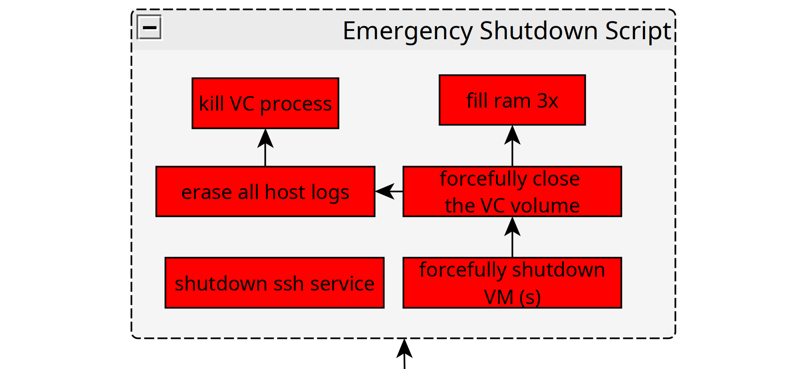
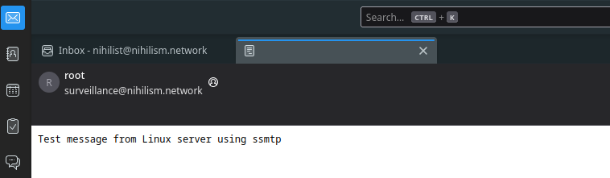
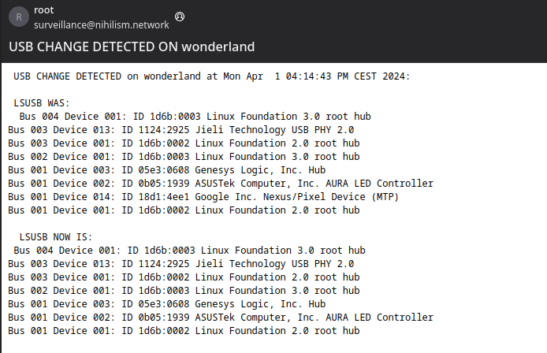

#  Plausible Deniability Protection for an .onion Service (WIP)

```
DISCLAIMER: THIS TUTORIAL IS GOING TO BE REWRITTEN IN MULTIPLE SEPARATE TUTORIALS, TREAT IT AS A DRAFT FOR NOW.
```

In this tutorial we're going to look at how you can protect a set of QEMU VMs running in a veracrypt hidden partition from being discovered by an adversary.

For this tutorial we have the following threat model:

  1. What if an adversary enters the room where the physical server is ?

  2. What if an adversary opens up the case of the physical server ?

  3. What if an adversary plugs in or removes any usb device on the server ?

  4. What if an adversary shuts down the electricity of the entire house before coming in ?

  5. What if an adversary steals your password or ssh key somehow and manages to login via SSH on the server ?

  6. What if an adversary physically destroys the harddrive containing the veracrypt partition ?

  7. What if an adversary tries to do a cold boot attack ? (meaning forensics regarding server logs and RAM live memory)

  8. What if an adversary forces you to type in your password to your encrypted data ?


Let's take all those threat vectors into account, and setup our homeserver with the following physical security setup:


## **Initial Setup**

First we setup a debian QEMU VM in the hidden veracrypt partition:

**DISCLAIMER: we're using only harddrives (HDDs) here, because using SSDs are not a secure way to have Plausible Deniability, that is due to hidden Volumes being detectable on devices that utilize wear-leveling**
    
    
    source: https://anonymousplanet.org/guide.html#understanding-hdd-vs-ssd
    
    regarding wear leveling:
    "Also as mentioned earlier, disabling Trim will reduce the lifetime of your SSD drive and will significantly impact its performance over time (your laptop will become slower and slower over several months of use until it becomes almost unusable, you will then have to clean the drive and re-install everything). But you must do it to prevent data leaks that could allow forensics to defeat your plausible deniability. The only way around this at the moment is to have a laptop with a classic HDD drive instead."
    
    

Look at [this tutorial](../veracrypt/index.md) on how to create a veracrypt hidden partition, now create a volume that can contain a debian VM inside the hidden partition (ex: outer volume 140G, and inner/hidden volume 70G). Also follow [this tutorial](../hypervisorsetup/index.md) to know how to setup a QEMU hypervisor to virtualize VMs on linux. Now in the hidden partition we will create the debian QEMU VM (whose disk is 50Gb) as follows (keep in mind that we will also need to copy it into the decoy partition without overwriting the hidden partition, so make sure you can fit the same VM there aswell when you are creating the veracrypt volume!):

       
    
    
    root@debian:~# apt update -y ; apt upgrade -y ; apt autoremove -y
    
    

side note: make sure that you also copy the same VM into the decoy partition in case if you are asked to disprove the claim that said vm name inside the veracrypt partition contains something sensitive. 

we make it run a .onion service like so as shown on [this tutorial](../torwebsite/index.md)

So now we have the following graph:


We now have a server at home, that contains a veracrypt hidden partition (whose existance shouldnt be revealed), that hidden partition contains a VM, which contains a .onion service we want to hide the existence of. So now let's protect it: 

## **Emergency Shutdown setup**

First let's define how to shutdown the services and hide the veracrypt hidden partition in one simple bash script:

We have the following order of events:

First we open the veracrypt volume, then we add the QEMU VM in virt-manager while naming it, then we power it on, and then we have our plausibly-deniable onion service.


So for an emergency shutdown, we need to do the same in the reverse order: First we shutdown the VM forcefully, then we close the hidden veracrypt partition forcefully, then we wipe the logs, then we kill the veracrypt process, and then then we wipe the ram 3 times to erase all potential trace of VMs in live memory. 



Then we assemble that in a bashscript like so:
    
    
    [ Wonderland ] [ /dev/pts/1 ] [~]
    → sudo cat /root/emergencyshutdown.sh
    [sudo] password for nihilist: 
    #!/bin/bash
    
    #remove VM and undefine it: (make sure that the VM name is exact!!!)
    sudo virsh -c qemu:///system destroy debian12-VM
    sudo virsh -c qemu:///system undefine debian12-VM
    #make sure that there is also an innocent VM called debian12-VM in the outer partition (for plausible deniability)
    
    #unmount veracrypt drives forcefully
    sudo veracrypt -d  -f
    
    # then cleanup logs
    sudo rm -rf /dev/shm/*
    sudo rm -rf /var/log/* 
    sudo dmesg -c >/dev/null 2>/dev/null
    
    # kill veracrypt to avoid having the veracrypt window display which drive/volume was selected
    kill $(pidof veracrypt)
    
    # then wipe ram 3 times
    # apt install stress
    # below change 128G to the number of Gigabytes in your system ! put 16 if you only have 16Gb of ram!
    stress -m 1 --vm-bytes 128G -t 10
    stress -m 1 --vm-bytes 128G -t 10
    stress -m 1 --vm-bytes 128G -t 10
    
    

you can run it like so:
    
    
    chmod +x ./emergencyshutdown.sh
    ./emergencyshutdown.sh
    	
    

Next we need to be able to send an email from the server to the administrator to notify him that an emergency shutdown just happened.


We'll be using ssmtp from the homeserver itself , it's going to connect to a remote mail server to send the mail we want. (check [this tutorial](../mailprivate/index.md) if you want to know how to setup your SMTP mail server):
    
    
    [ Wonderland ] [ /dev/pts/1 ] [~]
    → apt install ssmtp
    
    

Then make sure the user exists on the smtp server:
    
    
    root@mail-nihilism:~# useradd -G mail -m surveillance
    root@mail-nihilism:~# id surveillance
    uid=1003(surveillance) gid=1003(surveillance) groups=1003(surveillance),8(mail)
    root@mail-nihilism:~# passwd surveillance
    New password:
    Retype new password:
    passwd: password updated successfully
    
    

And then just send the mail after configuring ssmtp to send to the right place as the correct user:
    
    
    [ Wonderland ] [ /dev/pts/5 ] [~]
    → cat /etc/ssmtp/revaliases
    # sSMTP aliases
    #
    # Format:       local_account:outgoing_address:mailhub
    #
    # Example: root:your_login@your.domain:mailhub.your.domain[:port]
    # where [:port] is an optional port number that defaults to 25.
    
    root:surveillance:mail.nowhere.moe:587
    
    [ Wonderland ] [ /dev/pts/5 ] [~]
    → cat /etc/ssmtp/ssmtp.conf
    rewriteDomain=nowhere.moe
    mailhub=mail.nowhere.moe:587
    useSTARTTLS=YES
    AuthUser=surveillance
    AuthPass=D9IJWDOAHWHUHWUHDAWHDUWHAHDWAIHA3213221123312F
    
    [ Wonderland ] [ /dev/pts/5 ] [~]
    → echo "Test message from Linux server using ssmtp" | sudo ssmtp -vvv nihilist@nowhere.moe
    [<****-] 220 mail.nowhere.moe ESMTP nowhere.moe (Debian/GNU)
    [->] EHLO wonderland
    [ <****-] 250 CHUNKING
    [->] STARTTLS
    [ <****-] 220 2.0.0 Ready to start TLS
    [->] EHLO wonderland
    [ <****-] 250 CHUNKING
    [->] AUTH LOGIN
    [ <****-] 334 VXNlcm5hbWU6
    [->] c3VydmVpbGxhbmNl
    [ <****-] 334 UGFzc3dvcmQ6
    [ <****-] 235 2.7.0 Authentication successful
    [->] MAIL FROM: <****surveillance@nowhere.moe>
    [ <****-] 250 2.1.0 Ok
    [->] RCPT TO: <****nihilist@nowhere.moe>
    [ <****-] 250 2.1.5 Ok
    [->] DATA
    [ <****-] 354 End data with <****CR> <****LF>. <****CR> <****LF>
    [->] Received: by wonderland (sSMTP sendmail emulation); Sat, 30 Mar 2024 17:01:44 +0100
    [->] From: "root" <****surveillance@nowhere.moe>
    [->] Date: Sat, 30 Mar 2024 17:01:44 +0100
    [->] Test message from Linux server using ssmtp
    [->]
    [->] .
    [ <****-] 250 2.0.0 Ok: queued as 9FB5E26A92
    [->] QUIT
    [ <****-] 221 2.0.0 Bye

And there we see that we recieved the mail on thunderbird: 



Meaning we have the following emergency shutdown script:
    
    
    [ Wonderland ] [ /dev/pts/1 ] [~]
    → sudo cat /root/emergencyshutdown.sh
    [sudo] password for nihilist: 
    #!/bin/bash
    
    #notify the admin that the emergency shutdown is being performed
    echo "PERFORMING EMERGENCY SHUTDOWN!" | sudo ssmtp -vvv nihilist@nowhere.moe
    
    #perform the emergency shutdown:
    
    #remove VM and undefine it: (make sure that the VM name is exact!!!)
    sudo virsh -c qemu:///system destroy debian12-VM
    sudo virsh -c qemu:///system undefine debian12-VM
    #make sure that there is also an innocent VM called debian12-VM in the outer partition (for plausible deniability)
    
    #unmount veracrypt drives forcefully
    sudo veracrypt -d  -f
    
    # then cleanup logs
    sudo rm -rf /dev/shm/*
    sudo rm -rf /var/log/* 
    sudo dmesg -c >/dev/null 2>/dev/null
    
    # kill veracrypt to avoid having the veracrypt window display which drive/volume was selected
    kill $(pidof veracrypt)
    
    # then wipe ram 3 times
    # apt install stress
    # below change 128G to the number of Gigabytes in your system ! put 16 if you only have 16Gb of ram!
    stress -m 1 --vm-bytes 128G -t 10
    stress -m 1 --vm-bytes 128G -t 10
    stress -m 1 --vm-bytes 128G -t 10
    
    
    

## **Surveillance Setup**

So now that we have our actions completed (emergency shutdown and sending a mail), we need to make sure that both are triggered whenever necessary, as shown below:


To look out for any usb change on the homeserver, we have the following script:
    
    
    [ Wonderland ] [ /dev/pts/5 ] [~]
    → cat checkusb.sh
    #!/bin/bash
    
    action_for_unauthorized_usb_change () {
            echo "[+] ACTION : SEND MAIL TO NOTIFY ADMIN"
            echo -en "Subject: USB CHANGE DETECTED ON $(hostname) \n\n USB CHANGE DETECTED on $(hostname) at $(date): \n\n LSUSB WAS: \n  $defaultlsusb \n\n  LSUSB NOW IS: \n $(lsusb)" | sudo ssmtp -vvv nihilist@nowhere.moe
    
            #echo "[+] ACTION : EMERGENCY SHUTDOWN SCRIPT"
    }
    
    #defaultusb = check usb store it as default usb
    defaultusb=$(lsusb | sha512sum)
    defaultlsusb=$(lsusb )
    
    #set maintenanece to 0
    echo 0 > /tmp/maintenance
    
    while true; do
            # check if maintenance mode or not:
            if [ $(cat /tmp/maintenance) -eq 0 ]; # if no maintenance, look for usb changes
            then
                    usbnow=$(lsusb | sha512sum)
                    if [ "$usbnow" = "$defaultusb" ]; #detect usb changes
                    then
                            echo "[+] No usb change..."
                    else
                            echo "[+] USB change detected, peforming action"
                            echo $defaultusb
                            echo $usbnow
                            action_for_unauthorized_usb_change
                            #sleep 3600
                            sleep 10
                            defaultlsusb=$(lsusb)
                            defaultusb=$(lsusb | sha512sum)
                    fi
            else #maintenance ongoing, then not checking for usb changes
                    echo "[+] Maintenance mode, not checking for usb changes..."
            fi
            sleep 1
    done
    
    

Then to detect any movement in the room we setup motion, this will make it possible for a cheap usb webcam to take pictures upon detecting movement in the room where the homeserver is:
    
    
    [ Wonderland ] [ /dev/pts/5 ] [~]
    → apt-get install v4l-utils motion -y
    
    
    [ Wonderland ] [ /dev/pts/5 ] [~]
    → cat /etc/motion/motion.conf
    # Rename this distribution example file to motion.conf
    #
    # This config file was generated by motion 4.5.1
    # Documentation:  /usr/share/doc/motion/motion_guide.html
    #
    # This file contains only the basic configuration options to get a
    # system working.  There are many more options available.  Please
    # consult the documentation for the complete list of all options.
    #
    
    ############################################################
    # System control configuration parameters
    ############################################################
    
    # Start in daemon (background) mode and release terminal.
    daemon off
    
    # Start in Setup-Mode, daemon disabled.
    setup_mode off
    
    # File to store the process ID.
    ; pid_file value
    
    # File to write logs messages into.  If not defined stderr and syslog is used.
    #log_file /var/log/motion/motion.log
    log_file /dev/null
    
    # Level of log messages [1..9] (EMG, ALR, CRT, ERR, WRN, NTC, INF, DBG, ALL).
    log_level 6
    
    # Target directory for pictures, snapshots and movies
    target_dir /tmp/room
    
    # Video device (e.g. /dev/video0) to be used for capturing.
    video_device /dev/video0
    
    # Parameters to control video device.  See motion_guide.html
    ; video_params value
    
    # The full URL of the network camera stream.
    ; netcam_url value
    
    # Name of mmal camera (e.g. vc.ril.camera for pi camera).
    ; mmalcam_name value
    
    # Camera control parameters (see raspivid/raspistill tool documentation)
    ; mmalcam_params value
    
    ############################################################
    # Image Processing configuration parameters
    ############################################################
    
    # Image width in pixels.
    width 640
    
    # Image height in pixels.
    height 480
    
    # Maximum number of frames to be captured per second.
    framerate 1
    
    # Text to be overlayed in the lower left corner of images
    text_left ROOM1
    
    # Text to be overlayed in the lower right corner of images.
    text_right %Y-%m-%d\n%T-%q
    
    ############################################################
    # Motion detection configuration parameters
    ############################################################
    
    # Always save pictures and movies even if there was no motion.
    emulate_motion off
    
    # Threshold for number of changed pixels that triggers motion.
    threshold 1500
    
    # Noise threshold for the motion detection.
    ; noise_level 32
    
    # Despeckle the image using (E/e)rode or (D/d)ilate or (l)abel.
    despeckle_filter EedDl
    
    # Number of images that must contain motion to trigger an event.
    minimum_motion_frames 1
    
    # Gap in seconds of no motion detected that triggers the end of an event.
    event_gap 60
    
    # The number of pre-captured (buffered) pictures from before motion.
    pre_capture 3
    
    # Number of frames to capture after motion is no longer detected.
    post_capture 0
    
    ############################################################
    # Script execution configuration parameters
    ############################################################
    
    # Command to be executed when an event starts.
    ; on_event_start value
    
    # Command to be executed when an event ends.
    ; on_event_end value
    
    # Command to be executed when a movie file is closed.
    ; on_movie_end value
    
    ############################################################
    # Picture output configuration parameters
    ############################################################
    
    # Output pictures when motion is detected
    picture_output on
    
    # File name(without extension) for pictures relative to target directory
    picture_filename %Y%m%d%H%M%S-%q
    
    ############################################################
    # Movie output configuration parameters
    ############################################################
    
    # Create movies of motion events.
    movie_output off
    
    # Maximum length of movie in seconds.
    movie_max_time 60
    
    # The encoding quality of the movie. (0=use bitrate. 1=worst quality, 100=best)
    movie_quality 45
    
    # Container/Codec to used for the movie. See motion_guide.html
    movie_codec mkv
    
    # File name(without extension) for movies relative to target directory
    movie_filename %t-%v-%Y%m%d%H%M%S
    
    ############################################################
    # Webcontrol configuration parameters
    ############################################################
    
    # Port number used for the webcontrol.
    webcontrol_port 8080
    
    # Restrict webcontrol connections to the localhost.
    webcontrol_localhost off
    
    # Type of configuration options to allow via the webcontrol.
    webcontrol_parms 0
    
    ############################################################
    # Live stream configuration parameters
    ############################################################
    
    # The port number for the live stream.
    stream_port 8081
    
    # Restrict stream connections to the localhost.
    stream_localhost off
    
    ##############################################################
    # Camera config files - One for each camera.
    ##############################################################
    ; camera /usr/etc/motion/camera1.conf
    ; camera /usr/etc/motion/camera2.conf
    ; camera /usr/etc/motion/camera3.conf
    ; camera /usr/etc/motion/camera4.conf
    
    ##############################################################
    # Directory to read '.conf' files for cameras.
    ##############################################################
    ; camera_dir /usr/etc/motion/conf.d
    
    	
    
    [ Wonderland ] [ /dev/pts/5 ] [~]
    → mkdir /tmp/room
    
    [ Wonderland ] [ /dev/pts/5 ] [~]
    → chown -R motion:motion /tmp/room
    
    [ Wonderland ] [ /dev/pts/5 ] [~]
    → systemctl restart motion
    
    

From there you can see if the webcam works on port 9091:


Then we can see that motion to saves pictures once per second once it detects movement in /tmp/room:
    
    
    Every 1.0s: ls -l /tmp/room                                                        wonderland: Thu Mar 28 17:07:51 2024
    
    total 368
    -rw-r--r-- 1 motion motion 52251 Mar 28 17:07 20240328170745-01.jpg
    -rw-r--r-- 1 motion motion 52129 Mar 28 17:07 20240328170746-00.jpg
    -rw-r--r-- 1 motion motion 52471 Mar 28 17:07 20240328170746-01.jpg
    -rw-r--r-- 1 motion motion 37158 Mar 28 17:07 20240328170747-00.jpg
    -rw-r--r-- 1 motion motion 33439 Mar 28 17:07 20240328170747-01.jpg
    -rw-r--r-- 1 motion motion 22586 Mar 28 17:07 20240328170748-00.jpg
    -rw-r--r-- 1 motion motion 19099 Mar 28 17:07 20240328170748-01.jpg
    -rw-r--r-- 1 motion motion 18205 Mar 28 17:07 20240328170749-00.jpg
    -rw-r--r-- 1 motion motion 19284 Mar 28 17:07 20240328170749-01.jpg
    -rw-r--r-- 1 motion motion 49770 Mar 28 17:07 20240328170750-00.jpg
    
    

Then we have this script to check if there are any new files in /tmp/room/ and if there are then we put them in a zipfile before SEND it via mail to the admin:
    
    
    [ Wonderland ] [ /dev/pts/5 ] [~]
    → cat checkmovement_room.sh
    #!/bin/bash
    
    
    #apt-get install v4l-utils motion -y
    #vim /etc/motion/motion.conf
    
    action_for_unauthorized_room_motion () {
            echo "[+] ACTION : SEND MAIL TO NOTIFY ADMIN"
            find /tmp/room/ -name *.jpg > /tmp/newfiles
                    newfiles=$(diff -u /tmp/oldfiles /tmp/newfiles | grep -E "^\+" | grep -v "+++" | tr -d '+')
    
                    linelist=$(for line in $newfiles; do echo -en "$line " ;done)
                    zip /tmp/images.zip $linelist
                    echo -e "Subject: MOVEMENT DETECTED IN ROOM OF $(hostname) \n\n MOVEMENT DETECTED IN ROOM OF $(hostname) AT $(date):"| (cat - && uuencode /tmp/images.zip images.zip)  | sudo ssmtp -vvv nihilist@nowhere.moe
                    rm /tmp/images.zip
                    rm /tmp/room/* -rf
    }
    
    
    #set maintenanece to 0
    mkdir /tmp/room/ 2>/dev/null
    rm /tmp/room/* -rf
    chown motion: /tmp/room/ -R
    echo 0 > /tmp/maintenance
    find /tmp/room/ -name *.jpg > /tmp/oldfiles
    
    #defaultusb = check usb store it as default usb
    defaultroom=$(ls /tmp/room | sha512sum)
    
    while true; do
    
    
    
            # check if maintenance mode or not:
            if [ $(cat /tmp/maintenance) -eq 0 ]; # if no room maintenance, look for room changes
            then
                    roomnow=$(ls /tmp/room | sha512sum)
                    if [ "$roomnow" = "$defaultroom" ]; #detect usb changes
                    then
                            echo "[+] No Room Movement..."
                    else
                            echo "[+] Room movement detected, peforming action"
                            echo $defaulroom
                            echo $roomnow
                            action_for_unauthorized_room_motion
                            #sleep 3600
                            sleep 10
                            defaultroom=$(ls /tmp/room | sha512sum)
                            find /tmp/room/ -name *.jpg > /tmp/oldfiles
                    fi
            else #maintenance ongoing, then not checking for room movements
                    echo "[+] Maintenance mode, not checking for room movements..."
            fi
            sleep 1
    done
    
    

We also make a systemd service to automatically launch/relaunch the checkusb.sh script and checkmovement_room script, and also to make sure they auto start when the server boots up:
    
    
    
    [ Wonderland ] [ /dev/pts/5 ] [~]
    → vim /etc/systemd/system/usbwatcher.service
    
    [ Wonderland ] [ /dev/pts/5 ] [~]
    → cat/etc/systemd/system/usbwatcher.service
    
    [Unit]
    Description=usbwatcher
    After=network-online.target
    Wants=network-online.target
    
    [Service]
    Type=simple
    ExecStart=/root/checkusb.sh
    ExecStop=kill -9 $(pidof /root/checkusb.sh)
    Restart=always
    
    [Install]
    WantedBy=multi-user.target
    
    [ Wonderland ] [ /dev/pts/5 ] [~]
    → vim /etc/systemd/system/motionwatcher.service
    
    [ Wonderland ] [ /dev/pts/5 ] [~]
    → cat/etc/systemd/system/motionwatcher.service
    
    [Unit]
    Description=motionwatcher
    After=network-online.target
    Wants=network-online.target
    
    [Service]
    Type=simple
    ExecStart=/root/checkmovement_room.sh
    ExecStop=kill -9 $(pidof /root/checkmovement_room.sh)
    Restart=always
    
    [Install]
    WantedBy=multi-user.target
    
    
    [ Wonderland ] [ /dev/pts/5 ] [~]
    → systemctl daemon-reload
    
    [ Wonderland ] [ /dev/pts/5 ] [~]
    → systemctl enable --now motionwatcher.service usbwatcher.service motion.service
    Created symlink /etc/systemd/system/multi-user.target.wants/motionwatcher.service → /etc/systemd/system/motionwatcher.service.
    Created symlink /etc/systemd/system/multi-user.target.wants/usbwatcher.service → /etc/systemd/system/usbwatcher.service.
    Created symlink /etc/systemd/system/multi-user.target.wants/motion.service → /etc/systemd/system/motion.service.
    
    [ Wonderland ] [ /dev/pts/5 ] [~]
    → systemctl status motionwatcher.service usbwatcher.service
    ● motionwatcher.service - motionwatcher
         Loaded: loaded (/etc/systemd/system/motionwatcher.service; enabled; preset: enabled)
         Active: active (running) since Mon 2024-04-01 14:38:01 CEST; 6s ago
       Main PID: 3799951 (checkmovement_r)
          Tasks: 2 (limit: 76929)
         Memory: 676.0K
            CPU: 24ms
         CGroup: /system.slice/motionwatcher.service
                 ├─3799951 /bin/bash /root/checkmovement_room.sh
                 └─3800321 sleep 1
    
    Apr 01 14:38:01 wonderland systemd[1]: Started motionwatcher.service - motionwatcher.
    Apr 01 14:38:01 wonderland checkmovement_room.sh[3799951]: [+] No Room Movement...
    Apr 01 14:38:02 wonderland checkmovement_room.sh[3799951]: [+] No Room Movement...
    Apr 01 14:38:03 wonderland checkmovement_room.sh[3799951]: [+] No Room Movement...
    Apr 01 14:38:04 wonderland checkmovement_room.sh[3799951]: [+] No Room Movement...
    Apr 01 14:38:05 wonderland checkmovement_room.sh[3799951]: [+] No Room Movement...
    Apr 01 14:38:06 wonderland checkmovement_room.sh[3799951]: [+] No Room Movement...
    Apr 01 14:38:07 wonderland checkmovement_room.sh[3799951]: [+] No Room Movement...
    
    ● usbwatcher.service - usbwatcher
         Loaded: loaded (/etc/systemd/system/usbwatcher.service; enabled; preset: enabled)
         Active: active (running) since Mon 2024-04-01 14:38:01 CEST; 6s ago
       Main PID: 3799953 (checkusb.sh)
          Tasks: 2 (limit: 76929)
         Memory: 664.0K
            CPU: 40ms
         CGroup: /system.slice/usbwatcher.service
                 ├─3799953 /bin/bash /root/checkusb.sh
                 └─3800327 sleep 1
    
    Apr 01 14:38:01 wonderland systemd[1]: Started usbwatcher.service - usbwatcher.
    Apr 01 14:38:01 wonderland checkusb.sh[3799953]: [+] No usb change...
    Apr 01 14:38:02 wonderland checkusb.sh[3799953]: [+] No usb change...
    Apr 01 14:38:03 wonderland checkusb.sh[3799953]: [+] No usb change...
    Apr 01 14:38:04 wonderland checkusb.sh[3799953]: [+] No usb change...
    Apr 01 14:38:05 wonderland checkusb.sh[3799953]: [+] No usb change...
    Apr 01 14:38:06 wonderland checkusb.sh[3799953]: [+] No usb change...
    Apr 01 14:38:07 wonderland checkusb.sh[3799953]: [+] No usb change...
    
    
    

then just watch it run:
    
    
    Every 1.0s: systemctl status motionwatcher.service usbwatcher.service                                                                                                                                       wonderland: Mon Apr  1 14:40:55 2024
    
    ● motionwatcher.service - motionwatcher
         Loaded: loaded (/etc/systemd/system/motionwatcher.service; enabled; preset: enabled)
         Active: active (running) since Mon 2024-04-01 14:38:01 CEST; 2min 54s ago
       Main PID: 3799951 (checkmovement_r)
          Tasks: 2 (limit: 76929)
         Memory: 680.0K
            CPU: 457ms
         CGroup: /system.slice/motionwatcher.service
                 ├─3799951 /bin/bash /root/checkmovement_room.sh
                 └─3810241 sleep 10
    
    Apr 01 14:40:45 wonderland checkmovement_room.sh[3799951]: [+] No Room Movement...
    Apr 01 14:40:46 wonderland checkmovement_room.sh[3799951]: [+] No Room Movement...
    Apr 01 14:40:47 wonderland checkmovement_room.sh[3799951]: [+] No Room Movement...
    Apr 01 14:40:48 wonderland checkmovement_room.sh[3799951]: [+] No Room Movement...
    Apr 01 14:40:49 wonderland checkmovement_room.sh[3799951]: [+] No Room Movement...
    Apr 01 14:40:50 wonderland checkmovement_room.sh[3799951]: [+] No Room Movement...
    Apr 01 14:40:51 wonderland checkmovement_room.sh[3799951]: [+] No Room Movement...
    Apr 01 14:40:52 wonderland checkmovement_room.sh[3799951]: [+] Room movement detected, peforming action
    Apr 01 14:40:52 wonderland checkmovement_room.sh[3799951]: 20c1a997bdf538923ed863a64bd1c0d73a7e15337011e576bf9f473c88865fe7e95627774c8035d7f6ee00d998d0f9926cf7442b297ab8d91373ff8d2b587c2c -
    Apr 01 14:40:52 wonderland checkmovement_room.sh[3799951]: [+] ACTION : SEND MAIL TO NOTIFY ADMIN
    
    ● usbwatcher.service - usbwatcher
         Loaded: loaded (/etc/systemd/system/usbwatcher.service; enabled; preset: enabled)
         Active: active (running) since Mon 2024-04-01 14:38:01 CEST; 2min 54s ago
       Main PID: 3799953 (checkusb.sh)
          Tasks: 2 (limit: 76929)
         Memory: 800.0K
            CPU: 929ms
         CGroup: /system.slice/usbwatcher.service
                 ├─3799953 /bin/bash /root/checkusb.sh
                 └─3810361 sleep 1
    
    Apr 01 14:40:38 wonderland checkusb.sh[3799953]: [+] No usb change...
    Apr 01 14:40:39 wonderland checkusb.sh[3799953]: [+] No usb change...
    Apr 01 14:40:40 wonderland checkusb.sh[3799953]: [+] No usb change...
    Apr 01 14:40:41 wonderland checkusb.sh[3799953]: [+] USB change detected, peforming action
    Apr 01 14:40:41 wonderland checkusb.sh[3799953]: 140e9f95759026b6626bbc1098544bab9f85289c15c44f0fac44951100fbbb140214c00884f13bb50c959fc817bcdd1b6e8050781e1a987f6ea3a289c72c3198 -
    Apr 01 14:40:41 wonderland checkusb.sh[3799953]: 482600aa9446e3bbe616534a224785512995e80cd70a16e84c8315e569885a5d52ac0b8363055a6973476521321c767d8b54c918c8443f96cdf0eead35b17cb9 -
    Apr 01 14:40:41 wonderland checkusb.sh[3799953]: [+] ACTION : SEND MAIL TO NOTIFY ADMIN
    Apr 01 14:40:52 wonderland checkusb.sh[3799953]: [+] No usb change...
    Apr 01 14:40:53 wonderland checkusb.sh[3799953]: [+] No usb change...
    Apr 01 14:40:54 wonderland checkusb.sh[3799953]: [+] No usb change...
    
    

You can also see it sending mails whenever there is a usb change detected or a room movement detected:


The first mail contains the details regarding what usb got plugged in or plugged out:



The second mail contains the zipfiles with the images taken upon movement detection:


And if you need to do a maintenance you can always disable them like so:
    
    
    [ Wonderland ] [ /dev/pts/5 ] [~]
    → systemctl stop motionwatcher.service usbwatcher.service
    
    [ Wonderland ] [ /dev/pts/5 ] [~]
    → systemctl status motionwatcher.service usbwatcher.service
    × motionwatcher.service - motionwatcher
         Loaded: loaded (/etc/systemd/system/motionwatcher.service; enabled; preset: enabled)
         Active: failed (Result: exit-code) since Mon 2024-04-01 14:41:37 CEST; 1min 17s ago
       Duration: 3min 35.887s
        Process: 3799951 ExecStart=/root/checkmovement_room.sh (code=killed, signal=TERM)
        Process: 3812925 ExecStop=kill -9 $(pidof /root/checkmovement_room.sh) (code=exited, status=1/FAILURE)
       Main PID: 3799951 (code=killed, signal=TERM)
            CPU: 545ms
    
    Apr 01 14:41:32 wonderland checkmovement_room.sh[3799951]: [+] No Room Movement...
    Apr 01 14:41:33 wonderland checkmovement_room.sh[3799951]: [+] No Room Movement...
    Apr 01 14:41:34 wonderland checkmovement_room.sh[3799951]: [+] No Room Movement...
    Apr 01 14:41:35 wonderland checkmovement_room.sh[3799951]: [+] No Room Movement...
    Apr 01 14:41:36 wonderland checkmovement_room.sh[3799951]: [+] No Room Movement...
    Apr 01 14:41:37 wonderland systemd[1]: Stopping motionwatcher.service - motionwatcher...
    Apr 01 14:41:37 wonderland kill[3812925]: kill: failed to parse argument: '/root/checkmovement_room.sh)'
    Apr 01 14:41:37 wonderland systemd[1]: motionwatcher.service: Control process exited, code=exited, status=1/FAILURE
    Apr 01 14:41:37 wonderland systemd[1]: motionwatcher.service: Failed with result 'exit-code'.
    Apr 01 14:41:37 wonderland systemd[1]: Stopped motionwatcher.service - motionwatcher.
    
    × usbwatcher.service - usbwatcher
         Loaded: loaded (/etc/systemd/system/usbwatcher.service; enabled; preset: enabled)
         Active: failed (Result: exit-code) since Mon 2024-04-01 14:41:37 CEST; 1min 17s ago
       Duration: 3min 35.888s
        Process: 3799953 ExecStart=/root/checkusb.sh (code=killed, signal=TERM)
        Process: 3812926 ExecStop=kill -9 $(pidof /root/checkusb.sh) (code=exited, status=1/FAILURE)
       Main PID: 3799953 (code=killed, signal=TERM)
            CPU: 1.176s
    
    Apr 01 14:41:33 wonderland checkusb.sh[3799953]: [+] No usb change...
    Apr 01 14:41:34 wonderland checkusb.sh[3799953]: [+] No usb change...
    Apr 01 14:41:35 wonderland checkusb.sh[3799953]: [+] No usb change...
    Apr 01 14:41:36 wonderland checkusb.sh[3799953]: [+] No usb change...
    Apr 01 14:41:37 wonderland systemd[1]: Stopping usbwatcher.service - usbwatcher...
    Apr 01 14:41:37 wonderland kill[3812926]: kill: failed to parse argument: '/root/checkusb.sh)'
    Apr 01 14:41:37 wonderland systemd[1]: usbwatcher.service: Control process exited, code=exited, status=1/FAILURE
    Apr 01 14:41:37 wonderland systemd[1]: usbwatcher.service: Failed with result 'exit-code'.
    Apr 01 14:41:37 wonderland systemd[1]: Stopped usbwatcher.service - usbwatcher.
    Apr 01 14:41:37 wonderland systemd[1]: usbwatcher.service: Consumed 1.176s CPU time.
    
    

Or you can also set the /tmp/maintenance flag to 1, but dont forget to set it back to 0 afterward.
    
    
    [ Wonderland ] [ /dev/pts/5 ] [~]
    → echo "1" >/tmp/maintenance
    
    [ Wonderland ] [ /dev/pts/5 ] [~]
    → systemctl status usbwatcher.service motionwatcher.service
    ● usbwatcher.service - usbwatcher
         Loaded: loaded (/etc/systemd/system/usbwatcher.service; enabled; preset: enabled)
         Active: active (running) since Mon 2024-04-01 16:14:29 CEST; 5min ago
       Main PID: 4087848 (checkusb.sh)
          Tasks: 2 (limit: 76929)
         Memory: 584.0K
            CPU: 1.969s
         CGroup: /system.slice/usbwatcher.service
                 ├─4087848 /bin/bash /root/checkusb.sh
                 └─4099926 sleep 1
    
    Apr 01 16:19:52 wonderland checkusb.sh[4087848]: [+] No usb change...
    Apr 01 16:19:53 wonderland checkusb.sh[4087848]: [+] No usb change...
    Apr 01 16:19:54 wonderland checkusb.sh[4087848]: [+] No usb change...
    Apr 01 16:19:55 wonderland checkusb.sh[4087848]: [+] No usb change...
    Apr 01 16:19:56 wonderland checkusb.sh[4087848]: [+] No usb change...
    Apr 01 16:19:57 wonderland checkusb.sh[4087848]: [+] No usb change...
    Apr 01 16:19:58 wonderland checkusb.sh[4087848]: [+] Maintenance mode, not checking for usb changes...
    Apr 01 16:19:59 wonderland checkusb.sh[4087848]: [+] Maintenance mode, not checking for usb changes...
    Apr 01 16:20:00 wonderland checkusb.sh[4087848]: [+] Maintenance mode, not checking for usb changes...
    Apr 01 16:20:01 wonderland checkusb.sh[4087848]: [+] Maintenance mode, not checking for usb changes...
    
    ● motionwatcher.service - motionwatcher
         Loaded: loaded (/etc/systemd/system/motionwatcher.service; enabled; preset: enabled)
         Active: active (running) since Mon 2024-04-01 16:14:29 CEST; 5min ago
       Main PID: 4087847 (checkmovement_r)
          Tasks: 2 (limit: 76929)
         Memory: 644.0K
            CPU: 1.006s
         CGroup: /system.slice/motionwatcher.service
                 ├─4087847 /bin/bash /root/checkmovement_room.sh
                 └─4099976 sleep 1
    
    Apr 01 16:19:53 wonderland checkmovement_room.sh[4087847]: [+] No Room Movement...
    Apr 01 16:19:54 wonderland checkmovement_room.sh[4087847]: [+] No Room Movement...
    Apr 01 16:19:55 wonderland checkmovement_room.sh[4087847]: [+] No Room Movement...
    Apr 01 16:19:56 wonderland checkmovement_room.sh[4087847]: [+] No Room Movement...
    Apr 01 16:19:57 wonderland checkmovement_room.sh[4087847]: [+] No Room Movement...
    Apr 01 16:19:58 wonderland checkmovement_room.sh[4087847]: [+] No Room Movement...
    Apr 01 16:19:59 wonderland checkmovement_room.sh[4087847]: [+] Maintenance mode, not checking for room movements...
    Apr 01 16:20:00 wonderland checkmovement_room.sh[4087847]: [+] Maintenance mode, not checking for room movements...
    Apr 01 16:20:01 wonderland checkmovement_room.sh[4087847]: [+] Maintenance mode, not checking for room movements...
    Apr 01 16:20:02 wonderland checkmovement_room.sh[4087847]: [+] Maintenance mode, not checking for room movements...
    
    

Once your maintenance is over, start them again like so:
    
    
    [ Wonderland ] [ /dev/pts/5 ] [~]
    → systemctl start motionwatcher.service usbwatcher.service
    
    [ Wonderland ] [ /dev/pts/5 ] [~]
    → systemctl status motionwatcher.service usbwatcher.service
    ● motionwatcher.service - motionwatcher
         Loaded: loaded (/etc/systemd/system/motionwatcher.service; enabled; preset: enabled)
         Active: active (running) since Mon 2024-04-01 14:43:28 CEST; 1s ago
       Main PID: 3818336 (checkmovement_r)
          Tasks: 2 (limit: 76929)
         Memory: 572.0K
            CPU: 9ms
         CGroup: /system.slice/motionwatcher.service
                 ├─3818336 /bin/bash /root/checkmovement_room.sh
                 └─3818411 sleep 1
    
    Apr 01 14:43:28 wonderland systemd[1]: Started motionwatcher.service - motionwatcher.
    Apr 01 14:43:28 wonderland checkmovement_room.sh[3818336]: [+] No Room Movement...
    Apr 01 14:43:29 wonderland checkmovement_room.sh[3818336]: [+] No Room Movement...
    
    ● usbwatcher.service - usbwatcher
         Loaded: loaded (/etc/systemd/system/usbwatcher.service; enabled; preset: enabled)
         Active: active (running) since Mon 2024-04-01 14:43:28 CEST; 1s ago
       Main PID: 3818339 (checkusb.sh)
          Tasks: 2 (limit: 76929)
         Memory: 572.0K
            CPU: 14ms
         CGroup: /system.slice/usbwatcher.service
                 ├─3818339 /bin/bash /root/checkusb.sh
                 └─3818417 sleep 1
    
    Apr 01 14:43:28 wonderland systemd[1]: Started usbwatcher.service - usbwatcher.
    Apr 01 14:43:28 wonderland checkusb.sh[3818339]: [+] No usb change...
    Apr 01 14:43:29 wonderland checkusb.sh[3818339]: [+] No usb change...
    
    

Or by just resetting the /tmp/maintenance flag to 0:
    
    
    [ Wonderland ] [ /dev/pts/5 ] [~]
    → echo "0" >/tmp/maintenance
    
    [ Wonderland ] [ /dev/pts/5 ] [~]
    → systemctl status usbwatcher.service motionwatcher.service
    ● usbwatcher.service - usbwatcher
         Loaded: loaded (/etc/systemd/system/usbwatcher.service; enabled; preset: enabled)
         Active: active (running) since Mon 2024-04-01 16:14:29 CEST; 6min ago
       Main PID: 4087848 (checkusb.sh)
          Tasks: 2 (limit: 76929)
         Memory: 588.0K
            CPU: 2.035s
         CGroup: /system.slice/usbwatcher.service
                 ├─4087848 /bin/bash /root/checkusb.sh
                 └─4101731 sleep 1
    
    Apr 01 16:20:26 wonderland checkusb.sh[4087848]: [+] Maintenance mode, not checking for usb changes...
    Apr 01 16:20:27 wonderland checkusb.sh[4087848]: [+] Maintenance mode, not checking for usb changes...
    Apr 01 16:20:28 wonderland checkusb.sh[4087848]: [+] Maintenance mode, not checking for usb changes...
    Apr 01 16:20:29 wonderland checkusb.sh[4087848]: [+] Maintenance mode, not checking for usb changes...
    Apr 01 16:20:30 wonderland checkusb.sh[4087848]: [+] Maintenance mode, not checking for usb changes...
    Apr 01 16:20:31 wonderland checkusb.sh[4087848]: [+] Maintenance mode, not checking for usb changes...
    Apr 01 16:20:32 wonderland checkusb.sh[4087848]: [+] Maintenance mode, not checking for usb changes...
    Apr 01 16:20:33 wonderland checkusb.sh[4087848]: [+] No usb change...
    Apr 01 16:20:34 wonderland checkusb.sh[4087848]: [+] No usb change...
    Apr 01 16:20:35 wonderland checkusb.sh[4087848]: [+] No usb change...
    
    ● motionwatcher.service - motionwatcher
         Loaded: loaded (/etc/systemd/system/motionwatcher.service; enabled; preset: enabled)
         Active: active (running) since Mon 2024-04-01 16:14:29 CEST; 6min ago
       Main PID: 4087847 (checkmovement_r)
          Tasks: 2 (limit: 76929)
         Memory: 800.0K
            CPU: 1.050s
         CGroup: /system.slice/motionwatcher.service
                 ├─4087847 /bin/bash /root/checkmovement_room.sh
                 └─4101784 sleep 1
    
    Apr 01 16:20:27 wonderland checkmovement_room.sh[4087847]: [+] Maintenance mode, not checking for room movements...
    Apr 01 16:20:28 wonderland checkmovement_room.sh[4087847]: [+] Maintenance mode, not checking for room movements...
    Apr 01 16:20:29 wonderland checkmovement_room.sh[4087847]: [+] Maintenance mode, not checking for room movements...
    Apr 01 16:20:30 wonderland checkmovement_room.sh[4087847]: [+] Maintenance mode, not checking for room movements...
    Apr 01 16:20:31 wonderland checkmovement_room.sh[4087847]: [+] Maintenance mode, not checking for room movements...
    Apr 01 16:20:32 wonderland checkmovement_room.sh[4087847]: [+] Maintenance mode, not checking for room movements...
    Apr 01 16:20:33 wonderland checkmovement_room.sh[4087847]: [+] Maintenance mode, not checking for room movements...
    Apr 01 16:20:34 wonderland checkmovement_room.sh[4087847]: [+] No Room Movement...
    Apr 01 16:20:35 wonderland checkmovement_room.sh[4087847]: [+] No Room Movement...
    Apr 01 16:20:36 wonderland checkmovement_room.sh[4087847]: [+] No Room Movement...
    
    

Then we make sure that if there is any unauthorized ssh login we should get notified by mail (using knockd and a secret ssh port)


    
    
    [ Wonderland ] [ /dev/pts/23 ] [~]
    → apt install knockd
    
    [ Wonderland ] [ /dev/pts/23 ] [~]
    → vim /etc/knockd.conf
    
    [ Wonderland ] [ /dev/pts/23 ] [~]
    → cat /etc/knockd.conf
    [options]
            UseSyslog
    
    [openSSH]
            sequence    = 7000,8000,9000
            seq_timeout = 5
            command     = /usr/bin/systemctl start sshd2
            tcpflags    = syn
    
    [closeSSH]
            sequence    = 9000,8000,7000
            seq_timeout = 5
            command     = /usr/bin/systemctl stop sshd2
            tcpflags    = syn
    
    [emergencyshutdown]
            sequence    = 12345,54321,24680,13579
            seq_timeout = 5
            command     = /root/emergencyshutdown.sh
            tcpflags    = syn
    
    [ Wonderland ] [ /dev/pts/23 ] [~]
    → cat /etc/default/knockd
    # control if we start knockd at init or not
    # 1 = start
    # anything else = don't start
    # PLEASE EDIT /etc/knockd.conf BEFORE ENABLING
    START_KNOCKD=1
    
    # command line options
    KNOCKD_OPTS="-i enp8s0"
    
    [ Wonderland ] [ /dev/pts/23 ] [~]
    → systemctl restart knockd
    
    [ Wonderland ] [ /dev/pts/5 ] [~]
    → cat /etc/systemd/system/sshd2.service
    [Unit]
    Description=OpenBSD Secure Shell server
    Documentation=man:sshd(8) man:sshd_config(5)
    After=network.target auditd.service
    ConditionPathExists=!/etc/ssh/sshd_not_to_be_run
    
    [Service]
    EnvironmentFile=-/etc/default/ssh2
    ExecStartPre=/usr/sbin/sshd -t
    ExecStart=/usr/sbin/sshd -D $SSHD_OPTS -f /etc/ssh/sshd2_config
    ExecReload=/usr/sbin/sshd -t
    ExecReload=/bin/kill -HUP $MAINPID
    KillMode=process
    Restart=on-failure
    RestartPreventExitStatus=255
    Type=notify
    RuntimeDirectory=sshd2
    RuntimeDirectoryMode=0755
    
    [Install]
    WantedBy=multi-user.target
    Alias=sshd2.service
    
    [ Wonderland ] [ /dev/pts/24 ] [/etc/systemd/system]
    → cat /etc/ssh/sshd2_config| grep Port
    Port 2222
    
    [ Wonderland ] [ /dev/pts/24 ] [/etc/systemd/system]
    → systemctl start sshd2
    
    [ Wonderland ] [ /dev/pts/24 ] [/etc/systemd/system]
    → systemctl status sshd2
    ● sshd2.service - OpenBSD Secure Shell server
         Loaded: loaded (/etc/systemd/system/sshd2.service; disabled; preset: enabled)
         Active: active (running) since Fri 2024-03-29 13:44:07 CET; 5s ago
           Docs: man:sshd(8)
                 man:sshd_config(5)
        Process: 1735677 ExecStartPre=/usr/sbin/sshd -t (code=exited, status=0/SUCCESS)
       Main PID: 1735678 (sshd)
          Tasks: 1 (limit: 76929)
         Memory: 1.4M
            CPU: 10ms
         CGroup: /system.slice/sshd2.service
                 └─1735678 "sshd: /usr/sbin/sshd -D -f /etc/ssh/sshd2_config [listener] 0 of 10-100 startups"
    
    Mar 29 13:44:07 wonderland systemd[1]: Starting sshd2.service - OpenBSD Secure Shell server...
    Mar 29 13:44:07 wonderland sshd[1735678]: Server listening on 0.0.0.0 port 2222.
    Mar 29 13:44:07 wonderland sshd[1735678]: Server listening on :: port 2222.
    Mar 29 13:44:07 wonderland systemd[1]: Started sshd2.service - OpenBSD Secure Shell server.
    
    #now to open sshd2 on port 2222 you do the following:
    [ mainpc ] [ /dev/pts/4 ] [~/Nextcloud/blog]
    → for x in 7000 8000 9000; do nmap -Pn --max-retries 0 -p $x 192.168.0.100; done >/dev/null
    
    [ Wonderland ] [ /dev/pts/24 ] [/etc/systemd/system]
    → systemctl status sshd2
    ● sshd2.service - OpenBSD Secure Shell server
         Loaded: loaded (/etc/systemd/system/sshd2.service; disabled; preset: enabled)
         Active: active (running) since Fri 2024-03-29 13:55:44 CET; 4min 11s ago
           Docs: man:sshd(8)
                 man:sshd_config(5)
        Process: 1807467 ExecStartPre=/usr/sbin/sshd -t (code=exited, status=0/SUCCESS)
       Main PID: 1807468 (sshd)
          Tasks: 1 (limit: 76929)
         Memory: 1.4M
            CPU: 12ms
         CGroup: /system.slice/sshd2.service
                 └─1807468 "sshd: /usr/sbin/sshd -D -f /etc/ssh/sshd2_config [listener] 0 of 10-100 startups"
    
    Mar 29 13:55:44 wonderland systemd[1]: Starting sshd2.service - OpenBSD Secure Shell server...
    Mar 29 13:55:44 wonderland sshd[1807468]: Server listening on 0.0.0.0 port 2222.
    Mar 29 13:55:44 wonderland sshd[1807468]: Server listening on :: port 2222.
    Mar 29 13:55:44 wonderland systemd[1]: Started sshd2.service - OpenBSD Secure Shell server.
    
    #now to close sshd2 on port 2222 you do the following:
    [ mainpc ] [ /dev/pts/4 ] [~/Nextcloud/blog]
    → for x in 9000 8000 7000; do nmap -Pn --max-retries 0 -p $x 192.168.0.100; done >/dev/null
    
    [ Wonderland ] [ /dev/pts/24 ] [/etc/systemd/system]
    → systemctl status sshd2
    ● sshd2.service - OpenBSD Secure Shell server
         Loaded: loaded (/etc/systemd/system/sshd2.service; disabled; preset: enabled)
         Active: active (running) since Fri 2024-03-29 13:55:44 CET; 4min 11s ago
           Docs: man:sshd(8)
                 man:sshd_config(5)
        Process: 1807467 ExecStartPre=/usr/sbin/sshd -t (code=exited, status=0/SUCCESS)
       Main PID: 1807468 (sshd)
          Tasks: 1 (limit: 76929)
         Memory: 1.4M
            CPU: 12ms
         CGroup: /system.slice/sshd2.service
                 └─1807468 "sshd: /usr/sbin/sshd -D -f /etc/ssh/sshd2_config [listener] 0 of 10-100 startups"
    
    Mar 29 13:55:44 wonderland systemd[1]: Starting sshd2.service - OpenBSD Secure Shell server...
    Mar 29 13:55:44 wonderland sshd[1807468]: Server listening on 0.0.0.0 port 2222.
    Mar 29 13:55:44 wonderland sshd[1807468]: Server listening on :: port 2222.
    Mar 29 13:55:44 wonderland systemd[1]: Started sshd2.service - OpenBSD Secure Shell server.
    
    

Now that we setup the real sshd service, we can edit the original sshd service to become a trap like so:
    
    
    [ Wonderland ] [ /dev/pts/5 ] [~]
    → vim emergencyshutdown.sh
    
    [ Wonderland ] [ /dev/pts/5 ] [~]
    → chmod +x emergencyshutdown.sh
    
    [ Wonderland ] [ /dev/pts/5 ] [~]
    → cat emergencyshutdown.sh
    #!/bin/bash
    echo "Unauthorized, reporting incident to administrator, and performing emergency shutdown"
    
    [ Wonderland ] [ /dev/pts/5 ] [~]
    → vim /etc/ssh/sshd_config
    
    [ Wonderland ] [ /dev/pts/5 ] [~]
    → tail -n10 /etc/ssh/sshd_config
    
    Match Group root,sudo
          ForceCommand /root/emergencyshutdown.sh
          AllowTcpForwarding no
          PermitTunnel no
          X11Forwarding no
    
    [ Wonderland ] [ /dev/pts/5 ] [~]
    → systemctl restart sshd
    
    [ Wonderland ] [ /dev/pts/5 ] [~]
    → systemctl status sshd
    ● ssh.service - OpenBSD Secure Shell server
         Loaded: loaded (/lib/systemd/system/ssh.service; enabled; preset: enabled)
         Active: active (running) since Mon 2024-04-01 10:31:40 CEST; 3s ago
           Docs: man:sshd(8)
                 man:sshd_config(5)
        Process: 3103408 ExecStartPre=/usr/sbin/sshd -t (code=exited, status=0/SUCCESS)
       Main PID: 3103410 (sshd)
          Tasks: 1 (limit: 76929)
         Memory: 1.4M
            CPU: 10ms
         CGroup: /system.slice/ssh.service
                 └─3103410 "sshd: /usr/sbin/sshd -D [listener] 0 of 10-100 startups"
    
    Apr 01 10:31:40 wonderland systemd[1]: Starting ssh.service - OpenBSD Secure Shell server...
    Apr 01 10:31:40 wonderland sshd[3103410]: debug1: Set /proc/self/oom_score_adj from 0 to -1000
    Apr 01 10:31:40 wonderland sshd[3103410]: debug1: Bind to port 22 on 0.0.0.0.
    Apr 01 10:31:40 wonderland systemd[1]: Started ssh.service - OpenBSD Secure Shell server.
    Apr 01 10:31:40 wonderland sshd[3103410]: Server listening on 0.0.0.0 port 22.
    Apr 01 10:31:40 wonderland sshd[3103410]: debug1: Bind to port 22 on ::.
    Apr 01 10:31:40 wonderland sshd[3103410]: Server listening on :: port 22.
    
    
    

Now like this, the trap ssh service on port 22 is going to force the execution of only our emergency shutdown script if any user manages to login. Meaning the only way to get in is through the sshd2 port on port 2222 after doing the port knocking procedure:
    
    
    
    #testing to login on port 22 shows that the emergencyshutdown script is triggered:
    [ mainpc ] [ /dev/pts/7 ] [~]
    → ssh root@192.168.0.100 -i ~/.ssh/torified
    Enter passphrase for key '/home/nihilist/.ssh/torified':
    **Unauthorized, reporting incident to administrator, and performing emergency shutdown**
    Connection to 192.168.0.100 closed.
    
    #trying to evade the forced command execution fails:
    [ mainpc ] [ /dev/pts/7 ] [~]
    → ssh root@192.168.0.100 -i ~/.ssh/torified  bash
    Enter passphrase for key '/home/nihilist/.ssh/torified':
    **Unauthorized, reporting incident to administrator, and performing emergency shutdown**
    
    #so in order to login we need to open the secret sshd2 port with the specific port knocking procedure as follows:
    [ mainpc ] [ /dev/pts/7 ] [~]
    → for x in 7000 8000 9000; do nmap -Pn --max-retries 0 -p $x 192.168.0.100; done >/dev/null
    
    #now that the port knocking is completed, we can login via ssh on port 2222:
    [ mainpc ] [ /dev/pts/7 ] [~]
    → ssh root@192.168.0.100 -i ~/.ssh/torified  -p 2222
    Enter passphrase for key '/home/nihilist/.ssh/torified':
    Linux wonderland 6.1.0-18-amd64 #1 SMP PREEMPT_DYNAMIC Debian 6.1.76-1 (2024-02-01) x86_64
    
    The programs included with the Debian GNU/Linux system are free software;
    the exact distribution terms for each program are described in the
    individual files in /usr/share/doc/*/copyright.
    
    Debian GNU/Linux comes with ABSOLUTELY NO WARRANTY, to the extent
    permitted by applicable law.
    Web console: https://wonderland:9090/ or https://192.168.0.100:9090/
    
    Last login: Mon Apr  1 10:34:46 2024 from 192.168.0.61
    
    #login successful, without any forced command execution
    **[ Wonderland ] [ /dev/pts/25 ] [~]
    → id
    uid=0(root) gid=0(root) groups=0(root),104(kvm),126(libvirt)**
    
    [ Wonderland ] [ /dev/pts/25 ] [~]
    → exit
    Connection to 192.168.0.100 closed.
    
    #maintenance is over, we then close the sshd2 port.
    [ mainpc ] [ /dev/pts/7 ] [~]
    → for x in 9000 8000 7000; do nmap -Pn --max-retries 0 -p $x 192.168.0.100; done >/dev/null
    
    #we then verify that the port is closed.
    [ mainpc ] [ /dev/pts/7 ] [~]
    → ssh root@192.168.0.100 -i ~/.ssh/torified  -p 2222
    ssh: connect to host 192.168.0.100 port 2222: Connection refused
    
    
    

Next, to make sure that failed ssh login attempts get banned with fail2ban, we make sure that sshd outputs to auth.log, that way we ward off any potential ssh bruteforce attack, you can check out how to setup fail2ban to know how to do it.

## **Clientside precautions**

So here we want to mke a bash/zsh command function to simplify the opening and closing of the secret ssh port. You can use the one i made below for the same:
    
    
    [ mainpc ] [ /dev/pts/10 ] [~/Nextcloud/blog]
    → vim ~/.zshrc
    
    [ mainpc ] [ /dev/pts/10 ] [~/Nextcloud/blog]
    → zsh
    
    [ mainpc ] [ /dev/pts/10 ] [~/Nextcloud/blog]
    → which secretssh
    secretssh () {
            if [[ $# -ne 6 ]]
            then
                    echo "incorrect, use the following syntax:" >&2
                    echo "secretssh 192.168.0.1 111 222 333 wonderland 2222" >&2
                    echo "192.168.0.1 = host to port knock to" >&2
                    echo "111 222 333 = port knocking procedure to OPEN the port (in reverse = close the port)" >&2
                    echo "wonderland = ssh alias to connect to." >&2
                    echo "2222 = the secret ssh port to connect to" >&2
            else
                    echo "OPENIGN SECRET SSH: port knocking $1 with sequence $2 $3 $4"
                    for x in $2 $3 $4
                    do
                            nmap -Pn --max-retries 0 -p $x $1
                    done > /dev/null
                    sleep 1
                    ssh $5 -p $6
                    echo "CLOSING SECRET SSH: port knocking $1 with sequence $4 $3 $2"
                    for x in $4 $3 $2
                    do
                            nmap -Pn --max-retries 0 -p $x $1
                    done > /dev/null
            fi
    }
    
    

you can test it as follows, using an ssh alias (which doesn't reveal the secret ssh port!):
    
    
    [ mainpc ] [ /dev/pts/10 ] [~/Nextcloud/blog]
    → cat ~/.ssh/config
    Host wonderland
            User root
            Hostname 192.168.0.100
            IdentityFile ~/.ssh/torified
    
    
    [ mainpc ] [ /dev/pts/10 ] [~/Nextcloud/blog]
    → secretssh 192.168.0.100 7000 8000 9000 wonderland 2222
    number of arguements: 6
    opening secret ssh port:
    port knocking 192.168.0.100 with sequence 7000 8000 9000
    Enter passphrase for key '/home/nihilist/.ssh/torified':
    Linux wonderland 6.1.0-18-amd64 #1 SMP PREEMPT_DYNAMIC Debian 6.1.76-1 (2024-02-01) x86_64
    
    The programs included with the Debian GNU/Linux system are free software;
    the exact distribution terms for each program are described in the
    individual files in /usr/share/doc/*/copyright.
    
    Debian GNU/Linux comes with ABSOLUTELY NO WARRANTY, to the extent
    permitted by applicable law.
    Web console: https://wonderland:9090/ or https://192.168.0.100:9090/
    
    Last login: Mon Apr  1 11:32:21 2024 from 192.168.0.61
    
    [ Wonderland ] [ /dev/pts/25 ] [~]
    → id
    uid=0(root) gid=0(root) groups=0(root),104(kvm),126(libvirt)
    
    [ Wonderland ] [ /dev/pts/25 ] [~]
    → exit
    Connection to 192.168.0.100 closed.
    closing secret ssh port:
    port knocking 192.168.0.100 with sequence 9000 8000 7000
    
    

That way, we make sure that we do not hardcode the port sequence to open/close the secret ssh port, and we also make sure that the secret ssh port is not revealed. This means that from now on you will need to remember the port sequence to open the secret ssh port, and also the secret ssh port itself. Without those, you will be unable to login to the server.

Now however the risk is that you'd reveal the port sequence and ssh port from the bash or zsh history file: 
    
    
    [ mainpc ] [ /dev/pts/10 ] [~/Nextcloud/blog]
    → history | grep secretssh
      534  secretssh
      535  secretssh 111 222 333
      537  secretssh 111 222 333
      539  secretssh 111 222 333
      540  secretssh 192.168.0.100 111 222 333
      542  secretssh 111 222 333
      543  secretssh 192.168.0.100 111 222 333 333
      544  secretssh 192.168.0.100 111 222 333 333 444
      546  secretssh 192.168.0.100 111 222 333 333 444
      547  secretssh 192.168.0.100 111 222 333 333
      548  secretssh 192.168.0.100 111 222 333
      549  secretssh 192.168.0.100 111 222
      550  secretssh 192.168.0.100 111
      553  secretssh 192.168.0.100 111
      554  secretssh 192.168.0.100 111 222
      555  secretssh 192.168.0.100 111 222 333
      556  secretssh 192.168.0.100 111 222 333 444
      557  secretssh 192.168.0.100 111 222 333 444 555
      558  secretssh 192.168.0.100 111 222 333 666
      559  secretssh 192.168.0.100 111
      560  secretssh 192.168.0.100 111 222
      561  secretssh 192.168.0.100 111 222 333
      564  secretssh 192.168.0.100 111 222 333
      565  secretssh 192.168.0.100 111 222 333 wonderland
      568  secretssh 192.168.0.100 111 222 333 wonderland
      569  secretssh 192.168.0.100 111 222 333 wonderland 2222
      571  secretssh 192.168.0.100 111 222 333 wonderland 2222
      572  secretssh 192.168.0.100 7000 8000 9000 wonderland 2222
      574  secretssh 192.168.0.100 7000 8000 9000 wonderland 2222
      576  secretssh 192.168.0.100 7000 8000 9000 wonderland 2222
      578  secretssh 192.168.0.100 7000 8000 9000 wonderland 2222
      580  secretssh 192.168.0.100 7000 8000 9000 wonderland 2222
      582  secretssh 192.168.0.100 7000 8000 9000 wonderland 2222
      583  which secretssh
      586  which secretssh
      588  which secretssh
    
    

so let's make sure that there is a cronjob that runs on the clientside to sed out the lines containing ssh, scp, rsync, nmap and secretssh on the /home/*/.zsh_history files:
    
    
    [ mainpc ] [ /dev/pts/10 ] [~/Nextcloud/blog]
    → sed -i s'/.*nmap.*//gi' /home/*/.zsh_history /home/*/.bash_history /root/.zsh_history /root/.bash_history
    sed: can't read /root/.zsh_history: Permission denied
    sed: can't read /root/.bash_history: Permission denied
    
    [ mainpc ] [ /dev/pts/10 ] [~/Nextcloud/blog]
    → zsh
    
    [ mainpc ] [ /dev/pts/10 ] [~/Nextcloud/blog]
    → history | grep nmap
      602  history | grep nmap
    
    [ mainpc ] [ /dev/pts/10 ] [~/Nextcloud/blog]
    → sudo crontab -e
    
    * * * * * sed -i s'/.*nmap.*//gi' /home/*/.zsh_history /home/*/.bash_history /root/.zsh_history /root/.bash_history
    * * * * * sed -i s'/.*ssh.*//gi' /home/*/.zsh_history /home/*/.bash_history /root/.zsh_history /root/.bash_history
    * * * * * sed -i s'/.*scp.*//gi' /home/*/.zsh_history /home/*/.bash_history /root/.zsh_history /root/.bash_history
    * * * * * sed -i s'/.*rsync.*//gi' /home/*/.zsh_history /home/*/.bash_history /root/.zsh_history /root/.bash_history
    * * * * * sed -i s'/.*secretssh.*//gi' /home/*/.zsh_history /home/*/.bash_history /root/.zsh_history /root/.bash_history
    
    
    [ mainpc ] [ /dev/pts/10 ] [~/Nextcloud/blog]
    → history | grep secretssh
      582  secretssh 192.168.0.100 7000 8000 9000 wonderland 2222
      588  which secretssh
      590  history | grep secretssh
    
    [ mainpc ] [ /dev/pts/10 ] [~/Nextcloud/blog]
    → /usr/bin/sed -i s'/.*secretssh.*//gi' /home/*/.zsh_history /home/*/.bash_history /root/.zsh_history /root/.bash_history
    
    /usr/bin/sed: can't read /root/.zsh_history: Permission denied
    /usr/bin/sed: can't read /root/.bash_history: Permission denied
    
    [ mainpc ] [ /dev/pts/10 ] [~/Nextcloud/blog]
    → zsh
    
    [ mainpc ] [ /dev/pts/10 ] [~/Nextcloud/blog]
    → history | grep secretssh
      611  history | grep secretssh
    
    

And that's it! now we have a secure way of accessing the server, without revealing the port knocking sequence nor the secret ssh port.

## **UPS setup in case of a power outage (WIP)**

> TODO: Then we make sure that when the power goes out, the UPS gives the signal for the homeserver to do the emergency shutdown script before shutting down, in order to hide the content of the server, before gracefully shutting down. 

Next step is to look at how to make sure the .onion service keeps running even after shutting down the entire homeserver, to make sure that it is impossible to prove that you are maintaining the sensitive service. To achieve such high availability for the hidden service, you could use either [onionbalance](../onionbalance/index.md) or [Endgame V3](../endgame/index.md) described in their respective tutorials.

