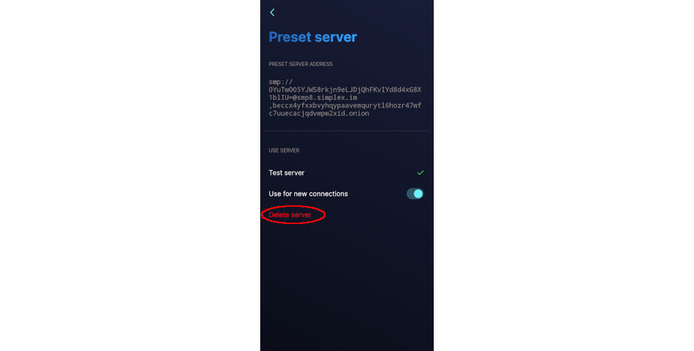
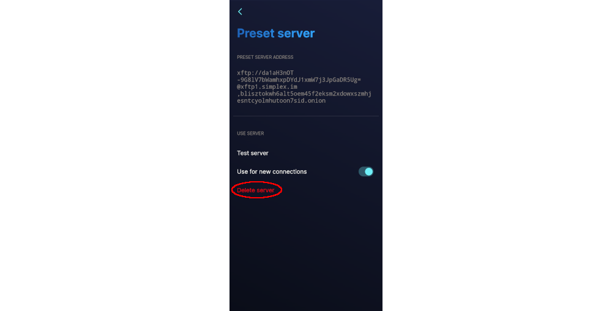

# **Remote Hosting SimpleX Servers**

```
TLDR: You can host and use your own clearnet SimpleX Servers remotely on VPSes.
```


Before diving into server hosting i will suggest going over the simplex client tutorial [post](../privatesimplex/index.md):

### Requirements

- A VPS running the latest Debian OS
- A domain name (or subdomain) 

To start, we will need a domain name. A subdomain such as a free one obtained from **https://freedns.afraid.org** will also work. Create A record entries for smp.yourdomain.tld and xftp.yourdomain.tld and point them at the IP address of your VPS. 


We will SSH into our VPS and set up our environment. 
    
    
    ~ ❯ torsocks ssh root@145.223.79.150
    The authenticity of host '145.223.79.150 (145.223.79.150)' can't be established.
    ED25519 key fingerprint is SHA256:AGZHyLpidaSu+ZE3cLFZ3KWxQq3Mx9rDH+HLVNF/okc.
    This key is not known by any other names.
    Are you sure you want to continue connecting (yes/no/[fingerprint])? yes
    Warning: Permanently added '145.223.79.150' (ED25519) to the list of known hosts.
    root@145.223.79.150's password:
    Linux srv636770 6.1.0-26-cloud-amd64 #1 SMP PREEMPT_DYNAMIC Debian 6.1.112-1 (2024-09-30) x86_64
    
    The programs included with the Debian GNU/Linux system are free software;
    the exact distribution terms for each program are described in the
    individual files in /usr/share/doc/*/copyright.
    
    Debian GNU/Linux comes with ABSOLUTELY NO WARRANTY, to the extent
    permitted by applicable law.
    Last login: Wed Nov 20 21:05:02 2024 from 185.220.101.103
    root@srv636770:~#
    
    

Once connected, we will follow the [official instructions](https://docs.docker.com/engine/install/debian/) to install Docker. Run: 
    
    
    # Add Docker's official GPG key:
    apt update
    apt install -y ca-certificates curl gnupg openssl vim
    install -m 0755 -d /etc/apt/keyrings
    curl -fsSL https://download.docker.com/linux/debian/gpg | gpg --dearmor -o /etc/apt/keyrings/docker.gpg
    chmod a+r /etc/apt/keyrings/docker.gpg
    
    # Add the repository to Apt sources:
    echo \
    "deb [arch="$(dpkg --print-architecture)" signed-by=/etc/apt/keyrings/docker.gpg] https://download.docker.com/linux/debian \
    "$(. /etc/os-release && echo "$VERSION_CODENAME")" stable" | \
    tee /etc/apt/sources.list.d/docker.list > /dev/null
    apt update
    
    

With the Docker apt repositories out of the way, install the Docker packages: 
    
    
    apt install -y docker-ce docker-ce-cli containerd.io docker-buildx-plugin docker-compose-plugin
    
    

OPTIONAL: You can test everything is working up to this point by a deploying a test container to see some output. Run: 
    
    
    docker run hello-world
    
    

We will now set up a docker-compose.yml file with all the build instructions: 
    
    
    vim docker-compose.yml
    
    

Copy/paste the following and change the **ADDR** fields to your domain.   
HINT: It's **p** to paste in vim, then **ESC :wq** to write changes and quit the file. 
    
    
    networks:
      simplex:
    
    services:
      simplex-smp-server:
        image: simplexchat/smp-server:v6.0.6
        container_name: simplex-smp
        restart: unless-stopped
        ports:
          - "5223:5223" 
        volumes:
          - ./simplex/smp/config:/etc/opt/simplex:Z
          - ./simplex/smp/logs:/var/opt/simplex:Z
        environment:
          - ADDR=smp.xmronly.us.to
    #     - PASS=${SIMPLEX_PASSWORD} #for non public servers
        networks:
          - simplex
        security_opt:
          - no-new-privileges:true
        cap_drop:
          - ALL
    
      simplex-xftp-server:
        image: simplexchat/xftp-server:v6.1.3
        container_name: simplex-xftp
        ports:
          - "443:443" 
        restart: unless-stopped
        volumes:
          - ./simplex/xftp/config:/etc/opt/simplex-xftp:Z
          - ./simplex/xftp/logs:/var/opt/simplex-xftp:Z
          - ./simplex/xftp/files:/srv/xftp:X
        environment:
          - ADDR=xftp.xmronly.us.to
          - QUOTA=10gb #change to set your own quota
        networks:
          - simplex
        security_opt:
          - no-new-privileges:true
        cap_drop:
          - ALL
    
    

A note about versioning: at the time of writing, there was an open [issue](https://github.com/simplex-chat/simplexmq/issues/1373) with the "latest" (v6.1.3) tag and HTTPS credentials for the SMP server. The most recent working version for the SMP server (v6.0.6) was definitively tagged here and the "latest" version for XFTP server (v6.1.3) was also definitively tagged to ensure working builds with the presented instructions. For reference, the "latest" version used in the [HackLiberty](https://forum.hackliberty.org/t/simplex-server-docker-installation-guide-smp-xftp/140) documentation for June 1st, 2024 is v5.8.0-beta.6 which is now several security fixes behind. 

Everything is now ready to be deployed. Run: 
    
    
    docker compose up -d
    
    

Run the following command to see the SMP and XFTP server addresses: 
    
    
    echo "smp://$(<simplex/smp/config/fingerprint)@$(awk -F '=' '/ADDR=/ {print $2}' docker-compose.yml | head -1)" && \
    echo "xftp://$(<simplex/xftp/config/fingerprint)@$(awk -F '=' '/ADDR=/ {print $2}' docker-compose.yml | tail -1)"
    
    

You should see output similar to this and just like that your self-hosted SimpleX servers are now ready! 
    
    
    smp://IB2NJl4Pv3OSLUmnvipKkCuJKGkEDfgUNkYFiKIH_GY=@smp.xmronly.us.to
    xftp://t_H_I_h5Iz7X-ChxA3nJeyw0s_2PJIFkfSK7Ng6UulU=@xftp.xmronly.us.to
    
    

## **Adding Your Self-Hosted SimpleX Servers**

To add the newly created self-hosted SimpleX servers to your client, click on your profile on the top left, followed by Settings. Click on Network & servers. We will modify both the Message servers (SMP) and the Media & file servers (XFTP). 


Click on **Message servers** and scroll down to Add server. Select Enter server manually. Paste in your SMP server address from above, click Test server and receive a green check mark. Finally, tick Use for new connections. 


With our self-hosted SMP server set, it's time to remove the default SimpleX servers. Click on each of the presets, then click Delete server. 



With only our self-hosted SMP server remaining, click the back arrow, then save changes. 


We will now repeat the process for **Media & file servers**. Scroll down to Add server. Select Enter server manually. Paste in your XFTP server address from above, click Test server and receive a green check mark. Finally, tick Use for new connections. 


With our self-hosted XFTP server set, it's time to remove the default SimpleX servers. Click on each of the presets, then click Delete server. 



With only our self-hosted XFTP server remaining, click the back arrow, then save changes. 


It is possible to self-host onion servers as well, but since this article is focusing on privacy and not anonymity, that part of the setup has been omitted. 

## **Using Your Self-Hosted SimpleX Servers**

All new connections will automatically use your self-hosted SimpleX servers, but what about already existing connections that were made using the default Simplex servers? It turns out existing connections do not automatically update, so we will need to manually change them. Click on the group name and scroll down to the members section. Click on a group member and scroll down to servers. We can see that Larry is using the default SimpleX servers. Click on Change receiving address and confirm the change. 

Repeat the process for Sam and you have now configured the group chat to use your self-hosted servers! 

You can confirm this by clicking on the group chat name and clicking on any of the members. 

## **Conclusion**

Now after creating your own server, you can feel safe and know that your data is saved but no other than you, you are one step close to invisibility, keep going! and don't forget 

### **Be wary!, Be Paranoid!, Be Invisible!**