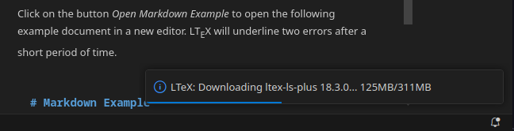
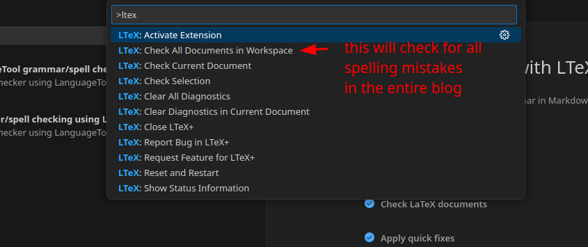

# The Quality Standard 

```
TLDR: Because we're supposed to make it easier for the masses to grasp Opsec concepts. If you can't make it simple for the average joe to understand how to get Opsec, you're not welcome on The Opsec Bible.
```

## Why is there a quality standard ?

Because we want our tutorials to be accessible to everyone, even the non-tech-savvy people. The Opsec Bible is supposed to enable everyone to be taken from the ABC of opsec, all the way to the XYZ of opsec, without ever skipping steps. We are here to take the hand of those that are willing to learn, and successfully take them to the summit of mount opsec.

Let me show you a bad example (even though i have alot of respect for Mikoyan Gurevich for administrating pitch and his other dnm pentesting activities):


This is first of all, a wall of text. No opsec noob on planet earth will ever read it or get it. There are no graphs to make it easy for the reader to get the concepts, and while there are parts of the Why and the what (explaining why this is important, and what is the solution), the How is completely missing.

There are no steps showcased to achieve the setup he's talking about. With blogposts like these, you are telling your audience "i'm lazy to explain it, go figure it out", you are neither helping the noobs out there, nor helping the geeks out there either because those are competent enough to figure it out without your help.

In conclusion, this is an useless blogpost, you're just showing that you understood some concepts, and that's it.

**The goal of writing opsec blogposts is that you're turning something complex into something simple for your audience.** The best teachers out there find ways to SIMPLIFY the complexity that they went through, the lousier the teacher you are, the more complex you make things out to be, because you suck at explaining things properly.

If you explain things properly, with the correct structure, and showcase everything from step A to step Z, there can be no room for misunderstandings. **Essentially, you're here to turn something that seems complex, into something simple.** If you can't do that, you cannot be welcomed as an opsec bible contributor, we expect to see proper writing skills.

**The number one priority for ANY opsec bible blogpost is to be crystal clear from beginning to end.** You are expected to make it easy for our audience to understand concepts and achieve setups, no matter how complex they are.

Yes it requires additional effort from your part to explain and showcase things properly, and we don't care, **you are expected to go the extra mile for our audience, otherwise you'll always remain mediocre like the vast majority of the lazy opsec blogposters out there**, we won't accept your contribution until you follow our quality standard as explained below.

## Introduction

In this tutorial we're going to look at what the quality standard is, to be able to submit good quality tutorials to the blog. **We do not consider tutorials that don't follow that standard to be acceptable.**


In order to make sure the content isn't rushed and the quality of the blog overall remains high, we have the following quality standard:


Rather than writing a gigantic wall of text and lose you halfway, as you can see i made a graph. **SO MAKE GRAPHS**. **Making a Graph is the most effective way of conveying your ideas to your audience**, so don't hesitate to make colorful graphs using drawio (with colors preferably) instead of writing walls of text that nobody will read.

First of all, the general structure of the content is with the **Why / What / How methodology** This following the minimalistic style where everything that is used and mentionned must be justified. (Everything that has no justification to be there, is to simply be removed.)

  1. **Why should I care ? In which context ?**


  2. **What is the solution ?**


  3. **How can i implement it ?**


Nobody cares about your message until you tell them **why they should care.** Usually that goes by giving the context and telling them a short story that they can relate to, in our case it's an opsec scenario that explains what an adversary can do against you.

**The blog is structured around 3 core scenarios:**

  1. Privacy: The adversary can see you do something, how can you prevent it ?

  2. Anonymity: The adversary knows that it's you who did it, how can you prevent it ?

  3. Deniability: The adversary busts down your door, and forces you to open your devices, how can you make sure he doesn't find anything in there ?


**WARNING:**
If the scenario of your contribution doesn't fit into (or serve a purpose for) one of those 3, it's most likely [off-topic](../offtopic/index.md).
  
    
    Context: In your house, in your bedroom, if there are windows to look outside
    Situation: the annoying neighbor always stops by to look at what you're doing in your bedroom
    Are you ok with this situation ?
    
    

So you told your story to highlight the problem, the reader understands that they want privacy. Now you need to tell them the what, **what are their options ?**
    
    
    You have a few options to prevent your annoying neighbor from seeing what you're doing in your bedroom:
    1) get rid of all windows and have a house with only walls : expensive
    2) install curtains on your windows : inexpensive
    
    

Now that you laid out the Why, you of course tell them what the best option is, and then you're going to tell them **how they can implement it.**
    
    
    Let's showcase how to install curtains, as it's the easiest and cheapest solution to prevent outsiders from seeing what you're doing in your bedroom.
    
    1) buy it, 
    2) then you attach it above your windows, using screws and screwing it into the wall, (warning, if you're living in an apartment, ask for your landlord's permission!)
    3) then you can move the curtain to prevent outsiders from peeking in
    
    
## The modular design of The Opsec Bible's tutorials

To ensure we convey (often complex) knowledge in the most efficient way to our audience, I designed the opsec bible's tutorials to be as modular as possible. We carefully determine the scope of each issue/tutorial exactly for that purpose, for instance the following 3 tutorials:

- [Installing Kicksecure as a host OS](../linux/index.md)
- [setting up the QEMU hypervisor](../hypervisorsetup/)
- [setting up the anonymous VM](../whonixqemuvms/index.md)

The order by which we list each tutorial on the left navbar is intentional, because one may require the other right? TO be able to setup your whonix VMs, you need the hypervisor setup, and for the hypervisor setup you need the host OS to be installed first.


Every colored rectangle on this graph is a tutorial we wrote. **Our tutorials are inter-dependant by design**, that way if any piece of the puzzle were to change, we don't have to change that part of the setup on 999 tutorials, **but instead we just need to change it on ONE tutorial.** That means that one tutorial may be reused as a requirement for one or more tutorials later down the road.

For instance here's a tutorial that depends on quite a few of our other tutorials:

- the [Critical Sensitive Backup Procedure tutorial](../plausiblydeniabledataprotection/index.md) depends on:
    - the [Deniable VPS renting tutorial](../vps-deniability/index.md) which depends on:
        - the [Anonymous VPS renting tutorial](../anonymousremoteserver/index.md) which depends on:
            - [Sensitive VM tutorial](../sensitivevm/index.md) which depends on :
                - the [veracrypt](../veracrypt/index.md) tutorial which depends on :
                    - the [live mode](../livemode/index.md) tutorial which depends on :
                        - the [Kicksecure Host OS](../linux/index.md) tutorial which depends on:
                            - the [tutorial on why you can't trust closed-source software](../closedsource/index.md)

the purpose behind that design is that you don't need to re-write everything from scratch when you want to try and reach for the stars of the opsec-verse, you can just reuse the tutorials we already wrote like building blocks to build your own tower of babel. Don't hesitate to quote other tutorials whenever you can like [in this one](../stancesensitive/index.md) where i go over our main deniability tutorials we already covered, this is to make sure the readers jump from one tutorial to the other and ensure that their minds link one set of knowledge to the other, as that's what a true knowledge base is supposed be doing (see the concept of [second brains](https://fortelabs.com/blog/basboverview/)).

## Our stance on AI

In the recent months, we saw an influx of contributors using LLMs to write their blogposts. While we have blog entries on [using AI privately](../openwebuilocalllms/index.md), we are not okay with people contributing LLM generated content without much work put into it. It is not fair to the contributors who wrote all the contents themselves. 

If the reviewer notices you trying to contribute obviously AI generated slop, they may ask to **rewrite of entire tutorial** or **reject your contribution altogether**.

We want to **preserve as much quality** as possible and so far, AI generated blog posts had noticeably worse quality.

You can of course use AI for research, pre-review or spell checking, but **you are expected to write the entirety of your blogpost by hand, we will NOT accept any AI-generated blogpost. If we find any, we'll ask you to rewrite those parts by hand. We will not tolerate laziness when it comes to writing blogposts.**


### Stylometry

The only purpose you *may* submit LLM generated text when contributing is for [stylometry protection](../stylometry/index.md). Even that has to be subtle and not noticeable to the reader.

For example, using unicode characters instead of regular ones for common characters (like dashes, quotes, apostrophes) is a dead giveaway:


The style must sound organic and interesting, without unnecessary [gibberish](https://en.wikipedia.org/wiki/Gibberish).

## the TLDR at the top (too long didn't read)

There's also a reason we now add a TLDR at the top of every blogpost, you should be able to summarize the entire blogpost in one or 2 sentences, that **makes sure that every speed reader out there can immediately get the message without even reading the rest of the blogpost, leaving no room for misunderstandings.**

The opsec bible is huge in content, and yet i summarized it in one sentence:

```
TLDR: You're already ungovernable, you just didn't realize it yet.
```

To the uneducated mind it may sound bold and unrealistic, and yet we digged down that rabbithole i think unlike any other. That's the goal, and that's what we're here to achieve.

Now each tutorial has a defined scope, so for example if you were to write the tutorial on how to install the Host OS, you have the following TLDR:

```
TLDR: you can achieve privacy by installing linux as the Host Operating system
```

One sentence to make sure they get the gist of the tutorial. This is the one thing they need to remember, keep it simple.


## Walls of text

As we mentioned before, the blog posts should contain graphs and images illustrating the topic. **No one wants to read a wall of text without any visuals.**


You should also **HIGHLIGHT important parts** using the `<b> </b>` tags of your text so that the reader's eye is immediately drawn to what matters most.

If you have trouble fixing the wall of text issue, please read the [how to make useful graphs](#how-to-make-opsec-analysis-graphs) section.


## Irrelevant images

When usually want you to submit images to help visualize stuff you're talking about. If you add out of context memes or low effort images in general, the reviewer will ask you to change that.


If the rest of images are illustrative and relevant to the topic discussed, you may add a few memes - **only if they are relevant**.

### AI generated images

AI generated images will be considered irrelevant too unless they fit the topic well and there are no visual issues.


## References and links

You should link to our other blog posts wherever possible. So for example when you're talking about GrapheneOS, you should add a link like: `[../graphene/index.md](GrapheneOS)`.

If you are not sure if we have an article on the topic, just use search on the blog:


If there are no blog posts on the topic you want to link to, it's recommended to link to external resources where the reader can verify your information and read more about it.

Generally, the more references your blog post contains the better. We don't want to have a blog without any point of reference. There may be some exceptions but generally the reader should be able to easily verify what we're saying here is true.


## How to make Opsec Analysis Graphs

In this part we're going to cover how to make operational analysis graphs in [draw.io](../../productivity/graphs/index.md) like i've been doing up until now. **MAKE THOSE OPSEC GRAPHS INSTEAD OF WALLS OF TEXT THAT NOBODY WILL READ!**

### The 3 required parts of an Opsec analyis graph

In your opsec analysis graph, you need 3 things:

1) **The parties involved**: Essentially you need to represent who's the protagonist, and who's the antagonist. (Ex: You, the ISP provider, the Authorities, the cloud provider, the microsoft corporation) 

To represent those, you can use the people icons in drawio:


2) **The Components involved**: Essentially you need to represents the different moving parts of one's operational security, those can range from the hardware that is being used, to the software being used, to the connections in between each of those (Ex: your laptop, your hypervisor, your VMs, the VPS server, the home router, the software that you use, etc)

To represent those you can reuse the clipart networking, computing and general shapes logos:


3) **Operational Security Logos**: Essentially you need to represent where there is privacy, where there is none, where there is anonymity, and where there is none, where there is deniability and where there is none.

To represent those you can import the opsec logos that i designed myself, that are stored in the special [opsec-blogposts/logos](http://gdatura24gtdy23lxd7ht3xzx6mi7mdlkabpvuefhrjn4t5jduviw5ad.onion/nihilist/opsec-blogposts/src/branch/main/logos) folder:


### Opsec Graphs Examples

As you can see below, here's a few examples opsec analysis graphs that has all 3 required parts:

#### Privacy Opsec graph example


  In this example, on the left we have a self-hosted homeserver, because it is hosted at your own home, you're the only one that can have physical access to it.

  In the middle, we have a remote server (VPS), and because it is not fully in your control, due to being a remote server in someone else's physical control (the cloud provider's control), privacy is non-existant, the VPS is under surveillance.

 And lastly on the right we have the end user's laptop accessing the self-hosted clearnet website, and thanks to the reverse nginx proxy in between on the VPS, you are effectively hiding your home server's public IP from your end users, preserving privacy on that end.


#### Anonymity Opsec graph example


 In this example we have a lack of anonymity on half of the setup: 

1) on the ISP level, you signed up for your internet connection using your real name, therefore the **ISP knows who you are.** 
2) And on the VPN level, you are directly connecting to the VPN from your home IP, **which reveals to the VPN provider where you live**.

 However on the other half of this tutorial, we achieve Anonymity on the destination website thanks to Tor's decentralised 3-hop mechanism. Which hides our real identity from the destination website administrator.

#### Deniability Opsec graph example


 In this example, we have all 3 opsec logos at once:
the public use VM has surveillance, the private use VM has privacy, the anonymous VM has both privacy and anonymity, **BUT, none of them have deniability, because they are not stored on a veracrypt hidden volume** 

 Therefore as described in the graph, the only place where there is deniability is within the sensitive use VM, **because it sits inside of a veracrypt hidden volume, whose very existance can be denied**


## The Todolist structure


But the thing is, we're not lazy blogwriters here, **talking about the path is not enough, you are expected to show the readers how you walk that path.** This is why the todolists for new blogposts are structured like so:
    
    
    to be explained: (WHY + WHAT)
    -
    -
    -
    
    to be showcased: (HOW)
    -
    -
    -
    -
    
    

In the first part usually there is the to be explained section, where you tell the user why they should care, and what their options are, but afterward there usually is the "to be showcased" part. **In that part, you are expected to do a step-by-step tutorial of how to implement the solution** which means that you are literally implementing the solution yourself, for yourself, but showing everyone how you're doing it.

Let's take a small todolist that is as follows:
    
    
    to be showcased:
    1) Download grapheneOS (GUI digital step)
    2) Reboot the phone (Physical step)
    3) flash graphene OS on the phone (CLI digital step)
    
    


Here we have a combination of the 3 possible types of steps you may be expected to showcase, a physical step, a GUI digital step, and a CLI digital step.

The first step being a GUI digital step, you need to take a screenshot with arrows, to make it simple i recommend using flameshot like i explained above, to have screenshots like that:


In the case of the physical step, you need to take a picture, and add arrows in it if needed, like so:


While editing the html file it will look like that (as you need to put the picture in the same folder as the tutorial you're editing):
    
    
    

If you want to reuse an image from another tutorial like i just did above (it's totally fine), but rather than copying the image from another tutorial and waste diskspace, you can simply reuse the image of another tutorial by adding ../tutorialfolder/ before the path of the image like so:

    

and lastly if you have a CLI step to show, you need to simply copy paste the terminal output in the code blocks while still highlighting what's important like so:
    
    
    
    nowhere#./flash-all.sh
    Warning: skip copying bootloader_a image avb footer (bootloader_a partition size: 0, bootloader_a image size: 14125140).
    Sending 'bootloader_a' (13794 KB)                  OKAY [  0.364s]
    Writing 'bootloader_a'                             (bootloader) Flashing pack version slider-14.5-11677881
    (bootloader) flashing platform gs101
    (bootloader) Validating partition ufs
    (bootloader) Validating partition partition:0
    
    [...]
    
    OKAY [  3.089s]
    Finished. Total time: 3.454s
    Setting current slot to 'a'                        OKAY [  0.058s]
    Finished. Total time: 0.059s
    Rebooting into bootloader                          OKAY [  0.000s]
    
    [...]
    
    Sending sparse 'super' 11/13 (254972 KB)           OKAY [  6.618s]
    Writing 'super'                                    OKAY [  0.950s]
    Sending sparse 'super' 12/13 (254972 KB)           OKAY [  6.621s]
    Writing 'super'                                    OKAY [  0.935s]
    Sending sparse 'super' 13/13 (46284 KB)            OKAY [  1.216s]
    Writing 'super'                                    OKAY [  0.204s]
    Erasing 'userdata'                                 OKAY [  0.390s]
    Erase successful, but not automatically formatting.
    File system type raw not supported.
    wipe task partition not found: cache
    Erasing 'metadata'                                 OKAY [  0.007s]
    Erase successful, but not automatically formatting.
    File system type raw not supported.
    Finished. Total time: 105.929s
    Rebooting into bootloader                          OKAY [  0.000s]
    **Finished. Total time: 0.150s**
    nowhere#
    

If there are parts of the commandline output that don't matter, just replace them with [...] in order to stick to what the user needs to see.


## Minimizing spelling mistakes

If you are someone that makes alot of spelling and grammar mistakes (like me, i know i'm guilty of that aswell), use LTEX+'s addon on vscodium (which is the FOSS version of vscode), it will setup a local LLM that will find your grammar and spelling mistakes:
    
    
    wget -qO - https://gitlab.com/paulcarroty/vscodium-deb-rpm-repo/raw/master/pub.gpg \
        | gpg --dearmor \
        | sudo dd of=/usr/share/keyrings/vscodium-archive-keyring.gpg
    
    echo 'deb [ signed-by=/usr/share/keyrings/vscodium-archive-keyring.gpg ] https://download.vscodium.com/debs vscodium main' \
        | sudo tee /etc/apt/sources.list.d/vscodium.list
    
    sudo apt update && sudo apt install codium
    
    

  
 
  
 
  
 
  
 
  
 
  
 
  
 
  
 
  
 
 

Now using this addon you can find your typos more easily (as it highlights them for you), effectively helping you find and fix them, so if english isn't your first language **definitely make sure that you run LTEX+ once after you finished writing your article, so that you don't leave spelling mistakes behind.**

**DISCLAIMER: a blogpost is NOT complete until it follows this quality standard** , if you find one that doesn't meet those requirements, do mention it on their [Forgejo issue](http://gdatura24gtdy23lxd7ht3xzx6mi7mdlkabpvuefhrjn4t5jduviw5ad.onion/nihilist/the-opsec-bible/projects/1) or ping me directly about it on SimpleX.

Same thing if you want to contribute a blogpost that does not meet these quality requirements, **_we do not care, it is NOT finished until it meets those requirements._** Do not be suprised if we refuse your blog contribution for weeks on end if it doesn't meet the quality requirements. It may take a little more time to do things properly, but at least you're not lowering the quality of the overall blog by following it.


## BONUS: Explaining complex concepts using Analogies / Allegories

I'm sure you've seen me using those extensively, but let me give you a totally unrelated example to explain how it's done:

Suppose you have a complex concept to explain to people such as a **Capitalist Society**, how do you go about it ? Do you make a wall of text ? do you make a huge graph to explain the concept visually ?

There's a simpler way, **you make analogies and allegories**, that's exactly what the Squid Game series masterfully did:

Capitalism is first introduced to you using a harmless game: 


It's a small game, If you play, you can win some money, if you lose you get a little slap on the cheek. 


Once you win, you're then you're presented with the opportunity to make more money, **if you accept to participate in another game you know nothing about.** Hey what could go wrong ?


You accept, and you get kidnapped into a place that looks like it's full of innocent childish games, you're simply told that if you lose a game you get "eliminated", but alright **you go on and accept to play an innocent-looking "red light green light" game with everyone else**:


And then Mid-game you realize that if you get "eliminated" in this game, it means that you literally get killed (**The parallel here is that IRL it would mean taking taking risks for profit, and if you lose, you end up a homeless beggar on the streets, left to die**):


Now almost half of the initial participants got eliminated in this game, nobody would want to continue right ? **Thing is, after you manage to finish the game, you're now being told that you can earn way more money, now that so many players were eliminated:**


Of course the participants need to be reminded of their voluntary participation in the games, to do so, **they get to freely and democratically vote to either continue (meaning to risk their lives to earn more money) or to stop playing the games and leave with that amount of money.**


A side effect of this democratic system that it divides to divide the participants into 2 groups: Those that want to continue and those that want to stop. **Thing is, all participants were chosen from the start, they're all all in serious debt.**

They all desperately need more money, so of course there will always be a very small percentage of participants voting to stop the games. As such, in this place, every participant is essentially a gambler, gambling with their own lives.


Also, since this is a democratic process, **that means you can't escape from playing these deadly games unless if the majority agrees to stop the games.** And of course it almost never happens, so you're anyway forced to keep going to the end. The previous game's losers don't get to vote again since they all died while the game took place, too bad for you.


The games are increasingly more cruel and unfair by design. The IRL parallel here is that the winners of the previous game have corrupted the ones in power to add laws (rules) to make the game either extremely unfair or unecessarily complex, or unecessarily lethal for those that try to play the same game that they played. **The sole purpose of those unjust rules is ensuring that only a very select few people can effectively remain at the top of the capitalism game, at the expense of everyone else.** The winners exist because of the losers, the winners NEED people to loose, to remain at the top of the food chain.

The games get increasingly more deadly, but the reward keeps growing, it's getting more and more rewarding to keep playing right ? **With such a huge potential reward, every death that occured along the way isn't important anymore, only the growing piggy bank matters.**


The more people die, the more money you get, the greater the risk, the greater the reward.


And of course **those that dare to defy the democratically-elected choice of the masses, by revolting against the system are met with brutal force and are made an example of, to deter the rest of the participants to attempt doing the same thing**:


To facilitate the enforcement of the rules of the system, the enforcers of the system need a few things in place. First of all the enforcers of the system have the privilege of retaining their own anonymity  to be able to keep operating without any repercussions in case if players want to stop the game:


While it is not the case for the players   as they need to identify everyone to better keep track of the progress of the game. The parallel here is the IRL phones and simcards tracking where everyone is, identifying them by their [phone number](../phonenumbers/index.md):


 Then they need cameras everywhere (mass surveillance) to know what everyone's doing, for all players:


 And the same is true for all enforcers, because one slip up for them also results in immediate death:


Essentially the enforcers are also being exploited. **The only difference is that the enforcers are after profit in exchange of obedience**, rather than chasing profit by gambling with their own lives like the players do.


But why are those games even being held at all ? There's a third essential piece to the puzzle: the VIPs. (IRL those would either be our elected officials which dictate the rules of the game, or the richest ones that won the capitalist game, that have enough money to corrupt those officials.)


The games are being held for the pleasure of the VIPs, **who are also gamblers, just like the rest of the participants.** The only difference is that they already won the capitalism game, **they are not here to gamble with their own lives, but with the lives of others**. They place bets on who's going to survive and they enjoy watching the players kill each other to try and get more money themselves.


They're Essentially gambling on which piece will remain on the chess board, except that the pieces are people, which are all struggling to survive, while being incentivized to kill each other, masquerading as a game that they are all voluntarily playing, despite having been manipulated into playing it, to avoid dying on the streets.


And at the end of the day, **the creators justify the game's existance by the choices that the players made along the way, they all agreed to participate in each game,** despite them designing the game in such a way that everyone is incentivized (and forced to) to kill each other for their own survival and profit.

And that's it! Now that was a very extensive allegory of capitalistic society but you get the idea, don't hesitate to make allegories and analogies to simplify the most complex concepts for the audience if you feel like it's needed.