# How to run the Opsec Bible Yourself 

```
TLDR: Anyone can run an instance of the opsec bible, to ensure that opsec knowledge remains accessible even if the main instance were to get taken down.
```

## **Why are you letting me run instances of the opsec bible ?**

As you have probably noticed after looking at the footer of any of the blogposts in this blog, they are all licensed under the public domain license. This means that there is no copyright restrictions at all, it is free for all, forever.

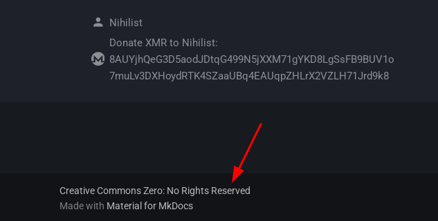

The reason behind this stems from [Sum Nihil](../../productivity/sum-nihil/index.md), where i strongly believe that it doesn't matter who does the work, who gets the fame, who gets to profit off of it, **what truly matters is that the work gets done** , no matter who does it.

Here, **the work is to make sure that everyone out there knows that when using the right technology in the right way, they cannot be oppressed, silenced, censored, controlled, and governed anymore.** If you can help me reach that goal i'm definitely going to welcome it, even if it means to allow other people to run the blog.

The entire blog is meant to remain available for free, for everyone, over clearnet and over the Tor network. Ideally i'd like it to be resillient to takedowns in the case if something were to happen to me in the future. **Therefore, the more people run the blog themselves, the more resillient it will become, and the farther the word will be able to go out there.**


## **How to run an instance of the Blog**

Now if you are interested in helping me get the word accross, you can run the blog yourself like so:

On a debian server (VPS or not) with [docker installed](../docker-intro/index.md#installation):
    
```
[ Wonderland ] [ /dev/pts/4 ] [~]
→ cd /srv/

[ Wonderland ] [ /dev/pts/4 ] [/srv]
→ torsocks git clone http://gdatura24gtdy23lxd7ht3xzx6mi7mdlkabpvuefhrjn4t5jduviw5ad.onion/nihilist/blog-deploy

[ Wonderland ] [ /dev/pts/4 ] [~]
→ cd blog-deploy

[ Wonderland ] [ /dev/pts/4 ] [/srv/blog-deploy]
→ cat docker-compose.yml
services:
  blogmk-puller:
    image: alpine:latest
    container_name: blogmk_puller
    env_file:
      - .env
    volumes:
      - ./repo:/repo
      - ./servable:/servable
      - ./entry.sh:/entry.sh:ro
    extra_hosts:
      - "host.docker.internal:host-gateway"
    entrypoint: ["sh", "/entry.sh"]
    network_mode: "host"
    restart: unless-stopped

  blogmk-server:
    image: nginx:alpine
    container_name: blogmk_server
    volumes:
      - ./nginx.conf:/etc/nginx/sites-enabled/default:ro
      - ./servable:/usr/share/nginx/html:ro
    ports:
      - "127.0.0.1:7080:80"
    restart: unless-stopped
```

Now create `.env` file which holds environment variables related to your mirror configuration. Adjust as needed. Usually you only need to change `SITE_URL` to the onion url of your mirror.

```sh
[ Wonderland ] [ /dev/pts/4 ] [/srv/blog-deploy]
→ cat .env
SITE_URL=http://yourblogmirrorurl.onion
BRANCH=main
REPO_URL=http://gdatura24gtdy23lxd7ht3xzx6mi7mdlkabpvuefhrjn4t5jduviw5ad.onion/nihilist/the-opsec-bible
REFRESH_SEC=900
```

```sh

[ Wonderland ] [ /dev/pts/4 ] [/srv/blog-deploy]
→ docker compose up -d
[+] Running 2/0
 ✔ Container blogmk_server  Running                                                                                                                                                                                                                                                                                       0.0s
 ✔ Container blogmk_puller  Running    
```

From there, the blog will start to git clone the [the-opsec-bible](http://gdatura24gtdy23lxd7ht3xzx6mi7mdlkabpvuefhrjn4t5jduviw5ad.onion/nihilist/the-opsec-bible) repository and the submodules containing the opsec, productivity, selfhosting and hacking blogposts.


give it some time to git clone it, as it's rather massive to download through Tor.

Afterward however, the blog will be reachable via the local port 7080 on the server, so you can make the following reverse nginx proxy config to make sure that it is reachable via a .onion mirror:

```sh
[ Wonderland ] [ /dev/pts/4 ] [/srv/blog-deploy]
→ vim /etc/nginx/sites-available/blog.conf

[ Wonderland ] [ /dev/pts/23 ] [~]
→ ln -s /etc/nginx/sites-available/blog.conf /etc/nginx/sites-enabled/

[ Wonderland ] [ /dev/pts/4 ] [/srv/blog-deploy]
→ cat /etc/nginx/sites-available/blog.conf
upstream blogbackend {
        server 127.0.0.1:7080;
}


server {
        listen 4443;
        listen [::]:4443;
        server_name opbible7nans45sg33cbyeiwqmlp5fu7lklu6jd6f3mivrjeqadco5yd.onion;

        gzip on;
        gzip_types text/plain text/css application/json application/javascript text/xml application/xml application/xml+rss text/javascript;
        gzip_vary on;
        gzip_proxied any;
        gzip_comp_level 6;
        gzip_buffers 16 8k;
        gzip_http_version 1.1;

        location / {
                proxy_pass http://blogbackend;
                proxy_http_version 1.1;
                proxy_set_header Upgrade $http_upgrade;
                proxy_set_header Connection "Upgrade";
        }
}

[ Wonderland ] [ /dev/pts/4 ] [/srv/blog-deploy]
→ systemctl restart nginx

[ Wonderland ] [ /dev/pts/4 ] [/srv/blog-deploy]
→ nginx -t
2025/05/08 21:08:41 [info] 359817#359817: Using 116KiB of shared memory for nchan in /etc/nginx/nginx.conf:61
2025/05/08 21:08:41 [info] 359817#359817: Using 131072KiB of shared memory for nchan in /etc/nginx/nginx.conf:61
nginx: the configuration file /etc/nginx/nginx.conf syntax is ok
nginx: configuration file /etc/nginx/nginx.conf test is successful

[ Wonderland ] [ /dev/pts/4 ] [/srv/blog-deploy]
→ nginx -s reload
```

From there you just need to make sure that the website is reachable via it's onion mirror: (for more details on how to run hidden services with custom .onion vanity v3 domains, check out [this tutorial](../torwebsite/index.md))

```sh
[ Wonderland ] [ /dev/pts/4 ] [/srv/blog-deploy]
→ cat /etc/tor/torrc
HiddenServiceDir /var/lib/tor/onions/nowherejezfoltodf4jiyl6r56jnzintap5vyjlia7fkirfsnfizflqd.onion/
HiddenServicePort 80 127.0.0.1:4443

[ Wonderland ] [ /dev/pts/4 ] [/srv/blog-deploy]
→ systemctl restart tor@default
```
and then just check if you can reach it:


## **Setting up Collaboration**

Now if you want to make sure the blog content keeps growing, you'll need to either write your own blogposts in it or setup collaboration:

Now in order to make sure you can welcome external contributions, you need at least to be able to have a forgejo instance like the one i run [here](http://gdatura24gtdy23lxd7ht3xzx6mi7mdlkabpvuefhrjn4t5jduviw5ad.onion/):

 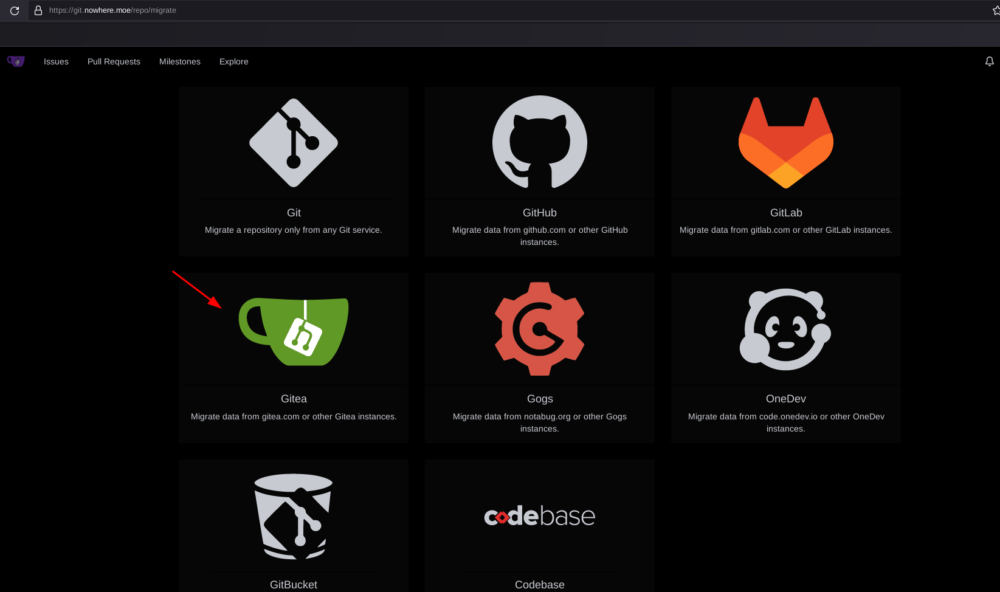 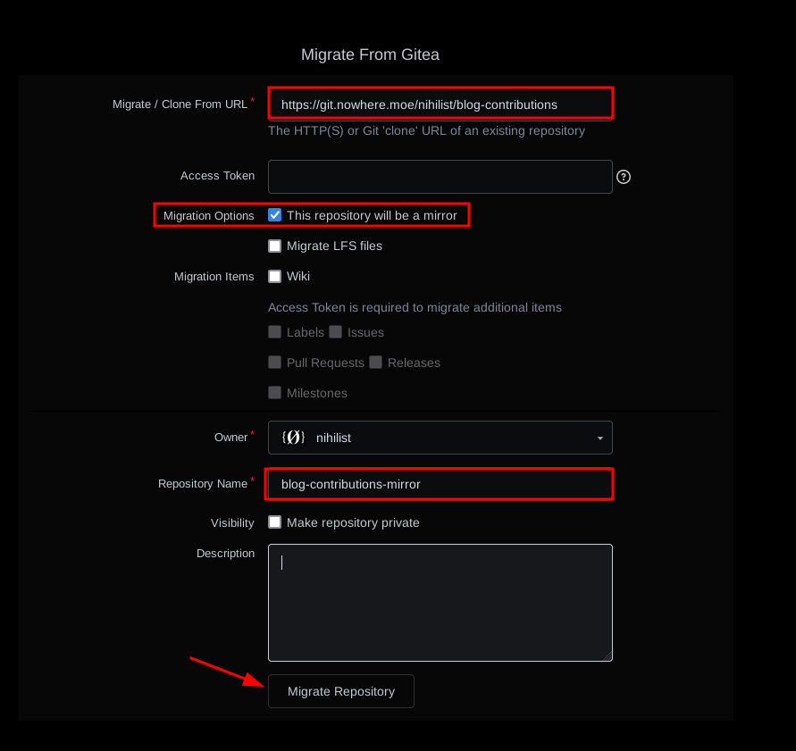 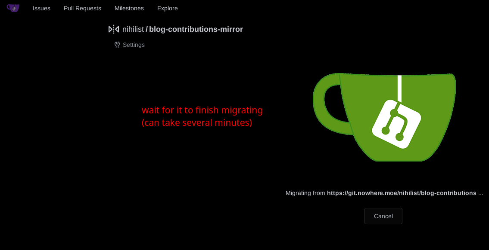 

Now here you have a simple mirror git repo of the blog, once a day it will synchronize the new changes onto your mirror which is always useful to have in case if the [main repository](http://gdatura24gtdy23lxd7ht3xzx6mi7mdlkabpvuefhrjn4t5jduviw5ad.onion/nihilist/the-opsec-bible) gets taken down.

If it were to get taken down for whatever reason, or if you decide to branch out and do your own thing with the blog, you can edit the repository to not be a mirror anymore (meaning you'll be able to push your own commits without going through me):

 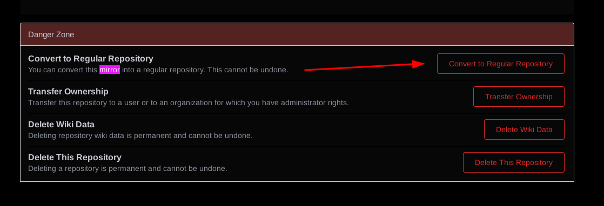 

And once done you can recreate the collaboration kanban board like so:

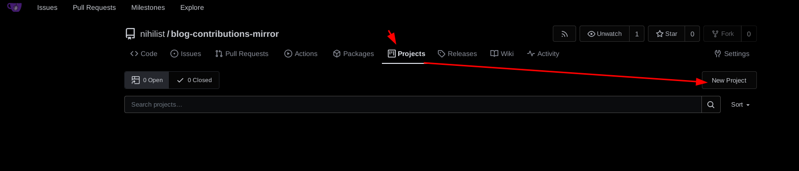 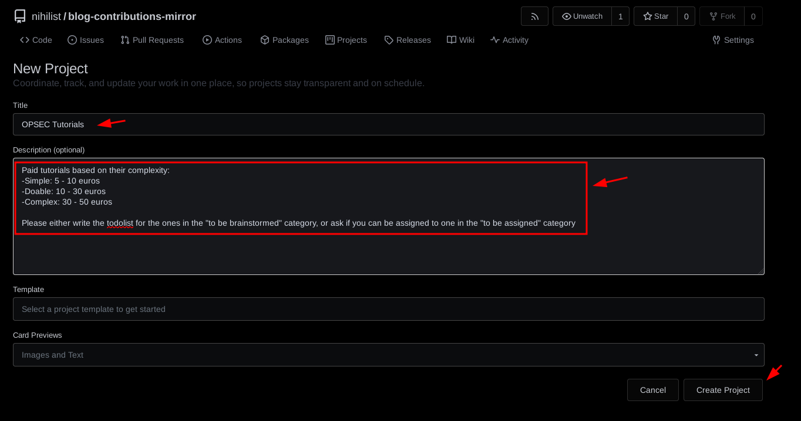 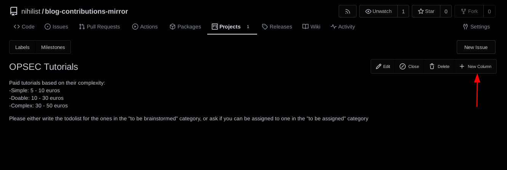 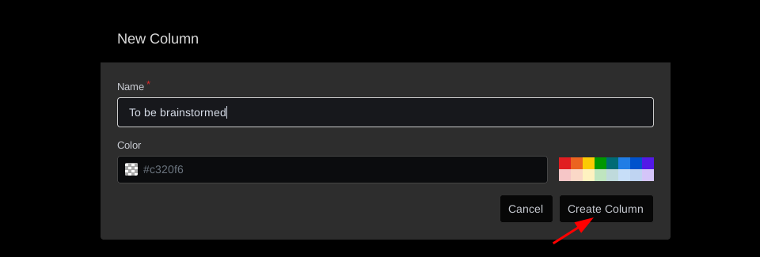

Then you can add the an issue per tutorial into it like so:

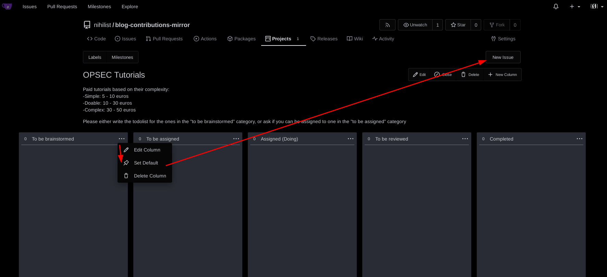  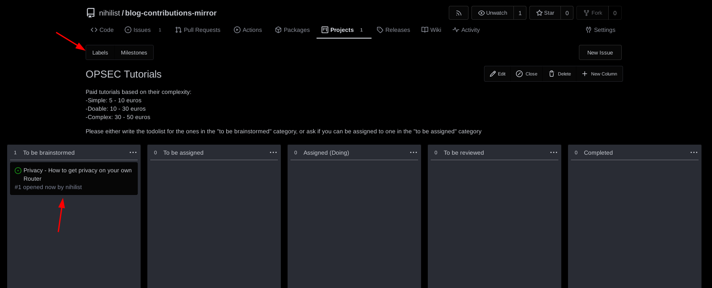

You can also add labels to add more details on each issue, to be visible from the kanban board:

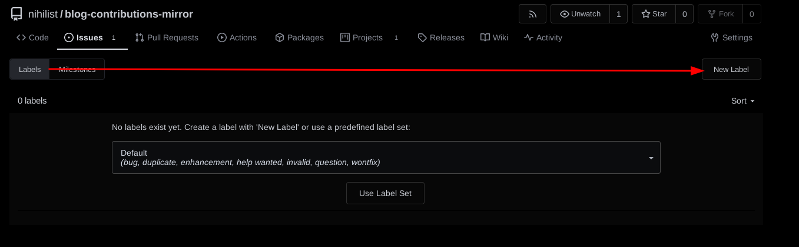 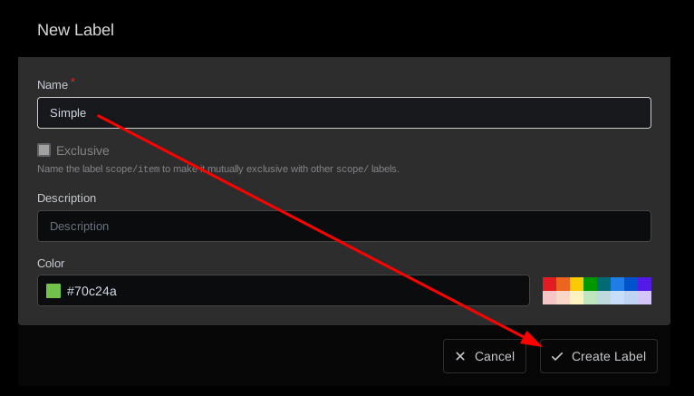 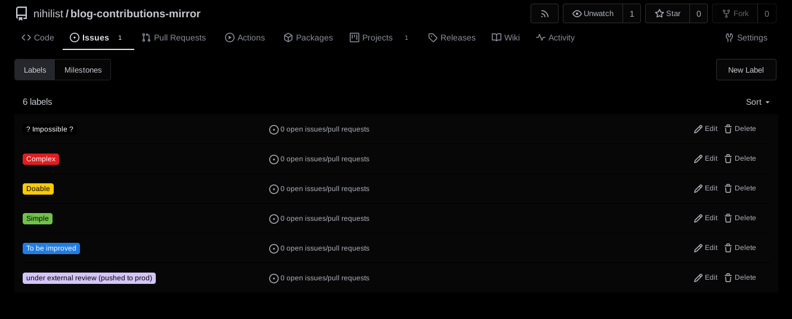

Then on each issue you can add labels on each like so:


Here the workflow is preety straightforward, the first column is there for the tutorials that dont have the todolist written yet, the second column is for those that do but aren't assigned to someone yet, the third column is for the assigned tutorials (with a 1 month default deadline), the fourth column is for the maintainer to review what the contributor has sent, and the last column is for the tutorials that are completed:


And then obviously, don't forget to have a [SimpleX Chatroom](../anonsimplex/index.md) to make sure you can chat easily with your contributors like i do [here](http://nowherejezfoltodf4jiyl6r56jnzintap5vyjlia7fkirfsnfizflqd.onion/simplex.html), this will help brainstorm ideas quickly and help clear up misconceptions with your audience directly:


And there you go! you now have a platform to receive criticism, collaborate and produce quality content.

## **Setting up a Mirror List**

And then to make sure the Opsec Bible remains resistant to takedowns, you can list it on your own [Darknet Lantern](../darknetlantern/index.md) instance, under the [Blogs](http://lantern6vrwheap4iahuktz3jtwvovrzhxgwgzvrvp46brdzzekxibqd.onion/index.php?query=Blogs) category:


And that's it! you now know how to run the blog yourself, and also how to make sure you can make sure the project keeps going if something were to happen to me in the future.
