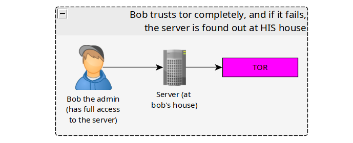
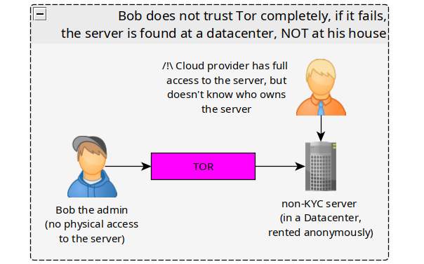

# Sensitive .onion Services: Self-Host or Host Remotely ? 

```
TLDR: It's safer but more expensive to host them remotely
```

## **The Context**

A popular debate that keeps reoccuring, is where exactly can you run sensitive .onion services.

It comes with 2 challenges:

  1. Running the service, with as much uptime as possible (making sure it keeps running in case of takedowns)

  2. Making sure you can't be traced back as the owner/administrator of the server


Out of those requirements, we have 2 possibilities as to where you can run a sensitive service.


## **Self Hosting : Full Physical Control but Risky!**


 **Pros:**

Everyone has an internet connection, and if you live in a country that does not actively sensor the tor network, it can be interesting to host your own physical server which runs your hidden .onion service

If you have your own physical server at home, it means you have complete control over the physical proximity of the server itself. as i detailed in [my tutorial on physical security](../physicalsecurity/index.md) there are many things you can do to detect if an adversary is breaking into your home to try and find if you host a hidden service (such as movement detection, unauthorized ssh detection, unauthorized USB interaction detection, etc.)

In short, it's ideal if the technology is perfect and never has any flaws, but you can't ever be sure of that, (for example: [Tor had security flaws in the past](https://nusenu.medium.com/is-kax17-performing-de-anonymization-attacks-against-tor-users-42e566defce8))

**Cons:**

Almost everyone has an internet connection at home, that is tied to your real name. Due to that fact alone, most people refuse to host anything sensitive locally.

The strategy here is **"I use secure technology, come at me!"** , if there is any undisclosed flaw/ 0day vulnerability in anything related to the technology used (tor, veracrypt, etc), an adversary could reveal the location of the server, and try to get their hands on the server.

If the adversary has the ability to crack open the security of the technology used (very unlikely but possible), you're screwed, because the server sits at your home, and they 100% know it is yours in case if the technology fails to protect your service along the way.

## **Remote Hosting: No Physical Control but Safer!**


 **Cons:**

Since the Idea here is to run the sensitive service (and most of the time, it's not allowed by the cloud provider), **If there is no redundancy / high availability, The longevity of the service would depend on how long the service remains unnoticed by the cloud provider.**

If the longevity of the service is of concern, you have to take into account that the service is very likely to get taken down regularly. So to avoid downtimes, **you will have to scale up and implement high availability, this is multiplying the costs per new server**

Since the goal is for a service to remain undetected for as long as possible on each server, you will have to stay away from VPSes as their kernels often come with monitoring modules, **you will need a dedicated server, with the ability to upload your custom ISO**

You will also need to monitor for any physical interaction with the server, in order to protect the plausible deniability inside the server, **for any unauthorized change or interaction by the cloud provider, there must be an immediate emergency shutdown to be triggered.**

And you will need to perform integrity checks after each unauthorized server maintenance to make sure that there are no spyware installed on your server, that may compromise the confidentialtiy from the cloud provider itself.

In theory, since the server is not there physically with you, you can't fully protect it physically, **you can't just encrypt all of the contents of the RAM to protect against cold boot attacks**.

**Pros:**

As i have detailed in my tutorial on [how to acquire remote servers anonymously](../anonymousremoteserver/index.md), if you make sure that you anonymously:

  1. Create an account on the cloud provider (via TOR)
  2. Pay for the server (via Monero)
  3. Access the server (ssh through tor)


You will be safe to assume that whatever happens on that server, it won't get tied back to you

The strategy here is **"Whatever I do, I do it as far away from my real identity!"** , this anonymity safeguard is what many consider worth all the trouble mentionned before. 

