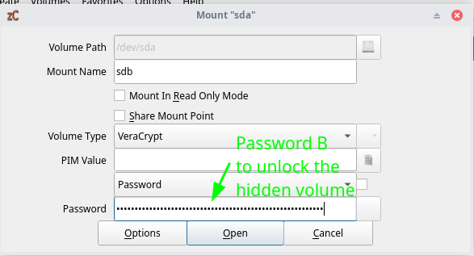

# Sensitive VMs Setup (Whonix VMs in a Veracrypt Hidden Volume) 

```
TLDR: you can perform sensitive activities from this particular sensitive VM setup because you can deny it's very existance.
```


In this tutorial we're going to cover how to setup Whonix VMs for Sensitive use. This means that our [OPSEC requirement](../opsec4levels/index.md) is that **we need to be able to deny the existance of the Sensitive Whonix VM if the adversary ever gets access to our laptop.**

Now the advantage of this setup, is that it is not going to actually destroy the computer, nor any sensitive data, you can keep using it even after triggering an emergency shutdown. 

_CONTEXT WARNING:_ this setup is only suitable **if you are not going to be thrown in jail for just using Veracrypt.** , and if an adversary were to bust down your front door, **you need to have at least 5 seconds before he can see your laptop screen.**

**WARNING: YOU NEED TO IMPLEMENT [LIVE MODE AND RAM-WIPE](../livemode/index.md) ON THE [KICKSECURE HOST OS](../linux/index.md) TO IMPLEMENT THE FOLLOWING SETUP!**

## **Deniability Requirements**

First of all as you have seen, the requirement is that we do this setup from the Host OS, in [live mode](../livemode/index.md). That is because we want to make sure that there is no forensic evidence to be saved on the system drive as we have explained [previously.](../livemode/index.md)


While in Live mode we can't write anything new on the system disk (such as the system logs, kernel logs, non-standard logs) **which can all be potential forensic evidence that the hidden volume exists**. Instead, everything is written into RAM, and we can easily erase all of those contents with a simple reboot. **While in live mode however, we can ONLY write to non-system drives** , which is where we will setup a big enough veracrypt volume (500GB in total, with a 250Gb hidden volume) to store the Whonix VMs (which are 200Gb big) that we will use for long-term Sensitive use.

### What non-system Harddrive should i get ?

I hope you understand that the goal here is to run at least 2 VMs from that harddrive, and from inside a Veracrypt Hidden volume at that.

Therefore you should understand that the disk writing speed is of paramount importance here if you want to have reasonably usable performance using that sensitive VM. If you think you can use a 10 year old 500Gb HDD drive and use it just fine, you're wrong, it will bottleneck HARD on the disk writing side.

Therefore i recommend you to at least get the [current industry standard of HDD writing speeds](https://www.tomshardware.com/features/hdd-benchmarks-hierarchy), **being 7200RPM:**


For instance you can get a [Seagate Barracuda 2TB HDD](https://www.amazon.com/Seagate-BarraCuda-Internal-Drive-3-5-Inch/dp/B07H2RR55Q?th=1), it will perfectly do the job (7200RPM, SATA 6Gb/s) at a reasonably low cost.

### Protecting against network-level hints of the existance of the sensitive vms

18/08/2025: Special thanks to [Mikoyan Gurevich](http://pitchprash4aqilfr7sbmuwve3pnkpylqwxjbj2q5o4szcfeea6d27yd.onion/p/6ffda281#p-20c6116a) for pointing this detail out, which i previously missed:


One thing you need to take note of is that the Kicksecure Host OS has a Tor daemon that is installed by default, which connects to a set of tor guard nodes (A,B and C for example), **but here we also have a set of whonix VMs which should not exist, that also connect to their own set of tor guard nodes (D,E,F for example).** 

So in case if the adversary is monitoring your internet connection from the ISP point of view, they may notice when the connections to the D,E, and F, which could be used to potentially prove the existance of the sensitive VM, we also want to make sure that they can't see the connections that we're making to Tor, using a (you -> VPN -> Tor setup), **by adding a VPN (with DAITA and multihop enabled) on the Host OS level**:


With [a VPN on the Host OS layer](../vpn/index.md), for example Mullvad, we can have a multi-hop VPN to blend in with other VPN users, and eliminate the risk of tor use correlation that could occur without it. Double check that both Multihop and DAITA are both enabled while you setup the VPN, as this is what will ensure that :
1) the adversary can't tell that there is tor traffic going through the VPN connection by looking at the timing or shape of the packets (thanks to the DAITA feature)
2) the adversary can't tell which tor guard nodes you're connecting to by, **even if they try to spy on the VPN connection, as you get to blend with many other users**.

   


## **Preparing the Host OS: Live Mode and the Reboot Shortcut**

As we have showcased [previously](../livemode/index.md), we have a **reboot.sh bashscript** on the Host OS, that is hooked up to the **Right Ctrl** key to make sure we can quickly shutdown the computer in case if an adversary were to bust down our door. So we're going to make use of it:
    
    
    [user ~]% cat reboot.sh
    #!/bin/bash
    
    /usr/bin/sudo /usr/sbin/reboot now
    
    [user ~]%  xfconf-query -c xfce4-keyboard-shortcuts -n -t 'string' -p '/commands/custom/Control_R' -s "sh /home/user/reboot.sh"
    

Definitely make sure that it works and that it keeps working by pressing the right ctrl key at least once in a while, **because you definitely don't want this to fail you when there's going to be an actual emergency.**

I also recommend making a simple shortcut to trigger the script.sh bashscript to avoid having to open up a terminal and run it every time you want to open up the sensitive VMs after booting in live mode:
    
    
    [user ~]% xfconf-query -c xfce4-keyboard-shortcuts -n -t 'string' -p '/commands/custom/<Super>s' -s "sh /run/media/private/user/sdb/script.sh"

In this example, i set the **Super+S** shortcut to run script.sh more easily.

And lastly, (since running right ctrl while focused inside of a VM doesnt trigger the shortcut on the Host OS), we make sure that we can focus out of the QEMU VMs easily by making sure that pressing the **Right ALT** focuses out of the VMs:
    
    
    [user ~]% gsettings set org.virt-manager.virt-manager.console grab-keys '65514'
    
    

**In conclusion: The correct key combination to reboot the computer is first Right Alt to focus out of the QEMU VM, and then Right CTRL to trigger the reboot script.**

So Now that's done, let's reboot the Host OS to go back in live mode before we start to create the veracrypt volume.


## **Preparing the non-system drive**

This tutorial is going to require you to have the following setup:

  * Host OS: [Kicksecure](../linux/index.md) (in live mode ONLY!)

  * Host OS Preparation: [Reboot.sh script hooked up to the right CTRL key + ram-wipe installed](../livemode/index.md)

  * Hypervisor: [libvirtd QEMU/KVM](../hypervisorsetup/index.md)

  * Non-System Harddrive: 500Gb at least


With this setup, you are ready to proceed. The non-system harddrive needs to be 500GB big because in it the veracrypt decoy (outer) volume will span the entire drive (500Gb), and the hidden (inner) volume will span half of that entire drive (250Gb), **in order to be able to contain the Whonix QEMU VMs which are 200Gb big.**


So make **sure that you have a non-system that is 500GB big (a Harddrive, NOT AN SSD)** , then you can proceed with setting up the veracrypt volume on the entire drive: 

   

Here is the important part: you mention both passwords: the top one is Password A: to unlock the decoy volume, and the bottom one is the secret password, you must be the only one that knows it **because it is the key to unlock (and reveal) the hidden volume NEVER WRITE IT DOWN, ALWAYS REMEMBER IT!**

   

And now that the veracrypt volume is created, we are ready to setup both the hidden and decoy volumes

## **Installing the Whonix VMs inside the Hidden Volume**

First we unlock the Veracrypt Hidden volume:

   


As you can see the mount point path is in **/run/media/private/user/sdb** , that's where we're going to store the whonix VMs. So let's download the latest whonix VMs from [here](https://www.whonix.org/wiki/KVM):


once downloaded directly into the hidden volume, unpack it (the archive may only be 3Gb big but once inflated it will weigh 200Gb in total.) 
    
    
    [user ~]% cd /run/media/private/user/sdb
    
    [user /run/media/private/user/sdb]% ls -l   
    total 549M
    drwx------ 2 root root  16K  1 sept.  2024 lost+found
    drwxr-xr-x 2 user user 4,0K  2 avril 11:45 old
    -rw-r--r-- 1 user user    0  2 avril 11:47 Whonix-Xfce-17.2.8.5.Intel_AMD64.qcow2.libvirt.xz
    
    [user /run/media/private/user/sdb]%  tar -xvf Whonix*.libvirt.xz 
    WHONIX_BINARY_LICENSE_AGREEMENT
    WHONIX_DISCLAIMER
    Whonix-Gateway-Xfce-17.2.8.5.xml
    Whonix-Workstation-Xfce-17.2.8.5.xml
    Whonix_external_network-17.2.8.5.xml
    Whonix_internal_network-17.2.8.5.xml
    Whonix-Gateway-Xfce-17.2.8.5.Intel_AMD64.qcow2
    Whonix-Workstation-Xfce-17.2.8.5.Intel_AMD64.qcow2
    
    [user /run/media/private/user/sdb]%  touch WHONIX_BINARY_LICENSE_AGREEMENT_accepted
    

Here to make it easier to handle, i recommend to first edit the file names to remove the version and the the window manager name:
    
    
    [user /run/media/private/user/sdb]% mv Whonix-Gateway-Xfce-17.2.8.5.xml				Whonix-Gateway.xml
    [user /run/media/private/user/sdb]% mv Whonix-Workstation-Xfce-17.2.8.5.xml			Whonix-Workstation.xml 
    [user /run/media/private/user/sdb]% mv Whonix_external_network-17.2.8.5.xml			Whonix-External.xml
    [user /run/media/private/user/sdb]% mv Whonix_internal_network-17.2.8.5.xml			Whonix-Internal.xml
    [user /run/media/private/user/sdb]% mv Whonix-Gateway-Xfce-17.2.8.5.Intel_AMD64.qcow2		Whonix-Gateway.qcow2
    [user /run/media/private/user/sdb]% mv Whonix-Workstation-Xfce-17.2.8.5.Intel_AMD64.qcow2	Whonix-Workstation.qcow2
    
    

Then we're going to need to edit the Whonix-Gateway.xml and Whonix-Workstation.xml to match the system path, have the correct resources, and use the correct qcow2 image filenames:

So here we first make sure that the whonix gateway has 1GB memory, and that it has the correct source file path (to the .qcow2 vm image):
    
    
    [user /run/media/private/user/sdb]% vim Whonix-Gateway.xml 
    [user /run/media/private/user/sdb]% cat Whonix-Gateway.xml 
    
    [...]
    
      <memory dumpCore="off" unit="GiB">1 </memory> <currentMemory unit="GiB">1 </currentMemory>
    
    [...] <disk type="file" device="disk"> <driver name="qemu" type="qcow2"/> <source file="/run/media/private/user/sdb/Whonix-Gateway.qcow2"/> <target dev="vda" bus="virtio"/> <address type="pci" domain="0x0000" bus="0x00" slot="0x06" function="0x0"/> </disk>
    
    [...]

So here we do the same for the whonix workstation to give it 8GB of memory, with 4vcpus, and we also make sure that it has the correct source file path (to the .qcow2 vm image) **(Also you need to make sure that you remove the pinning parameter cpuset='1' as explained [here](http://www.dds6qkxpwdeubwucdiaord2xgbbeyds25rbsgr73tbfpqpt4a6vjwsyd.onion/wiki/KVM#Adding_vCPUs) )**:
    
    
    [user /run/media/private/user/sdb]% vim Whonix-Workstation.xml 
    [user /run/media/private/user/sdb]% cat Whonix-Workstation.xml 
    
    [...]
    
      <memory dumpCore="off" unit="GiB">8 </memory> <currentMemory unit="GiB">8 </currentMemory>
    
    [...] <vcpu placement="static">4 </vcpu>
    
    [...] <disk type="file" device="disk"> <driver name="qemu" type="qcow2"/> <source file="/run/media/private/user/sdb/Whonix-Gateway.qcow2"/> <target dev="vda" bus="virtio"/> <address type="pci" domain="0x0000" bus="0x00" slot="0x06" function="0x0"/> </disk>
    
    [...]

Now that the XML files are correctly setup, we can write script.sh to make sure they are quickly setup if not already, and quickly removed if they are:
    
    
    [user /run/media/private/user/sdb]% cat script.sh             
    #!/bin/bash
    
    if [ $(virsh -c qemu:///system list --all | grep Whonix | wc -l) -ne 0 ];
    then
    
    	# if the VMs are imported, remove them:
    
    	virsh -c qemu:///system destroy Whonix-Gateway
    	virsh -c qemu:///system destroy Whonix-Workstation
    	virsh -c qemu:///system undefine Whonix-Gateway
    	virsh -c qemu:///system undefine Whonix-Workstation
    	virsh -c qemu:///system net-destroy Whonix-External
    	virsh -c qemu:///system net-destroy Whonix-Internal
    	virsh -c qemu:///system net-undefine Whonix-External
    	virsh -c qemu:///system net-undefine Whonix-Internal
    else
    
    
    	# if the VMs are not imported, import them:
    	virsh -c qemu:///system define /run/media/private/user/sdb/Whonix-Gateway.xml
    	virsh -c qemu:///system define /run/media/private/user/sdb/Whonix-Workstation.xml
    	virsh -c qemu:///system net-define /run/media/private/user/sdb/Whonix_external_network.xml
    	virsh -c qemu:///system net-define /run/media/private/user/sdb/Whonix_internal_network.xml
    	virsh -c qemu:///system net-autostart Whonix-External
    	virsh -c qemu:///system net-start Whonix-External
    	virsh -c qemu:///system net-autostart Whonix-Internal
    	virsh -c qemu:///system net-start Whonix-Internal
    	# then exit because we dont want to run the rest of wipe.sh
    	exit $? 
    fi
    
    

Then we make sure that the VMs by double-checking that [the hypervisor is properly configured](../hypervisorsetup/index.md) and that the folder is accessible as the "user" user with the proper rights:

```sh
[ localhost ] [ /dev/pts/4 ] [private/user/sdb]
→ chown user:user -R /run/media/private/user/sdb 

[ localhost ] [ /dev/pts/4 ] [private/user/sdb]
→ chmod 666 -R /run/media/private/user/sdb

[ localhost ] [ /dev/pts/4 ] [private/user/sdb]
→ ls -lash
total 201G
128K drwxrwxrwx 4 user user 128K  4 juil. 11:22 .
   0 dr-x------ 3 user user   60  4 juil. 09:50 ..
128K drwxrwxrwx 2 user user 128K  1 sept.  2024 lost+found
128K drwxrwxrwx 2 user user 128K  2 avril 16:03 old
128K -rw-rw-rw- 1 user user 1,2K  4 juil. 11:22 script.sh
128K -rw-rw-rw- 1 user user  39K 21 oct.   2015 WHONIX_BINARY_LICENSE_AGREEMENT
128K -rw-rw-rw- 1 user user 4,1K 21 oct.   2015 WHONIX_DISCLAIMER
128K -rw-rw-rw- 1 user user  172 21 oct.   2015 Whonix-External.xml
101G -rw-rw-rw- 1 user user 101G  4 juil. 11:24 Whonix-Gateway.qcow2
128K -rw-rw-rw- 1 user user 3,5K  4 juil. 11:22 Whonix-Gateway.xml
128K -rw-rw-rw- 1 user user   97 21 oct.   2015 Whonix-Internal.xml
101G -rw-rw-rw- 1 user user 101G  4 juil. 11:24 Whonix-Workstation.qcow2
128K -rw-rw-rw- 1 user user 3,4K  4 juil. 11:22 Whonix-Workstation.xml

```


Then we test to run script.sh to validate that we can setup the whonix VMs as intended:
    
        
    [user /run/media/private/user/sdb]% sh script.sh 
    Network Whonix-External defined from /run/media/private/user/sdb/Whonix-External.xml
    
    Network Whonix-Internal defined from /run/media/private/user/sdb/Whonix-Internal.xml
    
    Network Whonix-External marked as autostarted
    
    Network Whonix-External started
    
    Network Whonix-Internal marked as autostarted
    
    Network Whonix-Internal started
    
    Domain 'Whonix-Gateway' defined from /run/media/private/user/sdb/Whonix-Gateway.xml
    
    Domain 'Whonix-Workstation' defined from /run/media/private/user/sdb/Whonix-Workstation.xml
    
    

As you can see it successfully mounted the whonix VMs:


And then if you run it again you'll see that it removes the VMs: 
    
    
    [user /run/media/private/user/sdb]% sh script.sh  
    error: Failed to destroy domain 'Whonix-Gateway'
    error: Requested operation is not valid: domain is not running
    
    error: Failed to destroy domain 'Whonix-Workstation'
    error: Requested operation is not valid: domain is not running
    
    Domain 'Whonix-Gateway' has been undefined
    
    Domain 'Whonix-Workstation' has been undefined
    
    Network Whonix-External destroyed
    
    Network Whonix-Internal destroyed
    
    Network Whonix-External has been undefined
    
    Network Whonix-Internal has been undefined
    
    

` 

Next, run the script again to setup the VMs once again:
    
    
    [user /run/media/private/user/sdb]% sh script.sh  
    
    

And then upon starting the VMs we see that they work as intended:


Inside this one whonix workstation is the only context where i consider sensitive use to be suitable, **so make sure you don't do any other long-term sensitive activities (meaning you are storing sensitive data somewhere) outside of this VM, because you wouldn't be able to maintain deniability about it otherwise!**

## **Setting up the Decoy Volume**
    
    
    -in the decoy volume we download files that make sense to be stored in an encrypted volume (adult content / pirated movies, etc) but it needs to NOT be sensitive.
    -then we write script.sh
    

Now that we setup the hidden volume, we setup what we need in the decoy volume:


The decoy volume must contain files that meet the following criterias:

  1. The files must make sense to be kept hidden in an encrypted volume

  2. The files are not sensitive in nature (you're not going to be thrown in jail for it)

  3. The files must be less than 200Gb


**Keep in mind that this is the content that you would show the adversary if they were to seize your devices and force you to type a password.** Therefore what you store in it absolutely needs to make sense to be stored in an encrypted volume.


And obviously, the total diskspace consumed by the decoy files need to be less than 250Gb, as otherwise you'd overwrite (and destroy) the veracrypt hidden volume in the process.

As we have covered previously, the usual content that makes sense to be kept in an encrypted volume can be something along the lines of adult content, downloaded movies, or similar:


So in here we put some decoy files that would make sense for an adversary to find in an encrypted container:


Then we write the following script.sh in there:
    
    
    [user /run/media/private/user/sdb]% vim script.sh             
    [user /run/media/private/user/sdb]% cat script.sh
    #!/bin/bash
    
    kill -9 $(pidof vlc)
    
    [user /run/media/private/user/sdb]% sh script.sh
    

If ever asked to by an adversary, we'll basically pretend that this script is there to quickly kill the media player window in case if someone were to enter the room while you were watching that not-sensitive-but-private content.

And that's it ! We have now setup both the Hidden Volume with the whonix VMs in it for sensitive use, and the Decoy Volume containing the data we'd show the adversary if ever forced to.

## **Fine-tuning the emergency reboot script**

For this next part, we're going to reuse the emergency reboot.sh bashscript that we showcased [previously](../livemode/index.md), so let's reboot the Host OS to be able to edit it outside of live mode since we want it to be a persistant change:


**Reminder: once again, if you are outside of live mode like we are right now, DO NOT OPEN THE HIDDEN VOLUME, as otherwise you're leaving forensic evidence regarding it's existance on the system drive!**
    
    
    [user ~]% cat reboot.sh     
    #!/bin/bash
    
    /usr/bin/sudo /usr/sbin/reboot now
    
    

But we're going to refine it so that it does the following:

  1. Turn off the screen display output (to prevent the adversary from seeing what is happening on the monitor)

  2. Run the script.sh (that is either in the decoy or the hidden volume, depending on which one is currently opened)

  3. Close the veracrypt volume (and anything that could block the closing of the volume, such as closing thunar)

  4. Trigger the host OS reboot, (wiping the RAM in the process) 


Which after tweaking it accordingly we end up with the following reboot script:
    
    
    [user ~]% vim reboot.sh
    [user ~]% cat reboot.sh

    #!/bin/bash
    
    # turn off display
    xset dpms force off &
    
    # run script.sh to kill vlc
    sh /run/media/private/user/sdb/script.sh
    
    # kill all processes that could block veracrypt from closing
    killall Thunar
    killall xfce4-terminal
    systemctl kill libvirtd
    killall virt-manager
    
    # close the veracrypt volume using zulucrypt
    sudo zuluCrypt-cli -q -d /dev/sdb
    
    # kill zuluCrypt after unmounting to make sure it doesnt block the reboot
    killall zuluCrypt-gui
    
    # reboot the host OS
    /usr/bin/sudo /usr/sbin/reboot now
    
Now here if the host OS user has a password set like we setup in the [Host OS tutorial](../linux/index.md), we need can either remove the user password like so:


OR we can simply use visudo to set the NOPASSWD on the commands we want to run (that normally require a sudo password) to avoid having to type the sudo password to run them: 

```sh
[user ~]% sudo visudo

# User alias specification
user  ALL=(ALL) NOPASSWD:/usr/bin/systemctl, /usr/bin/zuluCrypt-cli, /usr/sbin/reboot, /usr/bin/virsh

```

Now from my personal experience i know libvirtd can slow down the shutdown process if there are still vms that aren't shutdown yet: 


So let's make sure it speeds up massively by changing the default timeout of 300 seconds to 1 second by editing the libvirt-guests.sh script where the timeout value is defined:

```sh
root@localhost:/etc/libvirt# cat /usr/lib/libvirt/libvirt-guests.sh | grep TIMEOUT
SHUTDOWN_TIMEOUT=300
# was successfully shutdown or the timeout defined by $SHUTDOWN_TIMEOUT expired.
root@localhost:/etc/libvirt# vim /usr/lib/libvirt/libvirt-guests.sh
root@localhost:/etc/libvirt# cat /usr/lib/libvirt/libvirt-guests.sh | grep TIMEOUT
SHUTDOWN_TIMEOUT=1
# was successfully shutdown or the timeout defined by $SHUTDOWN_TIMEOUT expired.
```

And with this we're all set to use the emergency reboot script without having to type the sudo password.


Even in a deniability setting, having this script sit in your home directory doesn't incriminate you either, **because you can tell the adversary that this script is used to prevent someone else from seeing that you're watching the non-sensitive content (such as adult content) that is sitting in the encrypted volume.** Still this is a plausible explanation that makes it look like you are cooperating to the adversary when you are being asked about that script in particular.

And as we showcased previously, we want this script to be executable with a single keystroke (using the right control key) so to make sure the shortcut is set, run this command:
    
    
    xfconf-query -c xfce4-keyboard-shortcuts -n -t 'string' -p '/commands/custom/Control_R' -s "sh /home/user/reboot.sh"
    
    

## **Emergency Reboot Scenario**

As explained higher up in this tutorial, you're going to have to test your emergency reboot procedure a few times to make sure it works but also to get used to it, **because when there's going to be a real emergency, you're going to need perform that emergency reboot procedure in a split second.**

So let's showcase how to do it. First setup the context, booting from the Host OS in live mode: 

**Reminder: Now that we are back in live mode, you can open the veracrypt hidden volume once again!**

Then open the veracrypt hidden volume:

 

 


and then run script.sh to setup the sensitive VMs:
    
        
    [user /run/media/private/user/sdb]% sh script.sh 
    Network Whonix-External defined from /run/media/private/user/sdb/Whonix-External.xml
    
    Network Whonix-Internal defined from /run/media/private/user/sdb/Whonix-Internal.xml
    
    Network Whonix-External marked as autostarted
    
    Network Whonix-External started
    
    Network Whonix-Internal marked as autostarted
    
    Network Whonix-Internal started
    
    Domain 'Whonix-Gateway' defined from /run/media/private/user/sdb/Whonix-Gateway.xml
    
    Domain 'Whonix-Workstation' defined from /run/media/private/user/sdb/Whonix-Workstation.xml
    
    

` 

And now that the sensitive VMs are listed in virt-manager, we open them:


This is your normal booting up routine when you want to do sensitive activities. Only from the host OS being in live mode, and from that VM alone.

_Sidenote:_ if you never make a single opsec mistake, you won't ever have the cops busting down your front door, but you never know when you might slip up in the future. **So you must always be ready for the worst when you are actually risking jailtime.** Test yourself at random every few days. What if someone was busting down your door Right now ? Would you be able to reboot your computer in time ? Aim for a 100% success rate, because when the real time comes, it will all depend on your reactivity.

So now you have been doing your regular sensitive activities from that VM for the last 4 hours, **and suddenly you hear your front door getting busted down,** suppose the door is right next to you like in [this video](https://www.youtube.com/watch?v=jEhprcgv3Pg), you only have 5 seconds to correctly react and press the right ctrl key to be able to shut down the sensitive VM on time.


So your door is getting busted down, and before the 5 second limit you manage to correctly **press that right ALT key to focus out of the sensitive VM, and then the right control key to trigger the reboot.sh script**.

And then upon pressing it, it immediately turns off the monitor and as you are getting pinned down by the adversary, the script is automatically unmounting the veracrypt volume, and rebooting the computer as intended.

If the adversary is skilled enough, they'd attempt to open up the PC, put some liquid nitrogen on the RAM sticks, to try and freeze the content of the memory, but by the time they try to do that, the contents of the RAM would be long gone already if you managed to press the emergency reboot key in time. 


Next, they seize the empty ramsticks, and the encrypted drives, they put you in handcuffs, put you in custody, while they inspect what they seized for incriminating evidence.

## **Emergency reboot Scenario: the Aftermath**
    
    
    Aftermath:
    -the forensic team inspects the RAM contents and the disk contents:
    -the RAM contents are empty: it only shows the typical contents of kicksecure booting and waiting for a password to unlock the system drive (since it rebooted successfully)
    -the disk contents are encrypted: the adversary is forced to get the password from you to be able to unlock it
    -the authorities get approval from the judge: you are now forced to give them the password to unlock your computer
    
    from custody:
    -the cops tell you the following: Either you give us your passwords to unlock your computer drives, or you're going to prison for a long time!
    

_In this situation here are your options:_

  1. either you admit everything you did and get thrown in jail for however long the punishment is supposed to be. (if were playing late in china for example) : life sentence in concentration camps

  2. either you refuse to give them the passwords and get thrown in jail for contempt of court (their reasoning: you lied that you forgot your password) : 6 months jailtime

  3. **Or you accept to give the password (which is the decoy password) to unlock the decoy volume (where there's nothing sensitive in there): you look good for the court, it looks like you have cooperated: 0 months jailtime**


Of course you select the last option (since this is the point of implementing such a setup), **you give them the decoy password, they find nothing in it, and now they are left with no evidence to incriminate you with.**

If the adversary is not stupid, they should already have something to incriminate you with before actually busting down your door (because you slipped up somewhere along the way while you were doing sensitive activities), meaning that you are anyway going away for some time. It would be stupid to bust down people's doors without having any actual evidence, it would be like playing the lottery hoping to find gold while ruining someone's appartment.

It may seem far-fetched but **you can't discard that eventuality since there have been[many innocent streamers got swatted](https://www.youtube.com/watch?v=coa7tP54kDY) in the past** (because of assholes that were falsely reporting bomb threats or gun shots just because they didn't like a streamer):


In those cases in particular, **the authorities believe that they'll find a criminal behind the door that they're busting down, so they bust it down despite not having any evidence.** And afterward they realize that the guy is innocent, and they release him.

Obviously here the context is different as you may actually have something to hide, but with that setup it remains impossible for the adversary to prove the existance of the hidden volume and the sensitive VM it contains. **The strategy here is that you are limiting the bleeding as much as possible**. The authorities may have evidence to put you in jail for 1 month, but if you don't properly stop the bleeding on time, they may find enough evidence for them to convict you for 20 years depending on the nature of the sensitive activity that you have been doing.

In the case of our showcased setup above, The authorities cannot incriminate you further because there's nothing more for them to find on your seized drives and ramsticks.

