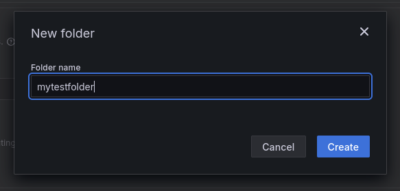

# How to anonymously recieve alerts (via SimpleX)

```
TLDR: you can recieve monitoring-based alerts via Simplex through Tor, while maintaining Serverside Anonymity.
```

As you know, [monitoring](../anonymous_server_monitoring/index.md) is important when running any kind of operations, especially so
for clandestine ones.


## Alert Types

Automated alerts have many advantages over open simple monitoring: if you can define what nominal looks like (can be done with simple statistical process control measures such as the [Nelson rules](https://en.wikipedia.org/wiki/Nelson_rules)) then you can set up a system that will be:
- reliable
- customizable: you define the exact context you want, how you want to receive alerts
- runs 24/7

Simple threshold-based alert are reactive by nature, but their automated monitoring cuts the response time down and enable operational agility when responding to threats. Statistical-based alerts allow you to be proactive and notify you when something is not a problem yet but might become one in the future.


### Examples from the MulliganSecurity Infrastructure monitoring standard playbook

- Threshold-based: a [SMARTCTL](https://en.wikipedia.org/wiki/Smartctl) alert creating a notification when any hard drive within your infrastructure crosses a pre-failure threshold

~~~
    smartctl_device_attribute{attribute_flags_long=~".*prefailure.*", attribute_value_type="value"} 
    <= 
    on (device, attribute_id, instance, attribute_name) 
    smartctl_device_attribute{attribute_flags_long=~".*prefailure.*", attribute_value_type="thresh"}
~~~

- Statistical (anomaly detection): CPU spike or under-use

~~~
    cpu_percentage_use > (avg_over_time(cpu_percentage_use[5m]) + (3* stddev_over_time(cpu_percentage_use[5m])))
    OR
    cpu_percentage_use < (avg_over_time(cpu_percentage_use[5m]) - (3* stddev_over_time(cpu_percentage_use[5m])))
~~~

## Associated Risks

As your perimeter and infrastructure grows, as you add more servers your system complexity will shoot up exponentially. Simple organic alerting shows its limit when you have to correlate logs and behaviors across multiple systems.
That's why you need alerting, if an adversary decides to stealthily probe at your infrastructure and you know what to look for you will see their attempt for what it is. Choosing to remain in the dark about it is foolish at best and irresponsible if you are part of an outfit as your laziness will put others in harm's way.


### Real world attack scenario

#### Situation
You run a clandestine operation that requires the ability to serve a website over tor in a [highly available](../high_availability/index.md) manner.


#### Assets
To keep this example simple we will focus only on the website content as the asset to be protected


#### Threat model
You have a highly technical, state-backed adversary.

- Adversary objective:
  - Either make your content unavailable or untrusted
- Adversary methods
  - Availability-based attacks: take the site down
    - tor service deanonymization techniques (from the [high availability](../high_availability/index.md) attacker playbook)
  - Integrity-based attacks: deface or introduce mistakes to break public trust in its content
    - AppSec-based attack on the website itself, probing for vulnerabilities such as XSS to identify readers or SQLi to change site content or gain access

#### Threat-model based Alerting

When devising a monitoring plan you must take the following into account:

- What application are you running?
  - we are running a website that interacts with user over HTTP through a tor onion service
- How do you know it is running correctly?
  - Systemd unit must be running
  - associated systemd-socket must be running
  - correct queries should receive answers with the following characteristics
    - 200 status code
    - 95th percentile response time of at most Xms
- How do you monitor the application substrate (VPses, Networks)
  - Onionbalance node must be up and available
  - Onionbalance node should receive and reply to queries for the highly available server descriptors
  - Onionbalance node should have minimal network trafic besides that
  - Onion balance node and VPS server should have minimal SSH trafic and only through a tor onion sevice
  - Onion balance 95th percentime response time of at most Yms
  - Vanguards warning must remain off on this infrastructure in normal operating conditions


##### Availability-based attacks

- To discover coordinated attemps at availability-based deanonymization against your infrastructure you should monitor your server's uptime (Prometheus data source)

    absent(up{application="node",instance="myserver5496497897891561asdf.onion"})


- Percentile based detection of performance-degradation attacks (Prometheus data source)

    histogram_quantile(0.95, sum(rate(http_server_duration_milliseconds_bucket{http_method="GET",http_host="mycoolwebsite.onion"}[5m])) by (le, http_method,http_host))


##### Intrusion detection

- insider threat: track successful logins and session durations (Loki)

~~~
    {unit="systemd-logind.service", instance="$hostname"} |= `session` | regexp `.* session (?P<session>[0-9]+).*user (?P<user>[^\.]+)` | label_format session="{{.session}}", user="{{.user}}" | session != ""
~~~


- If the endpoint used to connect remotely over ssh gets discovered by the attacker and becomes the target of a bruteforce attacks (Loki data source):


~~~
    count_over_time({unit="sshd.service", instance="myserver"} |~ `.*invalid (user|password)`[24h]) > 0
~~~


- If you have deployed fail2ban and an appropriate telemetry exporter to monitor it (prometheus data source) this query can give you a heads up when  you are under attack

~~~
    sum by (instance) (rate(f2b_jail_banned_current[5m]))
~~~


Season with statistical threshold detection depending on how likely your administrators are to fat-finger their username


- Appsec Monitoring (Tempo datasource for traces): if your service collects distributed tracing data you can create alerts based on specific function durations to discover if an attacker has, for example, dropped a webshell in a traced function


~~~
    {duration>=10s && .service.name="my-interactive-website"}
~~~

Do note that Pyroscope for continuous profiling should also be used, but this is highly application-specific (eg: monitor critical functions for execution duration variation). You will want to create recording rules that will build prometheus metrics from your continuous profiling infrastructure so you can alert against those. Creation of recording rules is out of scope for this tutorial but they use the same language and tooling as alerting rules.


#### Futher recommendation

As part of a partnership, the [observlib](http://gdatura24gtdy23lxd7ht3xzx6mi7mdlkabpvuefhrjn4t5jduviw5ad.onion/Capably7710/observlib) library was produced fo internal use by MulliganSecurity and availability to our customers.


This library is a very simple opentelemetry distro geared toward small organization with secure anonymous monitoring needs.


##### What it does:
- Configure the opentelemetry pipeline for your python application in such a way an alloy aggregator can easily combine and contextualize all your telemetry data before shipping it over tor to your monitoring server
- set up the necessary configuration so our end users can also just spin up a prometheus metrics instance if they do not want to set up opentelemetry collection
- provide a *traced* decorator that can be added to any function and:
  - measure execution time
  - update success/failure counters based on the results with arbitrary labels and amounts
  - ensure proper tracing configuration with span error status configuration for later debugging

##### Why use it
Because it makes monitoring integrated and easier. Using an integrated opentelemetry setup allows you to easily pivot from a prometheus alert to specific traces and execution flows using exemplars or logs using grafana's aggregator automatic contextualization. This gives you a way to easily go back in time to understand fully your system state, up to and including execution continuous profiling.


##### Using it in libraries
End users can also use observlib in their own libraries without requiring their third party users to configure anything: just don't call the configure_telemetry function and you will still be able to setup data collection.
Keep in mind that unless the application importing your lib sets up opentelemetry and/or prometheus exporting no data will be collected or resources consumed.


### But alerting carries risk too!

Indeed. Today we will keep building on the [monitoring](../anonymous_server_monitoring/index.md) tutorial.


Alerts can be used to deanonymize you. If an adversary suspects that you or others are tied to a clandestine infrastructure, they might decide to trigger alerts (say, bruteforcing one of your endpoints) and see if you receive notifications through channels they control.


Grafana supports a large number of possible alerts methods, most of them unfit to our purpose as those channels can be watched by the adversary.


- Telegram: opaque and centralized, tied to phone numbers
- AWS, Cisco, DingDing, Slack, Discord... same issue
- Email: you can control it but it still is traceable and tied to a domain name and clearweb infrastructure with all the accompanying metadata
- webhook: simply call an arbitrary URL with the alert message => **that's the way to go with the most control for ourselves**


# Tools of the trade

Let's start with webhooks. Webhooks are a great swiss-army knife when you need a system to act on its environment. They only need an http endpoint and the ability to make http request. They can easily be run as onion services too!


For this tutorial, Mulligan Security open sourced the tool they use for their own infrastructure: the [grafana-simplex-alerter](http://gdatura24gtdy23lxd7ht3xzx6mi7mdlkabpvuefhrjn4t5jduviw5ad.onion/Capably7710/simplex-alerter)


This will be used with the [simplex-chat](https://github.com/simplex-chat/simplex-chat) CLI client.


## Target architecture


## Simplex-chat

You can install simplex-chat from your source repository or directly from the [simplex-chat release page](https://github.com/simplex-chat/simplex-chat/releases)


Download the simplex-chat ubuntu release as shown:


The release page can be accessed through your web browser or you can download the latest (at the time of writing) release with the following command:


    wget https://github.com/simplex-chat/simplex-chat/releases/download/v6.2.3/simplex-chat-ubuntu-22_04-x86-64


## Grafana-Simplex-alerter

### What's this code and how can I trust it?

Great question. This code runs a simple webserver using uvicorn, configures the simplex-chat client based on a yaml config file you provide it with invite links to the alert groups you want to configue.

#### FOSS
This code is FOSS. All of it. No secret sauce. Furthermore it's pretty easy to analyze yourself as it's short

#### Dependency pinning
Everything that goes into making this code is cryptographically pinned and auditable:

- flake.lock file => python version, build-tools, and so on
- uv.lock => all libraries used by the code

#### Opentelemetry-enabled
Your alerting system itself should be monitored, this is can be done the following way:

- prometheus metrics: the alerter exposes a special /metrics endpoint so you can collect telemetry data about it
- continuous profiling: you have the option to connect it to a pyroscope server to get low-level per-function performance profile informations
- opentelemetry integration: connecting it to an opentelemetry collector such as alloy will give you correlated logs, traces, metrics and profiles, allowing you to easily debug and monitor it


And if you don't care about any of this: if you don't use those options no resources shall be consumed.

### Building the alerter

#### With nix

If you have the nix package manager installed, you can simply run:


    nix profile install github:MulliganSecurity/grafana-simplex-alerter


You will then be able to run simplex-alerter:


    [user@devnode:~]$ simplex-alerter --help
    usage: simplex-alerter [-h] [-a ADDR] [-m PROMETHEUS_CONFIG] [-o OTEL_SERVER] [-f PYROSCOPE_SERVER] [-b BIND_ADDR] [-d] [-c CONFIG] [-e ENDPOINT]

    options:
      -h, --help            show this help message and exit
      -o, --opentelemetry OTEL_SERVER
                            opentelemetry server
      -f, --profiling PYROSCOPE_SERVER
                            pyroscope server address for profiling
      -b, --bind-addr BIND_ADDR
                            host:port to run the app on
      -d, --debug           enable debug mode, increases pyroscope sampling rate if configured
      -c, --config CONFIG   config file
      -e, --endpoint ENDPOINT
                            simplex endpoint


#### With Docker

To build using docker please use the instructions in the repository README.md. As of this writing here is the execution flow. As time passes those instruction might deviate from what's in the repository. In this case please follow the README


    [user@devnode:~]$ git clone --config http.proxy=socks5h://127.0.0.1:9050 http://gdatura24gtdy23lxd7ht3xzx6mi7mdlkabpvuefhrjn4t5jduviw5ad.onion/Midas/simplex-alerter.git && cd simplex-alerter
    [user@devnode:~/simplex-alerter]$ docker build . -t builder
    [+] Building 1.0s (6/6) FINISHED                                                                                                                                                                                             docker:default
     => [internal] load build definition from Dockerfile                                                                                                                                                                                   0.0s
     => => transferring dockerfile: 196B                                                                                                                                                                                                   0.0s
     => [internal] load metadata for docker.io/nixos/nix:latest                                                                                                                                                                            0.9s
     => [internal] load .dockerignore                                                                                                                                                                                                      0.0s
     => => transferring context: 2B                                                                                                                                                                                                        0.0s
     => [1/2] FROM docker.io/nixos/nix:latest@sha256:016f07dddeb5feabeb75c360edb840ff4df3b89c7e0ca7ff1faea6240ce8375a                                                                                                                      0.0s
     => CACHED [2/2] WORKDIR /src                                                                                                                                                                                                          0.0s
     => exporting to image                                                                                                                                                                                                                 0.0s
     => => exporting layers                                                                                                                                                                                                                0.0s
     => => writing image sha256:d4561e76df38a12c18d457cddc769f4a1b93b8f79cfec139eb721b538d4abc52                                                                                                                                           0.0s
     => => naming to docker.io/library/builder                                                                                                                                                                                             0.0s

     1 warning found (use docker --debug to expand):
     - JSONArgsRecommended: JSON arguments recommended for CMD to prevent unintended behavior related to OS signals (line 7)


    [user@devnode:~/simplex-alerter]$ docker run --rm -v $(pwd):/src builder
    unpacking 'github:snowfallorg/lib/02d941739f98a09e81f3d2d9b3ab08918958beac?narHash=sha256-4i9nAJEZFv7vZMmrE0YG55I3Ggrtfo5/T07JEpEZ/RM%3D' into the Git cache...
    copying path '/nix/store/7z0c39jdpwfp86vbibi8q2l0pa22y77s-source' from 'https://cache.nixos.org'...
    unpacking 'github:edolstra/flake-compat/b4a34015c698c7793d592d66adbab377907a2be8?narHash=sha256-Z%2Bs0J8/r907g149rllvwhb4pKi8Wam5ij0st8PwAh%2BE%3D' into the Git cache..
    ...
    ...
    building '/nix/store/ac1585iniq202nzs7py74hginx6m4a0c-docker-layer-simplex-alerter.drv'...
    building '/nix/store/yyn5inp2im8gjhm4k353cwpx7hjs6rcy-runtime-deps.drv'...
    building '/nix/store/5dfra7hdrr9bv0ccwwkcfp7p27ismg1p-docker-image-simplex-alerter.tar.gz.drv'...

    [user@devnode:~/simplex-alerter]$ docker load < simplex-alerter.tar.gz
    72e799e76141: Loading layer [==================================================>]  316.8MB/316.8MB
    The image simplex-alerter:latest already exists, renaming the old one with ID sha256:aa364ddeb24615707a45211148a7669ef082d9cb0bb9e1327ea3376ab845503d to empty string
    Loaded image: simplex-alerter:latest


Do take note of the following:

- In docker run the "--rm" parameter will be used to automatically destroy the container after it's run. If using from nix you can disregard it.


### Running the alerter

#### Create your invite links

Now, on your phone or on your desktop create a group to receive alerts.

##### Create a group
In this tutorial I will create the "clandestineInfraAlerts" group and invite anyone from within my organization that needs to receive those alerts.


I will now need to create an invite link so the alert can send messages there:


#### Generate a basic config file

To get started we need a basic config file: please use the template provided (example_config.yml) in the repository


    [user@devnode:~/simplex-alerter]$ cp example_config.yml config.yml
    [user@devnode:~/simplex-alerter]$ cat config.yml 
    alert_groups:
    - invite_link: https://simplex.chat/contact#/?v=2-7&sm...
      endpoint_name: alert_group0
      group_name "my first alert group!" #not required if the group name is the same as the endpoint name, otherwise must match the group name configured in SimpleX-chat


##### Configure the alerter


Update your config file with the invite link you created earlier and set the name to your group name

**The config file MUST be named config.yml MUST be mounted in the alerter container at /alerterconfig**

    [user@devnode:~]$ vi config.yml
    [user@devnode:~]$ cat config.yml 
    alert_groups:
    - invite_link: https://simplex.chat/contact#/?v=2-7&smp=smp%3A%2F%2FUkMFNAXLXeAAe0beCa4w6X_zp18PwxSaSjY17BKUGXQ%3D%40smp12.simplex.im%2FlOgzQT8ZxfF3TV_x00c0mNLMFBDkl6gj%23%2F%3Fv%3D1-4%26dh%3DMCowBQYDK2VuAyEAypkpAgfmsShNThQBGvPXxjBk8O03vKe1x0311UHhK3I%253D%26q%3Dc%26srv%3Die42b5weq7zdkghocs3mgxdjeuycheeqqmksntj57rmejagmg4eor5yd.onion&data=%7B%22groupLinkId%22%3A%22EfuyLGxGhsc0iWkqr9NYvQ%3D%3D%22%7D
      name: clandestineInfraAlerts

##### Start the alerter

Run the container
    

    [user@devnode:~]$ ls
    config.yml
    [user@devnode:~]$ sudo docker run -v $(pwd):/alerterconfig -p 127.0.0.1:7898:7898 --rm simplex-alerter 

It will connect to the simplex-chat client we started earlier. You can check the metrics to make sure it's running by checking the metrics page

    curl http://localhost:7898/metrics | less
    # HELP python_gc_objects_collected_total Objects collected during gc
    # TYPE python_gc_objects_collected_total counter
    python_gc_objects_collected_total{generation="0"} 600.0
    python_gc_objects_collected_total{generation="1"} 15.0
    python_gc_objects_collected_total{generation="2"} 0.0
    # HELP python_gc_objects_uncollectable_total Uncollectable objects found during GC
    # TYPE python_gc_objects_uncollectable_total counter
    python_gc_objects_uncollectable_total{generation="0"} 0.0
    python_gc_objects_uncollectable_total{generation="1"} 0.0
    python_gc_objects_uncollectable_total{generation="2"} 0.0
    # HELP python_gc_collections_total Number of times this generation was collected
    ...
    ...
    ...


### Configuring a grafana endpoint

Browse to the contact points page in grafana and click on "add a new contact point"


Fill out the details, don't forget the path after the URL, it **must** match your configured endpoint_name  as it's how the alerter knows where to deliver the messages


And click on Test!


Result:


### Configuring an actual alert

Now that our webhook is ready we can configure an actual alert!

Go to alert rules and click on "create a new alert rule"


Now you need to configure it:


- set a name
- make sure it uses the Prometheus data source
- add an alerting condition (must be True to fire)
- Use the preview button to check that the alert would indeed be firing upon creation

#### Testing the alert

First install stress-ng:

    apt install stress-ng

Then run

    stress-ng --cpu 8

Wait for at least five minutes so the rolling average correctly gets updated.
If you have more than 8 cores it might be necessary to increase that number in order to produce the required CPU Usage.

#### Keeping things Tidy

Your alert must live in a folder:


Click on "New folder"


and add a folder name



#### Alert Evaluation


Alerts are regularly *evaluated* by grafana. Which means grafana will run the query at specific intervals and fire the alert if the conditions specified are filled.


Let's imagine that we want to keep a close eye on this alert, as if 0 ever not equals 0 then we will have big problems.


First configure an evaluation group and set its name. You can leave the one minute evaluation timing as it's the shortest.


You can leave all other options to their default.


#### Alert Contact Point

Now we are going to use the alert contact point we created earlier:


Choose from the drop-down menu the web hook we configured.


#### Alert Message

When the conditions are fulfilled you want an information to be conveyed: that's where you configure it


#### And now let's blow up some phones

Save the rule and exit, in 1 minute it will be evaluated and you will receive a a notification


And here's the alert:


# Configuring those systems as systemd services

To turn the simplex-chat and the alerter into systemd services, you only need to create two files:

## /etc/systemd/system/alerter.service

```text
vim /etc/systemd/system/alerter.service
cat /etc/systemd/system/alerter.service
```


    [Unit]

    [Service]
    ExecStart=docker run -p 127.0.0.1:7898:7898 -v /my/alerter/data:/alerterconfig --rm simplex-alerter 

    [Install]
    WantedBy=multi-user.target

## Enable the services
Now enable the services
    
    sudo systemctl daemon-reload
    sudo systemctl enable --now alerter.service

# Conclusion

We now have an easy way to set multiple alerts to different groups based on our monitoring system, furthermore those alerts will be sent over tor through a privacy-preserving messaging system.
