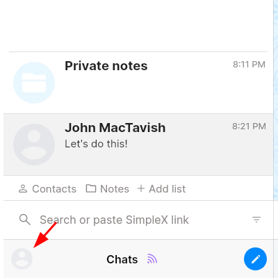
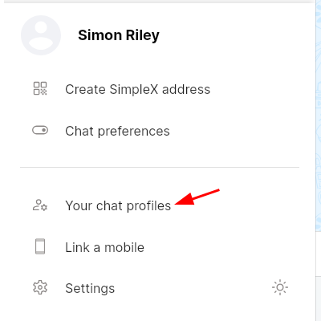
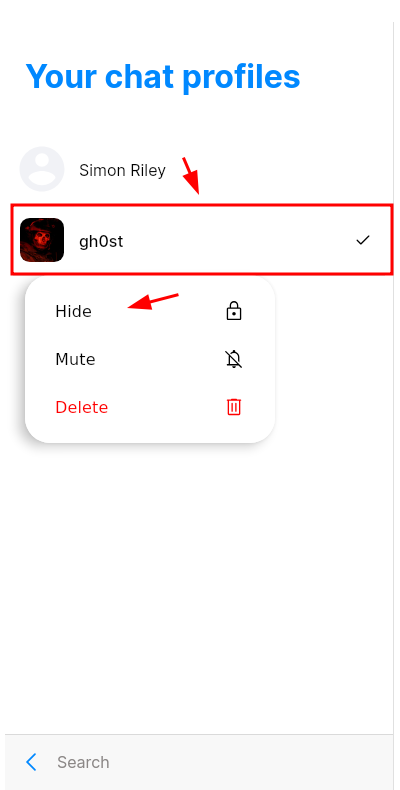
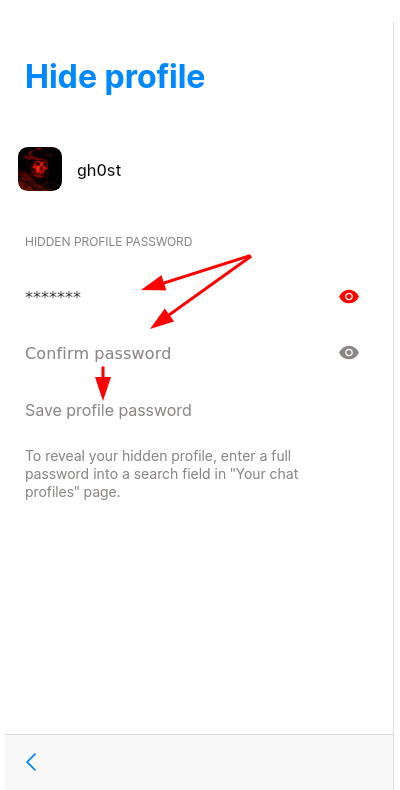
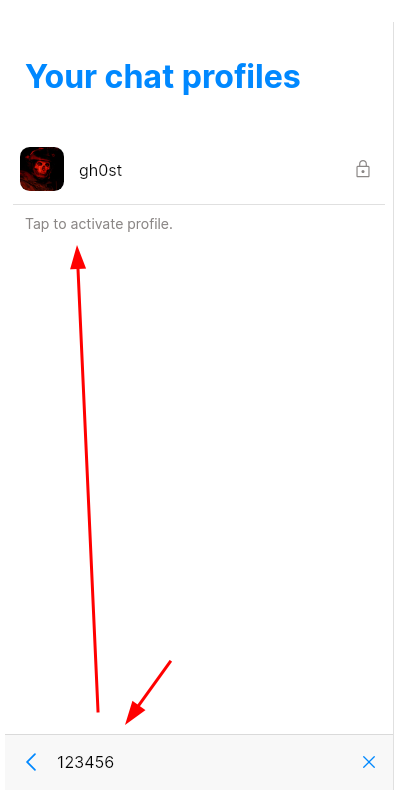

# SimpleX Deniable Chats

In this tutorial we're going to explain when and why SimpleX deniable chats are useful and showcase how to setup hidden profiles and disappearing messages.

⚠️ *Deniability Disclaimer:* This setup is only suitable [if the adversary can be told that you are using SimpleX](../toolslegality/index.md#simplex), without it being a reason to throw you in jail. Do not proceed if that's the case. ⚠️

## **Why do I need disappearing messages?**

Context: You attended a protest in a country with suppressive leadership.

Situation: After the protest the law enforcement kicks down your door and forces you to unlock your device.

In this context, the problem is that the law enforcement can prove your involvement in the protest through your chats.

## **What is the solution ?**

Setting up disappearing messages will delete messages after they have been read so they wont persist in storage after they have been read.

## **Why do I need hidden profiles?**

Context: You are a Whistleblower who tries to uncover unethical practices in the company you are employed in.

Situation: Your boss is suspicious of you and asks you to show him your chats.

In this context, the problem is that your only realistic options are to either show the chats and give yourself up or increase suspicion of your boss.

## **What is the solution ?**

Setting up hidden profiles will it make hard to prove that you have more profiles than shown in the profile list.

## How to setup hidden profiles in SimpleX ?

Prerequisites:
- two chat profiles

Recommendations:
- Mobile: Same setup as described in the [Anonymous SimpleX tutorial](../anonsimplex/index.md)
- Desktop: Not necessary, [Deniable Whonix virtual machine](../sensitivevm/index.md) is sufficient on its own
- Decoy chat in main profile: for example torrenting groups

Info: I will show the setup on the desktop version, but it is the same process on mobile. If you have not set the reachable toolbar setting the toolbar will be at the top.

1) Click on your profile in the main screen:

2) Open your chat profiles:

3) Right click secondary profile on desktop or long press on mobile and select hide:

4) Set a password, confirm it and save the profile:

Now your profile is hidden and will only be shown when selected.

5) To select the hidden profile you have to open your chat profiles again, type the password into the search bar and select the profile:

## How to setup disappearing messages in SimpleX ?

Prerequisites:
- at least one contact or one group owned by you

Recommendations:
- Mobile: Same setup as described in the [Anonymous SimpleX tutorial](../anonsimplex/index.md)
- Desktop: [Deniable Whonix virtual machine](../sensitivevm/index.md)
- Use Incognito connections

1) Open a chat (or a group you created), click on the name and open the contact preferences:

2) Make sure both you and your contact allow disappearing messages (for groups this is not necessary) and set delete after to custom:

Info: there is another timer in the main settings, this one only deletes messages for you in order to not run out of storage.

3) Set a value of your choice and click select:

4) Exit the preferences: (shown in second step)

5) Click Save and notify contact:

Now you have setup Disappearing messages for your selected chat.

If you send a message it will be deleted for each person individually after they opened your chat and the selected time has passed.

Additional source: [Threat Model SimpleX](http://gothoxeo4g2yqa3ba27z3sigeprlwan3deogkejooe7zqccou6qgkvad.onion/simplex-chat/simplexmq/blob/stable/protocol/overview-tjr.md#threat-model)

## Scenario rundown

If an adversary were to seize your phone right now and force you to type the password it is very unlikely for him to find the hidden profiles, and he wont be able to read the messages from earlier conversations, given you have read them and the timer has passed.

## Limitations

It is possible to prove messages have been sent as the chat in the main display will show deleted message and it is known when the last message was read.

If the contact does not open the chat the unread messages can persist forever.

- Your contact could be recording all new messages from you in real time and saving them to some external source before they disappear. Make sure you trust your contact enough or don't share sensitive information if you're unsure.

- The hidden profile is not encrypted separately and is running in the background even when hidden, which enables time correlation attacks and recovering the hidden profile without the password to skilled adversaries. For proper isolation it is always necessary to use separate virtual machines on desktop or profiles on mobile. It is not to be relied on the isolation provided by the network settings.

- If a group is used one time links are not possible and if the invite link gets leaked someone could join and read the messages, for this setup it is recommended to disable sending previous messages to new users and delete the invite link after all wanted members have connected.

- You won't get notifications from a hidden profile. It is possible that sensitive messages persist unread if you don't open the hidden profile regularly.

- It might make sense to allow delete for all, for a scenario where one contact knows that the other contact will have his chats checked while not having read all sensitive messages.

- Only the messages sent after setting the timer will disappear, other messages are unaffected.

- In the CLI hidden profiles are not possible.

- Time correlation attacks might also be possible over sent receipts, it is recommended to turn them off (wont stop adversaries that can perform large scale traffic analysis). 

- If the adversary runs forensics he might be able to recover deleted messages that were written to storage and haven't been overwritten yet, as a best practice it is recommended to overwrite the whole storage after each sensitive conversation, for example by taking a video of something that moves like a busy street, clouds or a tree on a windy day until you run out of storage. Another mitigation would be to run simplex in [live-mode](../livemode/index.md) when the Desktop version is used.

## Conclusion

And that's it! thanks to this tutorial the vast majority of adversaries won't be able to recover your sensitive conversations!
