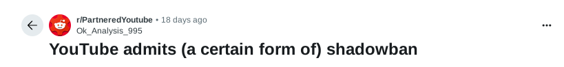

# The futility of talking OPSEC on Statist platforms

```
TLDR: If you talk about how to operate outside of the state's control, on statist centralised platforms (youtube, twitter, google, facebook, etc), you get shadowbanned (meaning your visibility gets drastically reduced), or straight up banned from speaking on those platforms. Either you lick their boots to have more visibility, or you keep your dignity and get pushed into a corner where noone goes.
```

## Introduction

Have you ever noticed how difficult it is to find information about [OPSEC](../opsec4levels/index.md), [Agorism](../agorism/index.md), or [Anarchy](../stateistheenemy/index.md) on most mainstream platforms? Similarly, content related to state scandals is often hard to access. The reason is simple: many creators who share this type of information are shadowbanned on these platforms.

In this article, we'll explore how shadowbanning works, why it happens, and how to avoid it. Shadowbanning is a subtle but powerful form of censorship, and it is often justified under various fuzzy policies and terms of service.


## What means shadowban ? 

If we look at [wikipedia](https://en.wikipedia.org/wiki/Shadow_banning) shadowbanning is defined like this: "*Shadow banning, also known as stealth banning, hell banning, ghost banning, and comment ghosting, is the practice of blocking or partially blocking a user or the user's content from some areas of an online community in such a way that the ban is not readily apparent to the user, regardless of whether the action is taken by an individual or an algorithm. For example, shadowbanned comments posted to a blog or media website would be visible to the sender, but not to other users accessing the site.*" 

In essence, a shadowban is just a regular ban, but disguised to look like nothing has happened. For example, several YouTube creators who criticized the platform have noticed that their content no longer appears on the front page and that fewer notifications are sent to their subscribers. This has led to a significant drop in their viewership and revenue. Since the platform controls both their visibility and their income, this kind of hidden punishment directly undermines their freedom of speech.

If you try to search for information about YouTube shadowbans on Google (which owns YouTube), most of the top results are articles debunking or denying the existence of shadowbanning. This is a serious issue, as it limits public awareness and understanding of the topic. When the same company controls both the platform and the search engine, it becomes much easier to shape the narrative and suppress certain discussions.



> Warning: Before clicking the links below, please note that some original sources are in French. However, key notions have been translated and summarized in the linked Reddit post.

Fortunately, there is a Reddit [post](https://www.reddit.com/r/PartneredYoutube/comments/1lhaw8q/youtube_admits_a_certain_form_of_shadowban/) that links to an official statement from YouTube, in which the platform effectively admits, though in different terms, that it engages in shadowbanning.

This Reddit post refers to a YouTube [video](https://www.youtube.com/watch?v=mWNVtzh-ZSk) titled "*Suivez en direct l'audition de Meta, X et YouTube par la commission d'enquête parlementaire TikTok*" which was published by a French news channel (BFMTV).

The key statement from the YouTube representative during the hearing is as follows:

"*Sometimes we are unable to remove content that is potentially harmful or that we would prefer not to see recommended, but which does not violate French law or our terms of use. In such cases, what we can do, what we can implement, is to reduce the virality and visibility of this content by no longer recommending it, and so in a number of cases, that is what we do.*"

This statement is a clear admission that YouTube deliberately limits the reach of certain content, even if it doesn't break any laws or violate platform rules. By suppressing content from recommendations and reducing its visibility, without notifying the creator or removing the video, YouTube is effectively engaging in a form of shadowbanning.

Occurrences like this, especially when recorded during an official legal commission, should be downloaded, backed up, and shared widely on non-statist platforms to ensure the information is preserved and never disappears.

If you read the comments on the Reddit post, many users defend YouTube vigorously. This could be due to natural skepticism, the typical critical mindset common on Reddit, or because some commenters are convinced statists supporting the platform's control.


The most common argument used by those who deny the existence of shadowbanning is that it's not shadowbanning at all, but simply the result of the "algorithm". The term "algorithm" is often used on platforms to explain why some content goes viral and why others don't. However, it's a vague term, widely misunderstood by most viewers, and tends to be used more as a "magic explanation" rather than a clear, logical one.

This is a common tactic in politics as well: using complex or poorly understood terms to justify decisions instead of providing clear explanations. In the case of algorithms, since no one outside the platform's engineers truly understands how these algorithms work, especially since those who do are often bound by NDAs, it becomes a convenient way to justify almost anything.

Here is an example of how YouTube algorithm is explained to people: 


As you can see, this explanation is so overly simplified that it removes any real chance of understanding how things actually work. How can you claim that the algorithm is responsible for such issues when the explanation is this vague?

## Examples of shadowbanned creators on YouTube

Many creators have been shadowbanned on YouTube over the years, and there are various reasons for this. Some have been shadowbanned for political reasons, others for criticizing the platform itself, and some due to actions outside the platform. But what we will focus on here is the group that gets shadowbanned for sharing information that doesn't align with the narrative YouTube is promoting.

OPSEC (Operational Security) is a crucial topic, and it's at the core of this blog, "OPSEC Bible". Many people are deeply convinced that offering OPSEC advice is essential for personal security. However, OPSEC also serves as a way to protect ourselves from government surveillance. Governments have long been monitoring our online behaviors, gathering data about our habits and actions, which makes OPSEC an invaluable tool in defending against them.

But that's where the problem arises. Governments, often acting as corrupt global entities, have long been intertwined with the companies that own the platforms we discuss here, turning them into statist platforms. While freedom of speech is still upheld, outright deletion of OPSEC related content would be seen as dictatorial. Instead, shadowbanning becomes the method of choice, allowing the platforms to silence voices without appearing overtly oppressive.


Here is an interesting [article](https://www.citizen.org/article/mission-creep-y-google-is-quietly-becoming-one-of-the-nations-most-powerful-political-forces-while-expanding-its-information-collection-empire/) giving information about the relationship between government and Google. 

**Known cases:**

1) **The Electronic Frontier Foundation (EFF)**

While not fully shadowbanned, the EFF has raised concerns about censorship and suppression of content related to digital privacy and security. They advocate for online rights and occasionally see their content or campaigns suppressed by platforms.

Channel [link](https://www.youtube.com/@EFForg)

2) **PrivacyTools.io**

PrivacyTools.io is a privacy advocacy group, and their YouTube content about privacy tools, OPSEC, and secure communications has faced restrictions or demonetization.

Website [link](https://www.privacytools.io/)

3) **The Hated One**

A YouTube channel that focuses on privacy, security, and digital rights, The Hated One has frequently discussed censorship and its effects on creators in the OPSEC space. Many of his videos have been de-prioritized or shadowbanned, especially those discussing anonymity tools like VPNs, Tor, and encryption.

Channel [link](https://www.youtube.com/@TheHatedOne)


4) **The Thought Police**

This channel discusses privacy, digital security, and how big tech and governments infringe upon personal freedom. Several of its videos were shadowbanned or restricted by YouTube after content related to surveillance and government overreach was posted.

Podcast [link](https://audioboom.com/channels/4995113-the-thought-police)

5) **Techlore**

Techlore covers privacy, security, and OPSEC in the digital age. The channel often discusses how-to guides for maintaining privacy and security, and YouTube has taken actions like demonetization and de-prioritization on videos related to anonymity tools or sensitive topics that go against mainstream narratives.

Channel [link](https://www.youtube.com/@techlore)

6) **Tails (Project)**

Although Tails itself is a privacy-focused project, some creators and users who discuss Tails OS, a security-focused Linux distribution, have faced censorship and shadowbanning for posting tutorials or guides on using the OS to safeguard privacy.

Article [link](../tailsqemuvm/index.md)

7) **Security Now**

Steve Gibson and his Security Now podcast occasionally discuss issues surrounding OPSEC. While the show itself is not shadowbanned, some of its content discussing encryption and privacy has faced visibility suppression or demonetization.

Channel [link](https://www.youtube.com/c/securitynow)


8) **James Corbett (The Corbett Report)**

Though Corbett is mainly known for his independent investigative journalism, his videos on surveillance, privacy, and the role of governments in shaping narratives have occasionally faced restricted visibility. His discussions on OPSEC are often seen as controversial.

Channel [link](https://www.youtube.com/@corbettreport)

**Now that we saw a few known cases, I'd like to add extra focus on these three ones:**

1) **Sam Bent**

*Content Focus*: Sam Bent is a privacy advocate who shares valuable content about OPSEC, anonymity, and privacy tools. He often discusses topics related to personal privacy, anonymity on the internet, and the use of privacy-focused tools like VPNs, Tor, and [Monero](..//monerofirst/index.md) (XMR).

*Shadowbanning & Visibility Issues*: While there isn't a lot of official documentation about Sam Bent's content being shadowbanned, he has reported issues with YouTube's algorithms in terms of demonetization and restricted reach for videos discussing privacy tools and topics such as cryptocurrencies. These subjects are often seen as controversial by platforms, which leads to visibility suppression.

*Reason for Suppression*: YouTube might restrict content related to privacy tools and cryptocurrencies to comply with local regulations or prevent illegal activities (such as money laundering, despite the legitimate use of these tools for privacy).

Channel [link](https://www.youtube.com/@Sam_Bent)


2) **Monero Talk**

*Content Focus*: Monero Talk is a podcast and YouTube channel that primarily focuses on discussions about Monero (a privacy-focused [cryptocurrency](../truecrypto/index.md), privacy, anonymity, and topics related to digital freedom. It includes interviews with experts, project updates, and tutorials related to Monero's usage in OPSEC and private transactions.

*Shadowbanning & Visibility Issues*: As a channel focused on Monero, which has often been linked with privacy advocacy and decentralization, Monero Talk has faced issues with platform restrictions. Videos and content discussing Monero's privacy features and its use in anonymous transactions often experience visibility suppression on YouTube.

*Reason for Suppression*: Content discussing privacy cryptocurrencies like Monero is a target for shadowbanning because these coins are frequently associated with illegal activities such as money laundering and dark web transactions. While this association is unsubstantiated in legitimate usage, platforms like YouTube might suppress such content to comply with government or legal pressure.

Channel [link](https://www.youtube.com/@MoneroTalk)


3) **SethForPrivacy's Opt-Out Podcast**

*Content Focus*: SethForPrivacy is a well-known privacy advocate who runs the Opt-Out Podcast, focusing on privacy rights, anonymity, and digital freedom. His content covers a wide range of topics from OPSEC, digital security tools, and data privacy to issues surrounding government surveillance.

*Shadowbanning/Visibility Issues*: SethForPrivacy has reported issues with YouTube's algorithm, including demonetization, video removal, and reduced visibility for videos discussing privacy tools, surveillance, and even cryptocurrencies. While shadowbanning has not been officially confirmed, the content that focuses on OPSEC, privacy rights, and anonymity tools has faced restrictions.

*Reason for Suppression*: Like other creators in the privacy space, SethForPrivacy's content is seen as controversial by platforms due to its direct challenge to government surveillance and the promotion of privacy-enhancing tools. YouTube often censors or restricts content that discusses such topics because they may be perceived as facilitating illegal activity or evading government monitoring.

Channel [link](https://www.youtube.com/@OptOutPodcast)


As you can see, most of these creators were shadowbanned for the same underlying reason: they aim to inform and help people protect themselves from government surveillance by sharing entirely legal advice. However, because such advice can also be used by individuals engaging in illegal activities, platforms like YouTube, under pressure from states or regulatory bodies, often choose to suppress it. This logic is flawed: many things can be used for both good and bad, yet we don't restrict them. For instance, physical fitness can aid criminal activity, but sports and exercise are actively promoted across mainstream platforms without hesitation. The issue isn't the tool, it's how and why it's being restricted.

In this case, quality is not the issue. Even though these creators consistently produce high-quality content aimed at promoting and protecting individual freedom, they are still quietly silenced by mainstream platforms that often act in alignment with government directives. Their commitment to empowering individuals through knowledge is overlooked, simply because their message challenges the systems in power.

## Youtube test

To understand how YouTube displays content related to online privacy, I conducted a simple search using the phrase "hiding online activities", a query that someone new to OPSEC might use when looking for information.

Here are the top results that YouTube displayed:


As you can see, the top three results aren't really related to OPSEC. The first is an advertisement, while the next two focus on hiding your online status on WhatsApp.

This raises several concerns. First, I never mentioned WhatsApp in my search. I wasn't signed in to any account where WhatsApp had been searched before. On top of that, WhatsApp isn't even installed on my device, and I was using the [Tor](../torbrowsing/index.md) Browser with no prior browsing history.

Secondly, WhatsApp is owned by Meta, a company widely known for its close ties to government agencies and for sharing user data with them. This means that YouTube is essentially promoting a platform that is heavily monitored by the state.

The final issue is that someone new to OPSEC, searching for ways to protect their privacy, might mistakenly believe that WhatsApp is a secure solution simply because it offers the option to hide online status. Something that, in reality, provides no meaningful security or privacy protection.

If we look at the next results, we will find this: 


The first few results are YouTube Shorts about an online hide-and-seek game, completely unrelated to our topic. The next video appears more relevant at first glance, but it's actually just a promotion for NordVPN, which is widely considered one of the least effective and most mainstream VPN services available. Additionally, this VPN service is known for being highly cooperative with government agencies, which raises serious concerns about its ability to truly protect user privacy.


The last result is for Zangi Private Messenger, which is marketed as a secure messaging app but, in reality, falls short of true security. Here is an [article](https://malwaretips.com/blogs/zangi-messenger-app-scams/) that explains why. 

Every other result on the first page follows the same pattern, promoting similar topics that align with statist solutions while pushing genuine content related to the original query into obscurity. This clearly suggests the platform is designed to favor government-friendly narratives and make authentic OPSEC information harder to find.

## And what about other platforms? 

We've focused a lot on YouTube throughout this blog post, but what about other mainstream platforms? Unfortunately, the situation is much the same.

Most major platforms engage in shadowbanning or similar practices, targeting content creators based on the topics they discuss. Here's a quick analysis of how some of the main platforms handle this issue:

1) **Facebook**

*Shadowbanning Examples*: Facebook has been reported to reduce the reach of posts or pages without notifying the users, especially those sharing content that challenges mainstream narratives or political views. Activists and smaller pages often complain about their posts not appearing in followers' feeds.

*Reason*: Often linked to content that Facebook's algorithms or moderation teams deem "controversial" or violating community standards, sometimes in ambiguous ways.


2) **Instagram**

*Shadowbanning Examples*: Instagram users report their posts and hashtags getting hidden or their engagement dropping sharply without explanation. This is common for accounts discussing political dissent, alternative health, or content critical of governments or major corporations.

*Reason*: Instagram's opaque algorithms limit visibility for posts considered "spammy" or violating vague community guidelines. Hashtags related to sensitive topics often get restricted.


3) **TikTok**

*Shadowbanning Examples*: TikTok has been accused of suppressing videos related to topics like LGBTQ+ issues, political protests, or COVID-19 skepticism. Creators note their videos stop appearing on "For You" pages or lose visibility suddenly.

*Reason*: Content moderation focused on compliance with local governments and platform policies leads to selective visibility, especially in regions with strict censorship laws.


4) **X (formerly Twitter)**

*Shadowbanning Examples*: X users report tweets not showing up in search results, replies, or timelines of non-followers without any notice. Accounts discussing politically sensitive topics or spreading views counter to mainstream narratives face reduced visibility.

*Reason*: To reduce misinformation or harmful content, but critics argue this also silences dissenting opinions or inconvenient truths.


As you can see, trying to discuss OPSEC or challenge governments on mainstream platforms is essentially futile, since shadowbanning is widely practiced and largely accepted by the public. However, if your content aligns with the government narrative, these platforms become an online paradise, allowing you to earn money, sometimes even substantial amounts, as long as you don't oppose the powers that be. 

And that's how they ensure maximum support, by using money as a tool to pressure people into compliance and to control the flow of information.

## What is the solution? 

As we've seen, mainstream platforms are heavily influenced by governments and prioritize control over people's freedom. 

The only real solution to combat this is simple: **we must create our own platforms and operate on them**. This is the only way to reclaim our liberty and ensure that we can share any information freely. If we can establish spaces that aren't monitored by governments, where people can truly express themselves, then the issue of mainstream platform censorship will no longer hold any power over us.


Some alternative platforms are already existing, but there is now way to warranty that these are not yet under government pressure. Anyway, I'd like to share some of them that look pretty interesting: 

1) [Minds](https://www.minds.com/)

*What it is*: A decentralized social media platform that champions free speech and privacy.

**Key Features:**

- Uses blockchain technology for transparency and control over user data.

- Rewards users with cryptocurrency for their content and engagement.

- Provides a way for users to create and share content without censorship from corporations or governments.

2) [Peertube](https://peertube.tv/)

*What it is*: A decentralized video hosting platform, designed as an alternative to YouTube.

**Key Features:**

 - Peer-to-peer hosting, meaning anyone can host their own server, creating a decentralized network.

- Open-source software, offering greater freedom and fewer restrictions.

- No corporate-driven censorship or advertisements.

3) [LBRY](https://lbry.com/)

*What it is*: A decentralized content sharing platform and protocol for digital media.

**Key Features:**

- Content is hosted on a blockchain, meaning it's harder for authorities to take down or censor.

- Users can earn cryptocurrency by sharing content or interacting with other users.

- Focuses on eliminating censorship and providing creators with full control.

Unfortunately, all of these websites I shared with you are Clearnet ones, which is not so good. In any cases, you should prefer the [Darknet](../clearnetvsdarknet/index.md), which is way superior. 

Here's an additional focus on a self-hostable video hosting solution that perfectly works on the darknet, guaranteeing free speech and complete independence from any corporation:


4) [MediaCMS](https://www.mediacms.io/)

*What it is*: A decentralized, self-hosted content management system (CMS) designed for video hosting.

**Key Features:**

- This solution allows you to host your own video platform on your own server or via a private hosting [provider](../anonymousremoteserver/index.md). 

- It is designed to function on networks such as the darknet or other private networks, ensuring that your content remains private and secure. 

- The platform is built to handle high-quality video streaming, and you can upload, organize, and share videos just like on mainstream video-sharing websites that we need to avoid.

- Since MediaCMS is [open-source](../compilation/index.md), you can customize the platform to suit your needs.

- Unlike YouTube, Facebook, or other corporate-run platforms, MediaCMS has no central authority dictating what can or cannot be uploaded. (Good bye Shadowban!)

As you can see, this solution stands out as the best option in the list. First and foremost, it is fully self-hosted, meaning you're not dependent on any corporation. Your free speech cannot be attacked, and you can upload whatever content you wish, **as long as your OPSEC is solid**. Another major advantage is that you maintain ownership of your data, which is incredibly important if you don't want to give away all your hard work to platforms like YouTube. Plus, since it operates on the darknet, you can protect both yourself and your users from government surveillance.

If you are interested in this project, here is the [Github](https://github.com/mediacms-io/mediacms) page. 


## Conclusion

Be curious, read some articles of the OPSEC [Bible](http://opbible7nans45sg33cbyeiwqmlp5fu7lklu6jd6f3mivrjeqadco5yd.onion/) about [media](../mediapropaganda/index.md) and [corporations](../poisonofmoderntimes/index.md), talk to people that are silenced on mainstream platforms. Avoid social media and corporations. 

The further you distance yourself from statist propaganda, the freer you become.

Why waste time trying to speak on platforms where no one will truly hear you? That's exactly why most OPSEC specialists have moved away from mainstream platforms and are now building their own. It's the modern equivalent of pirate radio: independent, resilient, and beyond centralized control.

Fortunately, we have an edge: we're better than governments at building effective, secure online solutions. This is a fight we can win.
