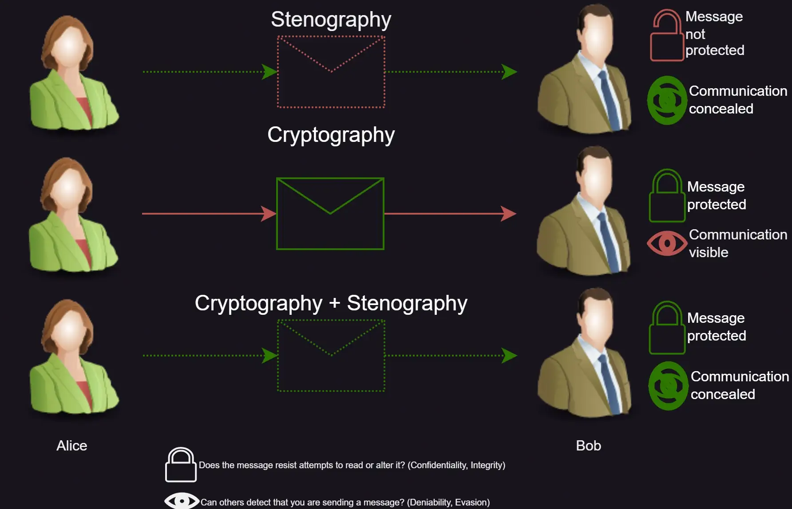
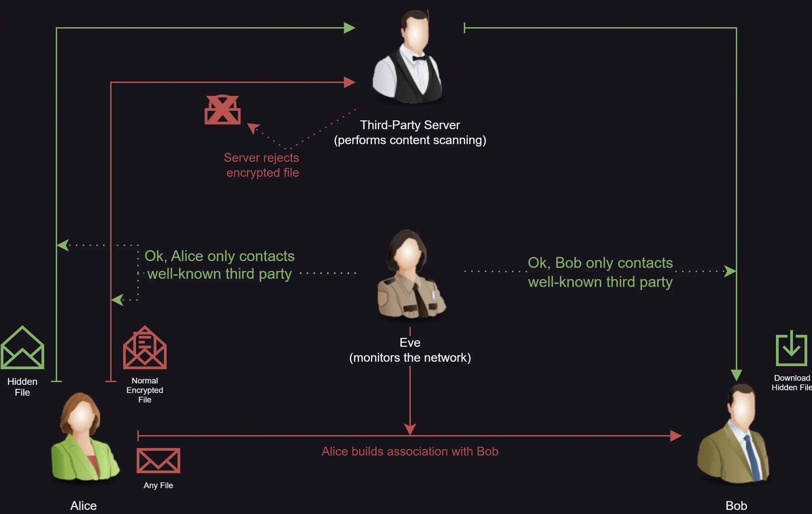

# Other sources of Plausible Deniability: Steganography

```
TLDR: you can hide data in videos, images, or pictures, and more, without the adversary realizing that data has been hidden in those files in the first place.
```

Steganography is the craft of hiding messages. It is a close relative of cryptography, but where cryptography strives to conceal the contents of a messages, steganography attempts to conceal its _presence_. Therefore **steganography helps avoiding suspicion and providing deniability**.


The important difference between the two fields is adherence to _[Kerckhoffs's principle](https://en.wikipedia.org/wiki/Kerckhoffs%27s_principle)_ : the assumption that an algorithm must be publicly known to guarantee that it has no flaws or backdoors. (This is the reason why you should only use open source crypto software and never roll your own crypto.)  
Steganography does the opposite by relying on _security by obscurity_ : the method by which you hid your data must be kept secret.

That means that whilst complementary to cryptography, steganography on itself is less secure than the mathematically provable security provided by cryptography. Think of it as tucking away your valuables in secret location versus putting them into a sturdy safe. The safe may draw immediate attention by burglars, but provides reliable resistance to attacks, whilst it is up to chance wheter they find your hidden stash.

### Then why use steganography at all?

In military science, there is the concept of the _Integrated Survivability Onion_ -- in short, the idea that they can't kill you if they don't hit you, that they can't hit you if they don't shoot at you and that they can't shoot at you if they don't see you. The same thing applies to every good digital defense-in-depth approach. Using steganography can't harm you, but **it shouldn't be all your rely on**. In our example, a hidden safe is better than either option on its own.

Here a quick overview of using steganography alone, cryptography alone and combining the two:



The main strength of steganography is that **steganography can conceal metadata** to some extent. Metadata (i.e. data about data and communications) is the primary way that state actors identify targets for closer scrutiny. When you can become guilty by association, **your primary concern may be communicating in public without anyone noticing** and not the confidentiality of your communications. (In fact, many cryptographic schemes attest the identity of the sender via signatures, which you should avoid when looking for _plausible_ deniability in case of compromise.)

However, **some form of communication event must always occur** , so steganography exploits various side-channels in order to embed additional concealed data. **In order to thwart analysis of metadata, communicate through one or multiple uninvolved third party dead-drops** , preferably such with broad distribution (i.e. popular websites, like social media or message/image boards).

When relying on such third parties, **steganography can help circumventing censors**. If an adversary controls a critical link in the network and blocks all communications they can't inspect, you need to conceal your encrypted communications inside of superficially innocuous traffic. An example of this would be a corporate email server which denies all attachments it can not scan for malware.



The major downside of steganography however is the need to tell your target audience how to find your hidden messages. Where cryptography allows for secure key negotiation even in plain sight of adversaries, informing a party you don't already have a secure communication channel with might be impossible.

