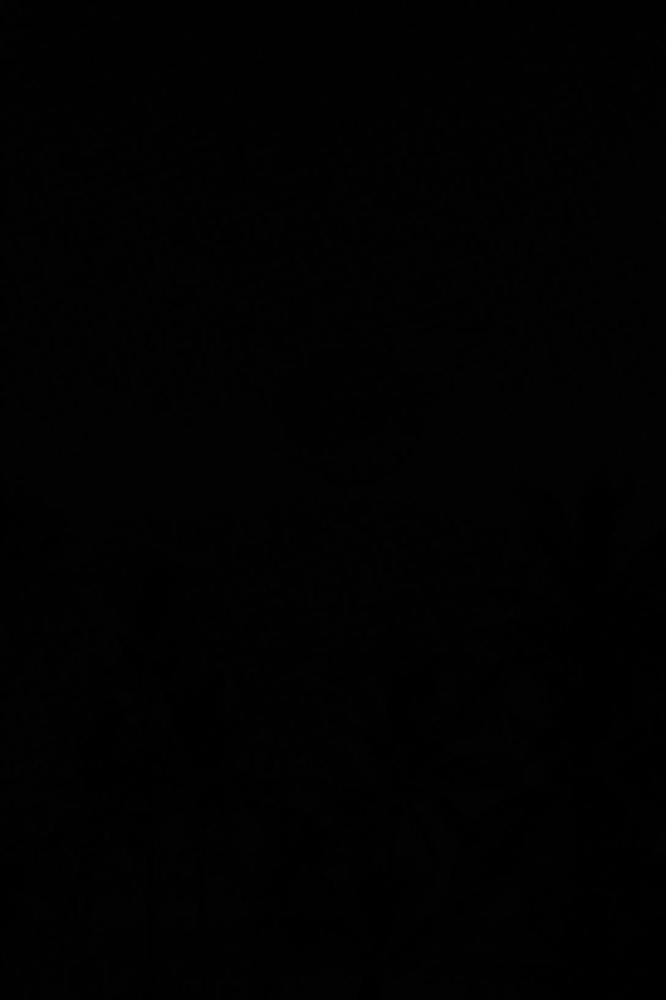
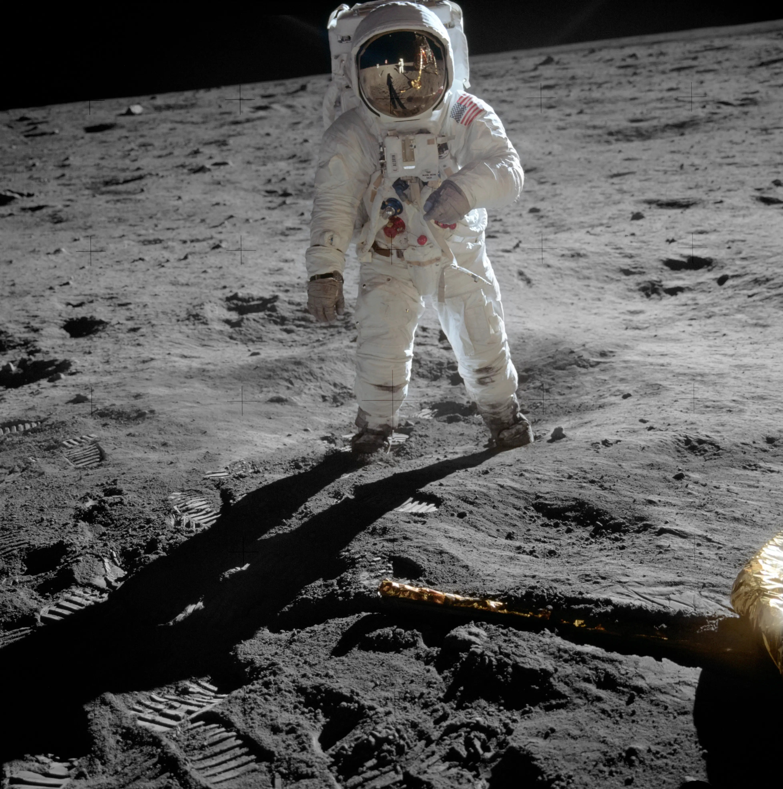

# **Using Steghide to hide data in images**

```
TLDR: you can hide data in images
```


steghide is ubiquitously mirrored in various repositories and package managers. You can also find a clone of the sourceforge repository [on GitHub](https://github.com/StegHigh/steghide). If you use APT, simply install it with
    
    
    # apt install steghide

steghide uses subcommands, and the three most important ones are `info`, `embed` and `extract` which will be explained in sequence. For this tutorial, we are going to use the [Astronomy Picture of the Day of 2024-08-24](https://apod.nasa.gov/apod/ap240824.html), a beautiful image of the anti-twilight arch:

[](apod20240824.jpg)

Our example file to hide is going to be [Bitcoin: A Peer-to-Peer Electronic Cash System](https://bitcoin.org/bitcoin.pdf), the original paper by Satoshi Nakamoto.

As mentioned above, the cover image must be larger than the file you wish to embed, **as a rule of thumb your coverfile should be 20 times larger**. (Hint: you can split larger files with tools like tar or 7z into smaller fragments to embed into a whole collection of cover files.) We can check how many bytes steghide can embed by using `steghide info _file_`. In our case, it tells us that it can embed 232 KB and asks wheter an attempt should be made at reading embed data without extracting. As there is nothing embedded yet, we decline with `n`.
    
    
    "apod20240824.jpg":
      format: jpeg
      capacity: 232.6 KB
    Try to get information about embedded data ? (y/n) 
    

The PDF is only 180 KB, so it fits. Next, we use `steghide embed -cf _coverfile_ -ef _embedfile_ -sf _destination_` and get asked for a passphrase (make sure to remember it or safe it in a password manager). After re-entering the passphrase (you can set it beforehand with the `-p` option) it will write the processed file to the specified destination. You can also leave out the `-sf` option, in which case it defaults to overwriting the coverfile. Look at it and try to find a visual difference to the original:

[](output1.jpg)

It's completely lost in the visual noise. As an experiment, let's try taking the difference of both images with a program like GIMP. This is what it looks like:

[](difference.jpg)

A difference of zero means a fully black pixel. Try zooming in and you'll see that only a few pixels are slightly lighter than black. These are the pixels that contain parts of your embedded file in their least significant bits.

**WARNING: changing the output file in anyway will make the embedded file irretrievable. This is especially important for every form of lossy compression!**

Now let's try to extract the file we've just hid. For this, use `steghide embed -sf _input_`

. This will prompt you for the passphrase. Enter it, and the contents will be extracted into the working directory. In our case we will be asked wheter we want to overwrite the file with the same name that already exists. (You can suppress this warning with `-f` or by specifying an alternative output destination with `-xf`. Here, I used the later so we can confirm the files to be identical with md5sum: 
    
    
    d56d71ecadf2137be09d8b1d35c6c042  bitcoin.pdf
    d56d71ecadf2137be09d8b1d35c6c042  output.pdf

And they are! This concludes the basic introduction to steghide. Some advanced details follow below, but in most cases, reading the well-written man page suffices.

## **Advanced Use**

### **Common Pitfalls**

There are a couple of things you shouldn't do with steghide. Here a quick overview:

  1. **Use strong passwords:** Always a given. The password to steghide can be brute-forced like every other password. [stegseek](https://github.com/RickdeJager/stegseek) can brute force 14 million passwords in under 2 seconds.

  2. **Use original images:** Known images can be easily double-checked against your cover files. If for example the Monero icon on your website is different to that included in the official press kit, that's suspicious, defeating the purpose of steganography. Make sure to only use this with originals only you are in possession of - in a pinch, adding an in-picture caption, resizing it, etc. offers plausible deniability, as different image editing programs are notoriously variant in handling pixel-level details.

  3. **Avoid images with little detail:** Images without pixel-level visual noise (e.g. diagrams, images of text, etc.) will have less hiding space, and become visible deteriorated when files are embedded. For demonstration purposes, compare [this map](map.jpg) with its [original](map_orig.jpg), then look at [their difference](map_diff.jpg). The embedded file was a mere 4286 B in size, yet these two files differ by 6693 B in size! (The password is left as a brute-forcing exercise for the reader.)

  4. **Avoid format conversions:** Even "lossless" conversions from one image format to another tend to be non-reversible, making it impossible to retrieve the hidden data. Remember that many popular websites compress all images uploaded to them to save on bandwidth, making them unsuitable for our purposes.


### **Changing the encryption**

As you've seen, steghide needs a passphrase to embed and extract data. (Note: using an empty passphrase can lead to issues extracting.) This passphrase is used to both encrypt your file before embedding and to seed the PRNG by which it selects pixel positions for embedding data. By default, it uses AES-128. You should not rely on steghide for securing your data cryptographically (see the [introduction to steganography](../steganography/index.md)), and when in doubt you can separately encrypt the file before embedding, but you may still want to change the used algorithm. For this, simply use `-e _algorithm_ _mode_`. You can list all available modes with `steghide encinfo`. So as example, to embed our previous picture using AES-256 in cipher feedback mode, you would use this:
    
    
    $ steghide embed -cf apod20240824.jpg -ef bitcoin.pdf -e rijandael-256 cfb 

### **Using steghide recursively**

Since steghide works on arbitrary binary data, you can embed steghide's output into another picture, provided the size is sufficient. The 4.8 MB picture below contains a 260 KB waveform audio file which in turns contains 2.7 KB UTF-8 encoded text file. (The passphrase is `moon` for both.)

[](apollo11.jpg)

