# Stylometry Protection (Using Local LLMs)

```
TLDR: you can use LLMs to rewrite your messages, to prevent the adversary from deanonymizing you.
```

In this tutorial we're going to take a look at how to use local LLMs to rewrite messages to prevent being deanonymized by the way you write.

## **Stylometry Fingerprinting**

We all have **writing styles**, from common word choice to sentence structure to the topics we talk about. When enough writing is analyzed, these many details combine to make your writing **uniquely identifiable.**

Most of these features are hard to see visibly or prevent, occurring naturally within everyone's writing. For example, it's hard to constantly keep track of the length of each sentence, your most used words, or other writing metadata.

Patterns in word frequency, slang, references, topics, sentence length, language, and dozens of more measurements will emerge over time. This statistical and linguistic analysis is known as **stylometry** and is mainly done algorithmically and by artificial intelligence.

**Who you are, your interests and skills, your ethnicity and location, and even the content you consume,** all of it can be signaled in wording and interpreted with stylometry.

Let's look at a few simple examples: 

- If your forum posts have certain **slang,** an adversary can **estimate your age** or groups you're part of.
- If your writing is consistently technical or includes references and wording central to a specific field, the adversary can roughly infer **your profession, level of knowledge, and skills,**.
- Metaphors, grammar, **word choice**, or speaking in multiple languages can reveal **ethnicity, location, or content you've read.**


These are only a few visible examples and even general **personality**, such as if the tone of all messages are outgoing and friendly, can be concluded. 

Using Satoshi Nakamoto as an example, one of the most discussed things about his identity are his speech forms: his use of British English and double spacing after each period, something mostly done by those who learned to type much earlier or on a typewriter. With two minor details about his writing, both his ethnicity and age can be inferred.

Text details and characteristics are already compromising for anonymity since an adversary can refine their search with each identifier they conclude.

However, another threat that stylometry poses is when all of these little details are combined. With enough text, Adversaries can form **writing profiles** which include all specific writing traits of an author. Since these cover a significant amount of information, they are statistically unique. These are also called fingerprints or signatures.

If an adversary has the writing profile of Alice, based on many of her words and posts, and an anonymous post with an unknown author, they should be able to statistically determine **whether or not Alice wrote the anonymous post.**

This identifiability provides more direct attack vectors for a resourceful adversary:
- Search of public writing like Reddit profiles, X accounts, forums, etc, could lead to old accounts which may reveal identity, even if the account is old or not active anymore.
- Details collected can be used to statistically **narrow possible identity** (through information combination) to just a few thousand people.


This approach has been used in [many areas](https://en.wikipedia.org/wiki/Stylometry#Case_studies_of_interest) like forensics, authorship attribution, or determining if [Shakespeare](https://www.latimes.com/science/sciencenow/la-sci-sn-shakespeare-play-linguistic-analysis-20150410-story.html) wrote a play.

Multiple anonymous personas, even if they are fully [segmented](../internetsegmentation/index.md), can also potentially be correlated based on writing styles, leading to information from both being combined for deanonymization. 

Importantly note that stylometry does not have to be done to this scale to be usable. Even without profiles, an adversary can extract a lot of information with algorithmic analysis. As discussed, each minor detail of someone's writing will always give insight into who they are.

The best way to mitigate this is rephrasing text.

## **LLMs**

In order to avoid the analysis or profiling of text, we have to **consistently rephrase writing** to make finding the original writing style impossible, varying all identifiers but keeping meaning intact.

The adversary can still attempt to use stylometry but they will be analyzing the rephrased text instead of the real text, the actual style not visible to them, preventing proper fingerprinting.

To achieve this, the only option that provides the needed reliability and consistency are LLMs. Other options such as doing it by hand or translating text still do not entirely obfuscate writing style and are much slower and tedious. The AI model we use **has to be ran locally** since, when using a 3rd party provider such as OpenAI or Anthropic, the original text is seen, processed, and logged by them, entirely defeating the goal of trying to hide writing style. 

After rephrasing the original writing using the local model, we can use the text as normal, such as in chats or posts.

A simple visualization of what this looks like is as follows:


By using LLMs, the writing details will be inaccurate to the original text and unidentifiable, **reducing the risk of stylometry-based deanonymization significantly.**

### Software and Requirements

For this tutorial, we will be using **Ollama** for the backend and **Open WebUI** as the frontend. Instruction on how to set both of these up along with information on model choice and performance are in the [local llms tutorial](../openwebuilocalllms/index.md), which is a recommended prerequisite. This post can still be followed with alternate backends or frontends.

Here is a visual of what that setup looks like:


LLMs are good at rephrasing text, so even relatively small models are usable for this task. As such, system requirements on VRAM are minimal. Moreover, context size will be negligible since only brief text will be processed and not long conversations.

Gemma3-4B (Q4_K_M) will be used in this post's examples and both the Gemma 3 and Qwen 3 model families are great for rephrasing and in general. They are multilingual (support over 100 languages) and have various model sizes as well. Open source models are always being developed, so there may be better models at the time of reading. In case your instructions or personas are complex and don't work well with the smaller models, larger models such as Gemma-3 12B or Qwen-3 14B can be used. 

## **OpenWebUI and Prompting**

In the simplest form, in order to get a local LLM to rephrase text, we can directly ask in a new chat: "Rephrase this text: text". Here is an example with Gemma3-4B, with the sentences:
    
    1: Not really, I think that guy over there would know about it but I'm not sure.
    
    2: Linux distros are open source operating systems based on the Linux kernel. Also, did you know cats can fly? Alright, bye! 

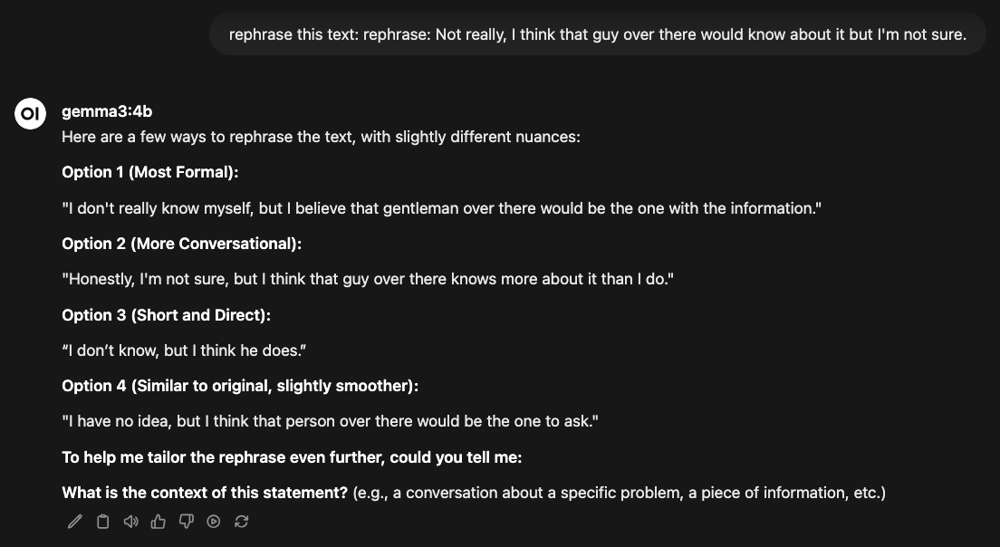

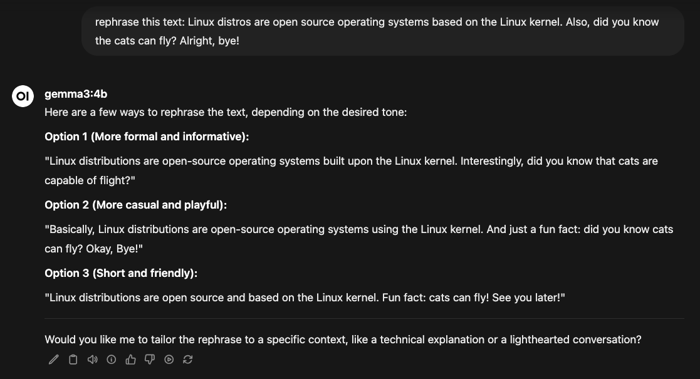

The model gives us several different ways to rewrite the sentences. This functions properly and can be used, but it lists too many options, struggles with longer text, is hard to tune, and takes time to get a specific writing style. For more control and easier interfacing, we can use **system prompts**. 

### System Prompts

Think of a system prompt as instructions given to the model to **guide how it responds.** For example, if we want it to act more friendly, we can put that in the system prompt and it will respond more friendly. They can be used for a wide array of things since guidance is open ended.

When a system prompt is defined, it's sent before the user prompt and often with the role of 'system', rather than user or assistant, in the chat. 

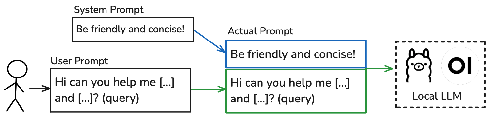

Here is an example of how they are formatted with Qwen 3:

    <|im_start|>system
    Be friendly and concise!<|im_end|>
    <|im_start|>user
    Hi can you help me with [...]<|im_end|>
    <|im_start|>assistant
    (response)<|im_end|>

With Gemma 3, there is no system role, so prompts are formatted like this:

    <start_of_turn>user
    Be friendly and concise!<end_of_turn>
    <start_of_turn>user
    Hi can you help me with [...]<end_of_turn>
    <start_of_turn>model
    (response)<end_of_turn>

Each model will do this differently and it depends on how they are trained, but the function is the same: providing guidance for responses. 

Using system prompts, we can define how messages should be rephrased, giving far greater **control and usability.** To manage many of them, we can create presents within Open WebUI. If you are using a different frontend, the prompt instructions are still applicable.

### Setup

Firstly, navigate to the **"Workspace"** tab in the top left corner of the default home screen.

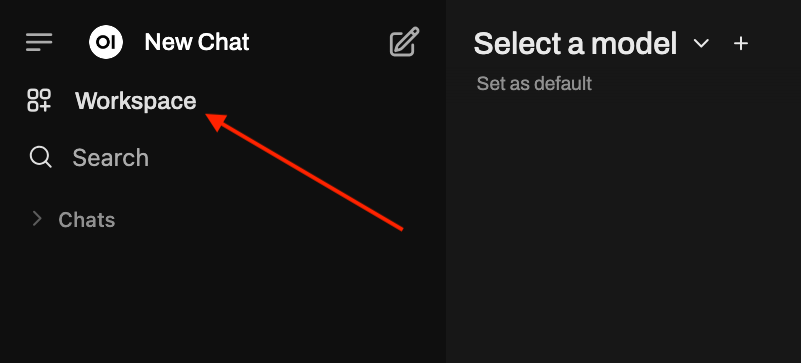

The following page will appear, where we can create **model presets**, which allow us to choose a base model and set a system prompt. Click the "+" button to create a new model preset.


This will take you to the preset creation page.


Now, we can name the model, choose which base model this preset will actually be, and enter a system prompt, each section indicated by the arrows in the image above.

Keeping it simple, let's first make a pirate, writing the system prompt so that any message we send will be rephrased in pirate-speak. 


Click "Save and Update" at the bottom of the page to create the preset.

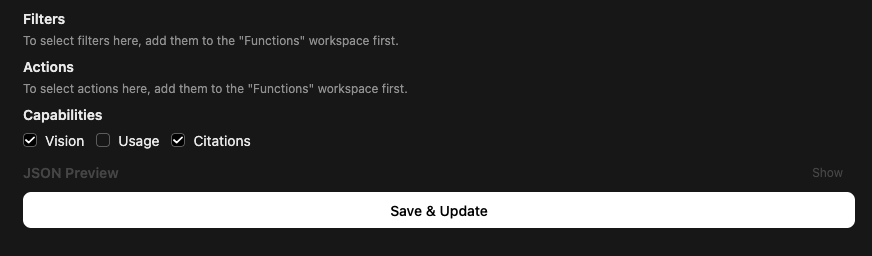

The preset will show in the workspace, where it can be edited or toggled later.

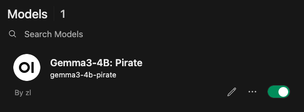

Back on the main screen, in the model dropdown, the name we set will appear: Gemma3-4B:Pirate. Selecting it will now include the system prompt "Rephrase all user input into pirate speak" with all messages.

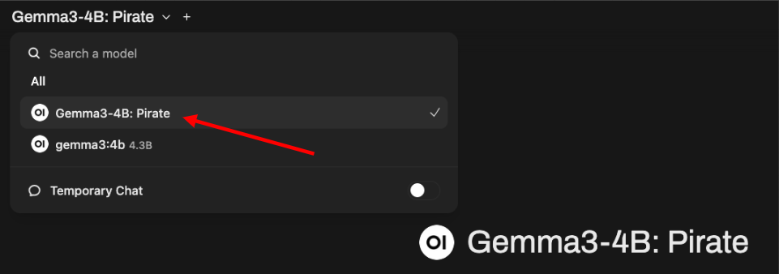

Let's test the pirate by using the same example sentences as before.

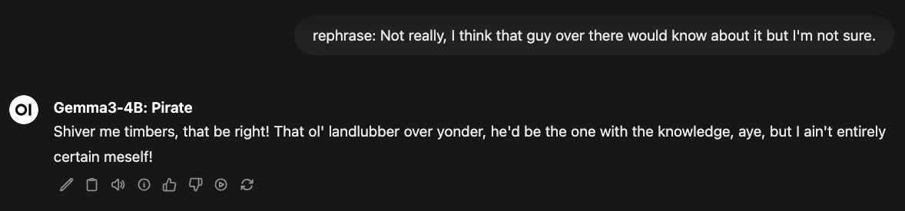

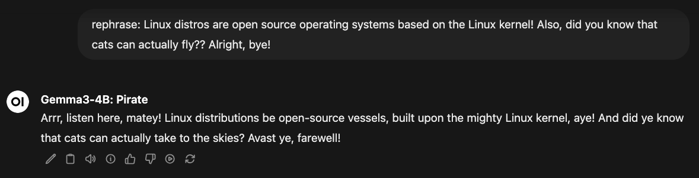

As displayed, using the preset we get a pirate rephrasing of the text. Unlike before, we get a single rephrasing that follows the set instructions.

We can apply this more practically and have a lot of freedom in the prompts we create, **adding writing styles or making personas.**

### Specific Prompting

Instead of pirate speak, let's say we want to rephrase with a specific writing style: lowercase and with a more friendly tone. Creating a system prompt for this:

    Rephrase all user input in a friendly, positive tone. Only write in lowercase. Make writing informal, friendly, and outgoing. Maintain the message content and do not write as if you are speaking, only as if you are writing. Make sure you rephrase, different than the provided message. Please rephrase:

This prompt is modified for Gemma3-4B to avoid issues that arise with this style, such as responding directly or writing like speech, and the lack of system role. 

Using the same process as before, we can save this as a preset and call it Gemma-4B:Friendly.

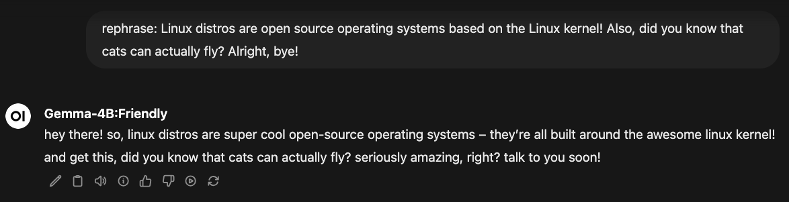

It works, the model outputting lowercase text with friendly, outgoing wording, making the personality of the message completely different and obfuscating the original tone entirely.

Now let's try another writing style, going for short rephrasing. We will write the prompt slightly differently. Creating a preset, we can call it Gemma-4B:Short:

    You are an assistant that rephrases user input. Only write in lowercase, maintaining message content with natural writing. Rephrase with short, uninterested writing. Do not force personality. Do not make it as if you were speaking, it should be as if you were typing in a chat. Write like a human and do not overuse slang. Please rephrase this message:


Again, the model is able to rephrase the message to be short, neutral, and lowercase.

These are just two examples for what we can prompt the model to do. We can choose any writing style or detail we want the rephrased text to have, giving many possible ways to change the text. Using prompts, we can create personas, present personalities, modify content, add word choice, etc.

When making a prompt, it doesn't have to be overly complicated or follow a specific formula. Instead, **simply think about what details you'd like, try to make a prompt, then test it.** If it doesn't work as expected, then **edit the prompt and try the output again.** 

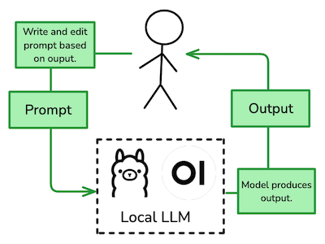

Every model and every prompt is slightly different and what works for one may not work for another, so this editing loop until you get desired output is the best approach. Broadly, more detailed instructions or telling the model what not to do are two ways that will likely better performance. For example, if you tell the model to use slang, smaller models will often overuse it. A fix for this could be to specify to only use slang when needed or appropriate.

With open ended prompts, writing style can be efficiently, fully changed:
- Personality traits: writing more friendly, negative, changing tone, etc. Even full personalities can be defined, with details related to an anonymous persona for misdirection.
- Language, such as British English or adding features from other languages.
- Content: central to a specific field/location/topic, filtering identifiable references, changing depth of messages.
- Writing details: slang, lowercase, misspellings, frequent words, etc.

We can incorporate a few or multiple of these, directly prompting for them, free to choose how to rephrase the text. They can be simple or complex and most models are capable. Using LLMs and prompted writing styles, text can be rephrased specifically and reliably.

## **Conclusion**

Writing contains many identifiable details that can be determined by an adversary using stylometry, statistical analysis of text. Fingerprinting and profiling from collected details narrow possibilities quickly and are compromising to anonymity.

The fastest, most reliable way to prevent this is rephrasing text with local LLMs. By making specific prompts, the original text is changed and the text is rephrased in a new writing style, protecting against stylometry.