# One on One large file sharing (Syncthing over Tor)

```
TLDR: You can anonymously share large files using Syncthing over Tor.
```

Onionshare is a good choice when you want to share small files over tor. But onionshare cannot handle big files, because when tor circuit fails (which is quite common in Tor) your download simply fails, and it does not support resuming the download at where it previously failed. Syncthing is a better alternative if you want to share large files over tor, it does not need any setup or hosting, and it will automatically retry at break point when network fails.

Syncthing is FOSS software and has E2EE by default, and can run it without requiring a VPS. This means you can just spin up syncthing client from your whonix workstation directly, and your data will be encrypted and sent through public syncthing nodes. If you have a threat model that needs a way to reliably share files with minimum exposure, this setup suits the need.

Syncthing has its own relays for supporting transmission of files between peers which are both behind the nat, and it works when both parties are behind tor. This allows us to guarantee the anonymity of both parties.

## _OPSEC Recommendations:_

  1. Hardware : (Personal Computer / Laptop)

  2. Host OS: [Linux](../linux/index.md) (Or Qubes OS)

  3. Hypervisor: [libvirtd QEMU/KVM](../hypervisorsetup/index.md) (Or Qubes OS's Xen)

  4. Virtual Machine: [Whonix](../whonixqemuvms/index.md)


It is highly recommended to use whonix for this setup, because there are always cases that an app might not honor your proxy setting and somehow tries to connect to the syncthing relay directly without going through Tor. It is always a good idea to put any anonymous use app in a whonix workstation, so your clearnet ip doesn't get revealed. 


## **Initial Setup**

The first thing to do is to get syncthing to your whonix workstation.

For simplicity you can just do
    
    
    sudo apt-get install syncthing -y
    

If apt does not contain the up to date package, then you need to get it from the [syncthing website](https://syncthing.net/downloads/)

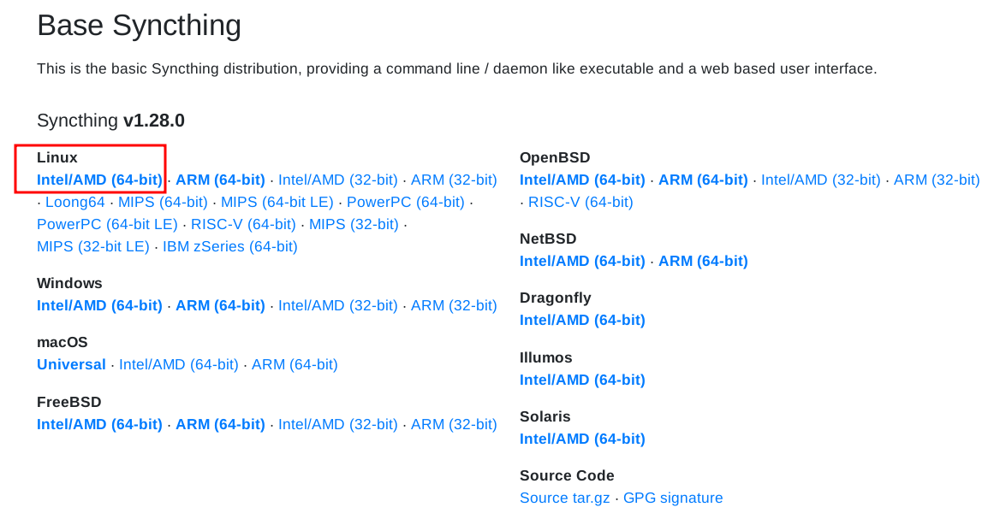

Next verify the sha256sum according to <https://syncthing.net/security/>
    
    
    curl -s https://syncthing.net/release-key.txt | gpg --import
    

Check the gpg fingerprint, it should be like this
    
    
    gpg --fingerprint
    /home/user/.gnupg/pubring.kbx
    -----------------------------
    pub   rsa2048/0xD26E6ED000654A3E 2014-12-29 [SC]
    		Key fingerprint = 37C8 4554 E7E0 A261 E4F7  6E1E D26E 6ED0 0065 4A3E
    uid                   [ unknown] Syncthing Release Management 
    sub   rsa2048/0x681C3CFCF614F575 2014-12-29 [E]
    
    

Then download verify the checksum file, and check the checksum to see if it matches
    
    
    $ curl -sLO https://github.com/syncthing/syncthing/releases/download/v1.23.6/sha256sum.txt.asc	
    
    $ gpg --verify sha256sum.txt.asc
    gpg: Signature made Mo 03 Jul 2023 10:09:30 UTC
    gpg:                using RSA key D26E6ED000654A3E
    gpg: Good signature from "Syncthing Release Management "
    gpg: WARNING: This key is not certified with a trusted signature!
    gpg:          There is no indication that the signature belongs to the owner.	
    
    $ sha256sum -c sha256sum.txt.asc
    ...
    sha256sum: syncthing-linux-386-v1.23.6.tar.gz: No such file or directory
    syncthing-linux-386-v1.23.6.tar.gz: FAILED open or read
    **syncthing-linux-amd64-v1.23.6.tar.gz: OK**
    sha256sum: syncthing-linux-armv5-v1.23.6.tar.gz: No such file or directory
    syncthing-linux-armv5-v1.23.6.tar.gz: FAILED open or read
    ...
    sha256sum: WARNING: 14 lines are improperly formatted
    sha256sum: WARNING: 35 listed files could not be read
    
    

Next you need to do some changes in the tor browser, so you can access the web panel that is running on localhost (127.0.0.1), type **about:config** inside the address bar, accept the risk and continue:

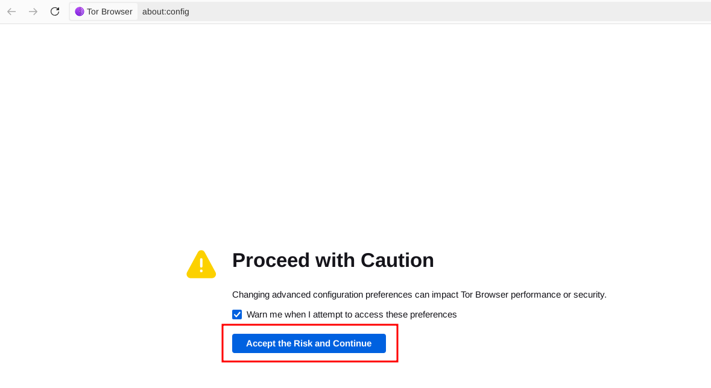

search for no_proxies_on in the search bar, and add 127.0.0.1 to it

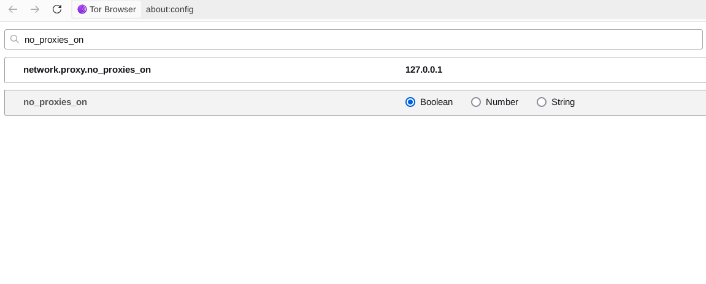

Editing your tor browser is fine if you are just using it to access local syncthing instance, but you should revert the change if you want to access the internet. Changing tor config might bring some unexpected browser fingerprint issue. You should get a separate whonix vm if paranoid.

## **How to setup syncthing**

Next decompress the syncthing pack and execute it
    
    
    $ tar xvf syncthing-linux-amd64-v1.28.0.tar.gz
    
    $ cd syncthing-linux-amd64-v1.28.0/
    
    $ ./syncthing
    

If you have setup your tor browser correctly it should automatically redirect you to http://127.0.0.1:8384/ and you will see the web panel

Next thing to do is to find your client id, it is in the actions menu

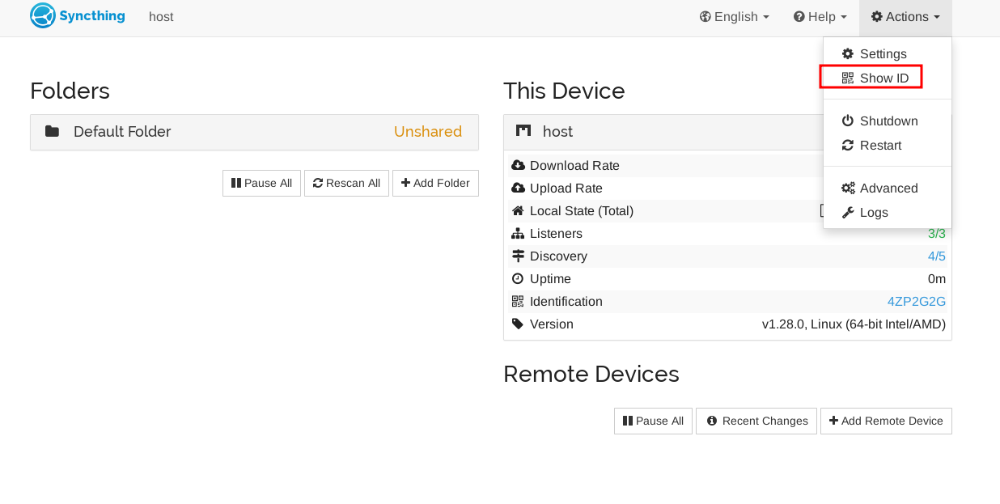

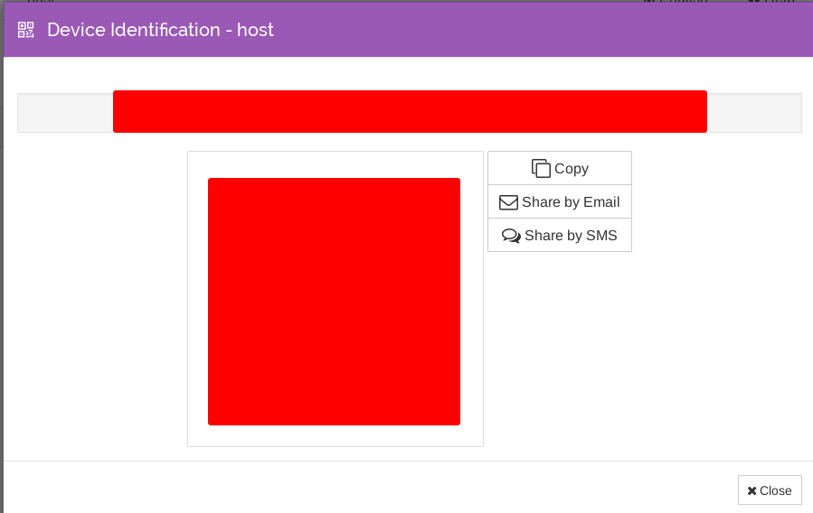

Next exchange this id with people you are sharing file with

After that add each other in both clients in the remote device section, if nothing goes wrong you should be able to see each other in the remote device section showed as "connected"

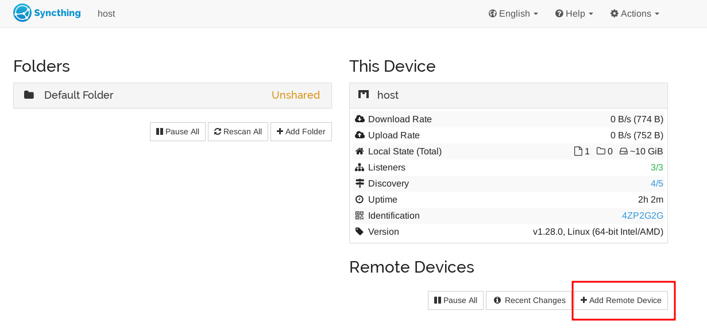

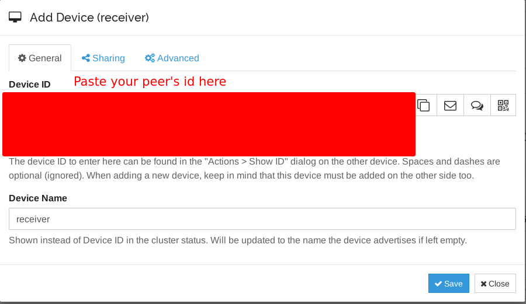

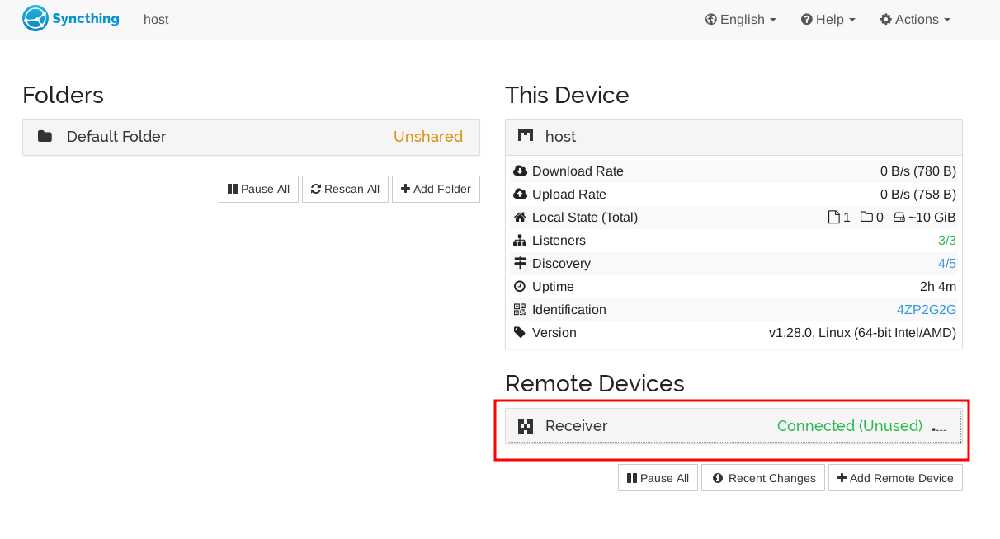

## **How to sync files anonymously**

After the previous setup, you can share the file you want. **But be aware tor traffic has low bandwidth, that is the price of online Anonymity**! Because if both parties are behind tor, your file goes through a circuit like this: 

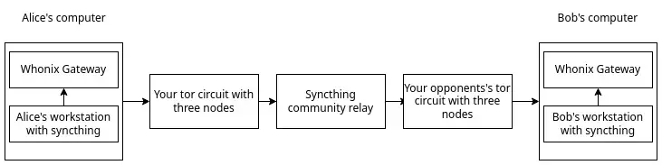

I personally tried this setup, **to send a 10GB file it took me 4 hours 30 minutes to send it** , which is normal due to the Tor network being slow, you'll need to be patient when you are trying to send large files over Tor.

You and your peer will only see the relay server's ip address, unlike the vpn setup which will expose the vpn ip you are using, which you can check [here](../syncthingvpn/index.md)

You peer also won't know you are using tor if you do not tell him

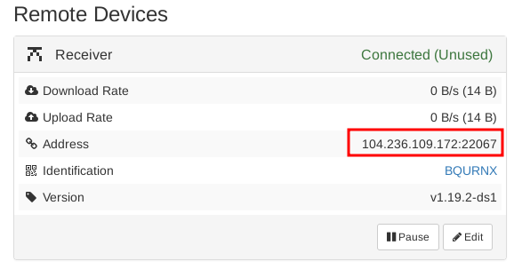

Choose add folder to create a new sharing Folder, and choose to share this folder with your peer

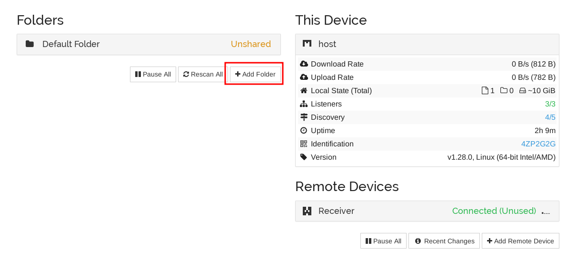

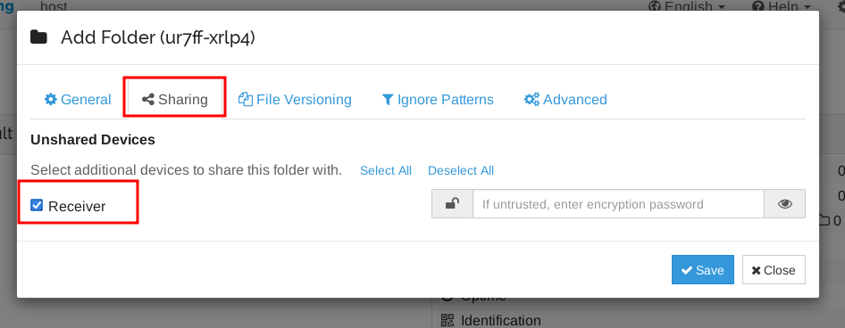

If nothing goes wrong, the receiver should see this

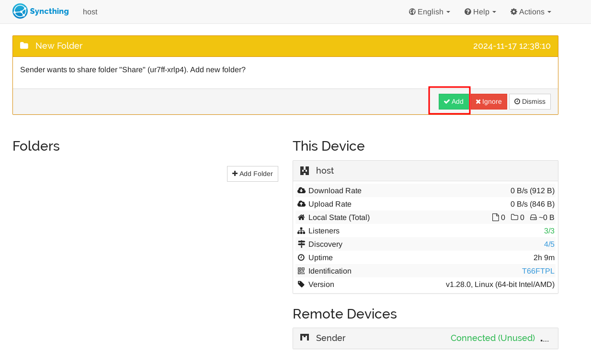

Agree and add the folder, after that syncthing will automatically transmit the files

