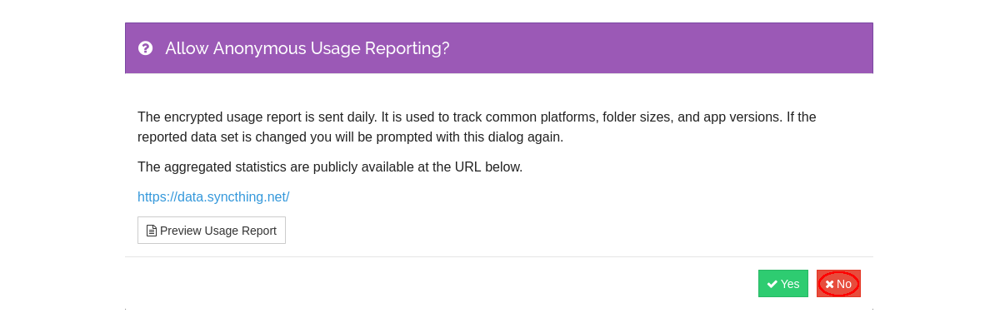
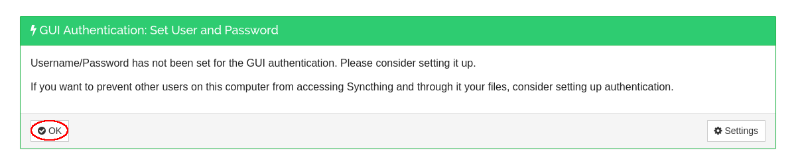
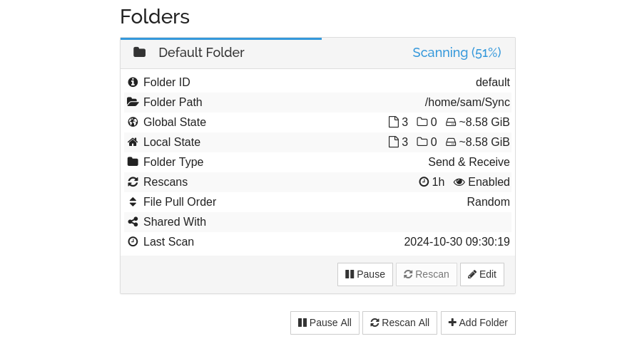
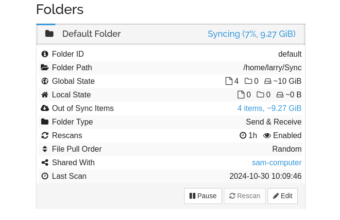
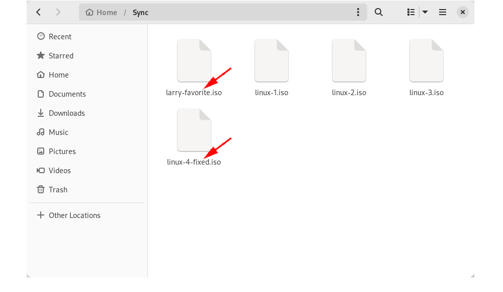
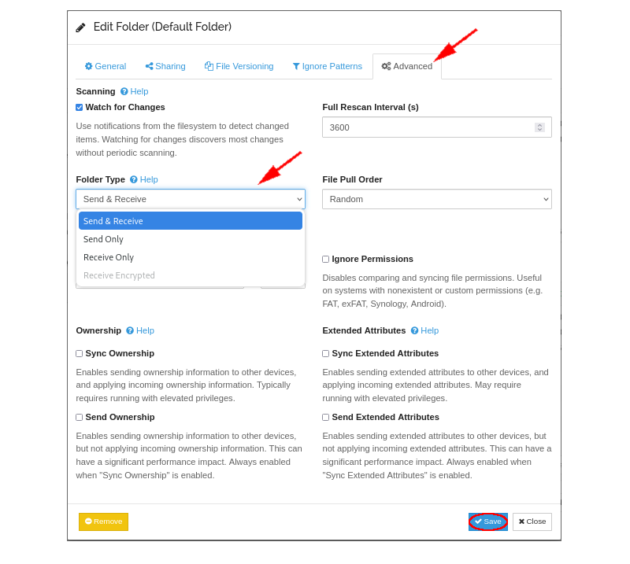

# One-on-One Large File Sharing (Syncthing over VPN)

```
TLDR: you can privately share large files over VPN using Syncthing.
```


## **Introduction**

While many methods of sending files online exist - methods such as email attachments, FTP, [OnionShare](https://blog.nowhere.moe/opsec/onionshare/index.md) and even [torrenting](https://blog.nowhere.moe/opsec/p2ptorrents/index.md) \- all of these methods have one thing in common. Once a file has been sent, no further changes to that file are tracked. For the use-case where you want to not only send a file or a group of files but also receive any updates to the file(s), that is where Syncthing comes in. Syncthing is a FOSS continous file synchronization program that enables users to securely share files across multiple devices in a decentralized manner. It uses peer-to-peer technology to ensure that data is end-to-end encrypted and transferred directly between enabled devices, eliminating any need for centralized cloud services. Syncthing can be completely self-hosted and is very versatile as sync locations can be a home server, VPS, mobile device or even a friend's computer! In this article, we will explore how Sam can set up Syncthing to privately share large files with Larry and track changes to those files, all while using a VPN to mask their internet activity. 

## **Setup**

We start from the perspective of both Sam and Larry as both will complete these initial steps.   
 

Sam and Larry are both using Debian and are on separate internet connections geographically distant from one another. It is presumed that both Sam and Larry have already purchased a subscription to a [VPN](https://blog.nowhere.moe/opsec/vpn/index.md). For this example we will use Proton VPN, but other [non-KYC VPNs](https://kycnot.me/?t=service&q=vpn) that accept Monero, such as Mullvad, may also be used. To start, they will sign in to their VPN client, ensure kill switch is enabled in the Settings, connect to their VPN and verify their IP address. 

Syncthing works by end-to-end encrypting files and sending them over the internet. To do this, Syncthing uses a [discovery server](https://docs.syncthing.net/users/stdiscosrv.html) to find peers and the Syncthing project maintains a global cluster of discovery servers for public use. If establishing a direct connection between devices is not possible, Syncthing will automatically use community-contributed publicly available [relay servers](https://docs.syncthing.net/users/strelaysrv.html) to route the file transfer instead. Because Syncthing is end-to-end encrypted, there is no need to trust these servers as they cannot read anything going through. With that being said, because Syncthing is fully open-source, it is possible to self-host both discovery and relay servers, but such configurations are beyond the scope of this article.   
  
For self-hosting a working Syncthing instance, the official [docker compose](https://github.com/syncthing/syncthing/blob/main/README-Docker.md) instructions are as follows: 
    
    
    
    ---
    version: "3"
    services:
      syncthing:
        image: syncthing/syncthing
        container_name: syncthing
        hostname: my-syncthing
        environment:
          - PUID=1000
          - PGID=1000
        volumes:
          - /wherever/st-sync:/var/syncthing
        ports:
          - 8384:8384 # Web UI
          - 22000:22000/tcp # TCP file transfers
          - 22000:22000/udp # QUIC file transfers
          - 21027:21027/udp # Receive local discovery broadcasts
        restart: unless-stopped
        healthcheck:
          test: curl -fkLsS -m 2 127.0.0.1:8384/rest/noauth/health | grep -o --color=never OK || exit 1
          interval: 1m
          timeout: 10s
          retries: 3
    
    

For this article, however, both Sam and Larry will install Syncthing on their computers from their package managers according to the [official instructions](https://apt.syncthing.net/) rather than self-hosting an instance: 
    
    
    
    # Add the release PGP keys:
    sudo mkdir -p /etc/apt/keyrings
    sudo curl -L -o /etc/apt/keyrings/syncthing-archive-keyring.gpg https://syncthing.net/release-key.gpg
    
    # Add the "stable" channel to your APT sources:
    echo "deb [signed-by=/etc/apt/keyrings/syncthing-archive-keyring.gpg] https://apt.syncthing.net/ syncthing stable" | sudo tee /etc/apt/sources.list.d/syncthing.list
    
    # Update and install syncthing:
    sudo apt-get update
    sudo apt-get install syncthing
    
    

Both Sam and Larry will create a systemd unit to automate the process of starting Syncthing. Sam and Larry will both replace **USER** with their respective usernames. 
    
    
    
    # Download the recommended systemd unit from the official Syncthing repository
    wget "https://raw.githubusercontent.com/syncthing/syncthing/main/etc/linux-systemd/system/syncthing%40.service"
    
    # Make the file owned by root
    sudo chown root: syncthing\@.service
    
    # Move the file to the appropriate directory
    sudo mv syncthing\@.service /etc/systemd/system
    
    # Reload the daemon with the changes made
    sudo systemctl daemon-reload
    
    # Enable the service on startup
    sudo systemctl enable syncthing@**USER**
    
    # Start the service
    sudo systemctl start syncthing@**USER**
    
    # Check the status
    sudo systemctl status syncthing@**USER**
    
    # Example output for Sam
    syncthing@sam.service - Syncthing - Open Source Continuous File Synchronization for sam
         Loaded: loaded (/etc/systemd/system/syncthing@.service; **enabled** ; preset: enabled)
         Active: **active (running)** since Fri 2024-10-25 12:15:35 EDT; 1h 46min ago
           Docs: man:syncthing(1)
       Main PID: 3634 (syncthing)
          Tasks: 17 (limit: 4622)
         Memory: 35.8M
            CPU: 19.790s
         CGroup: /system.slice/system-syncthing.slice/syncthing@sam.service
                 \u251c\u25003634 /usr/bin/syncthing serve --no-browser --no-restart --logflags=0
                 \u2514\u25003641 /usr/bin/syncthing serve --no-browser --no-restart --logflags=0
    
    

Syncthing is now running as a daemon, and will sync files in the background. Because of its continuous file synchronization, file transfers will restart automatically should any interruptions in VPN connection or power supply occur. 

Sam and Larry will navigate to **localhost:8384** in their browsers to open the Syncthing web GUI. Sam and Larry are greeted with an option to allow anonymous reporting, which they can accept or deny. 

Sam and Larry may choose to password protect their Syncthing web GUI, but in this article we'll just click OK. 

We will switch to Larry's perspective.   


Larry clicks on Actions -> Show ID to get the ID of his device. 

Larry now starts a [SimpleX](https://blog.nowhere.moe/opsec/anonsimplex/index.md) chat with Sam using disappearing messages and sends his Syncthing Device ID. 

We will switch to Sam's perspective.   


Syncthing adds a Default Folder at **/home/sam/Sync** which will be used to share files. This can of course be changed if desired. Sam clicks to Add Remote Device and adds Larry's Device ID. Sam adds a Device Name as well. 

Sam has 10GB of "Linux ISOs" he wants to share with Larry. Sam will start by moving the desired files to **/home/sam/Sync**. 
    
    
    
    sam@debian:~$ mv *.iso /home/sam/Sync && ls -lh /home/sam/Sync
    total 11G
    -rw-r--r-- 1 sam sam 2.9G Oct 27 12:56 linux-1.iso
    -rw-r--r-- 1 sam sam 2.9G Oct 30 09:18 linux-2.iso
    -rw-r--r-- 1 sam sam 2.9G Oct 30 09:18 linux-3.iso
    -rw-r--r-- 1 sam sam 1.5G Oct 26 17:06 linux-4-broken.iso
    
    

From there, Syncthing will automatically detect the files and scan them. 

Once scanning is complete, Sam is ready to share the files with Larry. On the Default Folder, Sam clicks Edit -> Sharing -> larry-computer and Save. 

We will switch to Larry's perspective.   


Larry receives a notification that Sam wants to connect and share something with him. Larry accepts the connection and shared Default Folder. 

Notice how the IP address that is shown to Larry is that of a Syncthing relay server like mentioned previously. If a direct connection had been established, Sam's VPN IP address would have been shown instead. 

The file transfer starts.   


Once finished, Larry has a complete copy of all of the files in **/home/larry/Sync**. Larry notices that Sam sent a Linux ISO that is broken. Larry fixes this broken Linux ISO and also adds a Linux ISO of his own to the shared folder.   


Back to Sam's perspective.   


Because the file transfer is bi-directional by default, the changes that Larry made are synced back to Sam! 
    
    
    
    sam@debian:~$ ls -lh /home/sam/Sync
    total 12G
    -rw-r--r-- 1 sam sam 1.5G Oct 30 10:47 larry-favorite.iso
    -rw-r--r-- 1 sam sam 2.9G Oct 27 12:56 linux-1.iso
    -rw-r--r-- 1 sam sam 2.9G Oct 30 09:18 linux-2.iso
    -rw-r--r-- 1 sam sam 2.9G Oct 30 09:18 linux-3.iso
    -rw-r--r-- 1 sam sam 1.5G Oct 26 17:06 linux-4-fixed.iso
    
    

## **Conclusion**

Sam was able to privately share 10GB of files and automatically receive changes to those files all while keeping his internet activity hidden. Notice how Larry was able to overwrite a file that Sam originally shared. There may be cases where this is undesirable and this option can be changed under Default Folder -> Edit -> Advanced and selecting either Send Only or Receive Only. 

