# Tails OS for Easy Temporary Sensitive Use 

```
Thanks to Tails' live mode, you can temporarily enable clientside sensitive use. It's temporary because anything you write on the disk will be erased upon rebooting.
```


In this tutorial we're going to look at how you can run Tails OS (The Amnesic Incognito Linux System) on a USB Stick, and also on a QEMU VM, following the official documentation [here](https://tails.net/doc/advanced_topics/virtualization/virt-manager/index.en.html). 

⚠️ _Deniability Disclaimer:_ **This setup is only suitable if the adversary can be told that you are using Tails OS, without it being a reason to throw you in jail. Do not proceed if that's the case.** ⚠️

**Tails OS is suitable for Short Term Sensitive Use due to it's default live-mode feature** , where upon shutting down the OS, every forensic trace of what you were doing is completely erased from memory, where the entire OS is loaded into. There are no disk-writes at all by default. (Unless if you use the persistent storage, which is not suitable for sensitive use, due to not being deniable encryption like [Veracrypt](../veracrypt/index.md) ).


While it is similar to Whonix, it is specificially intended for temporary sensitive use. [Whonix](../sensitivevm/index.md) on the other hand can be used for long-term sensitive use. Click [here](https://www.whonix.org/wiki/Comparison_with_Others) for more details on the differences between Whonix and Tails.

## _OPSEC Recommendations (for the live USB setup):_

  1. Hardware : (Personal Computer / Laptop) and a USB stick (with at least 2GB)

  2. Host OS: [Linux](../linux/index.md)


I recommend using this setup for [Anonymous use](../anonymityexplained/index.md) if you store anything into the persistent storage, **or for short-term[Sensitive use](../deniability/index.md) if you are not storing anything sensitive in the persistent storage**, as per the [4 basic OPSEC levels](../opsec4levels/index.md).


## **Tails live USB Setup**

First we download Tails OS as a USB image [here](https://tails.net/install/download/index.en.html):


Then we resize the image size to be able to contain persistent storage (in this case, i'll make it 8Gbs):
    
    
    [ nowhere ] [ /dev/pts/8 ] [nihilist/VAULT/Isos]
    → ls tails-amd64-6.3.img -lash
    1.4G -rw-r--r-- 1 nihilist nihilist 1.4G Jun 14 10:15 tails-amd64-6.3.img
    
    [ nowhere ] [ /dev/pts/8 ] [nihilist/VAULT/Isos]
    → truncate -s 8192M tails-amd64-6.3.img 	
    
    

From here we install tails onto the usb stick (which is detected as /dev/sdc in our usecase) from the commandline using dd:
    
    
    nihilist@mainpc:~$ lsblk
    NAME        MAJ:MIN RM   SIZE RO TYPE  MOUNTPOINTS
    
    [...]
    **sdc           8:32   1  14.6G  0 disk**
    [...]
    
    user@mainpc:~$ cd .mullvad-browser/Downloads/
    usert@mainpc:~$ **sudo dd if=/home/user/tails-amd64-6.3.img of=/dev/sdc bs=16M oflag=direct status=progress**
    
    

Now that the Tails OS image has been flashed onto the usb stick, you can simply reboot your computer, and then enter the boot menu to choose to boot onto the USB rather than onto your host OS. In this example i need to press ESC, but depending on your motherboard you may need to press F2, or F11, or another key.

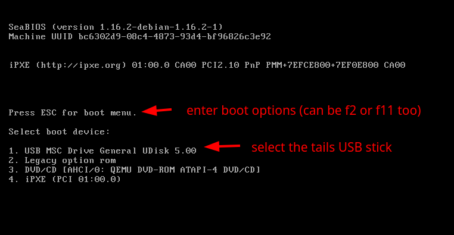

Then after entering the boot options by pressing ESC, we press 1 to choose to boot onto the USB key, rather than booting on the system drive.

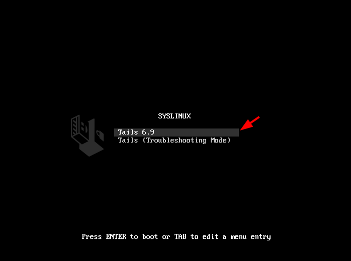 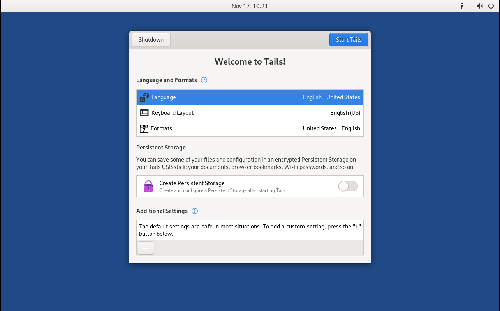

And you've just booted in Tails OS from your usb key!

## **Tails QEMU VM Setup**


## _OPSEC Recommendations (for the QEMU setup):_

  1. Hardware : (Personal Computer / Laptop)

  2. Host OS: [Linux](../linux/index.md)

  3. Hypervisor: [libvirtd QEMU/KVM](../hypervisorsetup/index.md)

  4. Application: [Host-based VPN](../index.md) (if your ISP doesn't allow Tor traffic) 


_Sidenote:_ If your ISP does not allow Tor traffic, make sure that you [route the QEMU VMs traffic through a VPN](../vpnqemu/index.md), to hide the tor traffic from your ISP (You -> VPN -> Tor) Setup

Now in the same way (even though it is a less-popular setup) we can also we can create a Tails OS QEMU VM in virt-manager like so:

 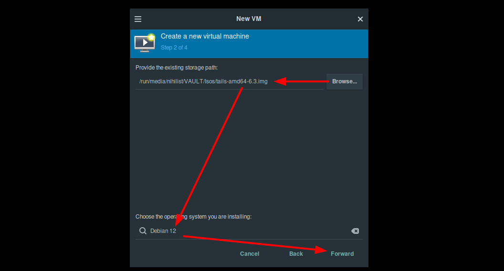 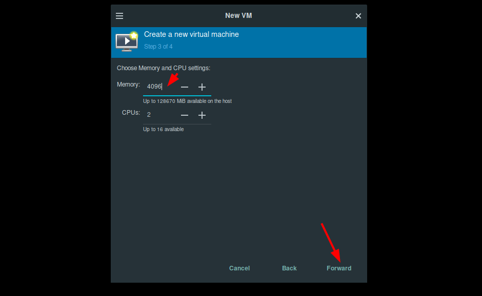 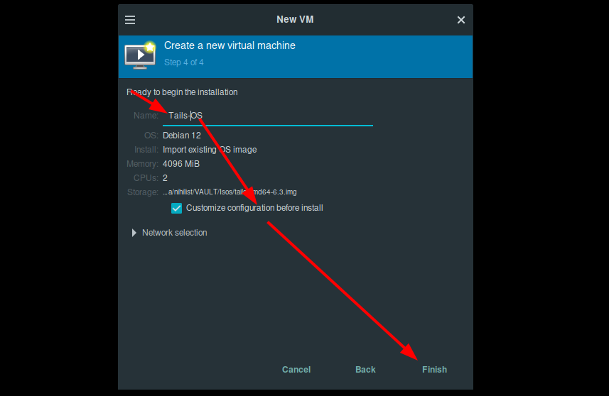  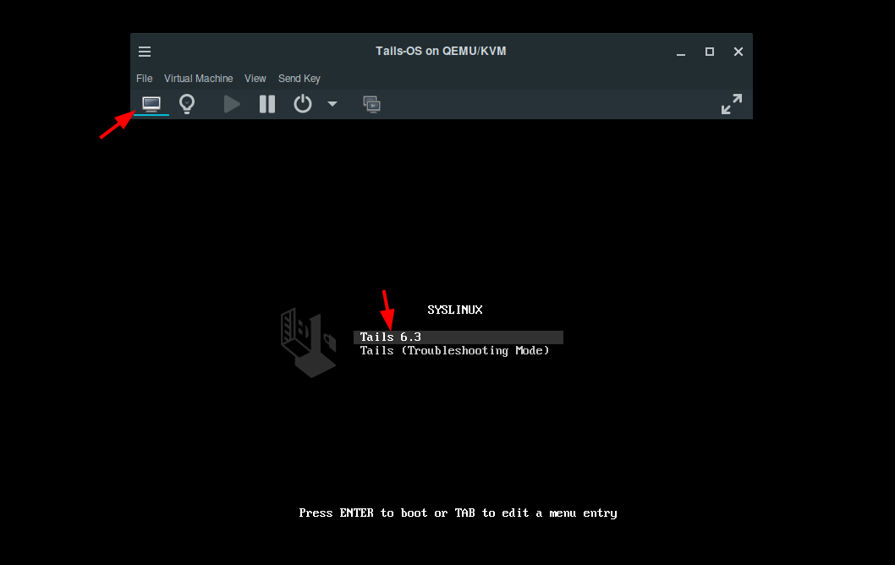

Then press enter to launch tails:

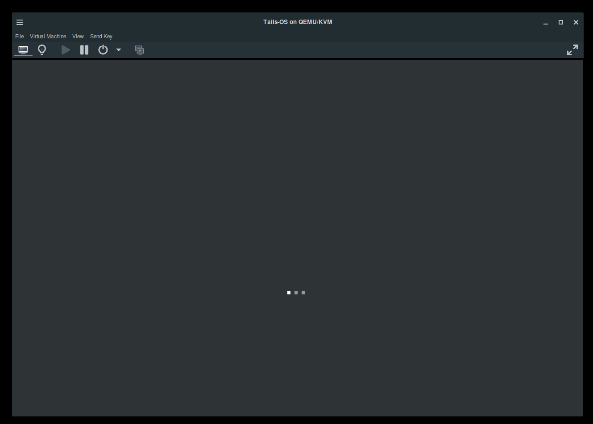

(wait a few seconds for it to load)


Once in there, depending on your use, you can select to have an admin password and a persistent storage if you need it. Otherwise everything you do in the VM will be wiped clean upon shutdown (hence the word amnesic).


Then we select connect to tor automatically:

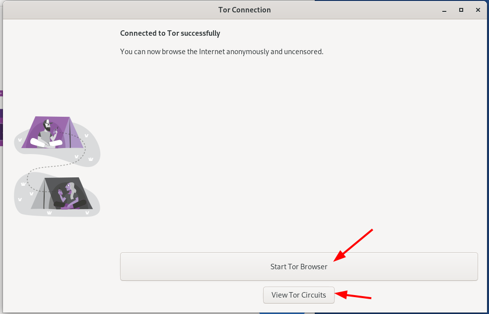

And here we click start the Tor browser to browse the web anonymously, and if you're curious and want to see the tor Circuits you can view them also:


## **Persistent Storage Setup (warning, this is not[deniable encryption](../veracrypt/index.md)!)**

Next, if you want to enable the persistent storage **(which uses regular encryption, do not store anything sensitive in it!)** go there:


make sure you enter a strong password that can't be bruteforced easily:

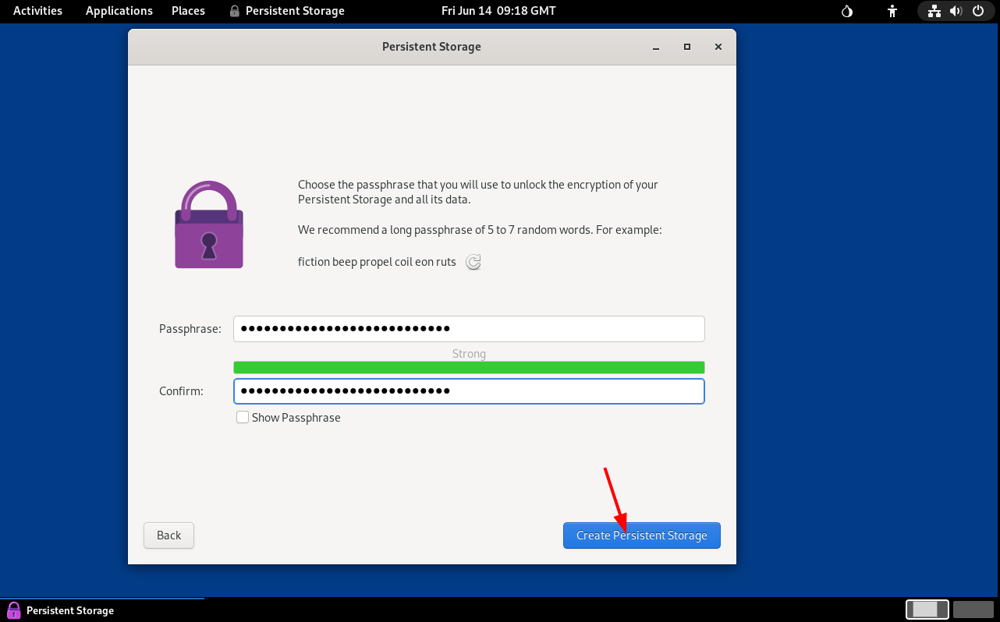

then hit "create persistent storage" and wait a bit for the operation to complete:

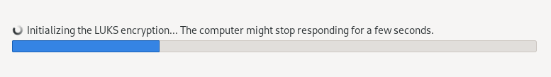

Then adjust the settings as per your liking, if you want the persistent storage to store more than it does by default:

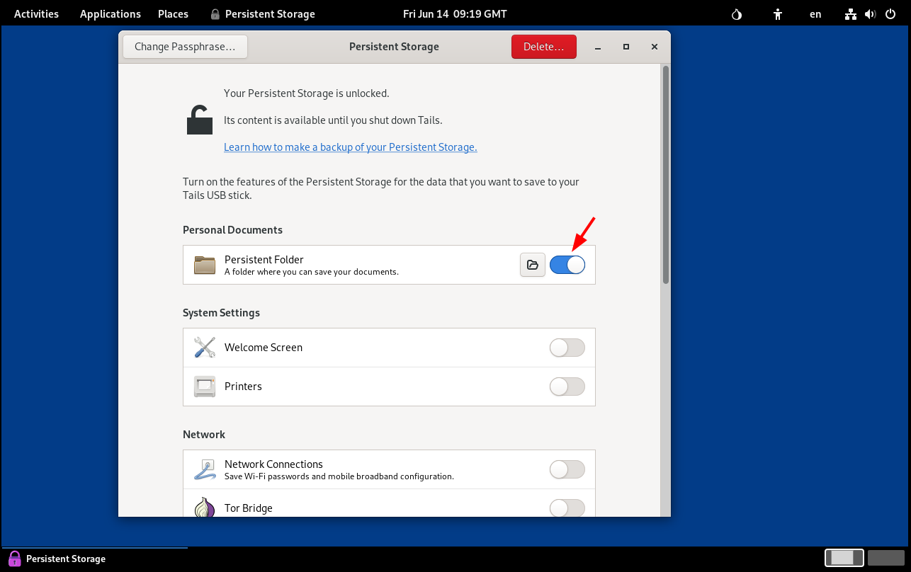 

Then if you want to install additional software you can launch a terminal:


Then from there you can use sudo because you enabled the administrator password, and install software:
    
    
    amnesia@amnesia:~$ sudo apt update -y ; sudo apt install neofetch -y 
    [sudo] password for amnesia:          
    Get:1 tor+https://cdn-fastly.deb.debian.org/debian bookworm InRelease [151 kB] 
    Get:2 tor+http://apow7mjfryruh65chtdydfmqfpj5btws7nbocgtaovhvezgccyjazpqd.onion/torproject.org bookworm InRelease [3,526 B]
    Get:3 tor+https://cdn-fastly.deb.debian.org/debian-security bookworm-security InRelease [48.0 kB]
    
    [...]
    
    

Then once the software installed, you have the possibility to store it in the persistent storage as well, so that it can be available when you launch tails again:

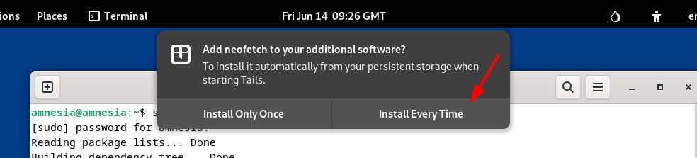
    
    
    amnesia@amnesia:~$ neofetch
          ``                        amnesia@amnesia 
      ./yhNh                        --------------- 
    syy/Nshh         `:o/           OS: Tails x86_64 
    N:dsNshh  \u2588   `ohNMMd           Host: KVM/QEMU (Standard PC (Q35 + ICH9, 2009) pc-q35-9.0) 
    N-/+Nshh      `yMMMMd           Kernel: 6.1.0-21-amd64 
    N-yhMshh       yMMMMd           Uptime: 13 mins 
    N-s:hshh  \u2588    yMMMMd so//.     Packages: 1854 (dpkg) 
    N-oyNsyh       yMMMMd d  Mms.   Shell: bash 5.2.15 
    N:hohhhd:.     yMMMMd  syMMM+   Resolution: 1280x800 
    Nsyh+-..+y+-   yMMMMd   :mMM+   DE: GNOME 43.9 
    +hy-      -ss/`yMMMM     `+d+   WM: Mutter 
      :sy/.     ./yNMMMMm      ``   WM Theme: Adwaita 
        .+ys- `:+hNMMMMMMy/`        Theme: Adwaita [GTK2/3] 
          `hNmmMMMMMMMMMMMMdo.      Icons: Adwaita [GTK2/3] 
           dMMMMMMMMMMMMMMMMMNh:    Terminal: gnome-terminal 
           +hMMMMMMMMMMMMMMMMMmy.   CPU: 11th Gen Intel i7-11700K (2) @ 3.600GHz 
             -oNMMMMMMMMMMmy+.`     GPU: 00:01.0 Red Hat, Inc. Virtio 1.0 GPU 
               `:yNMMMds/.`         Memory: 1313MiB / 3915MiB 
                  .//`
                                                            
    

And that's it! We managed to run tails OS from a QEMU VM and install some software into the persistent storage.

## **Deniability Context**

Now suppose you are living in a country where using Tails OS and Tor is not going to be a reason to immediately throw you in jail, the adversary is busting down your door, while you are browsing a sensitive website with it, and you want to make sure that there is no incriminating evidence to be found against you when the adversary seizes your computer.

**Reminder, this is only for temporary sensitive use, do not save anything sensitive in the persistent storage because otherwise the adversary can force you to unlock it to reveal the contents.**

If you have a regular live usb tails os setup, all you need to do is to simply **unplug or disconnect the USB stick to shutdown the system and wipe off all forensic trace of what you were doing:**

<video controls>
  <source src="40.mp4" type="video/mp4">
</video> 

And If you have a Tails OS VM, you can simply hit the shutdown button to erase what you were doing in the VM:

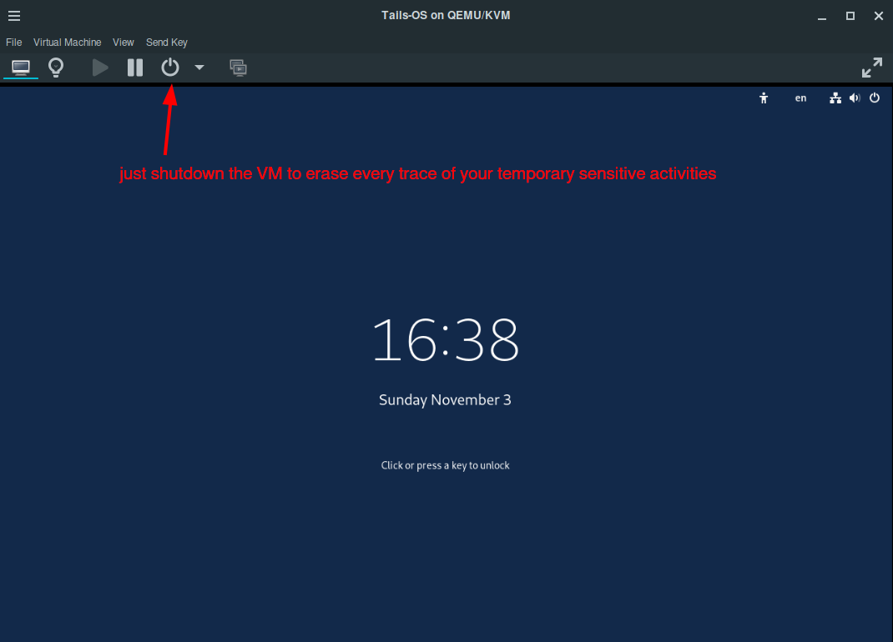

All you need is to shutdown the VM, and everything forensic trace of what you were doing in it gets immediately erased from memory, as if there was nothing there to begin with. **Effectively leaving the adversary empty-handed with no incriminating evidence to use against you in court.**

And that's it! You now have a dedicated live OS for temporary sensitive use.

