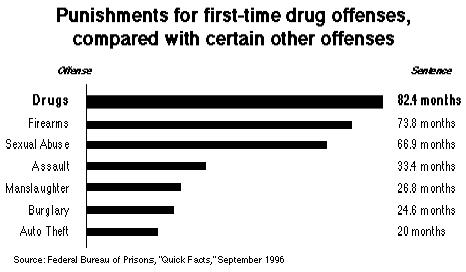

# **The postal system explained**

## **What is a postal system?**

A postal system is a network of services and infrastructure that facilitates the sending and receiving of mail and packages from one place to another. It involves a series of processes that ensure physical items, like letters, documents, and parcels, are delivered from the sender to the recipient.

Before delving into the topic, let's first define the key components of postal systems and the different types that exist.

The main elements of a postal system are as follows:

- *Mail Collection*:

This refers to the process of gathering mail from various sources, such as post offices, mailboxes, businesses, or individuals. It is the initial step, typically occurring once the mail is deposited in a mailbox.

- *Sorting*:

After the mail is collected, it is sorted based on factors like destination, size, and priority. Modern postal systems often employ automated machines for sorting, though manual sorting may still be used for certain items. This is the point where the first potential issues may arise.

- *Transportation*:

Once sorted, the mail is transported to its next destination, whether locally, nationally, or internationally. This process may involve various modes of transport, such as trucks, airplanes, ships, or even bicycles in remote areas. Transportation is another stage where problems can emerge.

- *Delivery*:

Finally, the mail reaches its destination, where postal workers deliver it to the recipient's address. This may be done through home delivery, post offices, or collection points. This is the last stage where complications could potentially occur.

There are two types of postal systems: 

- *National Postal Systems*:

Each country operates its own national postal system. Examples include the USPS in the United States, Royal Mail in the United Kingdom, and La Poste in France.

- *International Postal Systems*:

International cooperation between different national postal systems facilitates the exchange of mail across borders. For instance, the Universal Postal Union (UPU) plays a key role in coordinating global postal standards, ensuring seamless mail flow between countries.

If you want to learn more about postal system history, you could be interested in reading the following [article](https://www.britannica.com/topic/postal-system/History). 

## **What is it used for?**

The postal system serves a wide range of purposes. With the rise of email, most people no longer rely on the postal system for sending letters. However, it is still widely used by organizations around the world. Governments, for example, often use postal mail to send tax notifications, legal notices, or other important documents to the public.

The growth of online shopping has led to a significant increase in the volume of packages sent via the postal system. This includes both purchases and returns. Some individuals also use the postal service to sell goods outside of traditional economic systems or to ship personal items, like furniture, to recipients who are far away.

One thing that’s become less common is sending postcards, as the internet now allows people to share photos and messages instantly and for free.

Despite the digital age, most legal and official documents are still sent via the postal system, as these often require signatures, and electronic signatures are not yet widely trusted by many organizations.

Magazines, newspapers, catalogs, and advertising materials are still primarily sent through the postal service. Many people still prefer reading these physical items rather than online versions.

Certain types of payments, such as checks, continue to be sent through the postal system, though cash is generally not used due to government control issues. This is one of the reasons cryptocurrencies like Monero (XMR) are gaining popularity for private, "under-the-radar" transactions.

In some countries, prescription medications and medical supplies can be sent through the postal system, although this is not universally available.

For urgent deliveries, services like next-day or same-day delivery are often used to send important documents or goods quickly.

Postal systems are also essential for sending biological samples, research materials, or test kits to laboratories for analysis or clinical trials.

As you can see, the postal system is still a major part of people's lives. This is precisely why governments make every effort to maintain control over it. By doing so, they are able to regulate what, when, and where you receive mail.

## Postal system steps

The objective here is to understand the exact steps involved in sending and receiving mail, and to identify where issues might arise in the process.

The first step is preparing the mail. This is the sender's responsibility and occurs at their location. The sender prepares the item by writing the address, affixing the appropriate postage, and sealing the item if necessary. (Sealing the item is important, as it allows the sender to know if the item has been tampered with before reaching the recipient.)

The second step is mail collection. The location for this depends on the sender’s choice, but it is typically done at a local mailbox, post office, or collection point. The sender then drops the item at the selected location and lets the postal system handle it from there. This is where the sender loses control of the mail. Once the item is in the postal system, the sender no longer has oversight over what happens to it. At this stage, the mail is vulnerable to being delayed, intercepted, stolen, or even monitored by authorities.

The third step is sorting at the local post office or regional sorting facility. Most postal services use automated sorting systems that scan the postal code or barcode on the item to identify its destination. The system can also measure the weight of the item and provide information about its contents. For oversized items or those requiring special handling, human workers are involved in the sorting process. At this stage, the government may initiate a control to determine the contents of the mail.

The next step is transportation. The goal here is to move the mail to the appropriate locations, such as central hubs, airports, regional distribution centers, or international transfer points. For local mail, it may be transferred to another local facility or directly to delivery workers. At this point, the government may also order checks, similar to those conducted at airports, or transportation vehicles could be intercepted, leading to the potential theft of mail. For international mail, customs inspections are typically conducted to ensure compliance with legal and security regulations set by governments. This can involve scanning for prohibited items, verifying taxes or duties, and checking the contents of packages.

After that, the mail goes through another sorting process at a regional or central facility. It is sorted once again based on its final destination. For international mail, this may involve transferring the items from the central processing center to regional delivery hubs. Both automated and manual sorting systems are used during this step. Similar to the first sorting, your mail can be subject to further checks or inspections by authorities.

Once sorted, postal workers pick up the items and take them to the local post office or distribution facility near the recipient. Depending on the area, postal carriers may travel on foot, by bike, motorbike, or in delivery vans. In remote areas, more unconventional methods, such as boats, motorcycles, or bicycles, might be used. At this stage, a government official might replace the postal worker to monitor the recipient or to take action if any illegal items are suspected in the delivery.

Finally, the recipient receives the mail at the designated delivery location. This marks the end of the process, unless the destination location does not exist or the recipient refuses the mail. In such cases, the item is sent back to the sender, following all the same steps outlined above.

Here is a quick diagram explaining who decides what during this process: 

Here is an [article](https://www.mailpro.org/post/how-does-mail-processing-work) describing this process. 

## **Differences between postal systems**

I’d like to compare the postal systems of the USA and Europe to highlight the key differences between the two.

First of all, most European countries have national postal services that operate independently, but they adhere to European Union regulations for cross-border mail. In contrast, the United States has the United States Postal Service (USPS), which is an independent government agency that covers the entire country.

In Europe, each country sets its own postage prices, while in the United States, the price is the same across all states. The European Union only regulates the prices for cross-border mail.

When it comes to delivery methods, they are fairly similar in both Europe and the USA. In both regions, the government controls the postal system and holds significant authority over it.

While these systems share many similarities, there is one postal system that is considered the strictest. Let me introduce the Australian postal system!

Australia Post has very strict rules regarding what can and cannot be sent through the mail. Many items are either prohibited (completely banned) or restricted (sent only under specific conditions). When sending items internationally, Australia Post follows stringent customs and border control regulations. All international parcels are subject to checks by Australian Customs and Border Protection.

Security checks are a major part of the system’s strictness. Certain types of mail, especially those coming from or going to high-risk countries, undergo additional screening. The Australian postal system is highly regulated when it comes to illegal content. Sending material considered illegal, such as hate speech, child exploitation material, or terrorist propaganda, is strictly prohibited. Authorities actively monitor for such materials.

Mail interception can occur if authorities suspect illegal activity. Australia Post works closely with law enforcement agencies, including the Australian Federal Police (AFP), to investigate and prevent crimes such as mail fraud, smuggling, or terrorism.

By law, Australia Post must cooperate with law enforcement to detect and intercept illegal content. This means mail suspected of containing prohibited material can be flagged and investigated. Additionally, censorship laws apply to printed materials, especially when dealing with politically sensitive or controversial content.

Another strict area of Australia Post's operations is delivery confirmation. The service employs a range of methods to ensure that mail and parcels are securely delivered to the intended recipient.

Australia Post also takes a strict approach to preventing postal fraud and misuse. This includes the use of postal services for illegal activities, such as fraudulent transactions or identity theft. Misusing the postal system can result in legal actions, including fines and criminal charges. For example, sending false identification or using stolen credit cards to pay for postage could lead to investigations by the Australian Federal Police (AFP).

The Australian postal system is considered strict because of its rigorous enforcement of legal regulations, safety protocols, and government controls over what can be mailed and how. Whether dealing with international shipping, security checks, or compliance with Australian laws, the system is designed to prevent misuse and ensure the safety and security of all users. This makes it one of the most tightly regulated postal systems in the world.

*Drugs and Narcotics*: 

Over recent years, Australian authorities have consistently intercepted significant amounts of drugs being trafficked through the mail system. For example, in the 2019-2020 period, Australian Border Force (ABF) reported seizing 2.4 tonnes of illicit drugs across various entry points, a significant portion of which involved mail and parcel intercepts.

*Prohibited Items*: 

The ABF's annual statistics often show tens of thousands of items intercepted for various reasons, such as prohibited weapons, counterfeit goods, controlled substances, and materials that violate Australia's Customs and Border Protection laws. In one instance, more than 20,000 parcels were inspected at Australian airports in just a single year.

If you want to check additional data about this subject, here are a few links that could help (Warning, this is Australian government official data, it might be incorrect): 

Australian Border Force (ABF) Annual Reports [here](https://www.abf.gov.au/about-us/publications/annual-reports).

Australia Post Annual Reports [here](https://www.auspost.com.au/about-us/corporate-responsibility/annual-reports).

Australian Federal Police (AFP) Annual Reports [here](https://www.afp.gov.au/about-us/publications).

Australian Customs and Border Protection [here](https://www.homeaffairs.gov.au/reports-and-pubs).

Just so you know, Argentina is currently privatizing part of its postal system. You can find additional information in this [article](https://buenosairesherald.com/business/argentina-opens-up-some-mail-services-to-private-companies)

Let's see if this will help free the black market, or if these companies will collaborate with the government and impose more controls.

## **Shipping controlled substances through the postal system**

>  We do not, and will never, recommend the shipment of controlled substances through the postal system. It is not worth it. The information provided here is purely for informational purposes and is intended solely to offer a complete understanding of the postal system.

Most of this section will be based on the [DNM](https://darknetbible.info/) bible which describes itself like this:

Here, we will deep dive into OPSEC topics that are absolutely necessary for anyone who want to ship controlled substances through the postal system.

The first step to keep in mind is that you need to protect yourself before even thinking about looking at, buying or selling controlled substances online. And, it starts with your computer. As said in the DNM Bible: "You will see this note come up a few times as you read on, but it cannot be said enough. DO NOT USE WINDOWS OR OSX." Using Windows or OSX when your privacy needs to be secured is an absolute non-sense.

The DNM bible advises using Tails as a secured OS. You can find a really interesting OPSEC article [here](../tailsqemuvm/index.md) about Tails that could help you be more secured. It completes this DNM bible [part](https://darknetbible.info/bible/operating-systems/tails/index.html) perfectly. If you don't want to use Tails, the DNM bible advises the use of Whonix. As for Tails, we have an article [here](../whonix_hiddenservice/index.md) which completes this DNM bible [part](https://darknetbible.info/bible/operating-systems/whonix/index.html).

The second step to secure yourself is to use a trusted password manager. The DNM bible advises using [KeePassXC](https://darknetbible.info/bible/keepassxc/index.html). If you need more help to use this tool, please check this [article](../passwordmanagement/index.md)! 

Once your computer and accounts are secured, you need to keep in mind that any transaction must be performed with cryptocurrencies. As stated in the DNM Bible, and I can only agree with it, you must use only Monero for your transactions. The DNM Bible states: "*Before we begin it is important that you remember EVERYTHING with bitcoin/Litecoin is public on the blockchain. If possible you should ALWAYS start with Monero. If you need to pay your vendor in Bitcoin, or for some reason you started with bitcoin/Litecoin, you can use the [converting](https://darknetbible.info/bible/cryptocurrencies/converting/index.html) chapter to keep you safe.*". 

> Out of topic: If any communications related to this shipping are done through online services, it is crucial to use secure tools for that purpose. The DNM Bible provides excellent information on this topic [here](https://darknetbible.info/bible/pgp/index.html).

Ok, now we will begin to dive deep into OPSEC concepts designed to make you as safe as possible when shipping controlled substances through the postal system. Here are some general concepts that you need to know:

- International mail is more subject to controls.

- Do not order more than one package at a time. (If it is intercepted, you don't want to increase the volume of controlled substances that could be found by authorities.)

- If the package arrives damaged enough to make what's inside visible, stop ordering for a while.

- If you order to a dorm or a shared mailbox, be sure that you have not signed away any of your rights by allowing a third party to open/check your mail.

- Do not order controlled substances to your workplace. As stated in the DNM Bible, "Do you want to get fired AND arrested at the same time? Keep all DNM activities separate from your work."

- Avoid checking the online tracking of your packages as much as possible. It leaves traces that could be used against you.

- If you receive more than you ordered, inform the vendor. Being good with them will encourage them to be good with you.

- Destroy the packaging once you get your stuff. (Kill it with fire!) If you can't destroy it, dispose of it in a trash bin far from your home so it can't be associated with you. (And always remember to remove anything that identifies you, like tags, before throwing it away.)

One thing you need to consider when ordering controlled substances online is the origin country. Some countries are classified as "hot" countries by the DNM Bible:

- The Netherlands (NL) - notorious origin country for all drugs
- Colombia (CO) - notorious cocaine and heroin origin country
- Peru (PE) - notorious cocaine origin country
- Bolivia (BO) - notorious cocaine origin country
- Venezuela (VE) - significant but marginal cocaine origin country with possibly rising market share
- Ecuador (EC) - significant but marginal cocaine origin country
- Canada (CA) is on Israel’s drug origin country watch list, and, specifically, XpressPost (express mail) from - Canada is often opened by US Customs indiscriminately. Note: Mail that is not XpressPost from Canada is usually not cause for extra concern.
- Spain (ES) is on Israel’s drug origin country watch list. This affects imports into Israel.
- France (FR) is on Israel’s drug origin country watch list. This affects imports into Israel.

In addition to this list, the DNM bible is sharing the list of countries known for strict customs enforcement on inbound international mail: 

- Australia (AU)
- New Zealand (NZ)
- Israel (IL) - don’t order drugs to Israel from Canada, Spain, France or the Netherlands
- Norway (NO)
- Sweden (SE)
- Finland (FI)
- Singapore (SG) and many other Asian countries
- Most Middle Eastern countries

[Here](https://darknetbible.info/bible/shipping/stealth/index.html), the DNM bible is defining the importance of stealth, describing it as: "*Stealth is important to get your ordered product to your front door. It is mainly a vendor topic (because they have to package the order) but you have to pay attention to it too, in order to avoid getting into legal trouble because you chose a vendor who is known for his bad stealth.*"

The goal is simple: to make your controlled substances appear as if they are legitimate items. By using clever packaging, choosing innocuous or misleading labels, and following best practices, the aim is to minimize suspicion and ensure that the package looks like something entirely legal. This approach helps to avoid attracting attention from postal agents or law enforcement.

For example, here is some cannabis: 

A famous darknet market (DNM) is describing their shipping methods like this: 

And now that you know where and how you can safely order controlled substances, what should you do if your package doesn’t arrive?

The first thing to do is check whether your mail was interrupted. The best way to do this is by sending yourself a piece of mail from a post office that’s far away from your location — something perfectly legal, of course. As the DNM Bible states:
"*Package it carefully yourself. Remember exactly how you placed things. Take photos if it helps. Get creative. Use colorful tape, make patterns over the openings of the package, or count and track the number of packaging peanuts you put in. Wrap the object in thin holiday wrapping paper and tape it up. Go wild!*"

The main objective here is to enable you to identify whether the package was opened or tampered with by the authorities. You can repeat this process as many times as needed.

The following [article](https://magazinespheres.com/dont-panic-how-to-know-if-your-package-is-seized-at-usps/) give more details about USPS seizure process. 

You can consult this [website](http://dreadytofatroptsdj6io7l3xptbet6onoyno2yv7jicoxknyazubrad.onion/) to know if your DNM was compromised; It is not 100% sure, but it can help. For example, this kind of [post](http://dreadytofatroptsdj6io7l3xptbet6onoyno2yv7jicoxknyazubrad.onion/post/81094e6080c294faa5c1) describe what happened to a seized DNM and give advices to its customers. 

One important thing to keep in mind when you’re shipping controlled substances through the postal system is to make sure the delivery location is “clean.” This means there shouldn’t be anything illegal present there — whether it’s drugs, unlawful data, weapons, or other prohibited items — in case the authorities search the location.

In addition, remember that you should use your real name. Using a fake name at a delivery address where you normally receive packages under your real name can raise suspicion — not just with the postal service, but with the authorities as well. Furthermore, avoid sending illegal items to a location where other people, especially those who are responsible for you, live. If a package is discovered by the authorities, they may be held liable instead of you.

Using a fake name is a weak tactic on its own. Packages are routed by delivery address, not by recipient name.

Suspicious or high-risk packages are typically investigated based on other factors — unusual packaging, heavy odor, conflicting delivery details, or related investigations.

Providing a false name can raise suspicion and sometimes make delivery more difficult (since delivery people may need a recipient’s identification), adding additional complications for both the sender and recipient.

If a package is intercepted and investigated, a fake name often does not protect the recipient from liability, especially if other forms of evidence connect them to the delivery.

Here is an interesting [article](https://www.thefederalcriminalattorneys.com/fictitious-name-address) about this law text. 

When you go to sign for a package, there are some important questions to ask yourself. First, you need to check if your jurisdiction requires a signature for police action. If it doesn’t, signing will not impact anything. However, if a signature is required for police action, there’s a chance the delivery could be part of a controlled operation, which might lead to your arrest.

Governments oversee the entire delivery process, and they can decide to intervene at any point. However, it’s important to note that if a government opts to launch a [controlled](https://darknetbible.info/bible/shipping/controlled_delivery/index.html) delivery against you, refusing to sign might only delay the inevitable. In the end, authorities will find a way to arrest you if they are determined.

Signing for a package doesn’t automatically make you guilty. You are not expected to know everything being sent to you. As the DNM Bible rightly points out: “*The only reason postal services have you sign is to confirm that you’ve received the package, and that they’ve done their job. It’s a standard practice, especially for international mail and deliveries.*”

If you want to learn more about why do you have to sign for a package, you can read this [article](https://www.shippingschool.com/why-do-i-have-to-sign-for-a-package-a-guide-to-signature-requirements-delivery-requirements/) that give additional information. 

If you decide to use a drop instead of your own address for package delivery, even though it's not encouraged, please follow these [steps](https://darknetbible.info/bible/shipping/drop/index.html) from the DNM Bible to make the process more secure.

Shipping controlled substances can also lead to [monitored](https://darknetbible.info/bible/shipping/monitored_delivery/index.html) deliveries. It is rarer, but it is much more difficult to identify.

Here is one advice received from someone who is really careful about his privacy: "Ship domestically, small amounts, find someone as a drop"

## **How controls are performed?**

Here’s an interesting topic: How are controls performed by postal services? There are many different types of controls that can lead to a package being intercepted.

The first type of control, and the most common one, is the visual inspection conducted by postal agents. In this process, agents are trained to identify suspicious packages. [Here](https://www.wikihow.life/Recognize-a-Suspicious-Package) is an article explaining how to identify a suspicious package for example.

Here is what they are looking at: 

- Unusual Package Shapes: Packages that are unusually shaped or seem to have items stuffed inside in a way that doesn’t match the stated contents.

- Inconsistent or Cheap Packaging: Packaging that looks poorly sealed or overly taped, which could indicate tampering.

- Labels or Documentation: Mistakes or inconsistencies in the labels, addresses, or sender information might raise suspicion.

Authorities may have watchlists of suspicious addresses or individuals involved in the shipment of illegal items. If a package comes from or goes to a flagged location, it may trigger extra scrutiny.

This type of control is primarily used to identify packages containing explosives. When it comes to detecting illegal substances, trained dogs are employed. These dogs are specially trained to detect drugs, even if they are well-packaged. The following [article](https://www.3dk9detection.com/news/canine-detective-what-drugs-do-k9s-detect) gives a lot of information about those dogs. Basically, once the dog identifies a package containing drugs, it will alert the handler. Then, an agent will open the package to verify its contents.

Another effective method used for controls is X-ray scanning. Thanks to X-rays, agents can inspect the contents of a package without opening it. If they identify anything suspicious, they will then open the package to verify its contents. Agents look for anomalies in the X-ray image, such as unusual shapes, materials, or densities that might indicate illegal items like drugs, weapons, or contraband.

Chemical detectors are another essential tool used by postal systems to identify illegal substances in packages. These devices are designed to detect specific chemicals commonly associated with narcotics, explosives, or other illicit materials. When a package is exposed to these sensors—often through contact with its surface—the detectors are capable of identifying even trace amounts of drugs or harmful chemicals, alerting authorities to potential threats or illegal shipments.

Electronic scanners and trace detection systems are also commonly used to identify illegal substances in packages. These devices can detect trace particles left behind by narcotics, explosives, or other contraband, even if the substance is well concealed. They work by analyzing the air or surfaces of the package for specific chemical residues associated with illegal materials.

Another common method of identifying suspicious packages is through weight and size measurements. Postal systems often use automated systems to check whether the package's dimensions and weight are consistent with the declared contents. If a package seems unusually heavy for its size or appears improperly packed, it may be flagged for further inspection. For instance, a small, dense package could raise suspicions, prompting agents to examine it more closely.

Specialized machines scan packages for radiation, which could indicate nuclear or radiological materials.

If the authorities have strong suspicions about a specific package, they may analyze fingerprints or DNA traces on the package to track down the source.

These techniques, often used in combination, allow postal systems to intercept and stop the movement of illegal goods through the mail. Depending on the country, the level of security and resources dedicated to mail screening can vary, but most systems rely on a mix of technology, trained personnel, and intelligence gathering to ensure that illegal substances are intercepted before they reach their destination.

[Here](https://www.uspis.gov/wp-content/uploads/2019/05/USPIS-FAQs.pdf) is an interesting document that briefly explains how much power US postal agent can have. 

It’s crucial to understand that postal agents are not concerned with protecting your privacy in the same way you might be. They are authorized to open and inspect mail and packages whenever there is any suspicion of illegal activity. Once a package raises concern—whether due to its appearance, size, weight, or contents—they have the full authority to open it. In many cases, there’s nothing stopping them from conducting such inspections, making privacy a secondary concern in the process.

Most of these controls are enforced primarily for international shipping. Local shipments tend to be less strict and are subject to fewer controls, as the focus is typically on cross-border packages due to heightened concerns about illegal goods crossing national lines.

Here is an OPSEC diagram showing you the full postal system, controls included, and when and where your privacy and anonymity can be impacted: 

## **Where does the risk land on?**

First of all, there are typically only two parties involved in the shipping process outside of the postal system: the sender and the receiver. For the sender, the essential OPSEC steps to follow are:

- Use a fake return address.
- Ensure that the mailing process is anonymous.
- Maintain online anonymity.

If the sender follows these steps, they should not need to worry about any consequences.

However, for the receiver, it is much more challenging to guarantee that there won’t be any consequences. As the goods are shipped and delivered to you, there is a possibility that authorities could track the shipment and charge you for anything related to what you ordered.

Regarding the risks associated to this kind of shipping, there is this interesting [article](https://expatsi.com/legalities-rights-freedoms/illegal-drug-laws/) that give information about the countries with the harshest drug laws. In addition, this [article](https://www.bbc.com/news/uk-11001803) is giving an overview of drugs laws around the world. 

Here are some real life stories of people who bought controlled substances online and get caught: 

1) The "Dark Web" Drug Buyer (USA)

Story: A man from the United States, referred to as "John Doe" in court documents, was arrested after purchasing large quantities of drugs through the dark web. The drugs were sent to his home address via standard postal services. The authorities, after intercepting several of his packages, traced the purchases back to him.

What Happened: John Doe had made multiple orders for fentanyl and heroin, which he believed would arrive at his house without issue. However, his paranoia grew as delivery times seemed to take longer than expected. Unknown to him, his packages were being monitored by law enforcement. Eventually, he was arrested after one of his shipments was intercepted, and he was charged with drug trafficking and distribution.

Consequence: The man was sentenced to 12 years in federal prison. The authorities also seized his computer, where they found evidence of further drug orders and communications with dark web vendors.

What could have been done better: This person could have stopped ordering controlled substances online after his packages were delayed and taken steps to secure his computer, making it useless for authorities. Using a well-configured Tails OS running from a USB drive could have prevented authorities from exploiting the computer.

2) The "Hidden Heroin" Mail Case (UK)

Story: A 27-year-old woman in London, who had been struggling with addiction, decided to order heroin from an online dark market. She used the postal system to have it delivered in parcels disguised as "books" and "clothing." She had made a couple of previous successful deliveries, but on this occasion, the package caught the attention of postal inspectors.

What Happened: The authorities had been running a surveillance operation on several dark web drug vendors, and her name appeared on one of the intercepted shipments. The package, which was marked as a book, was scanned and flagged by customs officials due to discrepancies in weight and size. It was opened, and heroin was found concealed inside.

Consequence: The woman was arrested at her residence when police arrived with a search warrant. She was charged with possession with intent to distribute and was sentenced to 5 years in prison. The court found that her involvement was not only in drug possession but also in trafficking through the mail system.

What could have been done better: Gaining a better understanding of postal system controls and ensuring that stealth methods were in compliance with them could have helped avoid getting caught.

3) The "Vape Cartridge Smuggling" Client (Australia)

Story: In 2018, an Australian man attempted to import THC vape cartridges from a dark web marketplace. He had been using various postal services to receive his orders over several months, but one package—hidden inside a stereo speaker—raised the suspicions of postal workers.

What Happened: Authorities in Australia intercepted the package through a routine inspection at the Sydney mail center. The package was scanned and detected for irregularities in weight and shape. Upon further inspection, the illegal THC vape cartridges were uncovered. The package had been sent from the United States.

Consequence: The buyer was arrested and convicted of drug trafficking. He received a sentence of 3 years in prison for attempting to smuggle controlled substances through the mail system.

What could have been done better: Gaining a better understanding of postal system controls and ensuring that stealth methods were in compliance with them could have helped avoid getting caught.

4) The "Mail-Order Meth" Client (USA)

Story: A man in California was arrested after ordering a significant quantity of methamphetamine through the dark web. He was using an alias and taking steps to hide his identity, including having the drugs shipped to a PO Box rather than his home address. Unfortunately, he didn't realize that law enforcement had access to tracking systems and was able to flag his shipments.

What Happened: The man placed several orders for methamphetamine over a few months. He received multiple packages, and they appeared to pass through customs without any issues. However, during one of his final orders, the package was flagged during a routine customs inspection. The authorities had already been tracking his activity online and were aware of his PO Box. They intercepted the package and traced it back to him.

Consequence: The man was arrested during a routine traffic stop after his address was cross-referenced. Authorities found more evidence of his involvement in the drug trade, including digital communications and payment records. He was sentenced to 10 years in federal prison for trafficking and possession.

What could have been done better: Avoiding the use of a PO box and ensuring his house was free of any incriminating evidence could have helped prevent getting caught.

## **Conclusion**

As we’ve discussed before, postal systems are fully regulated by governments, and these governments aim to maintain strict control over what is being shipped. While many government communications claim that this oversight is necessary for security reasons, the reality is a bit more complex. Yes, security can be a factor, though I’m not entirely convinced that any government can guarantee complete safety for its population. The primary driver behind this control is often economic.

Governments want to regulate what is sold so they can tax it. When goods are moved outside the legal, regulated system—such as through the use of parallel economies—they miss out on the taxes they would typically collect. This lack of control creates a gap in the economy that they seek to close.

That’s why so much effort and money are invested in postal system controls. With the sheer volume of mail and packages sent daily, governments know that controlled substances and illegal goods are being shipped through these channels. While local postal systems face fewer controls due to the high costs involved, it’s important to note that there’s no guarantee that these measures won’t be expanded in the future.
