# TOR Bridge (November 2024 update)

```
TLDR: you can help people access the Tor network from authoritarian regimes by running Snowflake bridges.
```


Before we start, you will need a Debian VPS (you can get one on digitalocean for example), if you prefer to use your own self hosted server, make sure that port 80 and 443 are correctly port forwarded so that the public ip points to the server and not the router. Once that's done, go and ssh into your Debian server. 

## **Initial Setup**

Log into your Debian server and add Tor repository.  
This will allow you to update your Tor daemon to latest versions just after they're released. It's not recommended to use **tor** package from Debian repository since it's usually out of date.  
To do that, [check the steps on Tor project's website](https://support.torproject.org/apt/tor-deb-repo/). Commands I run are listed below, but they may change in the future. 
    
    
    root@Datura:~# apt update -y && apt upgrade -y
    root@Datura:~# apt install apt-transport-https curl tmux vim obfs4proxy gnupg2 -y
    
    root@Datura:~# cat /etc/apt/sources.list | head -n3
    
    deb     [signed-by=/usr/share/keyrings/deb.torproject.org-keyring.gpg] https://deb.torproject.org/torproject.org bookworm main
    deb-src [signed-by=/usr/share/keyrings/deb.torproject.org-keyring.gpg] https://deb.torproject.org/torproject.org bookworm main
    
    root@Datura:~# wget -qO- https://deb.torproject.org/torproject.org/A3C4F0F979CAA22CDBA8F512EE8CBC9E886DDD89.asc | gpg --dearmor | tee /usr/share/keyrings/deb.torproject.org-keyring.gpg >/dev/null
    
    root@Datura:~# apt update -y
    root@Datura:~# apt install tor nyx
    

To configure tor we need to edit the configuration file with the following entry. Replace the TODOs with the port numbers you wish to use Edit tor configuration file:
    
    
    root@Datura:~# vim /etc/tor/torrc
    
    #Added configuration
    BridgeRelay 1
    
    # Replace "TODO1" with a Tor port of your choice.
    # This port must be externally reachable.
    # Avoid port 9001 because it's commonly associated with Tor and censors may be scanning the Internet for this port.
    ORPort 37051
    
    ServerTransportPlugin obfs4 exec /usr/bin/obfs4proxy
    
    # Replace "TODO2" with an obfs4 port of your choice.
    # This port must be externally reachable and must be different from the one specified for ORPort.
    # Avoid port 9001 because it's commonly associated with Tor and censors may be scanning the Internet for this port.
    ServerTransportListenAddr obfs4 0.0.0.0:8042
    
    # Local communication port between Tor and obfs4.  Always set this to "auto".
    # "Ext" means "extended", not "external".  Don't try to set a specific port number, nor listen on 0.0.0.0.
    ExtORPort auto
    
    # Replace "" with your email address so we can contact you if there are problems with your bridge.
    # This is optional but encouraged.
    ContactInfo nihilist@nowhere.moe
    
    # Pick a nickname that you like for your bridge.  This is optional.
    Nickname Nihilist
    

Then restart the tor service + enable it:
    
    
    #Restart service
    root@Datura:~# systemctl restart tor@default
    
    #Enable at boot
    root@Datura:~# systemctl enable --now tor@default
    

## **Nyx monitoring**

Once it finished installing, you can monitor your tor bridge node activity with nyx:
    
    
    root@Datura:~# sudo -u debian-tor nyx

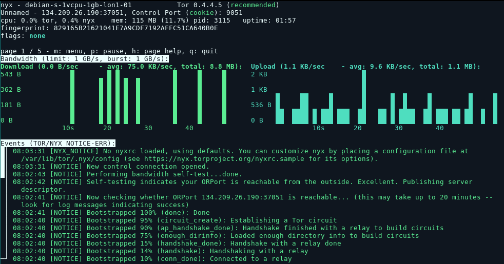

## **Using your own bridge**

Next install tor-browser (in arch linux you can do it from the AUR), if not just go to the [downloads](https://www.torproject.org/download/) page.
    
    
    yay -S torbrowser-launcher
    
    

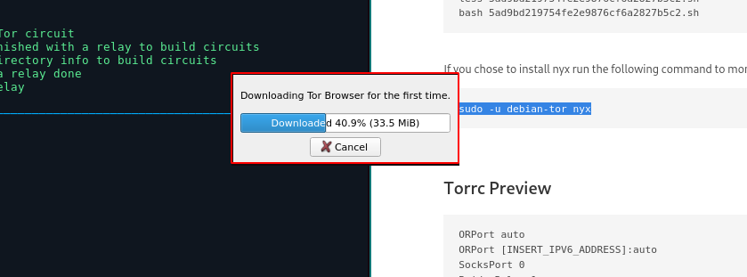

Then Launch it, and go in your preferences:

 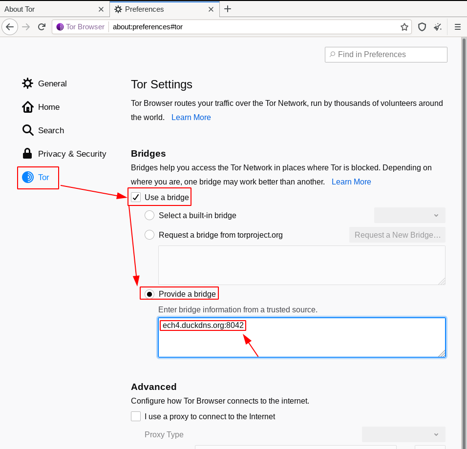

Here specifying your own bridge is not that simple, you need to use the following syntax:
    
    
    Bridge obfs4 <****IP ADDRESS>: <****PORT> <****FINGERPRINT> cert= <****CERTIFICATE> iat-mode=0

First find the ip address of your server:
    
    
    root@debian-s-1vcpu-1gb-lon1-01:~# curl ifconfig.me && echo && echo
    **134.209.26.190**
    
    

Next find the port :
    
    
    sudo -u debian-tor nyx
    
    

Just hit right arrow 3 times to get to your torrc config preview:

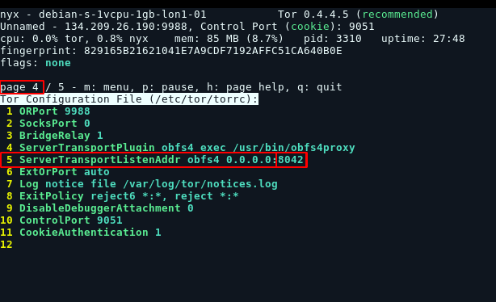

And here we have port **8042**. Next we need the fingerprint which is at page 1 of nyx, so press leftarrow to get back to page 1 and then scroll down using the downarrow:


Here it is **829165B21621041E7A9CDF7192AFFC51CA640B0E** , be careful not to copy the other one above which is the HASHED identity key. Here we want the original identity key fingerprint. After this, we need the server's certificate:
    
    
    
    root@debian-s-1vcpu-1gb-lon1-01:~# cat /var/lib/tor/pt_state/obfs4_bridgeline.txt
    # obfs4 torrc client bridge line
    #
    # This file is an automatically generated bridge line based on
    # the current obfs4proxy configuration.  EDITING IT WILL HAVE
    # NO EFFECT.
    #
    # Before distributing this Bridge, edit the placeholder fields
    # to contain the actual values:
    #  <****IP ADDRESS>  - The public IP address of your obfs4 bridge.
    # <****PORT>        - The TCP/IP port of your obfs4 bridge.
    # <****FINGERPRINT> - The bridge's fingerprint.
    
    Bridge obfs4 <****IP ADDRESS>: <****PORT> <****FINGERPRINT>**cert=L04rcSpDJb9xdGUy/LgAlxbNgtQUWPJFsdF3q2i8lKRmzffiVFJU5ARjr4RYXRZSrsNYXg iat-mode=0**
    

Here in this case we need the last part: **cert=L04rcSpDJb9xdGUy/LgAlxbNgtQUWPJFsdF3q2i8lKRmzffiVFJU5ARjr4RYXRZSrsNYXg iat-mode=0**

And so we combine it all to get the string we need:
    
    
    Bridge obfs4 134.209.26.190:8042 829165B21621041E7A9CDF7192AFFC51CA640B0E  cert=L04rcSpDJb9xdGUy/LgAlxbNgtQUWPJFsdF3q2i8lKRmzffiVFJU5ARjr4RYXRZSrsNYXg iat-mode=0
    

Paste it in and hit "new identity":

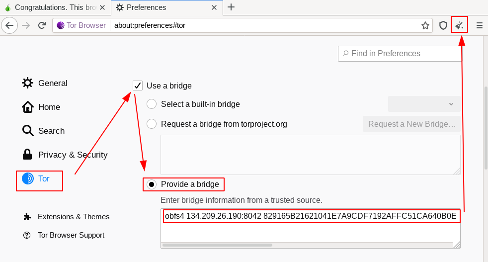

Then we check if it is working on [check.torproject.org](https://check.torproject.org/):

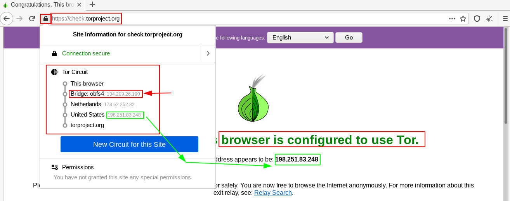

And that's it! we have been able to use our own VPS-hosted tor bridge!

If you want to use the bridge from torrc you can do as follows:
    
    
    nihilist@mainpc: ~$ vim /etc/tor/torrc
    nihilist@mainpc: ~$ cat /etc/tor/torrc
    
    UseBridges 1
    ClientTransportPlugin obfs4 exec /usr/local/bin/obfs4proxy managed
    Bridge obfs4 134.209.26.190:8042 829165B21621041E7A9CDF7192AFFC51CA640B0E  cert=L04rcSpDJb9xdGUy/LgAlxbNgtQUWPJFsdF3q2i8lKRmzffiVFJU5ARjr4RYXRZSrsNYXg iat-mode=0
    
    nihilist@mainpc: ~$ systemctl restart tor@default
    
    

Now keep in mind that obfs4 traffic simply looks like random data on the outside, it doesn't look like legit https traffic when doing deep-packet inspection. Therefore for heavily-censored countries, we recommend you use snowflake bridges:

## **Snowflake bridge theory**

As time goes to 2024 censorship becomes more advanced, and sometimes snowflake protocol works better than obfs4. We will go through theories and setup about snowflake bridge

For a normal tor connection without bridge, you will:

1.Talk to central directory

2.Get network information

3.Connect to your gurad nodes, and form tor circuits

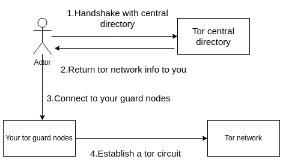

If tor network is blocked, you cannot talk to central directory or any tor node ip, then you need a **bridge**

All of your communication goes through the bridge, including your initial talk to central directory, and your bridge automatically becomes your first tor node

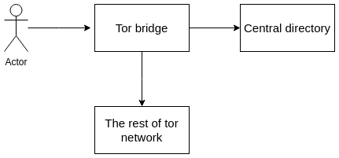

Bridges are usually not publicly announced for censorship resistance, since once a bridge ip get known by censoring firewall it can simply drop all the packets to that ip

This is the weakness for traditional tor bridges, not matter how hard you try to obfuscate your traffic, the **bridge ip** always have to be semi-public because you want people to use it, but this means people who work for censorship can also find bridge ip

To end this cat and mouse game, snowflake is introduced


This is a picture of how snowflake works from tor official

First you have volunteers over the world who install snowflake plugin in their browsers, they act as bridges for you to connect to tor network. Because this is mostly run by amateurs, and people turn on and off their devices all the time, which makes many ephemeral bridges, and this is why it is called snowflake

There is also a server called broker that knows all the information about snowflakes

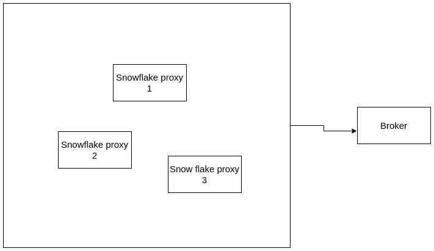

Then you will use a technique called domain fronting, which makes you seems connecting to a legit service like azure cloud or google cloud, but your actual connection goes to the broker.

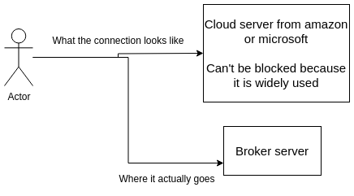

Then the broker server introduce you to the snowflake proxy, then you establish a webrtc connection, which is a connection allows two app to have direct connection for video call or file transmission. Then your traffic goes to the snowflake proxy, and connects to the rest of tor network

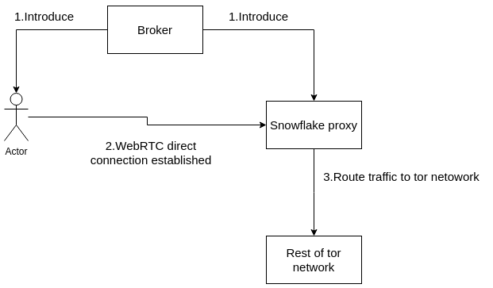

Then you connect to tor network!

## **Snowflake bridge in practice**

Now in practice, all you need to do to run a snowflake bridge is to have a webpage that runs the following HTML code:

Whoever wants to run a snowflake bridge simply has to click the "enabled" slider to run a snowflake bridge. Or you can also run [the snowflake firefox extension](https://addons.mozilla.org/en-US/firefox/addon/torproject-snowflake/) to run a snowflake bridge whenever you are starting a webpage:

 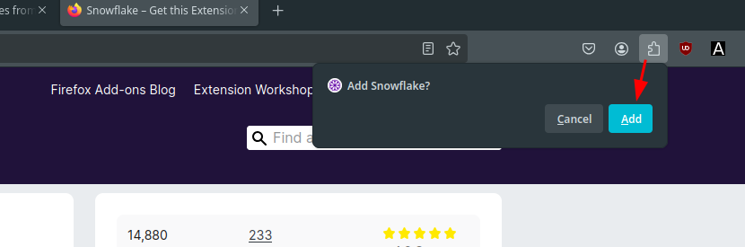 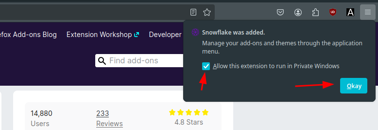  

and then you can simply wait for someone to use it. Someone that needs to evade censorship somewhere in the world will start to use it when torproject will give them the snowflake bridgelike so: 

 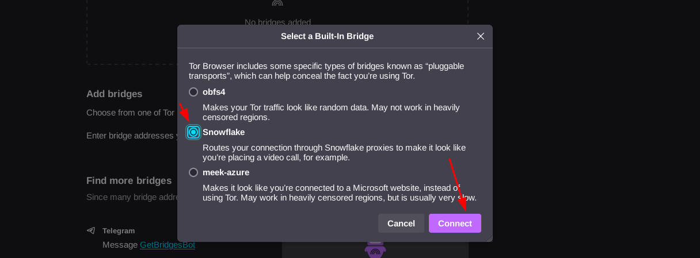 

If you want to use the snowflake bridge from torrc you can do as follows:
    
    
    nihilist@mainpc: ~$ vim /etc/tor/torrc
    nihilist@mainpc: ~$ cat /etc/tor/torrc
    
    UseBridges 1
    ClientTransportPlugin snowflake exec ./client -log snowflake.log
    
    Bridge snowflake 192.0.2.3:80 2B280B23E1107BB62ABFC40DDCC8824814F80A72 fingerprint=2B280B23E1107BB62ABFC40DDCC8824814F80A72 url=https://snowflake-broker.torproject.net.global.prod.fastly.net/ fronts=foursquare.com,github.githubassets.com ice=stun:stun.l.google.com:19302,stun:stun.antisip.com:3478,stun:stun.bluesip.net:3478,stun:stun.dus.net:3478,stun:stun.epygi.com:3478,stun:stun.sonetel.com:3478,stun:stun.uls.co.za:3478,stun:stun.voipgate.com:3478,stun:stun.voys.nl:3478 utls-imitate=hellorandomizedalpn
    
    Bridge snowflake 192.0.2.4:80 8838024498816A039FCBBAB14E6F40A0843051FA fingerprint=8838024498816A039FCBBAB14E6F40A0843051FA url=https://1098762253.rsc.cdn77.org/ fronts=www.cdn77.com,www.phpmyadmin.net ice=stun:stun.l.google.com:19302,stun:stun.antisip.com:3478,stun:stun.bluesip.net:3478,stun:stun.dus.net:3478,stun:stun.epygi.com:3478,stun:stun.sonetel.net:3478,stun:stun.uls.co.za:3478,stun:stun.voipgate.com:3478,stun:stun.voys.nl:3478 utls-imitate=hellorandomizedalpn
    
    Bridge snowflake 192.0.2.3:80 2B280B23E1107BB62ABFC40DDCC8824814F80A72 fingerprint=2B280B23E1107BB62ABFC40DDCC8824814F80A72 url=https://1098762253.rsc.cdn77.org/ fronts=www.cdn77.com,www.phpmyadmin.net ice=stun:stun.l.google.com:19302,stun:stun.antisip.com:3478,stun:stun.bluesip.net:3478,stun:stun.dus.net:3478,stun:stun.epygi.com:3478,stun:stun.sonetel.com:3478,stun:stun.uls.co.za:3478,stun:stun.voipgate.com:3478,stun:stun.voys.nl:3478 utls-imitate=hellorandomizedalpn
    
    nihilist@mainpc: ~$ systemctl restart tor@default
    
    

