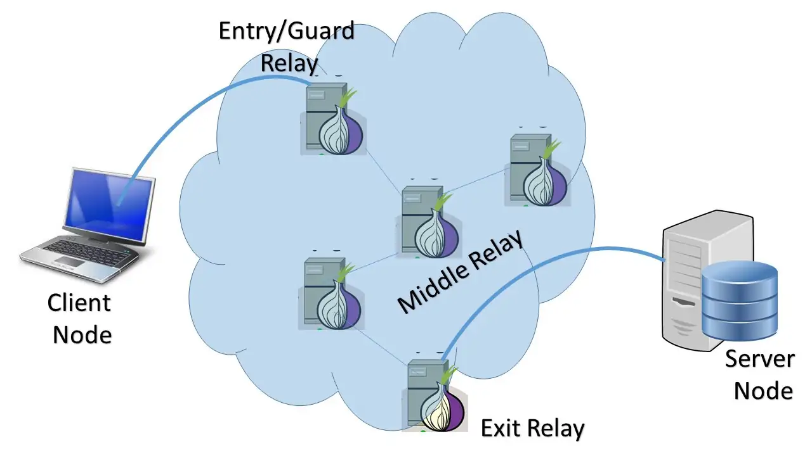

# TOR Exit Node 

```
TLDR: you can help tor users access the clearnet by running Tor exit nodes, but be warned, you should ONLY run those on cloud providers that explicitely allow you to run them. The cops will kick down your door if you try to self host it, so don't do that.
```


Before we start, make sure you either rent a VPS anonymously (tor+XMR + ssh via tor) click [here](https://kycnot.me/search?q=hosting&type=service) for the list of anonymity-friendly hosting providers or rent a VPS on a cloud provider that [explicitly](https://community.torproject.org/relay/community-resources/good-bad-isps/) allows for tor exit nodes to be hosted on their platform.



As a disclaimer, you need to know who allows these tor exit nodes, if you're going to pick a random host provider to host an exit node for you, you really don't know how the host may respond to that. Therefore it is best to pre-emptively see who actually accepts those exit nodes by looking at their TOS or by contacting them for additional information. 


⚠️ Beware that authorities aren't always aware of tor exit node and what to do from a legal stand point. Before hosting an exit node, please take time to do sufficient legal research. People have been arrested all around the world and had a lot of trouble with authorities because they hosted exit nodes. If you are still motivated to get your own exit node, keep the phone number of a lawyer specialised in this field just in case anything goes wrong. ⚠️ 

Now you can get a domain name to resolve to your exit node, or just use the one provided by njal.la :


Now regarding the choice of location for the server, in order to make sure that Tor remains decentralised, make sure that you are picking a country that doesn't have many tor nodes (see the [bubbles graph](https://metrics.torproject.org/bubbles.html#country)):


_Disclaimer:_ **Do not host your Tor node in Germany, Netherlands or in the US, as there are already too many nodes in those countries.** Try to run your own Tor nodes in countries that have the least nodes preferably, as this will help keeping the Tor network decentralized.


## **Initial setup**

Log into your Debian server and add Tor repository.  
This will allow you to update your Tor daemon to latest versions just after they're released. It's not recommended to use **tor** package from Debian repository since it's usually out of date.  
To do that, [check the steps on Tor project's website](https://support.torproject.org/apt/tor-deb-repo/). Commands I run are listed below, but they may change in the future. 
    
    
    root@Datura:~# apt update -y && apt upgrade -y
    root@Datura:~# apt install apt-transport-https curl tmux vim obfs4proxy gnupg2 -y
    
    root@Datura:~# cat /etc/apt/sources.list | head -n3
    
    deb     [signed-by=/usr/share/keyrings/deb.torproject.org-keyring.gpg] https://deb.torproject.org/torproject.org bookworm main
    deb-src [signed-by=/usr/share/keyrings/deb.torproject.org-keyring.gpg] https://deb.torproject.org/torproject.org bookworm main
    
    root@Datura:~# wget -qO- https://deb.torproject.org/torproject.org/A3C4F0F979CAA22CDBA8F512EE8CBC9E886DDD89.asc | gpg --dearmor | tee /usr/share/keyrings/deb.torproject.org-keyring.gpg >/dev/null
    
    root@Datura:~# apt update -y
    root@Datura:~# apt install tor nyx
    

From inside nyx you can view tor's status :
    
    
    root@exit:~# nyx
    
    


inside nyx you can use the left and right arrow to navigate the different pages:


Above you can see the connections, pressing right again shows how your server is configured, along with extra details on each setting:


Next we make sure it's an exit like so: (be aware that this is where it gets dangerous if you're not doing this on a non-KYC VPS, or on a cloud provider that doesnt accept tor exit nodes.
    
    
    root@exit:~# vim /etc/tor/torrc
    root@exit:~# cat /etc/tor/torrc
    RunAsDaemon 1
    ControlPort 9051
    CookieAuthentication 1
    ORPort 9001
    Nickname anonymous
    
    ExitPolicy accept *:* # Accept exit connections
    ExitPolicy reject private:* # Block private IPv4
    IPv6Exit 1 # Allow IPv6 connections
    ExitPolicy accept6 *:* # Accept IPv6
    ExitPolicy reject6 [FC00::]/7:* # Block private IPv6
    ExitPolicy reject6 [FE80::]/10:* # Block link-local IPv6
    ExitPolicy reject6 [2002::]/16:* # Block 6to4 addresses
    
    

you can also make a stricter tor exit policy like so:
    
    
    root@Datura:~# cat /etc/tor/torrc
    RunAsDaemon 1
    ControlPort 9051
    CookieAuthentication 1
    ORPort 9001
    Nickname Datura
    
    ExitPolicy accept *:20-21   # FTP
    ExitPolicy accept *:43     # WHOIS
    ExitPolicy accept *:53     # DNS
    ExitPolicy accept *:80-81   # HTTP, HTTP alt.
    ExitPolicy accept *:443   # HTTPS
    ExitPolicy accept *:5222-5223   # XMPP, XMPP over
    ExitPolicy accept *:6667-7000  # IRC
    ExitPolicy accept *:8008   # HTTP alternate
    ExitPolicy accept *:8082   # HTTPS Electrum Bitcoin port
    ExitPolicy accept *:8332-8333   # Bitcoin
    ExitPolicy accept *:8888   # HTTP Proxies, NewsEDGE, HUSH coin
    ExitPolicy accept *:9418   # git - Git pack transfer service
    ExitPolicy accept *:50002   # Electrum Bitcoin SSL
    ExitPolicy accept *:64738   # Mumble - voice over IP
    ExitPolicy accept *:18080-18081   # Monero
    ExitPolicy reject *:*
    
    ExitPolicy reject private:* # Block private IPv4
    IPv6Exit 1 # Allow IPv6 connections
    ExitPolicy accept6 *:* # Accept IPv6
    ExitPolicy reject6 [FC00::]/7:* # Block private IPv6
    ExitPolicy reject6 [FE80::]/10:* # Block link-local IPv6
    ExitPolicy reject6 [2002::]/16:* # Block 6to4 addresses
    
    

And then just restart the tor service to make sure the exit node is active:
    
    
    root@exit:~# systemctl restart tor@default
    root@exit:~# systemctl status tor@default
    ● tor@default.service - Anonymizing overlay network for TCP
         Loaded: loaded (/lib/systemd/system/tor@default.service; enabled-runtime; preset: enabled)
         Active: active (running) since Mon 2024-01-29 10:43:02 UTC; 5s ago
        Process: 3852 ExecStartPre=/usr/bin/install -Z -m 02755 -o debian-tor -g debian-tor -d /run/tor (code=exited, status=0/SUCCESS)
        Process: 3853 ExecStartPre=/usr/bin/tor --defaults-torrc /usr/share/tor/tor-service-defaults-torrc -f /etc/tor/torrc --RunAsDaemon 0 --verify-config (code=exited, status=0/SUCCESS)
       Main PID: 3855 (tor)
          Tasks: 3 (limit: 19110)
         Memory: 140.1M
         CGroup: /system.slice/system-tor.slice/tor@default.service
                 └─3855 /usr/bin/tor --defaults-torrc /usr/share/tor/tor-service-defaults-torrc -f /etc/tor/torrc --RunAsDaemon 0
    
    Jan 29 10:43:03 exit Tor[3855]: Bootstrapped 75% (enough_dirinfo): Loaded enough directory info to build circuits
    Jan 29 10:43:04 exit Tor[3855]: Bootstrapped 89% (ap_handshake): Finishing handshake with a relay to build circuits
    Jan 29 10:43:04 exit Tor[3855]: Bootstrapped 90% (ap_handshake_done): Handshake finished with a relay to build circuits
    Jan 29 10:43:04 exit Tor[3855]: Bootstrapped 95% (circuit_create): Establishing a Tor circuit
    Jan 29 10:43:05 exit Tor[3855]: Bootstrapped 100% (done): Done
    Jan 29 10:43:05 exit Tor[3855]: Now checking wheter IPv4 ORPort 80.78.22.215:9001 is reachable... (this may take up to 20 minutes -- look for log messages indicating success)
    Jan 29 10:43:05 exit Tor[3855]: Now checking wheter IPv6 ORPort [2a0a:3840:8078:22:0:504e:16d7:1337]:9001 is reachable... (this may take up to 20 minutes -- look for log messages indicating success)
    Jan 29 10:43:06 exit Tor[3855]: Self-testing indicates your ORPort [2a0a:3840:8078:22:0:504e:16d7:1337]:9001 is reachable from the outside. Excellent.
    Jan 29 10:43:06 exit Tor[3855]: Self-testing indicates your ORPort 80.78.22.215:9001 is reachable from the outside. Excellent. Publishing server descriptor.
    Jan 29 10:43:06 exit Tor[3855]: Performing bandwidth self-test...done.
    
    root@exit:~# nyx
    
    

Then wait a few hours for the exit node to appear on tor metrics, then you can take the node fingerprint (example 916EDD8E5D61613BBC7B6CCEFB2778AE706786B9) and check it's status on torproject.org [here](https://metrics.torproject.org/rs.html#search/flag:exit).

After that, you need to wait 2 weeks for the exit node to be fully operational as explained [here](https://blog.torproject.org/lifecycle-of-a-new-relay/).
    
    
    "A new relay, assuming it is reliable and has plenty of bandwidth, goes through four phases: the unmeasured phase (days 0-3) where it gets roughly no use, the remote-measurement phase (days 3-8) where load starts to increase, the ramp-up guard phase (days 8-68) where load counterintuitively drops and then rises higher, and the steady-state guard phase (days 68+). "
    
    

