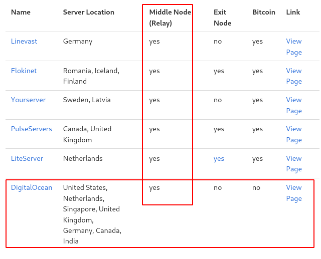
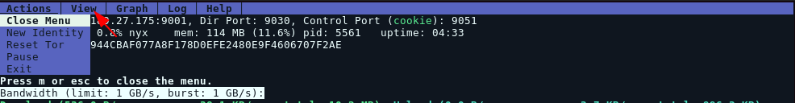
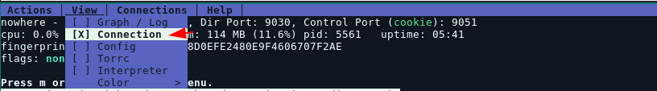

# How to run a Tor relay node 

```
TLDR: you can run a tor node for free, effectively helping decentralize the Tor network. Don't run tor nodes in germany or the netherlands, as there's a disproportionately large amount of Tor nodes there.
```


Before we start, you will need a Debian VPS (you can get one on digitalocean for example), if you prefer to use your own self hosted server, make sure that port 80 and 443 are correctly port forwarded so that the public ip points to the server and not the router. Once that's done, go and ssh into your debian 10 server. 

You will also need to make sure that the VPS provider allows the hosting of a tor node! check torproject's good/bad isps page [here](https://community.torproject.org/relay/community-resources/good-bad-isps/). 



For example, you wouldn't be able to host an exit node on DigitalOcean, however hosting a regular node is completely fine.

Now regarding the choice of location for the server, in order to make sure that Tor remains decentralised, make sure that you are picking a country that doesn't have many tor nodes (see the [bubbles graph](https://metrics.torproject.org/bubbles.html#country)):


_Disclaimer:_ **Do not host your Tor node in Germany, Netherlands or in the US, as there are already too many nodes in those countries.** Try to run your own Tor nodes in countries that have the least nodes preferably, as this will help keeping the Tor network decentralized.

## **Installation**

Log into your Debian server and add Tor repository.  
This will allow you to update your Tor daemon to latest versions just after they're released. It's not recommended to use **tor** package from Debian repository since it's usually out of date.  
To do that, [check the steps on Tor project's website](https://support.torproject.org/apt/tor-deb-repo/). Commands I run are listed below, but they may change in the future. 
    
    
    root@Datura:~# apt update -y && apt upgrade -y
    root@Datura:~# apt install apt-transport-https curl tmux vim obfs4proxy gnupg2 -y
    
    root@Datura:~# cat /etc/apt/sources.list | head -n3
    
    deb     [signed-by=/usr/share/keyrings/deb.torproject.org-keyring.gpg] https://deb.torproject.org/torproject.org bookworm main
    deb-src [signed-by=/usr/share/keyrings/deb.torproject.org-keyring.gpg] https://deb.torproject.org/torproject.org bookworm main
    
    root@Datura:~# wget -qO- https://deb.torproject.org/torproject.org/A3C4F0F979CAA22CDBA8F512EE8CBC9E886DDD89.asc | gpg --dearmor | tee /usr/share/keyrings/deb.torproject.org-keyring.gpg >/dev/null
    
    root@Datura:~# apt update -y
    root@Datura:~# apt install tor nyx
    

To configure tor we need to edit the configuration file with the following entry. Replace the TODOs with the port numbers you wish to use Edit tor configuration file:
    
    
    root@Datura:~# vim /etc/tor/torrc
    
    # Replace "TODO1" with a Tor port of your choice.
    # This port must be externally reachable.
    # Avoid port 9001 because it's commonly associated with Tor and censors may be scanning the Internet for this port.
    ORPort 37051
    
    # Local communication port between Tor and obfs4.  Always set this to "auto".
    # "Ext" means "extended", not "external".  Don't try to set a specific port number, nor listen on 0.0.0.0.
    ExtORPort auto
    
    # Replace "" with your email address so we can contact you if there are problems with your bridge.
    # This is optional but encouraged.
    ContactInfo nihilist@nowhere.moe
    
    # Pick a nickname that you like for your bridge.  This is optional.
    Nickname Nihilist

Then restart the tor service + enable it:
    
    
    #Restart service
    systemctl restart tor@default
    
    #Enable at boot
    systemctl enable --now tor@default
    
    #monitor it with nyx
    nyx
    


You can also monitor connections by switching to the menu (pressing **m**) 



and then just use the **arrow keys** to navigate:



Hit **spacebar** to choose "connection" 

EDIT: you can just use left arrow and right arrow to change menus quickly lol


This is going to list the active connections (Circuits) to your tor node with their ip addresses.

