# Using the Tor browser to browse the web Anonymously

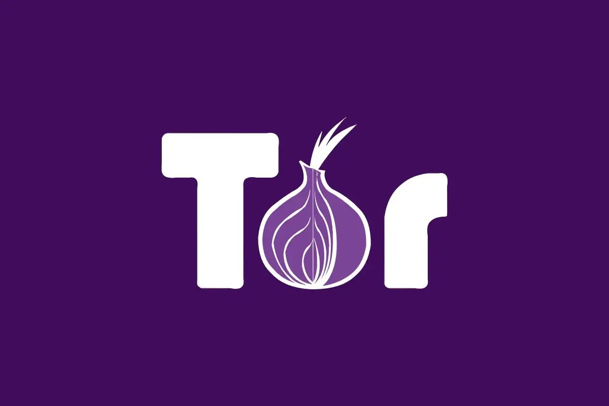

In this tutorial we're going to cover how to browse the web anonymously, and some simple rules to follow to protect your anonymity. 

## _OPSEC Recommendations:_

  1. Hardware : (Personal Computer / Laptop)

  2. Host OS: [Linux](../linux/index.md)

  3. Hypervisor: [libvirtd QEMU/KVM](../hypervisorsetup/index.md)

  4. Virtual Machine: [Whonix](../whonixqemuvms/index.md) 

  5. Application: [VPN](../vpn/index.md) (if your ISP doesn't allow Tor traffic) 

I recommend using this setup into one of the above mentioned VMs, for [Anonymous use](../anonymityexplained/index.md), as per the [4 basic OPSEC levels](../opsec4levels/index.md).

Next, we'll do some slight configuration changes, starting with the automatic connection:

Then we make sure that all javascript is disabled, using the shield option on the top right corner, make sure it's set to the "Safest" setting:

Then a personal preference, let's switch on the dark theme:

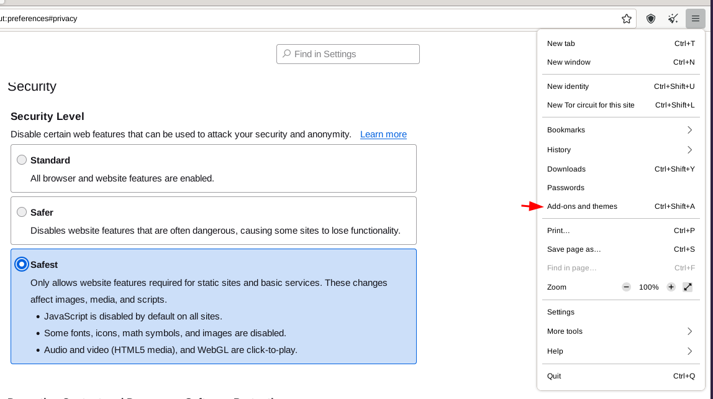 

And from there you can start browsing. You can browse the clearnet first to see how the tor connection works:

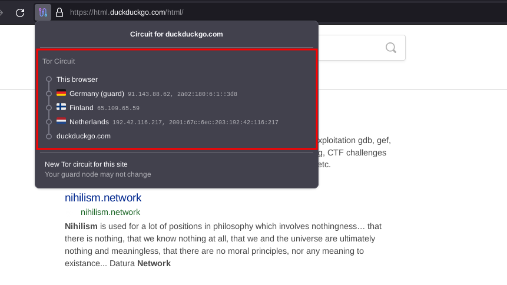

As you can see here, when browsing to the clearnet, your traffic is being encapsulated threefold, meaning that you are entrusting your connection to 3 tor node owners around the globe. And on top of that, they are in 3 different countries.

Next, when you browse to a website that can be accessed via a .onion link, you might get the above message that shows up. I prefer to not prioritize onions to avoid unnecessary page refreshes. Instead i click on the .onion available button if it appears.

Now when you're connected to the .onion hidden service, you can see that your connection goes through more tor nodes, this is the best way to access websites online, you're not leaking any info they don't need to know that way. Plus, since we are on the "safest" setting, we are not loading any javascript that may be used to fingerprint our activity online. 

## **How to get the Tor Browser when you are in a Heavily-censored country**

There are situations when you cannot simply download tor browser from their official site because of censorship. There are alternative methods for you to get the tor browser

Tor browser official offers an email address called gettor@torproject.org, which you can send email to them, and they will offer you a download link

First prepare an email, for me I am using protonmail, you can also use outlook or apple email if protonmail is blocked. Any service provider allows you to email tor project will work.

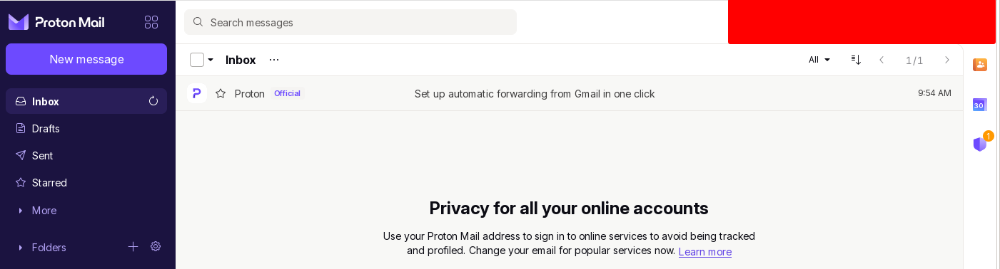

Next simply send an empty email to tor project

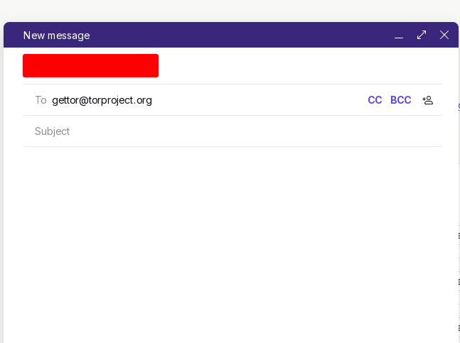

Soon you will receive a reply from tor project, simply reply them with your OS name(select one from the list)

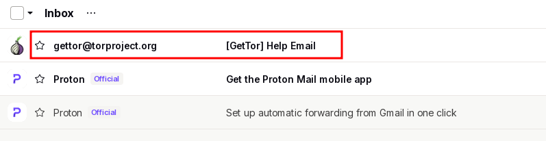

For me during this demo is linux64

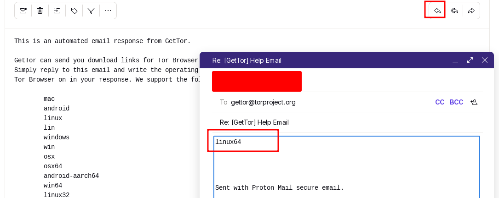

After the reply they will send you a download link, very ironically the download link is a google drive link, many countries that block tor also block google, they actually are supposed to send the brower bundle in attachment

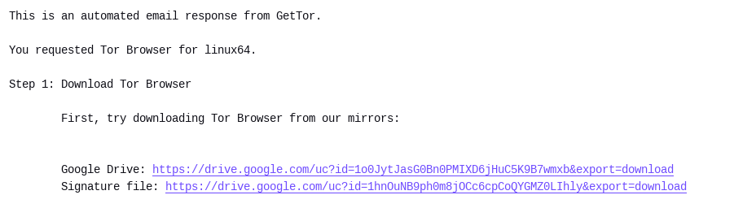

If you find out google drive does not work for you, try to check wheter if github is accessible. Tor browser also provides download on github officially, check the releases on [Tor browser github repository](https://github.com/TheTorProject/gettorbrowser)

## **Setting up the Tor Browser on your Mobile**

## _OPSEC Recommendations:_

  * Hardware: Google Pixel

  * Host OS: [Graphene OS](../graphene/index.md)

  * Configuration: Can be set in the Private or Anonymous Profile

## **Installing the Tor browser on mobile**

You can download Tor Browser for Android from F-Droid (as we want to maintain the open source requirement), using the Guardian Repository, or the apk directly from the official Tor website. Please do not download it from any other source. There have been malicious versions passed around on social media in the past.

  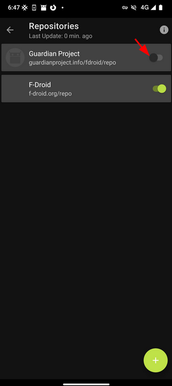 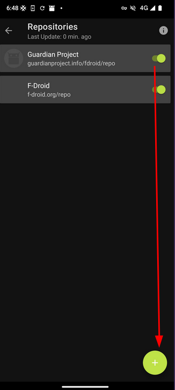 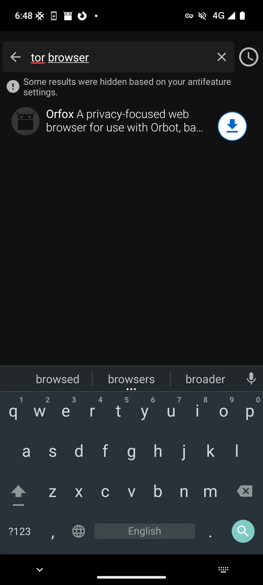 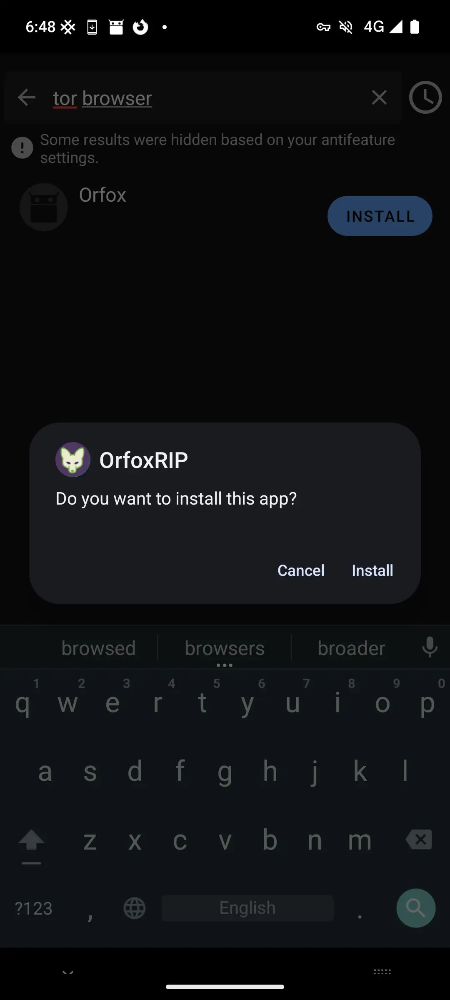     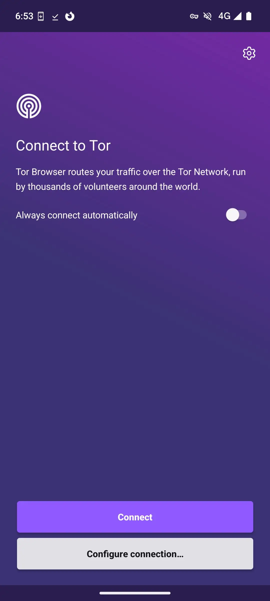

Note: To download from F-Droid you will have to enable Guardian Project Repositories under settings → My Apps → Guardian Project (guardianproject.info/fdroid/repo)

When you open the Tor app for the first time you will be greeted with this screen:

  
   

We'll do some slight configuration changes, starting with the automatic connection and then open settings: _toggle auto → settings_   
   

In settings, scroll down to Privacy and security. Open Security Level:

  
   

Choose Safest for maximum security

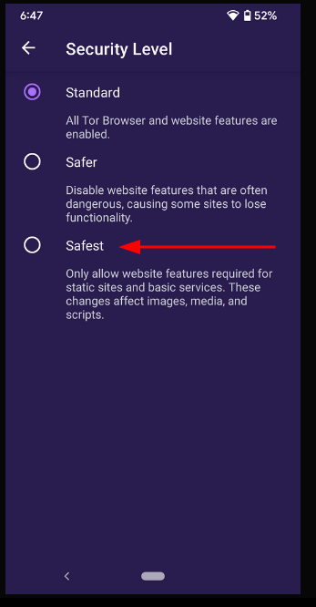   

Additionally in settings you can choose the Default search engine and to use (.onion) sites if you prefer.

   

And you are done, you should now be at the start page:

  
   

If your connection is being censored or you are unable to connect to the Tor network then you may have to configure a bridge. Choose “Config Bridge” on the opening screen or under settings:

  
   

Toggle “Use a Bridge” to open up three options: "obfs4", "meek-azure", and "snowflake".

  1. Obfs4 is a pluggable transport that makes Tor traffic look random and also prevents censors from finding bridges by Internet scanning. 

  2. Meek-Azure is a pluggable transport that makes it look like you are browsing a Microsoft web site instead of using Tor.

  3. Snowflake involves a large number of volunteer proxies, which also makes them hard to pin point and prevents the blocking of proxy IP addresses.

Additionally you can provide a trusted bridge to use if you know one.

  

## _Closing:_

  1. Orfox is a sunsetted privacy focused web browser based on Tor. It is no longer maintained and is not recommended.

  2. Orbot is a proxy app that allows other apps on your device to encrypt your internet traffic through Tor. After installing Orbot go to Choose apps under settings in order to route the apps of your choice through Tor.

  3. Currently there is no official Tor browser available for iOS on iPhone. Using Orbot with the open source Onion Browser is better than nothing but does not have the same privacy protections as Tor Browser. Use at your own risk.

By default, the Tor browser is installed on Whonix Workstation, you can use it there directly. If you want to install the Tor browser from elsewhere, follow those instructions:

## **Setting up the Tor Browser if you are not on Whonix**

If you have a regular debian distribution, do as follows to install the tor browser:
    
    
    [ mainpc ] [ /dev/pts/5 ] [~]
    → sudo apt install tor torsocks curl apt-transport-tor gnupg2 -y
    
    [ mainpc ] [ /dev/pts/1 ] [~]
    → sudo torsocks curl --output /usr/share/keyrings/derivative.asc --url http://www.w5j6stm77zs6652pgsij4awcjeel3eco7kvipheu6mtr623eyyehj4yd.onion/keys/derivative.asc
      % Total    % Received % Xferd  Average Speed   Time    Time     Time  Current
                                     Dload  Upload   Total   Spent    Left  Speed
    100 77312  100 77312    0     0   7106      0  0:00:10  0:00:10 --:--:-- 23126
    
    [ mainpc ] [ /dev/pts/1 ] [~]
    → echo "deb [signed-by=/usr/share/keyrings/derivative.asc] tor+http://deb.w5j6stm77zs6652pgsij4awcjeel3eco7kvipheu6mtr623eyyehj4yd.onion bookworm main contrib non-free" | sudo tee /etc/apt/sources.list.d/derivative.list
    deb [signed-by=/usr/share/keyrings/derivative.asc] tor+http://deb.w5j6stm77zs6652pgsij4awcjeel3eco7kvipheu6mtr623eyyehj4yd.onion bookworm main contrib non-free
    
    [ mainpc ] [ /dev/pts/1 ] [~]
    → sudo apt update -y
    Hit:1 http://deb.debian.org/debian bookworm InRelease
    Hit:2 http://security.debian.org/debian-security bookworm-security InRelease
    Hit:3 http://deb.debian.org/debian bookworm-updates InRelease
    Hit:4 https://packages.element.io/debian default InRelease
    Get:5 tor+http://deb.w5j6stm77zs6652pgsij4awcjeel3eco7kvipheu6mtr623eyyehj4yd.onion bookworm InRelease [39.6 kB]
    Get:6 tor+http://deb.w5j6stm77zs6652pgsij4awcjeel3eco7kvipheu6mtr623eyyehj4yd.onion bookworm/main amd64 Packages [34.3 kB]
    Get:7 tor+http://deb.w5j6stm77zs6652pgsij4awcjeel3eco7kvipheu6mtr623eyyehj4yd.onion bookworm/contrib amd64 Packages [506 B]
    Get:8 tor+http://deb.w5j6stm77zs6652pgsij4awcjeel3eco7kvipheu6mtr623eyyehj4yd.onion bookworm/non-free amd64 Packages [896 B]
    Fetched 75.3 kB in 12s (6,284 B/s)
    Reading package lists... Done
    Building dependency tree... Done
    Reading state information... Done
    16 packages can be upgraded. Run 'apt list --upgradable' to see them.
    
    [ mainpc ] [ /dev/pts/1 ] [~]
    → sudo apt install tb-starter tb-updater -y
    
    [ mainpc ] [ /dev/pts/6 ] [~/Nextcloud/blog]
    → systemctl enable --now tb-updater-first-boot.service                                                                                                                                                                                      (3)
    
    Created symlink /etc/systemd/system/multi-user.target.wants/tb-updater-first-boot.service → /lib/systemd/system/tb-updater-first-boot.service.
    
    [ mainpc ] [ /dev/pts/6 ] [~/Nextcloud/blog]
    → systemctl --no-pager --no-block status tb-updater-first-boot.service
    
    ● tb-updater-first-boot.service - Helper Service for /usr/bin/torbrowser to determine when it is save to Copy Tor Browser from /var/cache/tb-binary to user home by Whonix developers
         Loaded: loaded (/lib/systemd/system/tb-updater-first-boot.service; enabled; preset: enabled)
         Active: active (exited) since Wed 2024-01-31 08:59:34 CET; 2s ago
           Docs: https://github.com/Whonix/tb-updater
        Process: 140334 ExecStart=/bin/true (code=exited, status=0/SUCCESS)
       Main PID: 140334 (code=exited, status=0/SUCCESS)
            CPU: 690us
    
    [ mainpc ] [ /dev/pts/1 ] [~]
    → torbrowser
    INFO: ARCH 'x86_64' detected.
    INFO: ARCH_DOWNLOAD 'linux-x86_64' detected.
    INFO: CURL_PROXY:
    INFO: Not running inside Qubes Disposable Template, ok.
    INFO: Using stable version. For alpha version, see: https://www.whonix.org/wiki/Tor_Browser#Alpha
    INFO: Running connectivity check...  Downloading...: https://www.torproject.org
    INFO: CURL_OUT_FILE: /home/nihilist/.cache/tb/temp/tbb_remote_folder
    INFO: Connectivity check succeeded.
    INFO: Find out latest version... Downloading...: https://aus1.torproject.org/torbrowser/update_3/release/downloads.json
    INFO: CURL_OUT_FILE: /home/nihilist/.cache/tb/RecommendedTBBVersions
    INFO: Learn more about this Download Confirmation Notification.
    https://www.whonix.org/wiki/Tor_Browser#Download_Confirmation_Notification
    INFO: Previously downloaded version: none
    INFO: Currently installed version: None installed. (Folder /home/nihilist/.tb/tor-browser does not exist.)
    INFO: Online detected version: 13.0.9
    QUESTION: Download now?
    y/n?
    y
    
    INFO: Because you are not using --nokilltb, now killing potentially still running instances of Tor Browser...
    firefox.real: no process found
    INFO: Digital signature (GPG) download... Will take a moment...
    INFO: Downloading...: https://www.torproject.org/dist/torbrowser/13.0.9/tor-browser-linux-x86_64-13.0.9.tar.xz.asc
    INFO: CURL_OUT_FILE: /home/nihilist/.cache/tb/files/tor-browser-linux-x86_64-13.0.9.tar.xz.asc
    INFO: Downloading Tor Browser...
    INFO: Downloading...: https://www.torproject.org/dist/torbrowser/13.0.9/tor-browser-linux-x86_64-13.0.9.tar.xz
    INFO: CURL_OUT_FILE: /home/nihilist/.cache/tb/files/tor-browser-linux-x86_64-13.0.9.tar.xz
    INFO: Digital signature (GPG) verification... This will take a moment...
    INFO: Using digital signature signing key by The Tor Project.
    INFO: Digital signature (GPG) verification ok.
    INFO: Installation confirmation
    Currently installed version:  None installed. (Folder /home/nihilist/.tb/tor-browser does not exist.)
    Downloaded version         :  13.0.9
    We have not previously accepted a signature yet. Therefore assisted check for downgrade or indefinite freeze attacks skipped. Please check the Current Signature Creation Date looks sane.
    Previous Signature Creation Date:  Unknown. Probably never downloaded a signature before.
    Last Signature Creation Date    :  January 23 13:14:38 UTC 2024
    According to your system clock, the signature was created 8 days 3 hours 25 minutes 2 seconds ago.
    gpg reports:
    gpg: Signature made Tue 23 Jan 2024 02:14:38 PM CET
    gpg:                using RSA key 613188FC5BE2176E3ED54901E53D989A9E2D47BF
    gpg: Good signature from "Tor Browser Developers (signing key) " [ultimate]
    Primary key fingerprint: EF6E 286D DA85 EA2A 4BA7  DE68 4E2C 6E87 9329 8290
         Subkey fingerprint: 6131 88FC 5BE2 176E 3ED5  4901 E53D 989A 9E2D 47BF
    Learn more about this Installation Confirmation Notification.
    https://www.whonix.org/wiki/Tor_Browser#Installation_Confirmation_Notification
    QUESTION: Install now?
    y/n?
    y
    
    INFO: Extracting /home/nihilist/.cache/tb/files/tor-browser-linux-x86_64-13.0.9.tar.xz ...
    extraction percent done: 19 / 100
    extraction percent done: 44 / 100
    extraction percent done: 63 / 100
    extraction percent done: 82 / 100
    extraction percent done: 100 / 100
    
    
