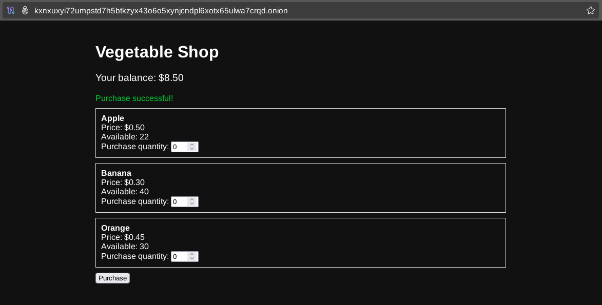

# How to setup a basic NGINX / PHP / MySQL app

## **Introduction**

After generating your [vanity address](../torwebsite/index.md), you might consider hosting something more advanced on the Tor network. If users need to interact with your website by registering an account, making a purchase, or uploading files, you will likely need functionality that updates data dynamically and stores changes persistently. 

Today, many websites use JavaScript to fetch and store data via APIs, dynamically rendering content in real-time. However, most hidden services hosted on Tor take a more conservative approach when building interactive websites. These services typically use PHP scripts rendered on the server side, which are then returned to users as HTML documents. This method minimizes the use of client-side JavaScript, which is often used for browser fingerprinting. 

The main drawback of this approach is that website content can only be updated by reloading the page since each page is server-side rendered using a PHP interpreter. 

## **Overview**

In this guide, we will set up a **LEMP** stack (**L** inux + **E** ngine-X + **M** ySQL + **P** HP) and expose a vegetable store website via a Tor hidden service. Nginx will act as a reverse proxy, passing requests to the PHP-FPM socket and returning an HTTP response back to the user. The PHP-FPM interpreter will execute the necessary PHP script to render the page and pass it to Nginx. 

We will also configure a MySQL-compatible database that the PHP scripts can access to store data persistently. By default on Debian systems, Nginx communicates with the PHP-FPM interpreter via a Unix socket located at **/var/run/php/php-fpm.sock**. 

Here is the diagram illustrating how our service will look like at the end of this guide. You can refer back to it anytime if you get lost in the steps below. 

## **Prerequisites**

To follow this guide you need to have up-to-date [Debian (or derivative) system running](../linux/index.md) with root access. I will be using **sudo** to run commands that require root privileges. 

Ensure you have Tor installed and onion domain generated as explained [here](../torwebsite/index.md). 

Next, install the required software: 

  * Nginx
  * PHP
  * PHP-FPM
  * MariaDB (MySQL compatible database)

    
    
    oxeo@galaxy:~$ sudo apt update
    oxeo@galaxy:~$ sudo apt install nginx php php-fpm php-mysql mariadb-server
    

We will be using [MariaDB](https://mariadb.org/) since it's available in Debian repositories. It's a fully open source fork of MySQL created when the former was acquired by Oracle. 

## **Database Setup**

We will start by generating a secure root password for MariaDB database. 
    
    
    oxeo@galaxy:~$ tr -dc 'A-Za-z0-9' < /dev/urandom | head -c 12 && echo
    ln8qXH64tjDi
    

From now on, you should replace every **YOU_SHOULD_GENERATE_THIS** string with the output of this command. 

There is a special **mysql_secure_installation** command we need to run to configure database security settings. This includes changing the database root account password to the one you generated. 
    
    
    oxeo@galaxy:~$ sudo mysql_secure_installation
    
    Enter current password for root (enter for none): 
    [...]
    
    Switch to unix_socket authentication [Y/n] n
    [...]
    
    Change the root password? [Y/n] Y
    New password: YOU_SHOULD_GENERATE_THIS
    Re-enter new password: YOU_SHOULD_GENERATE_THIS
    [...]
    
    Remove anonymous users? [Y/n] Y
    [...]
    
    Disallow root login remotely? [Y/n] Y
    [...]
    
    Remove test database and access to it? [Y/n] Y
    [...]
    
    Reload privilege tables now? [Y/n] Y
    [...]
    
    All done!  If you've completed all of the above steps, your MariaDB
    installation should now be secure.
    
    Thanks for using MariaDB!
    

  
  

After that, we log into the database and execute SQL commands to create the required tables and fill them with data. 
    
    
    oxeo@galaxy:~$ sudo mysql
    

Here are all commands to prepare the database for our app: 
    
    
    CREATE DATABASE veggie_shop;
    USE veggie_shop;
    
    CREATE TABLE products (
        id INT PRIMARY KEY AUTO_INCREMENT,
        name VARCHAR(100) NOT NULL,
        price DECIMAL(10, 2) NOT NULL,
        quantity INT NOT NULL
    );
    
    CREATE TABLE users (
        id INT PRIMARY KEY AUTO_INCREMENT,
        balance DECIMAL(10, 2) NOT NULL
    );
    
    INSERT INTO products (name, price, quantity) VALUES
        ('Apple', 0.50, 25),
        ('Banana', 0.30, 40),
        ('Orange', 0.45, 30);
    
    INSERT INTO users (balance) VALUES (20.00);
    

  
  

Now, here is an explanation of each command and the output you should get. You can skip this section if you are already familiar with SQL. 
    
    
    MariaDB [(none)]> CREATE DATABASE veggie_shop;
    Query OK, 1 row affected (0.000 sec)
    
    MariaDB [(none)]> USE veggie_shop;
    Database changed
    MariaDB [veggie_shop]> 
    

This creates a new database called **veggie_shop**. Then with **USE veggie_shop** , we specify which database we want to execute commands on. 
    
    
    MariaDB [veggie_shop]> CREATE TABLE products (
        ->     id INT PRIMARY KEY AUTO_INCREMENT,
        ->     name VARCHAR(100) NOT NULL,
        ->     price DECIMAL(10, 2) NOT NULL,
        ->     quantity INT NOT NULL
        -> );
    Query OK, 0 rows affected (0.006 sec)
    
    MariaDB [veggie_shop]> CREATE TABLE users (
        ->     id INT PRIMARY KEY AUTO_INCREMENT,
        ->     balance DECIMAL(10, 2) NOT NULL
        -> );
    Query OK, 0 rows affected (0.007 sec)
    

Now we add two tables - one for **products** and one for **users** and defining their schemas. Each **product** has an id, name (up to 100 characters long), price and quantity. Every **user** has an id and balance. For this demo, we will only have one user with id=1. 
    
    
    MariaDB [veggie_shop]> INSERT INTO products (name, price, quantity) VALUES
        ->     ('Apple', 0.50, 25),
        ->     ('Banana', 0.30, 40),
        ->     ('Orange', 0.45, 30);
    Query OK, 3 rows affected (0.008 sec)
    Records: 3  Duplicates: 0  Warnings: 0
    
    MariaDB [veggie_shop]> INSERT INTO users (balance) VALUES (20.00);
    Query OK, 1 row affected (0.002 sec)
    
    MariaDB [veggie_shop]> \q
    

Finally, we can fill the tables with products and create one user. Now the user has initial balance set to 20$.   
To exit the MariaDB shell we can use **\q**. 

## **PHP Scripting**

First, create a directory to put our php scripts. 
    
    
    oxeo@galaxy:~$ sudo mkdir -p /srv/shop
    

  
  

Then create the config file under **/srv/shop/config.php** and remember to replace **YOU_SHOULD_GENERATE_THIS** password with the one you generated earlier.   
Here, we connect to the database running at localhost using **mysqli** function. The database name is **veggie_shop** which we created before. 
    
    
    <?php
    $db_host = 'localhost';
    $db_user = 'root';
    $db_pass = 'YOU_SHOULD_GENERATE_THIS';
    $db_name = 'veggie_shop';
    
    $conn = new mysqli($db_host, $db_user, $db_pass, $db_name);
    
    if ($conn->connect_error) {
        die("Connection failed: " . $conn->connect_error);
    }
    

  
  

Now, put the main website content in **/srv/shop/index.php**. It will be executed every time a user accesses the main page of the website. In our case, this will be the entire content of our vegetable store.   
I left some vague comments in the code, but I don't have the space to explain all of it here. If you want to learn the basics of PHP, I recommend the [phptutorial](https://www.phptutorial.net/) website. 
    
    
    <?php
    require_once 'config.php';
    
    // fetch available products from the database
    $products_query = "SELECT * FROM products WHERE quantity > 0";
    $products_result = $conn->query($products_query);
    
    // read the balance of user with ID=1
    // we only have this one user for demonstration purposes
    $balance_query = "SELECT balance FROM users WHERE id = 1";
    $balance_result = $conn->query($balance_query);
    $user_balance = $balance_result->fetch_assoc()['balance'];
    
    // post request means user wants to buy something (form is submitted)
    if ($_SERVER['REQUEST_METHOD'] === 'POST') {
        $success = true;
        $total_cost = 0;
        $updates = [];
        
        // calculate cost of selected products
        foreach ($_POST['quantity'] as $product_id => $quantity) {
            if ($quantity > 0) {
                $product_query = "SELECT price, quantity FROM products WHERE id = ?";
                $stmt = $conn->prepare($product_query);
                $stmt->bind_param("i", $product_id);
                $stmt->execute();
                $result = $stmt->get_result();
                $product = $result->fetch_assoc();
                
                if ($quantity > $product['quantity']) {
                    $success = false;
                    $error = "Not enough items in stock!";
                    break;
                }
                
                $total_cost += $product['price'] * $quantity;
                $updates[$product_id] = $quantity;
            }
        }
        
        // check if user has enough funds
        if ($total_cost > $user_balance) {
            $success = false;
            $error = "Insufficient funds!";
        }
        
        // process the purchase
        if ($success && !empty($updates)) {
            $conn->begin_transaction();
            try {
                // update products in the database
                foreach ($updates as $product_id => $quantity) {
                    $update_query = "UPDATE products SET quantity = quantity - ? WHERE id = ?";
                    $stmt = $conn->prepare($update_query);
                    $stmt->bind_param("ii", $quantity, $product_id);
                    $stmt->execute();
                }
                
                // calculate and set the user's balance after the purchase
                $update_balance = "UPDATE users SET balance = balance - ? WHERE id = 1";
                $stmt = $conn->prepare($update_balance);
                $stmt->bind_param("d", $total_cost);
                $stmt->execute();
                
                $conn->commit();
                $message = "Purchase successful!";
                
                // load the new balance from the database
                $balance_result = $conn->query($balance_query);
                $user_balance = $balance_result->fetch_assoc()['balance'];
                
                // load products from the database
                $products_result = $conn->query($products_query);
            } catch (Exception $e) {
                // something went wrong, display failed message
                $conn->rollback();
                $error = "Transaction failed!";
            }
        }
    }
    ?>
    
    <!DOCTYPE html>
    <html>
    <head>
        <title>Vegetable Shop</title>
        
    </head>
    <body>
        <h1>Vegetable Shop</h1>
        
        
Your balance: $<?php echo number_format($user_balance, 2); ?>

        
        <?php if (isset($message)): ?>
            
<?php echo $message; ?>

        <?php endif; ?>
        
        <?php if (isset($error)): ?>
            
<?php echo $error; ?>

        <?php endif; ?>
        
        <form method="post">
            <?php while ($product = $products_result->fetch_assoc()): ?>
                

                    <strong><?php echo htmlspecialchars($product['name']); ?></strong>
                     
                    Price: $<?php echo number_format($product['price'], 2); ?>
                     
                    Available: <?php echo $product['quantity']; ?>
                     
                    Purchase quantity: 
                    <input type="number" name="quantity[<?php echo $product['id']; ?>]" 
                           min="0" max="<?php echo $product['quantity']; ?>" value="0">
                

            <?php endwhile; ?>
            
            <input type="submit" value="Purchase">
        </form>
    </body>
    </html>
    

## **Nginx Configuration**

Just like [last time](../torwebsite/index.md), we need to create a new nginx site. Put the following in **/etc/nginx/sites-available/veggie-shop.conf**. 
    
    
    server {
        listen 4440;
        server_name kxnxuxyi72umpstd7h5btkzyx43o6o5xynjcndpl6xotx65ulwa7crqd.onion;
        root /srv/shop/;
        index index.php;
    
        location / {
            try_files $uri $uri/ =404;
        }
    
        location ~ \.php$ {
            include snippets/fastcgi-php.conf;
            fastcgi_pass unix:/var/run/php/php-fpm.sock;
        }
    }
    

The main new thing is the **\\.php$** location matcher which will pass all requests ending with **.php** to the **PHP-FPM** interpreter. When a user requests the root of our website, it is served with **index.php** file we created earlier. 

Now, we can enable the site by linking **available** to **enabled** and validate nginx configuration. 
    
    
    oxeo@galaxy:~$ sudo ln -s /etc/nginx/sites-available/veggie-shop.conf /etc/nginx/sites-enabled/veggie-shop.conf
    oxeo@galaxy:~$ sudo nginx -t
    nginx: the configuration file /etc/nginx/nginx.conf syntax is ok
    nginx: configuration file /etc/nginx/nginx.conf test is successful
    

Finally, configure the hidden service by adding these lines to your torrc. Don't forget to put your onion domain keys in the **/var/lib/tor/veggie_service** as explained [here](../torwebsite/index.md). 
    
    
    HiddenServiceDir /var/lib/tor/veggie_service/
    HiddenServicePort 80 127.0.0.1:4440
    

## **Almost there**

You can now restart nginx and tor to reload their configurations and enable required services to start at boot. 
    
    
    oxeo@galaxy:~$ sudo systemctl restart nginx tor php8.2-fpm mariadb
    oxeo@galaxy:~$ sudo systemctl enable nginx tor php8.2-fpm mariadb
    

Now, go to your onion domain and verify the vegetable shop is accessible on the Tor network. 

   
  

If you encounter any issues, you may look for appropriate log entries using **journalctl**. 
    
    
    oxeo@galaxy:~$ sudo journalctl -xe
    Feb 01 16:44:28 galaxy Tor[1754]: Opening Control listener on /run/tor/control
    Feb 01 16:44:28 galaxy Tor[1754]: Opened Control listener connection (ready) on /run/tor/control
    Feb 01 16:44:28 galaxy Tor[1754]: Bootstrapped 10% (conn_done): Connected to a relay
    Feb 01 16:44:28 galaxy Tor[1754]: Bootstrapped 14% (handshake): Handshaking with a relay
    [...]
    

## **Closing Remarks**

**Congratulations!** \- You have successfully deployed an interactive website on the Tor network. 

Running more complicated websites on the **"Dark Web"** requires a lot of experience. Every simple mistake can have [devastating consequences](https://doingfedtime.com/helsinki-darknet-markets-security-failures-ip-leak-info-disclosure-etc-still-live/) for your service's anonymity.   
Here are some important things to consider: 

  * **Database User** \- For this demo, we were running our app with **root access** to the database. Ideally, you should create a separate MariaDB user and restrict their permissions.
  

  * **SQL Injection** \- Until a few years ago, SQL injection was one of the most common web vulnerabilities. It's crucial to sanitize user input to prevent unauthorized access to your SQL database. The **mysqli** library has the [prepare function](https://www.w3schools.com/php/func_mysqli_prepare.asp) designed to prevent such vulnerabilities.
  

  * **Keeping Software Up-to-Date** \- Over the years, there have been numerous [bugs found in PHP](https://bugs.php.net/search.php?limit=30&order_by=id&direction=DESC&cmd=display&status=Open&bug_type=All&phpver=8.0&project=PHP). Regularly update your packages to patch vulnerabilities that may cause deanonymization of your hidden service.

