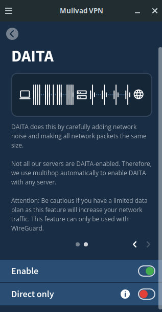
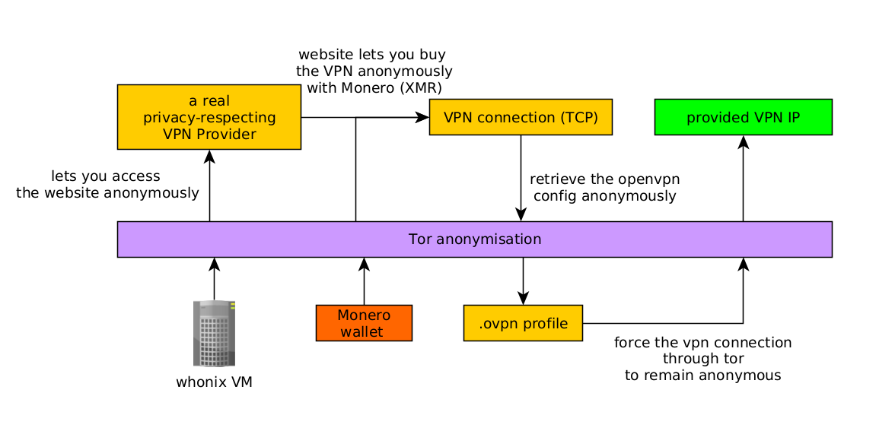

# Using Tor Safely: Tor through VPN or VPN through Tor? 

```
TLDR: 
- Tor through VPN if the ISP shouldn't know that you're using Tor,
- VPN through Tor if the destination server doesn't allow you to connect via Tor.
```


## **Tor and VPNs comparison Recap**

As we went over this comparison in the previous blogpost [here](../torvsvpns/index.md) i will briefly recap it here:

**VPNS:**

VPNs can provide Privacy from your ISP , but by using one you are getting privacy from someone (most likely your ISP), but the VPN provider can see what you're doing with your internet connection.

In other words, you're just shifting the privacy problem from your ISP to your VPN provider. You are moving your trust from one centralized entity to another

**Tor:**

The Tor Network provides Anonymity by routing your traffic through 3 random servers that are spread across the world. 

Using Tor means you are employing Decentralisation, by using it you are placing your trust into 3 random entities (which can be individuals, companies or adversaries), in 3 different legislations (due to being in 3 different countries), rather than in one centralized entity, hence providing Anonymity on the IP layer. 

There is always a low probability of risk, where if you are unlucky and tor circuits go through 3 nodes that are hosted by the same malicious entity, leading to deanonymization. 


## **Tor and VPNs combinations**

Combining Tor and VPNs require to be justified depending on the **clientside context** , and on the **serverside context** : 


First comes the clientside context: **Does your country allow anonymity?**

Check if your country [allows using Tor](../toolslegality/index.md#tor) or not. If it's not illegal, you can use tor traffic as is. **(you -> tor)**

If you are in a country where tor traffic is illegal, you need to hide tor use behind a vpn **(you -> vpn -> tor)**

If you are in a country where both Tor and [VPNs are illegal](../toolslegality/index.md#vpns), **know that this is very risky to try and be anonymous online**. If you still want to have anonymity, you'll have to [use censorship evasion techniques](https://github.com/net4people/bbs/issues) like using [v2ray](../v2ray/index.md) or [cloak](../cloak/index.md) to access the free internet.

Make sure to also excercise [plausible deniability](../deniability/index.md) so that it can't be proven you used any tools deemed to be illegal in your place.


Second comes serverside context: **Does the service allow anonymity?**

Check if you can use the service using tor only,**(tor -> website)**

If the website doesn't allow tor traffic, hide tor traffic behind a VPN **(tor -> vpn -> website)**

If the website doesn't allow vpn traffic either, personally i would stop trying there, but you could try using residential proxies **(tor -> residential proxy -> website)**

In conclusion, there are only 4 valid Tor / VPN combinations:
    
    
    #country allows tor traffic:
    you -> Tor -> service
    you -> Tor -> VPN -> service
    
    #country doesn't allow tor traffic, but allows VPNs:
    you -> VPN -> Tor -> service
    you -> VPN -> Tor -> VPN -> service
    
    

If you want to experiment with multiple tor / vpn setups at once (as part of the [internet segmentation](../internetsegmentation/index.md) Opsec practice), you can try each setup in a VM separately like so:


_Sidenote:_ there is no point in having a setup that is going twice through Tor, only once is enough to obtain anonymity.

## **First Goal: Hiding Tor usage from your ISP**

Another scenario is when you need to hide the fact that you're using Tor from your ISP, we have the following setup which is useful to prevent [Tor usage correlation](https://edition.cnn.com/2013/12/17/justice/massachusetts-harvard-hoax).


    
    
    You -> VPN -> Tor -> Destination

**WARNING:** in this setup you are trusting your VPN provider to not snitch to your ISP that you are using Tor!

From your ISP's point of view, using Tor alone definitely stand out from regular traffic, a popular option you can go for is to use a VPN (as this is a much more common occurrence), and to use the Tor browser while keeping the VPN connection open.

In the unlikely event that you get deanonymized while using Tor, **only your VPN IP would get revealed instead of your home IP address**. And if the VPN provider has strict no-log policies and [they actually follow through with their promises](https://www.theverge.com/2023/4/21/23692580/mullvad-vpn-raid-sweden-police), **it's very unlikely that both your VPN and Tor would be compromised at the same time.**

_DISCLAIMER ON VPNs:_ Keep in mind that if you choose to use a VPN anyway, you must conduct a strict VPN selection, see [Privacy Guides' Recommendations](https://www.privacyguides.org/en/vpn/) on that topic, out of which i recommend [Mullvad](https://kycnot.me/service/mullvad) because they accept Monero without any KYC.

By first connecting to a VPN instead of Tor, your isp can't easily tell that you are connecting to Tor, since you're not connecting to Tor nodes directly anymore. **However since Tor traffic is uniquely recognizeable even when hiding it behind a VPN, thanks to AI-assisted traffic observation** , we need to defend against that too:

When trying to use VPNs for anonymity, take note that we need to prevent traffic correlation as much as possible, hence we want to protect against AI-guided traffic analysis, **in order to make sure our VPN traffic patterns do not look like Tor traffic, in order to blend in with the other VPN users.** To do so we enable DAITA (Defense Against AI-guided traffic analysis) in the mullvad VPN:

   

Once enabled this will prevent an adversary watching connections to and from a VPN server to figure out which VPN user (that is currently using a VPN server) is visiting which website, based on the packet size and traffic patterns. (see [this article](https://mullvad.net/en/vpn/daita) for more details on how DAITA works)

And that's it! Now your traffic doesnt contact Tor nodes directly thanks to connecting to a VPN beforehand, nor does it look like Tor traffic either thanks to using DAITA.

## **Second Goal: Accessing websites that block Tor**

Great, you found out about Tor, you want to be anonymous while browsing the web, and now you start to use your favorite centralised services (google, youtube for example) **but you realize that they don't allow you to use their service while you use Tor!**


    You -> Tor -> Destination

Keep in mind that [Tor exit nodes are all public](https://metrics.torproject.org/rs.html#search/flag:exit), it's easy for website administrators to block Tor exit nodes IPs by blocking their public IPs directly. So you can expect popular services that are openly hostile to both anonymity and privacy to block Tor traffic. 

So the constraint here is to access the service **without showing up as a tor exit node IP from their end.**

To get around that problem, the idea is to force a VPN to connect through Tor (VPN through Tor Setup):


_Disclaimer:_ **Do not use this setup for any other reason than to access websites that try to block Tor** , this is a very niche setup, it is not to be used for the rest of your Anonymous online activities!

    You -> Tor -> VPN -> Destination

That way, we have the following result:

  1. Your ISP only sees Tor traffic

  2. The VPN provider does not know who's using their infrastructure

  3. The website administrators of popular services think you are using their service using a simple VPN

A constraint here of course is to acquire the VPN connection anonymously, to do so we only use Tor and Monero as explained in my tutorial on what to do when [Websites block Tor](../whentorisblocked/index.md):



If the popular service does not block VPNs, you're good to keep using their service while still maintaining Anonymity.

**WARNING:** This setup takes into account that you're **properly segmenting your [Internet Usage](../internetsegmentation/index.md)**, because initially when you use this setup (you -> tor -> VPN), you may be anonymous, but **depending on your usage over time, you are increasingly more likely to be deanonymized if you are improperly segmenting your internet usage.** (see details on [OPSEC](../opsec/index.md) for more details)

## **Third Goal: Hiding Tor usage (For Heavily Censored Countries)**

A popular scenario people encounter, especially in [heavily censored countries](https://rsf.org/en/index) (the prime example being [China with their "Great Firewall"](http://invxoxeo2cflturo6t5qag5a5smmcl2yjszmk64gzzwzqjcu2mw42cyd.onion/watch?v=QBp6opkcxoc)), is that the state blocks all VPN connections, on top of making them illegal.

**Citizens don't want their ISP to know that they are using the Tor network. Because otherwise they would be prosecuted for simply using the technology.**

Out of that situation, Tor bridge nodes were created. Tor bridge nodes are purposefully not listed in the public Tor directory to avoid being blocked by governments. Tor bridges include multiple [pluggable transports](https://tb-manual.torproject.org/circumvention/) to help users in heavily censored countries:

From Torproject's [explanation](https://support.torproject.org/censorship/censorship-7/) on tor bridge nodes:
    
    
    Bridges are useful for Tor users under oppressive regimes, and for people who want an extra layer of security because they're worried somebody will recognize that they are contacting a public Tor relay IP address.
    
    Several countries, including China and Iran, have found ways to detect and block connections to Tor bridges. Obfsproxy bridges address this by adding another layer of obfuscation. 
    
    

**WARNING:** be aware that this setup may provide transient censorship circumvention, but **it does not protect against the threat where an adversary finds out, let's say 5 months later, that you connected to a tor bridge node in the past, and may prosecute you for it.** This scenario is to be considered only when **all VPNs are blocked or illegal in your country.**

Personally, if i were to live in a heavily censored country like china, i wouldn't try to be anonymous online, **to avoid the risk of being prosecuted for just using the technology** , as the risks are too high there.


Using this setup allows you to use the Tor network even if your government doesn't allow it, **but again, you run the risk that they find out later on, that you used tor in the past.** For a long-term way of accessing Tor from heavily-censored countries, check out the tutorial on how to use [v2ray](../v2ray/index.md) and [cloak](../cloak/index.md).

