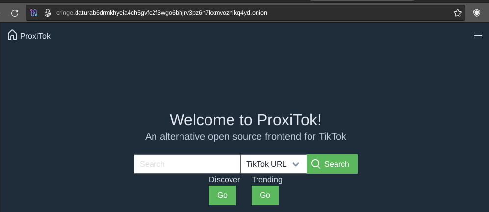

# How to have a custom .onion address for your Hidden Service (Vanity V3)

```
TLDR: you can generate your own custom .onion address for free, and as long as you have the keys to it, you own it.
```


In this tutorial we'll setup a Hidden Service with custom .onion Vanity V3 address, we'll set it up using nginx and Tor. 


## **Initial Setup**

Before starting, [check if your ISP allows tor use or not.](../torthroughvpn/index.md) **And if it does not, make sure you install a VPN to hide the fact that you're using Tor** as we did previously [here](../vpn/index.md):
    
    
    # Download the Mullvad signing key
    sudo curl -fsSLo /usr/share/keyrings/mullvad-keyring.asc https://repository.mullvad.net/deb/mullvad-keyring.asc
    
    # Add the Mullvad repository server to apt
    echo "deb [signed-by=/usr/share/keyrings/mullvad-keyring.asc arch=$( dpkg --print-architecture )] https://repository.mullvad.net/deb/stable $(lsb_release -cs) main" | sudo tee /etc/apt/sources.list.d/mullvad.list
    # Or add the Mullvad BETA repository server to apt
    echo "deb [signed-by=/usr/share/keyrings/mullvad-keyring.asc arch=$( dpkg --print-architecture )] https://repository.mullvad.net/deb/beta $(lsb_release -cs) main" | sudo tee /etc/apt/sources.list.d/mullvad.list
    
    # Install the package
    sudo apt update
    sudo apt install mullvad-vpn
    
    # Connect to Mullvad VPN
    mullvad account login
    Enter an account number: 91320912809328832
    Mullvad account "91320912809328832" set
    
    # Connect to the VPN:
    mullvad lockdown-mode set on
    mullvad connect
    
    curl ifconfig.me
    194.127.199.92
    
    

## Generate vanity onion v3 URL

Once done, install tor and compute your Tor domain:
    
    
    [ nowhere.moe ] [ /dev/pts/11 ] [/srv]
    → apt install gcc libc6-dev libsodium-dev make autoconf tor nginx -y
    
    [ nowhere.moe ] [ /dev/pts/11 ] [/srv]
    → git clone https://github.com/cathugger/mkp224o
    Cloning into 'mkp224o'...
    remote: Enumerating objects: 1571, done.
    remote: Counting objects: 100% (402/402), done.
    remote: Compressing objects: 100% (83/83), done.
    remote: Total 1571 (delta 341), reused 350 (delta 317), pack-reused 1169
    Receiving objects: 100% (1571/1571), 1.89 MiB | 6.32 MiB/s, done.
    Resolving deltas: 100% (982/982), done.
    
    [ nowhere.moe ] [ /dev/pts/11 ] [/srv]
    → cd mkp224o
    
    [ nowhere.moe ] [ /dev/pts/11 ] [/srv/mkp224o]
    → ls
    autogen.sh     base64_to.c   filters_common.inc.h  ioutil.h          test_base64.c            worker.h
    base16_from.c  calcest.c     filters.h             keccak.c          test_ed25519.c           worker_impl.inc.h
    base16.h       common.h      filters_inc.inc.h     keccak.h          testutil.h               yaml.c
    base16_to.c    configure.ac  filters_main.inc.h    likely.h          types.h                  yaml.h
    base32_from.c  contrib       filters_worker.inc.h  main.c            vec.c
    base32.h       COPYING.txt   GNUmakefile.in        OPTIMISATION.txt  vec.h
    base32_to.c    cpucount.c    hex.h                 README.md         worker_batch.inc.h
    base64_from.c  cpucount.h    ifilter_bitsum.h      test_base16.c     worker_batch_pass.inc.h
    base64.h       ed25519       ioutil.c              test_base32.c     worker.c
    
    [ nowhere.moe ] [ /dev/pts/11 ] [/srv/mkp224o]
    → ./autogen.sh
    
    [ nowhere.moe ] [ /dev/pts/11 ] [/srv/mkp224o]
    → ./configure
    checking for gcc... gcc
    checking wheter the C compiler works... yes
    checking for C compiler default output file name... a.out
    checking for suffix of executables...
    checking wheter we are cross compiling... no
    checking for suffix of object files... o
    checking wheter the compiler supports GNU C... yes
    checking wheter gcc accepts -g... yes
    checking for gcc option to enable C11 features... none needed
    checking wheter CC supports -march=native... yes
    checking wheter CC supports -fomit-frame-pointer... yes
    checking wheter CC supports -fPIE... yes
    checking wheter CC supports -std=c99... yes
    checking wheter CC supports -Wall... yes
    checking wheter CC supports -Wextra... yes
    checking wheter CC supports -Wno-maybe-uninitialized... yes
    checking wheter CC supports and needs -Wno-format -Wno-pedantic-ms-format... no
    checking wheter CC supports -Wno-unused-function... yes
    checking wheter CC supports -Wmissing-prototypes... yes
    checking wheter CC supports -Wstrict-prototypes... yes
    checking wheter ARGON2ID13 is supported by libsodium... yes
    configure: creating ./config.status
    config.status: creating GNUmakefile
    
    [ nowhere.moe ] [ /dev/pts/11 ] [/srv/mkp224o]
    → make
    	
    

Now i want my tor domain to contain the "datura" characters so i do the following:
    
    
    [ nowhere.moe ] [ /dev/pts/11 ] [/srv/mkp224o]
    → ./mkp224o datura
    sorting filters... done.
    filters:
            datura
    in total, 1 filter
    using 12 threads
    daturacccspczuluj2hbgqfcpkjo75hn7bzmuzsm5zys3az6k3su45ad.onion
    daturaxnp7x4ubwlslgyeaft5dabaxotmsaxanayocnpxarc7wi36kid.onion
    
    [ nowhere.moe ] [ /dev/pts/11 ] [lib/tor/onions]
    → ls -lash
    total 16K
    4.0K drwx------ 4 debian-tor debian-tor 4.0K Jan 27 15:33 .
    4.0K drwx--S--- 8 debian-tor debian-tor 4.0K Feb  1 15:08 ..
    4.0K drwx------ 3 debian-tor debian-tor 4.0K Jul 12  2023 daturab6drmkhyeia4ch5gvfc2f3wgo6bhjrv3pz6n7kxmvoznlkq4yd.onion
    4.0K drwx------ 3 debian-tor debian-tor 4.0K Jan 27 15:48 nihilhfjmj55gfbleupwl2ub7lvbhq4kkoioatiopahfqwkcnglsawyd.onion
    
    [ nowhere.moe ] [ /dev/pts/11 ] [lib/tor/onions]
    → ls -lash daturab6drmkhyeia4ch5gvfc2f3wgo6bhjrv3pz6n7kxmvoznlkq4yd.onion
    total 24K
    4.0K drwx------ 3 debian-tor debian-tor 4.0K Jul 12  2023 .
    4.0K drwx------ 4 debian-tor debian-tor 4.0K Jan 27 15:33 ..
    4.0K drwx------ 2 debian-tor debian-tor 4.0K Jul 12  2023 authorized_clients
    4.0K -r-------- 1 debian-tor debian-tor   63 Jul 12  2023 hostname
    4.0K -r-------- 1 debian-tor debian-tor   64 Jul 12  2023 hs_ed25519_public_key
    4.0K -r-------- 1 debian-tor debian-tor   96 Jul 12  2023 hs_ed25519_secret_key
    
    
    [ nowhere.moe ] [ /dev/pts/11 ] [/srv/mkp224o]
    → cat /etc/tor/torrc
    HiddenServiceDir /var/lib/tor/onions/daturab6drmkhyeia4ch5gvfc2f3wgo6bhjrv3pz6n7kxmvoznlkq4yd.onion/
    HiddenServicePort 80 127.0.0.1:4443  # for web service HTTP (recommended!)
    HiddenServicePort 443 127.0.0.1:4444 # for web service HTTPS (but not recommended!)
    
    HiddenServicePort 18080 127.0.0.1:18080 # for monero nodes
    HiddenServicePort 18081 127.0.0.1:18081 # for monero nodes
    
    # to have another hidden service, you can append it afterward like so; but you need to use different ports:
    
    HiddenServiceDir /var/lib/tor/onions/nihilhfjmj55gfbleupwl2ub7lvbhq4kkoioatiopahfqwkcnglsawyd.onion/
    HiddenServicePort 80 127.0.0.1:4445
    
    

Make sure that the file permissions are correct in the /var/lib/tor/onions/datura...onion/ directory:
    
    
    [ nowhere.moe ] [ /dev/pts/11 ] [lib/tor/onions]
    → chmod 700 daturab6drmkhyeia4ch5gvfc2f3wgo6bhjrv3pz6n7kxmvoznlkq4yd.onion
    
    [ nowhere.moe ] [ /dev/pts/11 ] [lib/tor/onions]
    → chmod 400 daturab6drmkhyeia4ch5gvfc2f3wgo6bhjrv3pz6n7kxmvoznlkq4yd.onion/*
    
    [ nowhere.moe ] [ /dev/pts/11 ] [lib/tor/onions]
    → chmod 700 daturab6drmkhyeia4ch5gvfc2f3wgo6bhjrv3pz6n7kxmvoznlkq4yd.onion/authorized_clients -R
    
    [ nowhere.moe ] [ /dev/pts/11 ] [lib/tor/onions]
    → chown debian-tor: /var/lib/tor/onions -R
    

## Nginx Configuration

Now let's set it up on our webserver:
    
    
    [ nowhere.moe ] [ /dev/pts/11 ] [~debian-tor/onions]
    → cat /etc/nginx/sites-available/nowhere.moe.conf
    
    server {
            ######## TOR WEBSITE ########
            listen 127.0.0.1:4443;
            server_name daturab6drmkhyeia4ch5gvfc2f3wgo6bhjrv3pz6n7kxmvoznlkq4yd.onion;
            root /srv/blog/;
            index index.html;
    }
    
    

That's how you do it for an onion-only website ^ but if you also have clearnet (meaning your website is reachable publicly via port 80 and 443) you can add onion support like so:
    
```hl_lines="11 12 13 37 38 39"
[ nowhere.moe ] [ /dev/pts/11 ] [~debian-tor/onions]
→ cat /etc/nginx/sites-available/nowhere.moe.conf
server {
        listen 80;
        listen [::]:80;
        server_name nowhere.moe;
        return 301 https://$server_name$request_uri;
}

server {
        listen 127.0.0.1:4443;
        server_name daturab6drmkhyeia4ch5gvfc2f3wgo6bhjrv3pz6n7kxmvoznlkq4yd.onion;
        add_header Onion-Location "http://daturab6drmkhyeia4ch5gvfc2f3wgo6bhjrv3pz6n7kxmvoznlkq4yd.onion$request_uri" always;

        listen 443 ssl http2;
        listen [::]:443 ssl http2;
        server_name nowhere.moe;

        ssl_certificate /etc/acme/certs/nowhere.moe/fullchain.cer;
        ssl_trusted_certificate /etc/acme/certs/nowhere.moe/nowhere.moe.cer;
        ssl_certificate_key /etc/acme/certs/nowhere.moe/nowhere.moe.key;

[...]
        root /srv/nowhere.moe/;
}

[ nowhere.moe ] [ /dev/pts/11 ] [~debian-tor/onions]
→ cat /etc/nginx/sites-available/nowhere.moe.conf
server {
        listen 80;
        listen [::]:80;
        server_name nowhere.moe;
        return 301 https://$server_name$request_uri;
}

server {
        listen 127.0.0.1:4445;
        server_name nihilhfjmj55gfbleupwl2ub7lvbhq4kkoioatiopahfqwkcnglsawyd.onion;
        add_header Onion-Location "http://nihilhfjmj55gfbleupwl2ub7lvbhq4kkoioatiopahfqwkcnglsawyd.onion$request_uri" always;

        listen 443 ssl http2;
        listen [::]:443 ssl http2;
        server_name nowhere.moe;
[...]

        root /srv/nowhere.moe/;

        ssl_certificate /etc/acme/certs/nowhere.moe/fullchain.cer;
        ssl_trusted_certificate /etc/acme/certs/nowhere.moe/nowhere.moe.cer;
        ssl_certificate_key /etc/acme/certs/nowhere.moe/nowhere.moe.key;
}

[ nowhere.moe ] [ /dev/pts/0 ] [tor/onions/daturab6drmkhyeia4ch5gvfc2f3wgo6bhjrv3pz6n7kxmvoznlkq4yd.onion]
→ nginx -t
2023/07/12 21:46:16 [emerg] 113983#113983: could not build server_names_hash, you should increase server_names_hash_bucket_size: 64
nginx: configuration file /etc/nginx/nginx.conf test failed

#if it gives you this error do the following:

[ nowhere.moe ] [ /dev/pts/0 ] [tor/onions/daturab6drmkhyeia4ch5gvfc2f3wgo6bhjrv3pz6n7kxmvoznlkq4yd.onion]
→ vim /etc/nginx/nginx.conf

[ nowhere.moe ] [ /dev/pts/0 ] [tor/onions/daturab6drmkhyeia4ch5gvfc2f3wgo6bhjrv3pz6n7kxmvoznlkq4yd.onion]
→ cat /etc/nginx/nginx.conf |grep 128
        server_names_hash_bucket_size 128;


[ 10.0.0.101/16 ] [ /dev/pts/12 ] [/var/lib/tor]
→ nginx -t
nginx: the configuration file /etc/nginx/nginx.conf syntax is ok
nginx: configuration file /etc/nginx/nginx.conf test is successful

[ 10.0.0.101/16 ] [ /dev/pts/12 ] [/var/lib/tor]
→ nginx -s reload

[ 10.0.0.101/16 ] [ /dev/pts/8 ] [~debian-tor]
→ sudo -u debian-tor tor
Jan 23 16:57:19.270 [notice] Tor 0.3.5.16 running on Linux with Libevent 2.1.8-stable, OpenSSL 1.1.1d, Zlib 1.2.11, Liblzma 5.2.4, and Libzstd 1.3.8.
Jan 23 16:57:19.270 [notice] Tor can't help you if you use it wrong! Learn how to be safe at https://www.torproject.org/download/download#warning
Jan 23 16:57:19.270 [notice] Read configuration file "/etc/tor/torrc".
Jan 23 16:57:19.278 [notice] Opening Socks listener on 127.0.0.1:9050
Jan 23 16:57:19.278 [notice] Opened Socks listener on 127.0.0.1:9050
Jan 23 16:57:19.000 [notice] Parsing GEOIP IPv4 file /usr/share/tor/geoip.
Jan 23 16:57:19.000 [notice] Parsing GEOIP IPv6 file /usr/share/tor/geoip6.
Jan 23 16:57:19.000 [warn] You are running Tor as root. You don't need to, and you probably shouldn't.
Jan 23 16:57:19.000 [notice] Bootstrapped 0%: Starting
Jan 23 16:57:20.000 [notice] Starting with guard context "default"
Jan 23 16:57:20.000 [notice] Bootstrapped 10%: Finishing handshake with directory server
Jan 23 16:57:20.000 [notice] Bootstrapped 80%: Connecting to the Tor network
Jan 23 16:57:20.000 [notice] Bootstrapped 90%: Establishing a Tor circuit
Jan 23 16:57:21.000 [notice] Bootstrapped 100%: Done
```

From there we can check if our tor website is up:

 

It works! Now let's use systemctl to start tor instead:
    
    
    [ nowhere.moe ] [ /dev/pts/11 ] [~debian-tor/onions]
    → systemctl restart tor@default
    
    [ nowhere.moe ] [ /dev/pts/11 ] [~debian-tor/onions]
    → systemctl status tor@default
    ● tor@default.service - Anonymizing overlay network for TCP
         Loaded: loaded (/lib/systemd/system/tor@default.service; enabled-runtime; preset: enabled)
         Active: active (running) since Thu 2024-02-01 15:24:07 CET; 18min ago
        Process: 3027334 ExecStartPre=/usr/bin/install -Z -m 02755 -o debian-tor -g debian-tor -d /run/tor (code=exited, status=0/SUCCESS)
        Process: 3027335 ExecStartPre=/usr/bin/tor --defaults-torrc /usr/share/tor/tor-service-defaults-torrc -f /etc/tor/torrc --RunAsDaemon 0 --verify-config (code=exited, status=0/SUCCESS)
       Main PID: 3027336 (tor)
          Tasks: 30 (limit: 77000)
         Memory: 636.4M
            CPU: 49.885s
         CGroup: /system.slice/system-tor.slice/tor@default.service
                 ├─3027336 /usr/bin/tor --defaults-torrc /usr/share/tor/tor-service-defaults-torrc -f /etc/tor/torrc --RunAsDaemon 0
                 └─3027337 /usr/bin/obfs4proxy
    
    Feb 01 15:24:26 nowhere.moe Tor[3027336]: Your network connection speed appears to have changed. Resetting timeout to 60000ms after 18 timeouts and 1000 buildtimes.
    Feb 01 15:25:09 nowhere.moe Tor[3027336]: Performing bandwidth self-test...done.
    
    

## Adding Subdomain

Now we can do the same for a subdomain:
    
```hl_lines="10 11 12"
[ nowhere.moe ] [ /dev/pts/11 ] [/etc/nginx/sites-available]
→ cat cringe.nowhere.moe.conf
server {
        listen 443 ssl;
        server_name cringe.nowhere.moe;

        ssl_certificate /etc/acme/certs/cringe.nowhere.moe/cringe.nowhere.moe.cer;
        ssl_certificate_key /etc/acme/certs/cringe.nowhere.moe/cringe.nowhere.moe.key;

        listen 127.0.0.1:4443;
        server_name cringe.daturab6drmkhyeia4ch5gvfc2f3wgo6bhjrv3pz6n7kxmvoznlkq4yd.onion;
        add_header Onion-Location "http://cringe.daturab6drmkhyeia4ch5gvfc2f3wgo6bhjrv3pz6n7kxmvoznlkq4yd.onion$request_uri" always;

[...] 

	location / {
                proxy_pass http://localhost:8083;
        }

        location = /robots.txt {
                add_header Content-Type text/plain;
                return 200 "User-agent: *\nDisallow: /\n";
        }
}

[ nowhere.moe ] [ /dev/pts/11 ] [/etc/nginx/sites-available]
→ nginx -t
nginx: the configuration file /etc/nginx/nginx.conf syntax is ok
nginx: configuration file /etc/nginx/nginx.conf test is successful

[ nowhere.moe ] [ /dev/pts/11 ] [/etc/nginx/sites-available]
→ nginx -s reload
2024/02/01 15:45:18 [notice] 3045373#3045373: signal process started
```





## DoS Prevention


Now that we have our website up and running, it's better to configure some **DoS countermeasures** to avoid any unpleasant problems.

There are many countermeasures, one of the most effective is **PoW**. If you want to learn more about other DoS prevention methods check the [guidelines](https://community.torproject.org/onion-services/advanced/dos/). If you want to learn more about how PoW works, check out the [FAQs](https://onionservices.torproject.org/technology/pow/).

Without further ado, let's enable PoW for our onion service.
Add the following to your `/etc/tor/torrc`
    
    
        HiddenServicePoWDefensesEnabled 1
        HiddenServicePoWQueueRate 250
        HiddenServicePoWQueueBurst 2500
    

This is what the options do (taken from `tor(1)` manual)
    
    
        HiddenServicePoWDefensesEnabled 0|1
           Enable proof-of-work based service DoS mitigation. If set to 1
           (enabled), tor will include parameters for an optional client
           puzzle in the encrypted portion of this hidden service’s
           descriptor. Incoming rendezvous requests will be prioritized based
           on the amount of effort a client chooses to make when computing a
           solution to the puzzle. The service will periodically update a
           suggested amount of effort, based on attack load, and disable the
           puzzle entirely when the service is not overloaded. (Default: 0)
    
       HiddenServicePoWQueueRate NUM
           The sustained rate of rendezvous requests to dispatch per second
           from the priority queue. Has no effect when proof-of-work is
           disabled. If this is set to 0 there’s no explicit limit and we will
           process requests as quickly as possible. (Default: 250)
    
       HiddenServicePoWQueueBurst NUM
           The maximum burst size for rendezvous requests handled from the
           priority queue at once. (Default: 2500)
    

If you don't know what _rendezvous requests_ are, check out [the specification](https://spec.torproject.org/rend-spec/rendezvous-protocol.html), but essentially see them as "Hello I am NODE_X, I want to connect to NODE_Y to create a circuit, can you let me do it?"

If you are wondering how the priority queue is managed, think of it as how much _effort_ the client put into solving the challenge; the more effort the _higher_ the client priority will be (but also the time took to solve the challenge)

Don't forget to restart the hidden service to enable the changes made.

