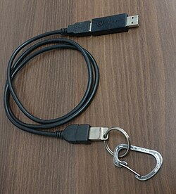

# USB-triggered emergency shutdowns

```
TLDR: you can trigger emergency shutdowns by detecting usb changes
```

In this guide you will learn how to trigger a shutdown by yanking off a USB. This is an anti-forensic tool.

**Note: This will not help you if you don't have additional protections like FDE (Full Disk Encryption) and Deniability. Therefore, we will assume you have a setup from the [Livemode](../livemode/index.md) guide.**

---

## Should you use this?
- To prevent LE from capturing your device while it's unencrypted.
- If you're a high value target.
- As a [dead-man's switch](https://wikiless.com/wiki/Dead_man%27s_switch). (CLEARWEB)

---

## Setup
1. Make sure you have `lsusb` installed. Usually the package name would be `usbutils`.
```bash
user ~$ sudo apt install usbutils
user ~$ lsusb
Bus 0xx Device 0xx: ID xxxx:xxxx Logitech Wired Mouse
Bus 0xx Device 0xx: ID xxxx:xxxx HP, Inc USB Flash Drive
.
.
.
```
Once you see a list of USB devices, you're good to proceed to the next step.

2. Make sure you have `reboot.sh` in your home directory. (This isn't mandatory. You'll see why below.)
```bash
user ~$ cat reboot.sh
#!/bin/bash

/usr/bin/sudo /usr/sbin/reboot now
```

3. Copy the following bash script and give it executable permissions.
```bash
#!/bin/bash

# killusb.sh
# A script by bleak.

# Variables
INTERVAL=1                         # <-- interval to check the devices in.
TRIGGER="sh /home/user/reboot.sh"  # <-- command to run if device is disconnected. Change it to whatever you want.

# List USB devices
mapfile -t devices < <(lsusb)

# Check if any USB devices are found
if [ ${#devices[@]} -eq 0 ]; then
  echo "No USB devices found."
  exit 1
fi

echo "Select a USB device to monitor for disconnection:"
for i in "${!devices[@]}"; do
  echo "[$i] ${devices[$i]}"
done

read -rp "Choose the device to monitor: " choice

# Validate input
if ! [[ "$choice" =~ ^[0-9]+$ ]] || [ "$choice" -ge "${#devices[@]}" ]; then
  echo "Invalid selection."
  exit 1
fi

# Extract selected device and ID
selected="${devices[$choice]}"
device_id=$(echo "$selected" | awk '{print $6}')

echo "Monitoring USB device ID $device_id..."
echo "Press Ctrl+C to stop."

# Monitor loop
while true; do
  if lsusb | grep -q "$device_id"; then
    echo "$(date '+%H:%M:%S') still plugged in"
  else
    $TRIGGER
    exit
  fi
  sleep "$INTERVAL"
done
```

### What the script does
The following is a diagram that describes what the script does.


This script lets you choose a USB device to monitor, then checks if it is still connected every `$INTERVAL` seconds (default 1 second).
If the USB device gets disconnected, it runs the `$TRIGGER` command. In this case, it executes `~/reboot.sh`.

First, tweak your variables present at the beginning of the script to whatever you like. 
For the sake of uniformity and best practices, again, I'm assuming you have the [Livemode](../livemode/index.md) setup. Hence the `reboot.sh` script.
You can change the `$TRIGGER` value to whatever command you want to run automatically. But, make sure the reboot command comes last.
You can ensure this by maintaining the following format:
`Command 1 && Command 2 && sh /home/user/reboot.sh`

**Note: Make sure you aren't running any commands that require you to enter a password. If you need to run superuser commands, either set a NOPASSWD rule for that command, or run the script as root. We want everything to be quick and automatic.**
_You can find a guide to setting up a NOPASSWD rule in the sensitivevm guide [here](../sensitivevm/#fine-tuning-the-emergency-reboot-script)._

## Usage
1. Once you have set up your script, execute it.
```bash
user ~$ ./killusb.sh
Select a USB device to monitor for disconnection:
[0] Bus 0xx Device 0xx: ID xxxx:xxxx Logitech Wired Mouse
[1] Bus 0xx Device 0xx: ID xxxx:xxxx HP, Inc USB Flash Drive
.
.
.
Choose the device to monitor: 
```

2. From the list, select the device you want to monitor. For example, I'll use the Flash Drive, so I'll type 1 and hit enter.
```bash
Choose the device to monitor: 1
Monitoring USB device ID xxxx:xxxx...
Press Ctrl+C to stop.
04:12:00 still plugged in
04:12:01 still plugged in
.
.
.
```

3. Now it's ready to go. You can now test if your script is working as intended. Removing the drive will reboot the system.

## Additional setup
You should consider tying a cord from the USB device to your body if you're a target. Hooking it up to your belt would be a good option.
In case your house gets broken into and you don't really have time to do anything, you could move and the USB would disconnect, running the trigger command and erasing all evidence.

- This is exactly what [BusKill](https://wikiless.com/wiki/BusKill) (CLEARNET) does, but without the special cord, attachments, and program.



The above image is the first prototype of BusKill. Similar to that, you can use a hook to attach it to yourself.

## Final notes
This is an (almost) feature complete replica of [usbkill](https://github.com/hephaest0s/usbkill) (CLEARNET).
`usbkill` needs python to run, which I doubt everyone wants to install. You can compile the script into a single binary, but I'd rather do things simple and minimal.
It also *requires* to be run as root, which again, increases your surface area.

I hope the guide helped.
Cheers!

**DISCLAIMER**: This blog's [stance](../stancesensitive/index.md) is not to endorse sensitive activities and nothing in this article serves as legal advice. You are responsible for whatever you do, unless found not guilty.
