# How to access Tor when you are in a heavily-censored country using v2ray (vmess / vless) 

   
  

> "How charming it is to witness such harmony—where freedom is a gentle illusion, and every bleat is a reminder that safety lies not in the open fields, but in the comforting embrace of the shepherd’s leash"

some governments just love to restrict free flow of information in the name of serving and securing their citizens by implying censorship and blocking certain websites. So in this tutorail we deep dive into circumviliation tools and their working principles. 

## **Introduction**

  * ### _Why should I use v2ray?_

**If your country makes TOR traffic as illegal, how can you access .onion websites anyway ?**   
  
Normally you would just hide that you are using Tor [by hiding it behind a VPN](../torthroughvpn/index.md) (which can be based on wireguard or openvpn) like we have previously recommended:    
  
but now we have another problem, **what if your country also made VPNs illegal to use ?**   
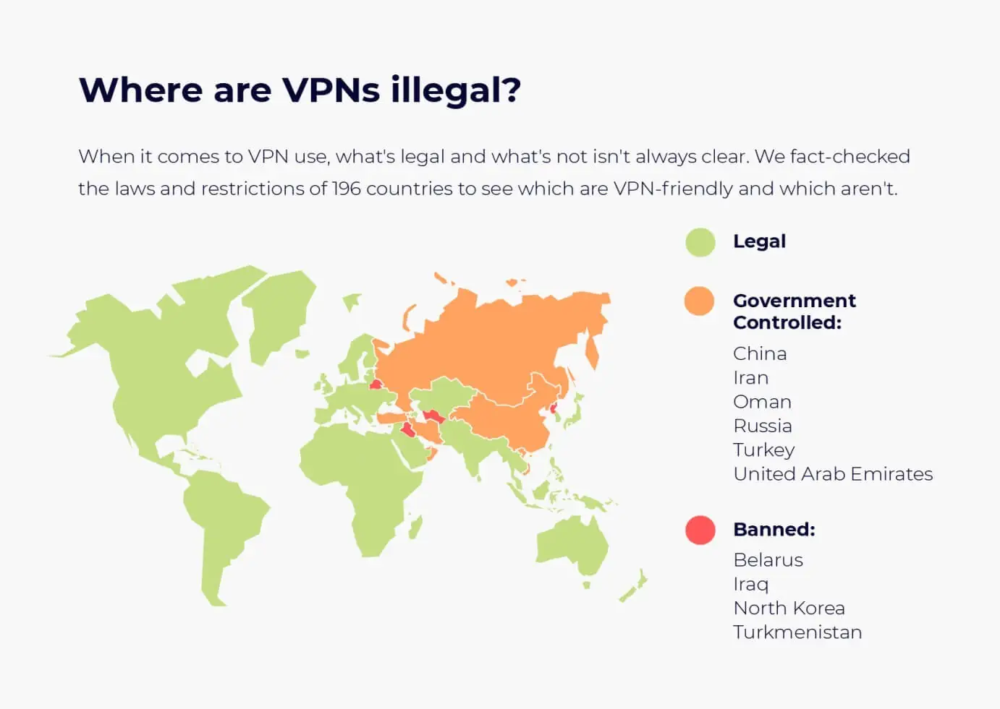   
  
**If you are in a country where both Tor and VPNs are illegal to use** , you'll need to use a censorship-evasion tool like v2ray **to be able to safely hide that you're using Tor.**
  * ### _Project V and Project X_

**V2ray** : an open source censorship circumvention tool also know as project V is a framework where one could stack protocols as well as modify standard protocols to bypass firewalls. 

**Xray** : a superset of v2ray, with better overall performance and enhancements such as XTLS

XTLS is an optimized/modification of TLS protocol, it works by using real TLS to hide proxy traffic 

  
  

> V2ray is not a protocol rather a platform where users could design their own protocol stacks based on the primitive protocols like TCP,UDP,HTTP while vmess and vless are proxy protocols which are native to v2ray. 

  
  
  
  
V2rays has the ability to obfuscate and make packets appear to be genuine webtraffic, **in order to prevent the adversary from figuring out that you are using Tor.** 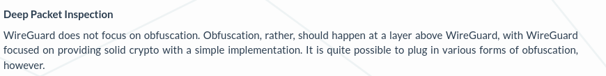 Wireguard as well as openvpn  does not provide any obfuscation feature and will be detected easily by header match or DPI. 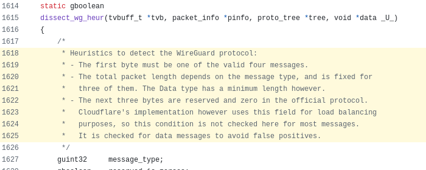   
(they have this in their codebase which clearly shows how to detect Wireguard traffic) [ref](https://github.com/wireshark/wireshark/blob/ef9c79ae81b00a63aa8638076ec81dc9482972e9/epan/dissectors/packet-wireguard.c#L1618-L1625)

But How does a V2ray traffic look like? 

Here's a Wireshark dump of  curl archlinux.org with and without v2ray.   
   
  
As you could see requests to archlinux.org ( with v2ray ) goes to a popular website giphy but is actually communicating to our V2ray server behind the CDN through Websocket protocol.   
(Domain Fronting method is being used here)   
  

> we could use v2ray to make our own versions of primitive protocols to "fool the wall". 

  
  

  * ### _Some Principles to get started_

> **Transport** : The protocol used to connect to the v2ray server.   
>  **Inbounds** : Connections to the v2ray server.   
>  **Routing** : Rules defining how an inbound connection should be treated. (Ex. drop connection requests from certain domains, route inbound through a socks server)   
>  **Outbounds** : Connections going out of v2ray server.(Ex. Towards the user requested website)   
> 

  
  

  * ### _Clients_

Android 
    * [Nekobox](httphttps://github.com/MatsuriDayo/NekoBoxForAndroid/)
    * [v2rayNG](https://github.com/2dust/v2rayNG)
Linux 
    * [Nekoray](https://github.com/Matsuridayo/nekoray)
    * [v2rayN](https://github.com/2dust/v2rayN)
    * [v2rayA](https://github.com/v2rayA/v2rayA)
    * [Furious](https://github.com/LorenEteval/Furious)
Windows 
    * [HiddifyN](https://github.com/hiddify/HiddifyN)
    * [v2rayN](https://github.com/2dust/v2rayN)

## **Serverside Setup**

an overview of v2ray server config looks like this
    
    
    {
        "log": {},
        "api": {},
        "dns": {},
        "stats": {},
        "routing": {},
        "policy": {},
        "inbounds": [],
        "outbounds": [],
        "transport": {}
    }

Looking kinda complicated right, fear not we have Web-UI's to setup V2Ray servers. Web-UI aka "panels" could be used for user-management including traffic stats,uuid-generation and much more... 

  * ### _Getting a VPS_

refer to [Acquiring remote servers anonymously (non-KYC providers) ](../anonymousremoteserver/index.md) for buying a **VPS using XMR**

  
  

  * ### _Installing a panel_

Once you have the VPS ready and have established an SSH connection,we can start working on installing panel.

> we'll be using **[alireza0/x-ui](https://github.com/alireza0/x-ui)** panel since its actively maintained, but you could also use **[MHSanaei/3x-ui](https://github.com/MHSanaei/3x-ui)** .The v2ray server setup is same same for all. 

Supported distributions - Ubuntu 20.04+ - Debian 11+ - CentOS 8+ - OpenEuler 22.03+ - Fedora 36+ - Arch Linux - Parch Linux - Manjaro - Armbian - AlmaLinux 8.0+ - Rocky Linux 8+ - Oracle Linux 8+ - OpenSUSE Tumbleweed - Amazon Linux 2023
    
                                        
    #> bash <(curl -Ls https://raw.githubusercontent.com/alireza0/x-ui/master/install.sh)
    ....
    Would you like to customize the Panel Port settings? (If not, random port will be applied) [y/n]: y
    Please set up the panel port: 9566
    Your Panel Port is: 9566
    Port set successfully: 9566
    Username and password updated successfully
    Base URI path set successfully
    This is a fresh installation, generating random login info for security concerns:
    ###############################################
    Username: fU8hjnoLSp
    Password: ak8jX44rZy
    Port: 9566
    WebBasePath: EwAJmwAHwMk7FLK
    ###############################################
    If you forgot your login info, you can type 'x-ui settings' to check
    Start migrating database...
    Migration done!
    Created symlink '/etc/systemd/system/multi-user.target.wants/x-ui.service' → '/etc/systemd/system/x-ui.service'.
    x-ui v1.8.7 installation finished, it is up and running now...
    
    
                                     

The script asks for the port to use. we could change the port later. We could use the creds(Autogenerated) displayed above to access the webui 
    
        X-UI Control Menu Usage
        ------------------------------------------
        SUBCOMMANDS:
        x-ui              - Admin Management Script
        x-ui start        - Start
        x-ui stop         - Stop
        x-ui restart      - Restart
        x-ui status       - Current Status
        x-ui settings     - Current Settings
        x-ui enable       - Enable Autostart on OS Startup
        x-ui disable      - Disable Autostart on OS Startup
        x-ui log          - Check Logs
        x-ui update       - Update
        x-ui install      - Install
        x-ui uninstall    - Uninstall
        x-ui help         - Control Menu Usage
        ------------------------------------------
        

In order to access the web UI, the url schema looks like this.   
`http://server_ip:port/path`   
  

> You can use **x-ui settings** command to retrieve panel info, like port and path.   
>  Ex-output:   
>  ############################################### Username: fU8hjnoLSp   
>  Password: ak8jX44rZy   
>  Port: 9566   
>  WebBasePath: EwAJmwAHwMk7FLK   
>  ############################################### 

Example http://198.41.128.88:9566/EwAJmwAHwMk7FLK/   
Once you access the web portal,use the username and password as above. 

  
  

  * ### _Setting up the panel_

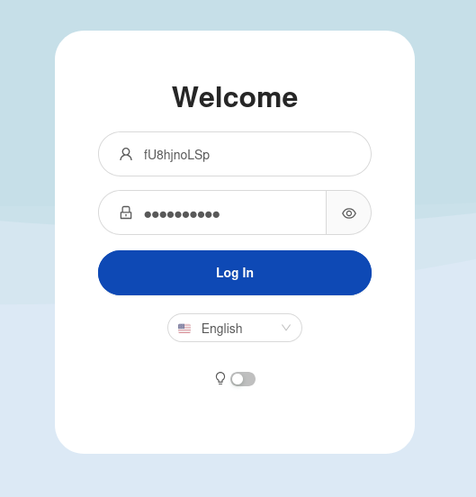

#####  after logging in switch to latest the xray-core 

In order to receive inbounds we must create an inbound rule within the panel.   
We are choosing vmess (as protocol) + websocket (as trasport). copy the settings as below.   
(you could change the port as of your liking) 

> VLESS does not provide built-in encryption, avoiding it for now. [ref](https://xtls.github.io/en/config/inbounds/vless.html#vless) NOTE: VMess Requires to have time synced up. 

   
Now you could try to connect to the server using QR Code or by using the vmess link.   
(Click the QR to copy link) See Client Section   
  

> a vmess link will look like vmess://&ltuuid;>@&lthostname;>:&ltport;>?&ltother;_params>#&ltremarks;>

  * ### _Client Installation_

We're installing **V2rayN** on linux, one could find the pre-build binaries in the releases section on github( [link](https://github.com/2dust/v2rayN/releases) )    
Extract, and run the client as follows   

    
                                    
    $ unzip v2rayN-linux-64.zip 
    ...
    $ cd v2rayN-linux-64/
    $ chmod +x v2rayN 
    $ ./v2rayN
    
                                
                            

After executing the above command a GUI will popup.   
change route settings (optional) within Settings(on top) > Regional Presets Settings > Russia   
  
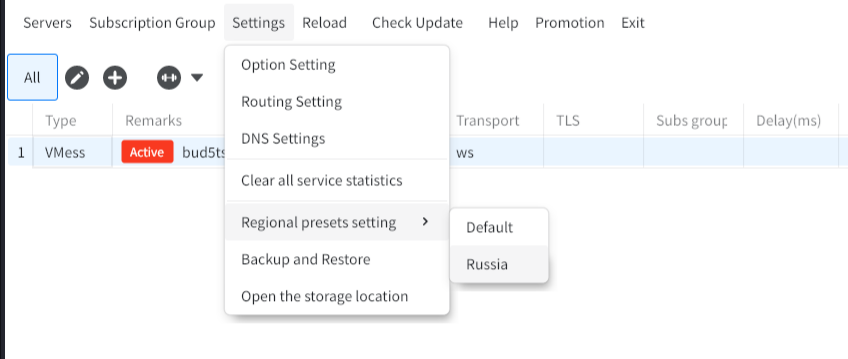   
  

> Routing is used when you want to avoid proxy for regional websites.   
>  (A direct connection without proxy will be made by the clientside app based-off IP or Domain name) 

Ex. if we access 1tv.ru, with this setting turned on it will be resolved using our actual IP than our Proxy IP 

## **Censorship Evasion technique #1 - Domain Fronting**

  
  

Setting up a v2ray server alone doesnt bypass any censors(it would be obvious if we push a large amount of traffic),rather we use some methods to make the traffic look geniune.   
One such method is called **Domain Fronting**   
   
  
We will be using Fastly, since it offers a free CDN without CreditCard + 30-day Websocket support(free-trial)   
Start by creating an account at [Fastly](http://fastly.com)   
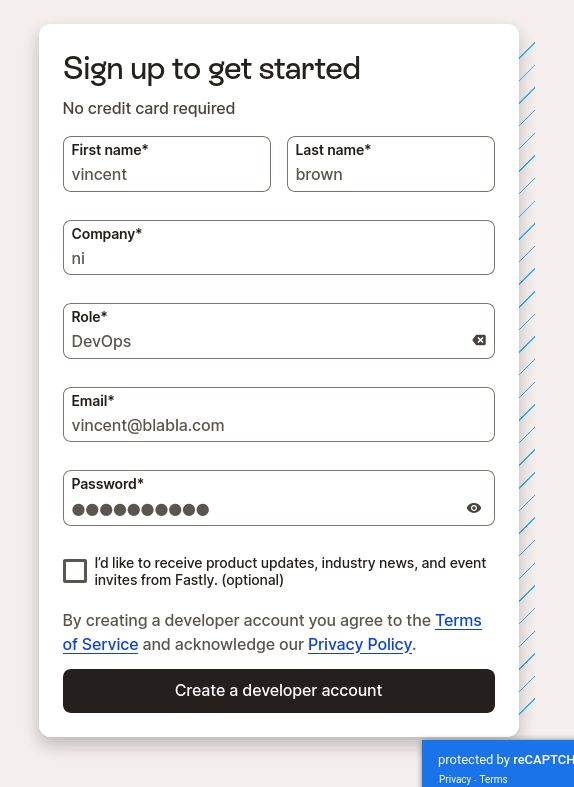   
Create a new cdn service like this   
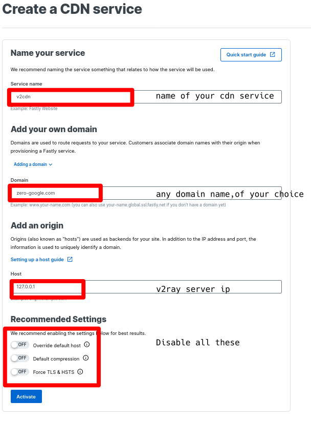

> In here we can **use any domain name** since its for internal routing within cdn.   
>  (meaning that within the CDN domain zero-google.com will resolve to our v2ray IP )   
>  **origin** willbe our v2ray inbound IP 

  
then select the cdn name to edit the config   
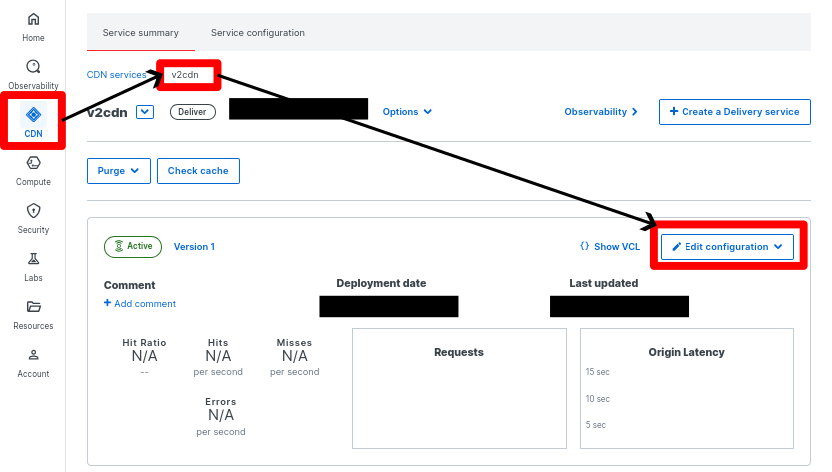   
  
We edit the CDN config to change the port of our host and disable some settings that may cause issues   
   
After that we change the port from 443 to 53254 (The port we used for receiving inbounds in our v2ray panel) 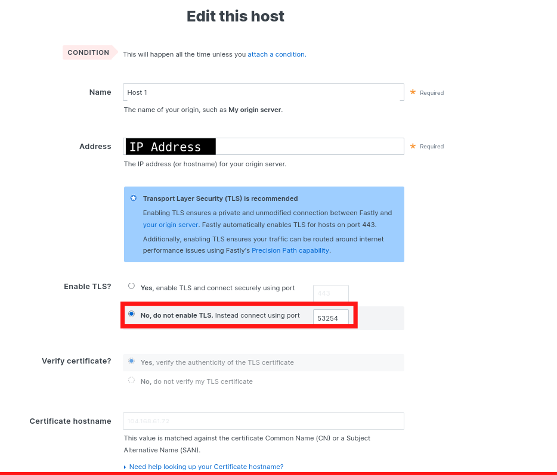   
  

> We can do inbounds to port 443(TLS port) and adjust inbound settings to have **Fallback** but that requires one to have an inbound config with TCP transport within the panel. 

A Fallback is when you want to expose only one standard HTTP/HTTPS port(80,443) to receive inbounds but want to use different protocols like VMESS,Shadowsock... with the same port.   
Fallback Can only be used with TCP/XTLS transport modes.   

  
  
Now from Settings >> 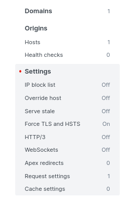   
we enable websocket.   
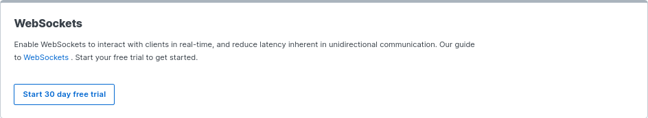 Start the trial and it should look something like this   
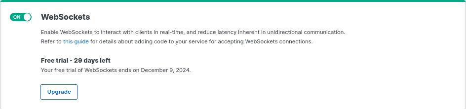   
Now lets add VCL for HTTP Connection Upgrade(Since we want to switch to Websocket)    
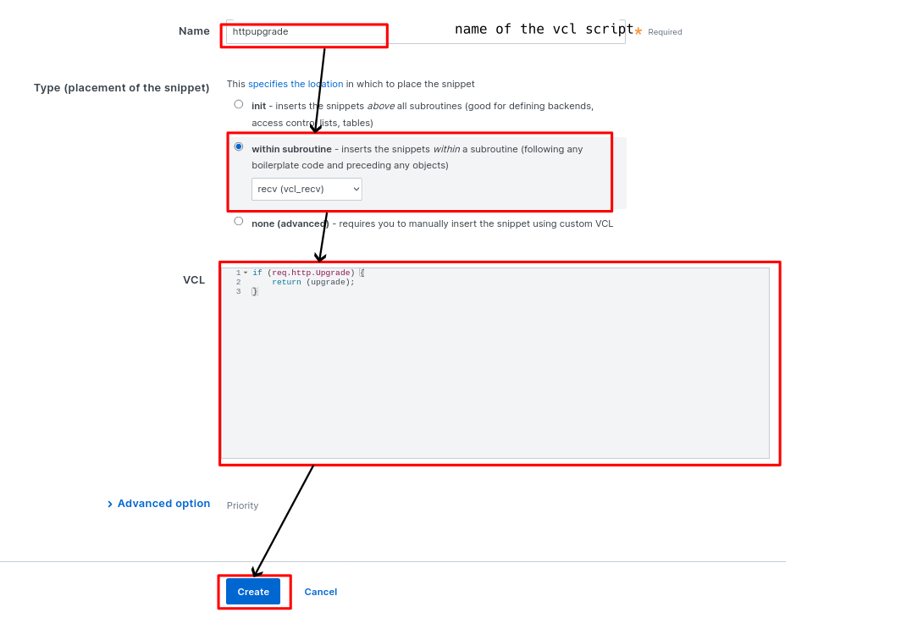
    
    
    if (req.http.Upgrade) {
    return (upgrade);
    }
                            
                            

## **Clientside Setup**

In this section we'll discuss how to connect to the prementioned setup using domain fronting technique. 

  * ### _Linux_

Copy the server config from panel(by clicking the qr-code) to clipboard.   
Open client app(v2rayN/nekoray)   
Ctrl + V   
and edit it as follows.   
For testing in Linux we are using v2rayN 

   
  
click **Confirm**   
  
If the connection was successful you'll see your server IP along with delay(ms) in the logs as well as on bottom right corner like this.    
You could toggle System Proxy to check connectivity, within browser and all.   
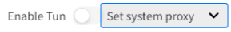   
  

## **Testing Tor**

  
  
go to **about:preferences#connection** change proxy settings as follows.   
(Proxy port shown in v2ray. So that connection made by tor will go through v2ray server) 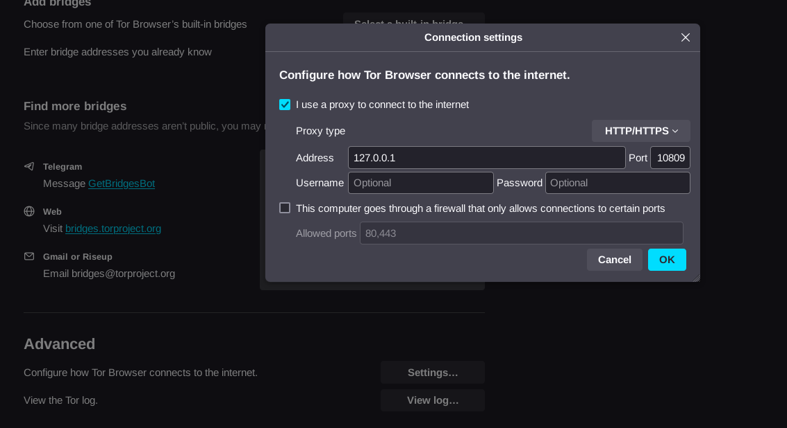   

> If we were to save it and try to connect **it will fail**. (connection died in state handshaking). **So enable Bridges**

Set Bridges of Your Choice   
   
  
  
This is how the traffic leaves the system.   
   
  
As you could see, traffic goes to fastly server rather than tor nodes.   
(You're seeing Websocket traffic to and from 192.168.1.2(LAN IP) to a Fastly CDN(Anycast IP))   

And that's it! we managed to connect to an onion website, from a heavily-censored country, thanks to v2ray.

