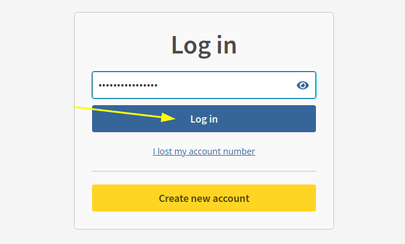
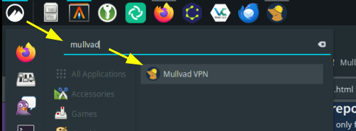
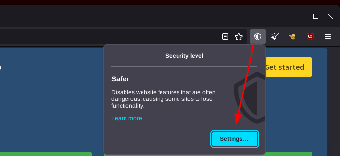
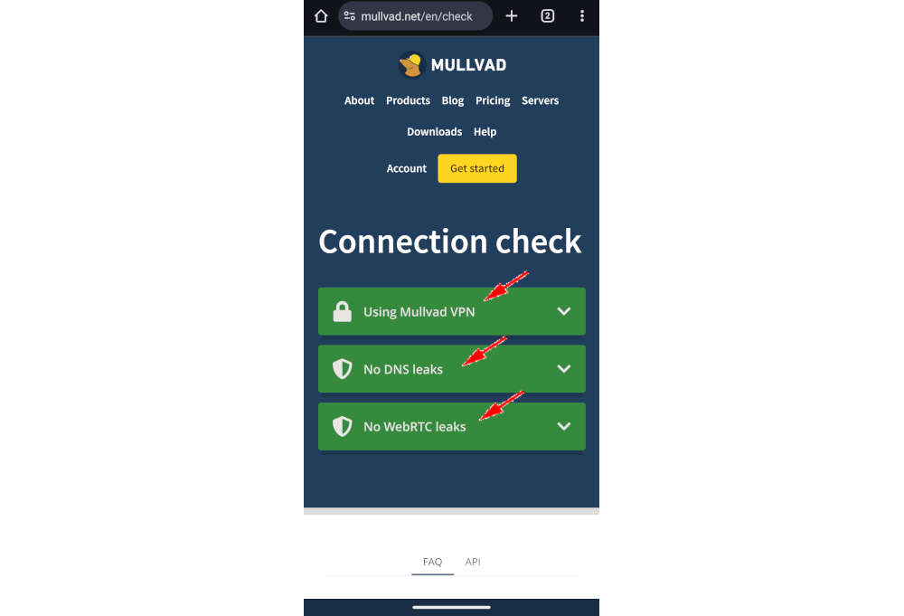

# How to get privacy from your ISP using a VPN 

```
TLDR: You can use a VPN to prevent your ISP from knowing which websites you're connecting to.
```

## _OPSEC Recommendations:_

  1. Hardware : PC / Laptop / Homeserver / Remote Server

  2. Host OS : [Linux](../linux/index.md)

  3. Hypervisor: [libvirtd QEMU/KVM](../hypervisorsetup/index.md)

  4. VM : [Linux](../hypervisorsetup/index.md)


I recommend to use that setup as part of your [Privacy Use](../privacy/index.md) online, to hide what you are browsing online from your ISP


## **Why does Bob need a VPN to begin with ?**

Bob now has [Linux](../linux/index.md) as his host operating system on his computer, with a debian private VM setup thanks to the [QEMU/KVM hypervisor](../hypervisorsetup/index.md). Now as per his private internet usage in his debian VM, he was thinking: **"My Debian VM only has open source software, but who else may spy on me?"**

As he browsed the web from his linux laptop he realised one thing; He's paying for an internet connection. A company is offering the internet service to his house.


Meaning, that when Bob is browsing the web on google.com; youtube.com or duckduckgo.com, his internet service provider can see that he's connecting there!

That doesn't sit well with Bob. **Bob decides that his ISP shouldn't be aware of what he's doing with his internet usage.** Therefore, he wants to use a VPN.


But thing is, Bob realises that the VPN market is over-saturated, there's a lot of choice. He wants to know what's the best VPN out there. After browsing for some time, he found this article from [Privacy Guides](https://www.privacyguides.org/en/vpn/) where they compare popular VPN services according to their standards. From there, Bob decides he's going to try to use [Mullvad VPN](https://kycnot.me/service/mullvad).

## **Purchasing a VPN**

Bob goes on mullvad.net to purchase the VPN (which is 5 euros monthly) 

   

Here Bob can pay with various means. For ease of use he can pay using his credit card for example, but as we'll see in later tutorials on [decentralised finances](../truecrypto/index.md), [Monero](../monero2024/index.md) is the ideal payment choice for financial privacy.

So Bob pays for the VPN, then his account has time added:

 
    
    
    # Download the Mullvad signing key
    sudo curl -fsSLo /usr/share/keyrings/mullvad-keyring.asc https://repository.mullvad.net/deb/mullvad-keyring.asc
    
    # Add the Mullvad repository server to apt
    echo "deb [signed-by=/usr/share/keyrings/mullvad-keyring.asc arch=$( dpkg --print-architecture )] https://repository.mullvad.net/deb/stable $(lsb_release -cs) main" | sudo tee /etc/apt/sources.list.d/mullvad.list
    # Or add the Mullvad BETA repository server to apt
    echo "deb [signed-by=/usr/share/keyrings/mullvad-keyring.asc arch=$( dpkg --print-architecture )] https://repository.mullvad.net/deb/beta $(lsb_release -cs) main" | sudo tee /etc/apt/sources.list.d/mullvad.list
    
    # Install the package
    sudo apt update
    sudo apt install mullvad-vpn
    	
    # Connect to Mullvad VPN
    mullvad account login
    Enter an account number: 91320912809328832
    Mullvad account "91320912809328832" set
    
    # Connect to the VPN:
    mullvad lockdown-mode set on
    mullvad connect
    
    curl ifconfig.me
    194.127.199.92
    

From there, Bob can launch the VPN from his desktop:



And he can see that his IP got changed accordingly to the location he picked: 


The VPN is also protecting against DNS and WebRTC leaks, according to <https://mullvad.net/en/check>

Now that you are using Mullvad as a VPN, you can also use their Mullvad Browser, which is basically a Hardened Firefox based off the Tor Browser:
    
    
    [ mainpc ] [ /dev/pts/3 ] [~/Nextcloud/blog]
    → apt search mullvad
    Sorting... Done
    Full Text Search... Done
    mullvad-browser/unknown,now 13.5.1-1 amd64
      Mullvad Browser
    
    mullvad-vpn/unknown,now 2024.4 amd64 [installed]
      Mullvad VPN client
    
    [ mainpc ] [ /dev/pts/3 ] [~/Nextcloud/blog]
    → apt install mullvad-browser -y
    
    [ mainpc ] [ /dev/pts/3 ] [~/Nextcloud/blog]
    → mullvad-browser
    
    

And from there you can browse the web using the same VPN connection:

 

From there, just like on the Tor Browser, you can protect against fingerprinting by setting the security level here:



If you want to reduce your fingerprinting attack surface as much as possible, you can choose to disable javascript by selecting the "Safest" security level, but it may break some websites functionnality.

   
  
  
  


## **Mobile Setup**

## _OPSEC Recommendations:_

  * Hardware: Google Pixel

  * Host OS: [Graphene OS](../graphene/index.md)

  * Configuration: Can be set in the Private or Anonymous Profile


Of course, Bob can set Mullvad up on mobile as well. He searches for Mullvad in the F-Droid store and then clicks Install. Leaving the default Network permission, he clicks Install on the pop-up. 

Once the app is downloaded, Bob opens it up. Bob agrees to the Mullvad's privacy policy and then grants notification permissions. Finally, he enters his account information and clicks Login. 

Mullvad will alert Bob to the fact that the connection is unsecured. Bob clicks Secure my connection to connect. If it is Bob's first time using Mullvad, he will need to grant it permission to establish a VPN connection. Bob should now be connected! 

To verify the mobile connection, Bob navigates to <https://mullvad.net/en/check> and ensures the connection is not leaking any information. 

## **Conclusion**

So now currently, Bob has managed to setup a Debian VM (with only open source software) with a VPN in order to use it and gain privacy from his ISP.


Currently, Bob's setup is suitable for Public use (thanks to his windows VM), AND suitable for Private use too (thanks to his debian VM with the VPN setup).

However you can also setup the [VPN from the Host OS directly](../vpnqemu/index.md), so that every VM in it goes through the VPN. 

Next, Bob can setup KeepassXC to implement proper [Password Management](../passwordmanagement/index.md).

