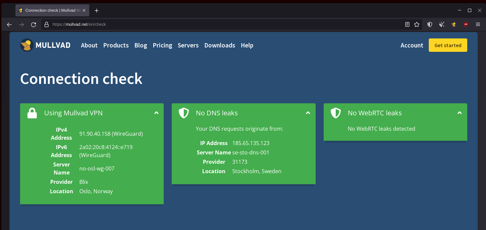

# Prevent IP leaks using a VPN on the Host OS

When you are using your laptop and segmenting your internet uses with VMs, you need to take into account that the services that you are running inside your VMs may try to connect to external services:

## **Targeted Setup**

What we need here is a VPN on the Host OS level, that way every connection that any of the VMs try to make will be routed through the VPN, to prevent direct IP connection leaks from being percieved by the ISP and the external websites.

## Mullvad Installation

First, install the VPN like we saw previously [here](../vpn/index.md), but the only difference being that we now install it on the Host OS, rather than inside the VM.
    
    
    # Download the Mullvad signing key
    sudo curl -fsSLo /usr/share/keyrings/mullvad-keyring.asc https://repository.mullvad.net/deb/mullvad-keyring.asc
    
    # Add the Mullvad repository server to apt
    echo "deb [signed-by=/usr/share/keyrings/mullvad-keyring.asc arch=$( dpkg --print-architecture )] https://repository.mullvad.net/deb/stable $(lsb_release -cs) main" | sudo tee /etc/apt/sources.list.d/mullvad.list
    # Or add the Mullvad BETA repository server to apt
    echo "deb [signed-by=/usr/share/keyrings/mullvad-keyring.asc arch=$( dpkg --print-architecture )] https://repository.mullvad.net/deb/beta $(lsb_release -cs) main" | sudo tee /etc/apt/sources.list.d/mullvad.list
    
    # Install the package
    sudo apt update
    sudo apt install mullvad-vpn

    # Connect to Mullvad VPN
    mullvad account login
    Enter an account number: 91320912809328832
    Mullvad account "91320912809328832" set

## Lockdown Mode

Then, configure mullvad as follows to prevent IP leaks from happening:

    # Connect to the VPN:
    mullvad lockdown-mode set on
    mullvad connect
    
    curl icanhazip.com -4
    91.90.40.158

From there you can check from the host OS that you have access to the internet via the VPN:

Here as you can see there are no ip leaks from the Host OS anymore, but as you're going to see, it is also the case from the VM aswell:

From there, you need to make sure that your private VM has it's network interface set as "NAT" as it is by default (be aware that if the VM network interface is configured as macvtap or bridge, the traffic won't go through the host OS VPN!).

And then once applied, you can check if it works as intended from inside the VM (all that's required is for the VM to have a NAT connection), by going to <https://mullvad.net/en/check> from inside the VM:

## Conclusion

And here as you can see, there are no IP leaks either from the guest OS!

That concludes our tutorial.
