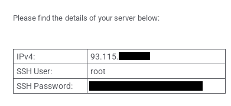

# Deniably Renting a VPS from the Sensitive-Use VM

```
TLDR: if you anonymously rent VPSes via the Sensitive VM, you can deny having rented those VPS services in the first place.
```

Here we're going to explain from a high level how to rent and manage a totally deniable VPS.

## Why do I need this?

For context let's look at our set of layout from our [segmented VM strategy](../internetsegmentation/index.md):


Specifically, we are looking at the **Sensitive Identity**. We want the highest OpSec possible, as we are using it for our secure backups and file storage on a remote VPS that we do not want anyone to even know exists.

## Planning our Setup

With all that in mind, in order to accomplish this we need to fulfill the following:

1. A **Kicksecure host OS** on our physical machine and a randomly **rotating VPN connection** on our host that will back our VM's TOR connection.
2. Our **Sensitive VM** ready to use on our host machine, along with a method of quickly **rebooting to re-encrypt** the drive and keep the Hidden Volume as hidden
3. A **VPS provider** from which we can be totally anonymous from. This means we should be able to **pay with XMR** and access their site as well and their management console entirely from an Onion address. We will also setup a method to **SSH into the VPS purely over onion**.

Here we see our network flow in play:


You can see this gives us a couple layers of network deniability. And of course we're paying XMR which severs the last possible remote link between us and the VPS.

## 1. Install Rotating VPN on Host Machine

This assumes you've setup the Host Machine for Sensitive use as per [**this guide**](../livemode/index.md)

Afterward, please refer to [**this guide**](../mullvadvpn-daily-connect/index.md) for a complete guide on setting up a randomly-rotating Mullvad VPN connection.

## 2. Install Whonix VM and Setup Emergency Shutdown

We are going to use the Sensitive VM concept, so we will be installing **Whonix on a VM inside of a VeraCrypt Hidden Volume** to further our deniability. We also need to setup an **emergency shutdown plan**.


All that is needed for this is contained in [**this guide**](../sensitivevm/index.md).

Another option for your emergency shutdown is to use a **USB drive that will automatically reboot your machine when disconnected**. You can create your own by following our guide [**here**](../usbdeadmansswitch/index.md)

Another option is to buy or make a **Buskill**. This uses a magnetically-tripped USB connection to be able to disconnect easily and instantly, to trigger a shutdown. More info is found [**here**](http://www.buskillvampfih2iucxhit3qp36i2zzql3u6pmkeafvlxs3tlmot5yad.onion/) and [**here**](http://tech.michaelahgu3sqef5yz3u242nok2uczduq5oxqfkwq646tvjhdnl35id.onion/2020/01/02/buskill-laptop-kill-cord-dead-man-switch/) (onion sites)

In any case, our emergency shutdown will look like this:


There is also a method you can do to make sure that your shutdown will happen quickly, which you should see and implement from [**this guide**](../hypervisorsetup/index.md#bonus-speeding-up-the-host-os-shutdown-in-case-if-vms-are-still-active-and-blocking-the-shutdown-sequence)

Before we continue to the next part we need to install the `ssh` package on our Whonix VM. We do this by rebooting the VM, booting into SysMaint mode, Opening the terminal, and installing with our package manager:
```
sudo apt update
sudo apt install ssh
```


Then we can reboot again into our normal Daily Activities mode

## 3. Purchase VPS and access via SSH Onion Service

Here we'll go through all the steps to purchase a VPS over TOR and access it via SSH over an onion service. Everything we do here will be done inside of the Whonix VM, of course.

First we need to choose a provider. We're going to use Servers Guru ([Clearweb](https://servers.guru/) | [Onion](http://srvguru7bjzzjba7xy2hnx2ju4k77qy4eum2h3tgudwc3j2zof4aggyd.onion/)), we also recommend Cockbox ([Clearweb](https://cockbox.org/) | [Onion](http://dwtqmjzvn2c6z2x462mmbd34ugjjrodowtul4jfbkexjuttzaqzcjyad.onion/) | [Tutorial](../anonymousremoteserver/index.md)). You can find reviews for these and many other Non-KYC VPS providers on **KYCnot.me** ([Clearweb](https://kycnot.me/) | [Onion](http://kycnotmezdiftahfmc34pqbpicxlnx3jbf5p7jypge7gdvduu7i6qjqd.onion/) | [I2P](http://nti3rj4j4disjcm2kvp4eno7otcejbbxv3ggxwr5tpfk4jucah7q.b32.i2p/))

When we go to the provider's website we're going to choose a VPS and then checkout and pay with Monero. The exact steps will depend on your provider but will be something similar.

One consideration you need to think about here is that this VPS is for your Sensitive Identity and is meant to persist through any arrests or seizures of your local personal property. So think about how long you want to rent the VPS for, you may want to keep it topped-up for 1 year long or more.

Depending on your provider you may be prompted for an email, it's highly recommend to use **Morke Email** ([Onion only](http://6n5nbusxgyw46juqo3nt5v4zuivdbc7mzm74wlhg7arggetaui4yp4id.onion/)), it's lightweight and has unrestricted signups, perfect for a single-purpose use like this.


Once you get your server provisioned it's time to access the server via SSH. With the server provider I'm using, my details were sent via email but yours may be on your account dashboard.



Then open a terminal and login to your server:
```
ssh root@93.115.xx.xx
# then type in the password when it asks
```


This will be over the 3-hop TOR->Clearnet connection, but now we'll setup an onion service on the VPS so we can access over onion.

While logged into the VPS, we need to install the TOR service onto it:
```
sudo apt install tor # install the package
sudo systemctl enable tor # enable so it always runs
sudo systemctl restart tor # start the service
sudo systemctl status tor # check that it's running
```


Next we need to define a new onion service. We edit our TOR config file by using **`sudo nano /etc/tor/torrc`**, then adding these lines to the end of the file:
```
# SSH over Tor
HiddenServiceDir /var/lib/tor/ssh
HiddenServicePort 22 127.0.0.1:22
```
Use Ctrl+S to Save and Ctrl+X to exit nano

To make this take effect, we must restart the TOR service, to re-read the config file:
**`sudo systemctl restart tor`**

This will create a random onion address for us. We view this like so:
```
% sudo cat /var/lib/tor/ssh/hostname
mynewonionaddress.onion # outputs the address
```
Then we execute the **`exit`** command to close our current ssh connection to the VPS. We will now re-establish the ssh connection, but this time over the onion service:
```
ssh root@mynewonionaddress.onion
# type in your password afterward
```


## File transfer over SSH Onion

You can use the onion SSH service to use any SSH-based file transfer protocols, such as Secure Copy:

```
# run from your Whonix VM terminal, not logged into the VPS
# hello.txt is a text file in our current directory, /root is the directory on the VPS we wanna put the file into
% scp hello.txt root@myonion.onion:/root
```


## Long-term preservation

Be sure you have all your account info, passwords, keys, etc all encrypted and backed up and placed in secure locations, so that you can restore your critical sensitive data and survive multiple takedowns from the adversary.

In a scenario where **you are arrested or get your personal property seized/destroyed**, **the adversary is left empty-handed**, and they can force you to type your password (even ordered by the judge) but that won't allow them to prove the existence of the VeraCrypt hidden volume because **you will type the decoy volume password instead of the real one**, which **won't expose the existence of your hidden volume or VPS**.


Worst case scenario, you can't get your hardware back, or any of your USB keys either, so after you're free again you get new hardware, **re-setup the sensitive VMs, and then you access that anonymously-rented VPS again to retrieve your critical sensitive backup files**.

When you're ready to get you VPS back, if you don't have any of your USBs, you'll either have to have your IP and SSH key, or your VPS customer panel login info, memorized. Once you get into your VPS you can copy your files back to your local machine:

```
scp root@95.115.55.56:/root/keepass.kdbx ~/Documents/
# type in ssh key/password
```


Full setup and explanation for all this is given [**here**](../plausiblydeniabledataprotection/index.md)

## Conclusion

**Now you have a fully deniable way to rent and manage a VPS server.** The TOR connection and rotating VPN gives us network level deniability and our hidden VM that can be re-encrypted with a reboot at a moment's notice gives us physical deniability.

