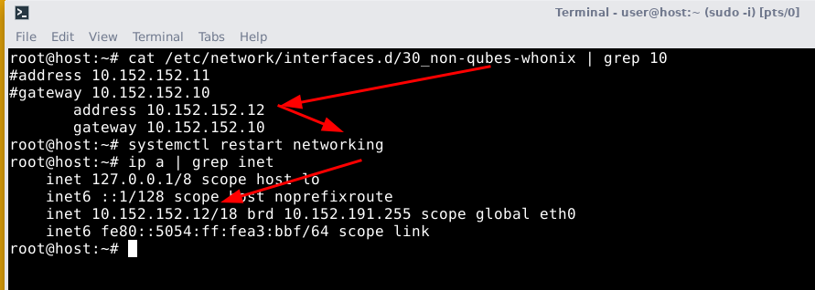
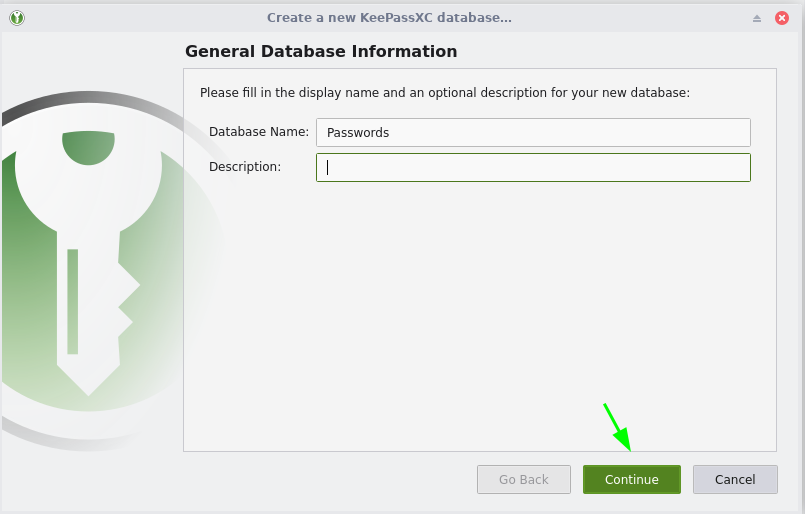
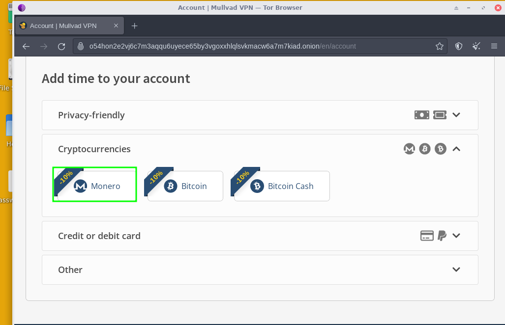
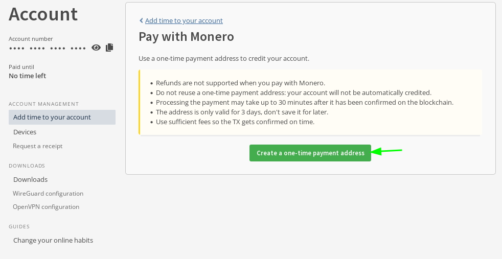
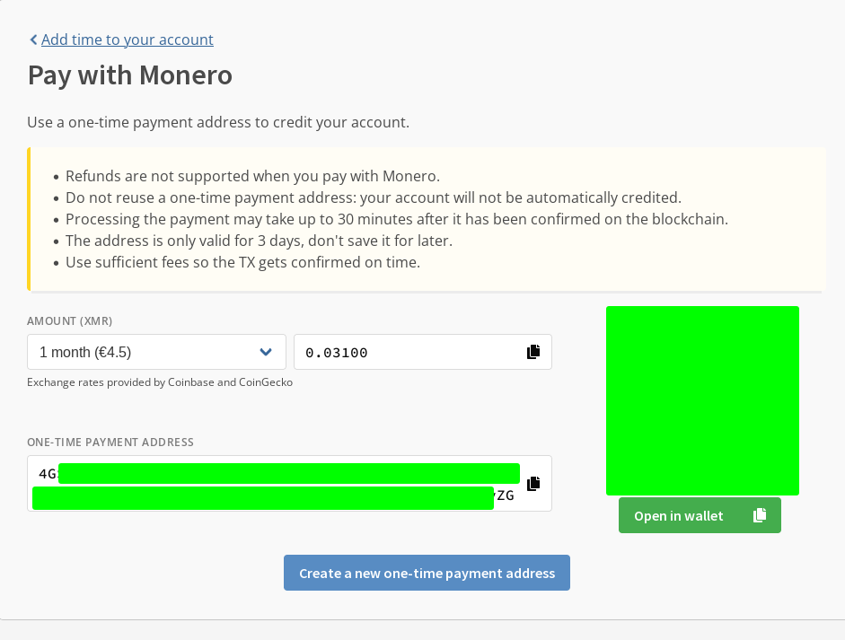
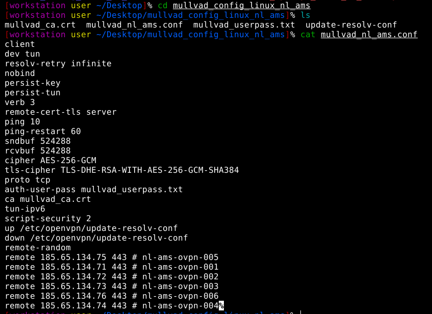
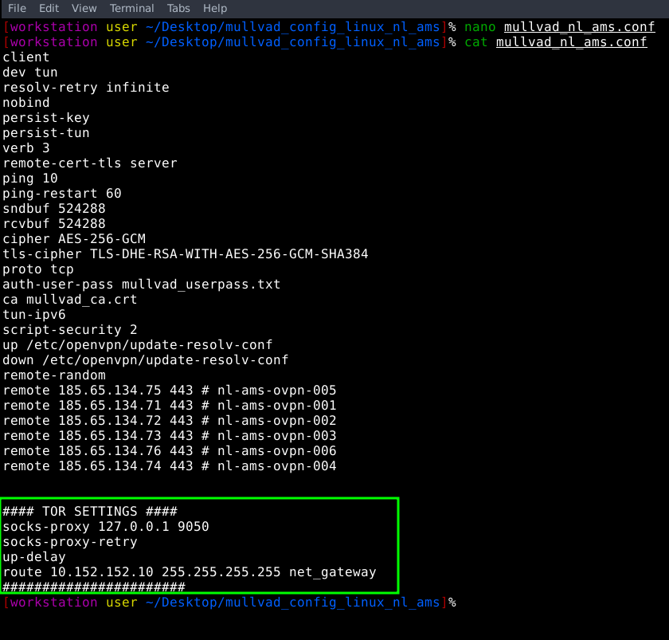
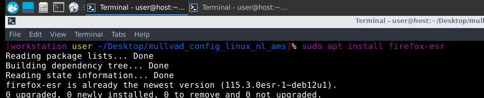
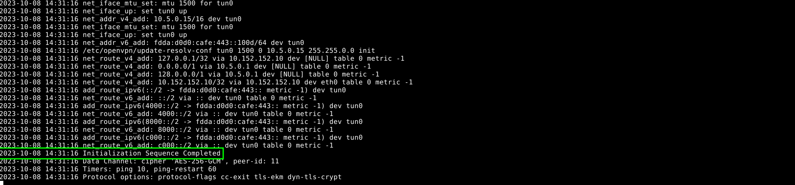
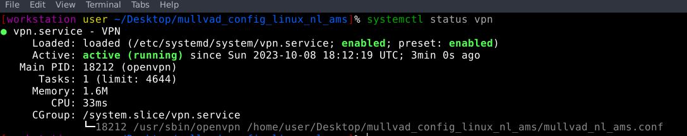

# How to Anonymously access websites that block Tor

```
TLDR:
- if a website blocks Tor traffic, use a (you -> Tor -> VPN setup)
- if a website blocks VPN traffic, use a (you -> Tor -> Residential proxy setup)
```

In this tutorial we're going to cover how we can circumvent a website's attempts at blocking Tor traffic, by using a VPN. As we discussed [previously](../torthroughvpn/index.md), this is relating to the serverside context required to know if we should combine the use of Tor with the use of a VPN. 


**Here we are using a VPN to hide from the website owner that we are connecting via Tor.** Effectively giving off the impression that we are only connecting via a VPN, while in reality Tor is protecting our Anonymity on the IP level. Now we also need to preserve our Anonymity when we are renting and using the VPN, that's why we have to use [MullvadVPN](../vpn/index.md) as they don't care who's using their service (they allow both [Tor connections](../torbrowsing/index.md) and[ Monero](../monero2024/index.md) payments). **We are also blending in their large userbase.** (which would not be the case if we were using a VPS with openvpn on it, in which we would be the only one to use it).


_DISCLAIMER:_ Be aware that when doing a (you -> Tor -> VPN -> website) setup, you are getting rid of the stream isolation that is there by default in Whonix, **making every application in that Whonix VM go through one circuit, rather than through many circuits.** Over time this can lead to traffic use correlation if you start to use this VM for every other Anonymous use.


So keep in mind that **a website blocking Tor traffic is the only scenario in which you need a (you -> Tor -> VPN -> website) setup. the rest of your anonymous activities are to remain in a regular Whonix VM (you -> Tor -> website) setup !**

## _OPSEC Recommendations:_

  1. Hardware : (Personal Computer / Laptop)

  2. Host OS: [Linux](../linux/index.md)

  3. Hypervisor: [libvirtd QEMU/KVM](../hypervisorsetup/index.md)

  4. Application: [Host-based VPN](../index.md) (if your ISP doesn't allow Tor traffic) 

  5. VM: [Whonix VMs](../whonixqemuvms/index.md) (for any regular long-term Anonymous Use)


I recommend using this setup into one of the above mentioned VMs, for [Anonymous use](../anonymityexplained/index.md), as per the [4 basic OPSEC levels](../opsec4levels/index.md).

_Sidenote:_ If your ISP does not allow Tor traffic, make sure that you [route the QEMU VMs traffic through a VPN](../vpnqemu/index.md), to hide the tor traffic from your ISP (You -> VPN -> Tor) Setup


## **Setting up the VM second Whonix Workstation VM**

Now the first thing to do here is that we copy the existing the second workstation which will be used as the vpn over tor setup later on so let's copy the .xml and .qcow2 after shutting down the existing workstation:

Be careful that you need 100Gb for the Whonix Gateway, 100Gb for the Whonix Workstation, and another 100Gb for the Whonix Workstation with the VPN setup we want to make. **So you need a total of 300Gb disk space at least!**
    
    
    [ nowhere ] [ /dev/pts/0 ] [/mnt/veracrypt1]
    → ls
    lost+found     WHONIX_BINARY_LICENSE_AGREEMENT  Whonix-Gateway.qcow2  Whonix-Workstation.qcow2
    refreshvms.sh  WHONIX_DISCLAIMER                Whonix-Gateway.xml    Whonix-Workstation.xml
    script.sh      Whonix-external.xml              Whonix-internal.xml
    
    [ nowhere ] [ /dev/pts/0 ] [/mnt/veracrypt1]
    → cp Whonix-Workstation.qcow2 Whonix-Workstation-vpn.qcow2
    
     nowhere ] [ /dev/pts/23 ] [/mnt/veracrypt1]
    → cp Whonix-Workstation.xml Whonix-Workstation-vpn.xml
    
    [ nowhere ] [ /dev/pts/0 ] [/mnt/veracrypt1]
    → cp Whonix-Workstation.xml Whonix-Workstation-vpn.xml
    
    

Then edit the new xml file to match the new VM name:
    
    
    [ nowhere ] [ /dev/pts/23 ] [/mnt/veracrypt1]
    → vim Whonix-Workstation-vpn.xml
    
    [ nowhere ] [ /dev/pts/23 ] [/mnt/veracrypt1]
    → cat Whonix-Workstation-vpn.xml | grep Workstation2
      <****name>Whonix-Workstation-vpn <**/name>
          <****source file='/mnt/veracrypt1/Whonix-Workstation-vpn.qcow2'/>

Then we include it in the script.sh script:
    
    
    [ nowhere ] [ /dev/pts/23 ] [/mnt/veracrypt1]
    → cat script.sh
    
    #!/bin/bash
    
    if [ $(virsh -c qemu:///system list --all | grep Whonix | wc -l) -ne 0 ];
    then
    
    	# if the VMs are imported, remove them:
    
    	virsh -c qemu:///system destroy Whonix-Gateway
    	virsh -c qemu:///system destroy Whonix-Workstation
    	virsh -c qemu:///system destroy Whonix-Workstation-vpn
    	virsh -c qemu:///system undefine Whonix-Gateway
    	virsh -c qemu:///system undefine Whonix-Workstation
    	virsh -c qemu:///system undefine Whonix-Workstation-vpn
    	virsh -c qemu:///system net-destroy Whonix-External
    	virsh -c qemu:///system net-destroy Whonix-Internal
    	virsh -c qemu:///system net-undefine Whonix-External
    	virsh -c qemu:///system net-undefine Whonix-Internal
    else
    
    
    	# if the VMs are not imported, import them:
    
    	virsh -c qemu:///system net-define /mnt/veracrypt1/Whonix-external.xml
    	virsh -c qemu:///system net-define /mnt/veracrypt1/Whonix-internal.xml
    	virsh -c qemu:///system net-autostart Whonix-External
    	virsh -c qemu:///system net-start Whonix-External
    	virsh -c qemu:///system net-autostart Whonix-Internal
    	virsh -c qemu:///system net-start Whonix-Internal
    	virsh -c qemu:///system define /mnt/veracrypt1/Whonix-Gateway.xml
    	virsh -c qemu:///system define /mnt/veracrypt1/Whonix-Workstation.xml
    	virsh -c qemu:///system define /mnt/veracrypt1/Whonix-Workstation-vpn.xml
    	# then exit because we dont want to run the rest of wipe.sh
    	exit $? 
    fi
    
    
    [ nowhere ] [ /dev/pts/23 ] [/mnt/veracrypt1]
    → ./script.sh
    
    Network Whonix-External defined from Whonix-external.xml
    
    Network Whonix-Internal defined from Whonix-internal.xml
    
    Network Whonix-External marked as autostarted
    
    Network Whonix-External started
    
    Network Whonix-Internal marked as autostarted
    
    Network Whonix-Internal started
    
    Domain 'Whonix-Gateway' defined from Whonix-Gateway.xml
    
    Domain 'Whonix-Workstation-vpn' defined from Whonix-Workstation-vpn.xml
    
    Domain 'Whonix-Workstation' defined from Whonix-Workstation.xml
    
    

Then edit the new workstation VM to have the 10.152.152.12 ip by default (since the other one has the 10.152.152.11 ip):

 

You need to keep in mind that currently we have not given out any information about ourselves, other than we've used Tor. We won't stop there, and in order to use a VPN anonymously, you need to acquire it through Tor, buy it with Monero, and force the VPN Connection itself through Tor. Cherry on top is that we're going to use a well-used VPN service, so we won't be the only user with that public VPN ip. But what matters is that we do not give any information about us to the VPN provider. If the VPN provider forces you to provide anything personal (if the vpn provider blocks tor connections, or forces you to buy it with something else than monero), then it would not truly be a non-KYC VPN provider, and thus it's against your privacy. That's the only way you can find out which ones are all just marketing.


Now that's done we can go find a vpn provider for the workstation2, let's try out the very praised mullvad vpn provider [here](https://kycnot.me/service/mullvad), Firstly because it's a non-KYC VPN provider (meaning you can acquire it and use it through Tor, and pay with Monero), also due to the fact that we won't be the only ones using that service, it means we won't need to change the VPN server when we want to have another identity online. On top of that, mullvad gives us the ability to connect to a random server of theirs, via openvpn via TCP on port 443, which is definitely neat because it mimicks web HTTPS traffic, and isn't blockable by tor exit node hosters (which is definitely a trend, most of them block ports that are suceptible to abuse, 443 https being the least likely of them): 

 

now to not loose your accesses , make sure to save credentials in a local keepass database on the VM.

  

Now let's add time to our account, and of course we will pay with [the only cryptocurrency that's used](https://iv.nowhere.moe/watch?v=YTTac2XjyFY):

 

To get some monero you can buy it on localmonero.co, and make sure it arrives on your monero wallet inside the whonix VM, never trust centralised exchanges with your assets, always keep them locally.


Once it finishes installing, create your monero wallet:


Then say no to mining and use an onion-based monero daemon, like the one i'm hosting, you can find a full list of other ones [here](https://monero.fail/):


Wait for it to finish synchronizing, then get some monero from a vendor on localmonero.co (by giving them a wallet address you'd have created: 

 

Once you've paid, download the .ovpn file to connect via vpn:


Then unzip and let's now make sure the vpn goes through tor:

 

To do that we need to make sure the VPN goes through the local SOCKS port 9050, and to mention the entry node which is the gateway 10.152.152.10:



before we launch it keep in mind this:



Then launch the VPN and you can then see that you no longer have a tor exit node IP:

 

Now check your ip from Firefox, not the tor browser:


You can also check if there are any DNS leaks:


here we see the test revealed a dns ip leak, but upon checking (in shodan.io) we see that it's a tor exit IP address:


We can also check if there are any WebRTC leaks:


and there we see that there are no webRTC leaks either, so it's all good.

To make sure the vpn is started automatically we can make it a systemd service:
    
    
    root@workstation:~# cat /etc/systemd/system/vpn.service
    [Unit]
    Description=VPN
    After=network-online.target
    Wants=network-online.target
    
    [Install]
    WantedBy=multi-user.target
    
    [Service]
    Type=simple
    WorkingDirectory=/home/user/Desktop/mullvad_config_linux_nl_ams/
    ExecStart=/usr/sbin/openvpn /home/user/Desktop/mullvad_config_linux_nl_ams/mullvad_nl_ams.conf
    ExecStop=kill -9 $(pidof openvpn)
    Restart=always
    
    root@workstation:~# systemctl daemon-reload ; systemctl enable --now vpn.service ; systemctl restart vpn.service
    
    

` 

Now thanks to that, you can still browse websites anonymously in case if they block tor exit nodes. However as stated above, make sure that you leave the rest of your Anonymous use in the regular Whonix VM, as there is no stream isolation in the Whonix-Workstation-VPN VM.

