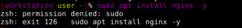

# Anonymous VM Setup - Whonix QEMU VMs 

```
TLDR: you can use Whonix VMs to perform any activity you want to perform anonymously, because it transparently routes all traffic through Tor.
```


Whonix is an open-source set of 2 VMs, "**Whonix Workstation**" and "**Whonix Gateway**", based on a hardened debian 12 OS, made specifically for general anonymous activities, which has been built with hardening in mind. In this tutorial we're going to set it up using the [QEMU virtualization](../hypervisorsetup/index.md) setup we installed previously.

Whonix transparently routes all TCP and DNS data through Tor ([DNS over Tor](../dnscrypt/index.md)) to prevent data leaks. It does this by **forcing all your network traffic from your Workstation VM (on which you will do all your normal tasks), through the Gateway VM**, which in turn routes everything through the Tor network. There are no direct connections to the clearnet whatsoever, **only through the Gateway, then through the Tor circuit, then to the destination**.


## _OPSEC Recommendations:_

  1. Hardware : (Personal Computer / Laptop)

  2. Host OS: [Linux](../linux/index.md)

  3. Hypervisor: [libvirtd QEMU/KVM](../hypervisorsetup/index.md)

  4. Application: [Host-based VPN](../vpnqemu/index.md) (if your ISP doesn't allow Tor traffic) 


I recommend using this setup into one of the above mentioned VMs, for [Anonymous use](../anonymityexplained/index.md), as per the [4 basic OPSEC levels](../opsec4levels/index.md).

_Sidenote:_ If your ISP does not allow Tor traffic, make sure that you [route the QEMU VMs traffic through a VPN](../vpnqemu/index.md), to hide the tor traffic from your ISP (You -> VPN -> Tor) Setup. Also we recommend to consider setting up [scheduled server rotation for your VPN](../mullvadvpn-daily-connect/index.md)


## **Initial Setup**

Make sure that you have setup the QEMU / virt-viewer setup we described in [this](../hypervisorsetup/index.md) earlier tutorial

Then install download the whonix VMS as follows:

First go [here](https://www.whonix.org/wiki/KVM) to download whonix for qemu, 


Then extract the .xz file where you want the image to be at:
    
    
    [ 10.8.0.3/24 ] [ nowhere ] [~/Downloads]
    → tar -xvf Whonix-Xfce-17.3.9.9.Intel_AMD64.qcow2.libvirt.xz -C ~/VMs
    WHONIX_BINARY_LICENSE_AGREEMENT
    WHONIX_DISCLAIMER
    Whonix-Gateway.xml
    Whonix-Workstation.xml
    Whonix_external_network.xml
    Whonix_internal_network.xml
    Whonix-Gateway-Xfce-17.3.9.9.Intel_AMD64.qcow2
    Whonix-Workstation-Xfce-17.3.9.9.Intel_AMD64.qcow2
    
    [ 10.8.0.3/24 ] [ nowhere ] [~/Downloads]
    → cd ~/VMs
    
    [ 10.8.0.3/24 ] [ nowhere ] [~/VMs]
    → touch WHONIX_BINARY_LICENSE_AGREEMENT_accepted
    
    [ 10.8.0.3/24 ] [ nowhere ] [~/VMs]
    → ls -lash
    total 7.9G
    4.0K drwxr-xr-x 2 nothing nothing 4.0K Dec 29 20:10 .
    4.0K drwxr-xr-x 4 nothing nothing 4.0K Dec 29 20:09 ..
     40K -rw-r--r-- 1 nothing nothing  39K Oct 21  2015 WHONIX_BINARY_LICENSE_AGREEMENT
       0 -rw-r--r-- 1 nothing nothing    0 Dec 29 20:10 WHONIX_BINARY_LICENSE_AGREEMENT_accepted
    8.0K -rw-r--r-- 1 nothing nothing 4.1K Oct 21  2015 WHONIX_DISCLAIMER
    4.0K -rw-r--r-- 1 nothing nothing  172 Oct 21  2015 Whonix_external_network.xml
    2.7G -rw-r--r-- 1 nothing nothing 101G Oct 21  2015 Whonix-Gateway-Xfce-17.3.9.9.Intel_AMD64.qcow2
    4.0K -rw-r--r-- 1 nothing nothing 2.3K Oct 21  2015 Whonix-Gateway.xml
    4.0K -rw-r--r-- 1 nothing nothing   97 Oct 21  2015 Whonix_internal_network.xml
    3.8G -rw-r--r-- 1 nothing nothing 101G Oct 21  2015 Whonix-Workstation-Xfce-17.3.9.9.Intel_AMD64.qcow2
    4.0K -rw-r--r-- 1 nothing nothing 2.3K Oct 21  2015 Whonix-Workstation.xml
    1.4G -rw-r--r-- 1 nothing nothing 1.4G Dec 29 20:06 Whonix-Xfce-17.3.9.9.Intel_AMD64.qcow2.libvirt.xz
    

To simplify the use of the XML files i recommend renaming them like so:

    [nihilist@nowhere VMs]$ mv Whonix-Workstation-Xfce-17.3.9.9.Intel_AMD64.qcow2 Whonix-Workstation.qcow2
    [nihilist@nowhere VMs]$ mv Whonix-Gateway-Xfce-17.3.9.9.Intel_AMD64.qcow2 Whonix-Gateway.qcow2

So now we have the qcow2 files, so we need to edit our XML config files by pointing to those qcow2 files and also giving them 4GB of RAM each:
    
    [ 10.0.2.2/24 ] [ nowhere ] [~VMs]
    → vim Whonix-Gateway.xml # edit with vim. you can also use nano if you prefer
    
    [ 10.0.2.2/24 ] [ nowhere ] [~/VMs]
    → vim Whonix-Workstation.xml

The edits should look like this for Whonix-Gateway.xml:


And like this for Whonix-Workstation.xml


    
With those edits, the Whonix VMs are ready to be added to the virt-manager, by using several commands. We'll create a simple Bash script `refreshvms.sh` that will remove existing Whonix VM if existing, then will define and create new ones in the virt-manager. Your script should look like this:
    
    
    [nihilist@nowhere VMs]$ cat refreshvms.sh 
    #!/bin/bash
    
    #remove VMs
    
    virsh -c qemu:///system destroy Whonix-Gateway
    virsh -c qemu:///system destroy Whonix-Workstation
    virsh -c qemu:///system undefine Whonix-Gateway
    virsh -c qemu:///system undefine Whonix-Workstation
    virsh -c qemu:///system net-destroy Whonix-External
    virsh -c qemu:///system net-destroy Whonix-Internal
    virsh -c qemu:///system net-undefine Whonix-External
    virsh -c qemu:///system net-undefine Whonix-Internal
    
    echo '[+] VMs removed, re-install them ? (ctrl+c to exit)'
    read
    
    #install VMs
    
    virsh -c qemu:///system net-define Whonix_external*.xml
    virsh -c qemu:///system net-define Whonix_internal*.xml
    virsh -c qemu:///system net-autostart Whonix-External
    virsh -c qemu:///system net-start Whonix-External
    virsh -c qemu:///system net-autostart Whonix-Internal
    virsh -c qemu:///system net-start Whonix-Internal
    virsh -c qemu:///system define Whonix-Gateway.xml
    virsh -c qemu:///system define Whonix-Workstation.xml

You can run it like so (when it asks you to re-install, just press Enter):

    [nihilist@nowhere VMs]$ chmod +x refreshvms.sh 
    [nihilist@nowhere VMs]$ sudo ./refreshvms.sh 
    [sudo] password for nihilist: 
    error: failed to get domain 'Whonix-Gateway'

    error: failed to get domain 'Whonix-Workstation'

    error: failed to get domain 'Whonix-Gateway'

    error: failed to get domain 'Whonix-Workstation'

    error: failed to get network 'Whonix-External'
    error: Network not found: no network with matching name 'Whonix-External'

    error: failed to get network 'Whonix-Internal'
    error: Network not found: no network with matching name 'Whonix-Internal'

    error: failed to get network 'Whonix-External'
    error: Network not found: no network with matching name 'Whonix-External'

    error: failed to get network 'Whonix-External'
    error: Network not found: no network with matching name 'Whonix-External'

    [+] VMs removed, re-install them ? (ctrl+c to exit)

    Network Whonix-External defined from Whonix_external_network.xml

    Network Whonix-Internal defined from Whonix_internal_network.xml

    Network Whonix-External marked as autostarted

    Network Whonix-External started

    Network Whonix-Internal marked as autostarted

    Network Whonix-Internal started

    Domain 'Whonix-Gateway' defined from Whonix-Gateway.xml

    Domain 'Whonix-Workstation' defined from Whonix-Workstation.xml

You should now see them in the `virt-manager` GUI. Select the Gateway VM and click the Play button to turn it on. Do the same for the Workstation VM, then click the Open button to view your workstation desktop.


When starting up the Gateway VM, you may or may not get an error like `/var/lib/libvirt/dnsmasq/virbr1.macs.new No such file or directory`. This is due to a bug in one of the packages needed for running VMs. You can easily fix this by creating the directory it's looking for:

```
% sudo mkdir /var/lib/libvirt/dnsmasq
```

## **Basic Whonix Usage**

On the Whonix Gateway VM you can open Onion Circuits on the gateway VM to view the tor connections being built up in real time like so :


And inside the Workstation VM you can browse the web using the Tor browser just like in the [previous tutorial](../torbrowsing/index.md):


## Whonix Hardening Features

If you try to run sudo commands from inside the user account you'll see that it's not possible, which is intentional, [here's why](https://www.kicksecure.com/wiki/Dev/Strong_Linux_User_Account_Isolation):



To go around that issue you need to reboot the Workstation VM, to boot into persistent mode, into the sysmaint user:


This is where you'll be able to run sudo commands:


For example we install neofetch to display the system specs:


```sh
[workstation root ~]# reboot now
```


Then, after rebooting into the regular user mode, we see that neofetch is installed as intended:


And thats it! you now have a VM ready to be used for your Anonymous activities, 

Now if you want to remove the user and sysmaint separation, you can select the "Remove user-sysmaint-split - enable unrestricted admin mode" boot option like we did in the [Kicksecure Host OS tutorial.](../linux/index.md)