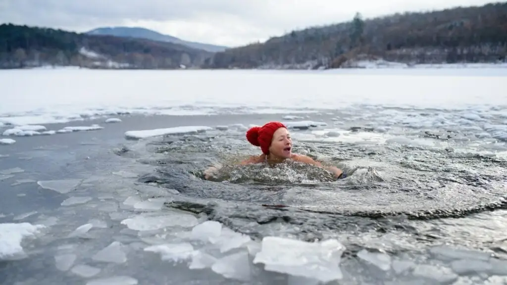

# Cold Exposure: Where Discipline takes over Comfort 

What the body and mind don't want, but actually needs. The perfect discipline practice. 

## **The benefits of Cold Exposure**

There is a common misconception out there, that cold is bad, because supposedly it makes you catch colds. But reality is that the cold is what you need to expose yourself to, to be able to reinforce your immune system, to prevent yourself from falling sick, such as catching colds.

The first and foremost benefit is **immune system reinforcement** , as it enhances immune function and increases the number of white blood cells, which play a crucial role in fighting infections and cancers.

Cold exposure has a significant impact on **metabolic health, as it activates the brown fat** , it increases the energy expenditure and promotes weight loss. Unlike white fat (that people want to get rid of), brown fat's activation allows you to feel more comfortable in cold temperatures, how big of a furnace you have to generate heat for your own body depends on the density of that Brown fat.

Cold exposure **improves glucose and lipid metabolism, on top of enhancing insulin sensitivity** , which reduces risk factors associated with metabolic diseases such as obesity and type 2 diabetes.

Exposing yourself to cold temperatures **reduces inflammation** by constricting your blood vessels, it helps in reducing pain in arthritis for instance

It also aids in **muscle recovery, benefiting from the inflammation reduction** as explained above. (if muscle growth is the goal, you'll need to wait one hour after exercising, to expose yourself to the cold, but that's not our goal here.) 

Most importantly, cold exposure improves your **mental health and mood** , the primary mechanism at work is the release of norepinephrine and dopamine, which acts as a mood booster, promoting feelings of alertness and wellbeing.
    
    
    This is essentially the opposite of indulging into too much pleasure, which would "spike" and deplete your dopamine of the day (leaving you depressed for the rest of the day), which would lower your baseline. **Instead you are intentionally entering a stressful situation** , which causes your dopamine to gradually increase for many hours after the cold exposure. Leaving you with a ton of energy to do your work in the morning.
    
    

Cold exposure, also aids in brain health, the activation of cold shock proteins enables specific proteins crucial for rebuilding synapses (the connections between the nerve cells)

## **How to practice Cold Exposure**

There are a few methods to do Cold exposure, you have Ice baths, Cryotherapy, jumping into the nearest lake, **or more simply (and cheaply) Cold Showers.**

How cold ? Resistance to cold temperatures varies from person to person. So we'll go with the following scale : 

  1. Pleasant temperature

  2. Neutral temperature

  3. **Slightly cold temperature**

  4. **Uncomfortably cold, yet safe temperature**

  5. Dangerously cold temperature

What we're aiming for here is **your current "uncomfortably cold, yet safe" temperature**. If you were to try my current "uncomfortably cold" temperature (as i have been practicing cold exposure daily for more than 8 months), your heart would probably stop immediately, so stay within the safezone, do not force yourself.

How long ? **At the minimum 11 minutes per week** is what you need to be able to have positive results. 

If you want to see more benefits, try to make it even more. My daily shower is approximately 10 minutes long, and now, i take it ice cold right from the beginning, the whole time. For me this amounts to a little more than 60 minutes of cold exposure per week, where for me the benefits are undeniable (for example remaining in contact with my entire family (that caught colds) without getting any of it for 2 whole weeks, remaining OK the whole time and after).

**WARNING VERY IMPORTANT:** You are reinforcing your immunary system by breathing in and out as much air as you possibly can, **so you need to intentionally slow down and deepen your breathing** , while undergoing the cold exposure. Check out [Wim Hof's breathing method](https://www.youtube.com/watch?v=0BNejY1e9ik) for more details on that:

At first when you are starting to adapt to the cold, you'll have to breathe intentionally as described above, but later down the road you won't need to do it anymore.

As the goal is to gradually work up your cold tolerance, if you want to do it like i did, put the shower temperature at the "slightly cold" temperature, and every day, **very slightly turn it down, to a slightly lower temperature, without ever turning the temperature up again.** The temperature either stays the same (at that slightly cold temperature) or goes down, but it must never go back up again.

You'll probably be suprised to see after a while, that the heat you usually sought when entering the shower no longer needs to come from the water, **the heat comes from your own Body.** That's when you know the brown fat is being activated. **This is a clear reminder, that what can be achieved from outside, can also be achieved from within.**

## **The Morning Battle**

You are waking up early today, your body wants to remain in bed, but you decide that you are going to get up early.

Because you do not intend to let your body decide things on it's own, You make it stretch entirely with [the yoga practice](../yoga/index.md) of your choice. 

Great, you started to control over your body for the day, it's time to get it to refine the blade now.

It's also time to get control over your own mind now. What does it want ?
    
    
    "Come let's go back in the bed and stay warm, put on that cover and turn up the heater!"
    
    

But after reading all the benefits of cold exposure above, you're not going to miss out are you ?

There's only one thing you need to remember: **That water is as cold as it needs to be, it is perfect the way it is.**

Take your time to get used to the cold water, take your time. Start with the hands, then the arms, then the shoulders, then the legs, then the crotch area, then the belly, then the torso, then the back, and lastly the neck, the head and your face for last.

Then as usual, clean yourself, **but without ever turning up the temperature** , take your time to finish cleaning yourself, there's no rush.

## **Digging deeper**

If you want to see faster progress, and are willing to dig deep into it like i did, directly switch to that uncomfortably cold temperature, You will see that your body is going to make you breathe through your mouth instinctively. it's going to be a vivid reaction at first, the typical fight or flight stress response. 

Look at how your body is reacting: gasping for air, **and instinctively breathing deeply**

Listen to what your mind is saying: "Get me out of here! Turn the temperature up!"

_Controlling the Body:_

With the cold water flowing down from the head downward onto the rest of your body, stay immobile, with your joined hands together. Stop breathing through your mouth, only breathe through your nose, and try to breathe more slowly, in a controlled manner.

_Controlling the Mind:_

In that same posture, once your Body is firmly in your control, and breathing steadily, see if you can think up the [3 Nihilism Mantras](../nihilism/index.md) with each inhalation and exhalation:
    
    
    Opus Nihil: to dissolve your compulsions
    Inhalation: I want nothing,
    Exhalation: I need nothing
    
    Scio Nihil: to dissolve your beliefs
    Inhalation: I know nothing,
    Exhalation: I know nothing else
    
    Sum Nihil: to dissolve your identities
    Inhalation: I am nothing,
    Exhalation: I am noone
    
    

You will see, in that stressful situation it will not be easy to get your mind to repeat those mantras with each inhalation and exhalation consistantly, but once you are able to do that, while doing your daily cold exposure, this is when both your mind, and your body are taking instructions from you. This is when you can truly say that you have chosen [Discipline over Comfort.](../discipline/index.md)

