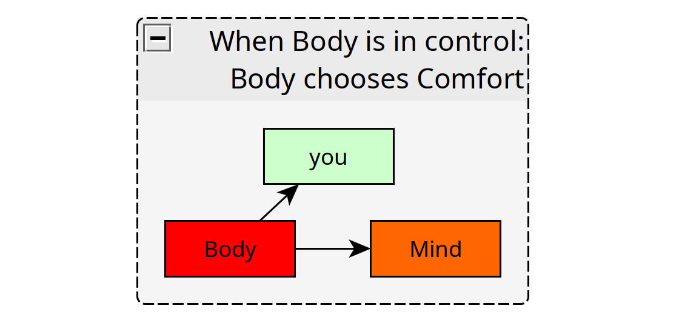
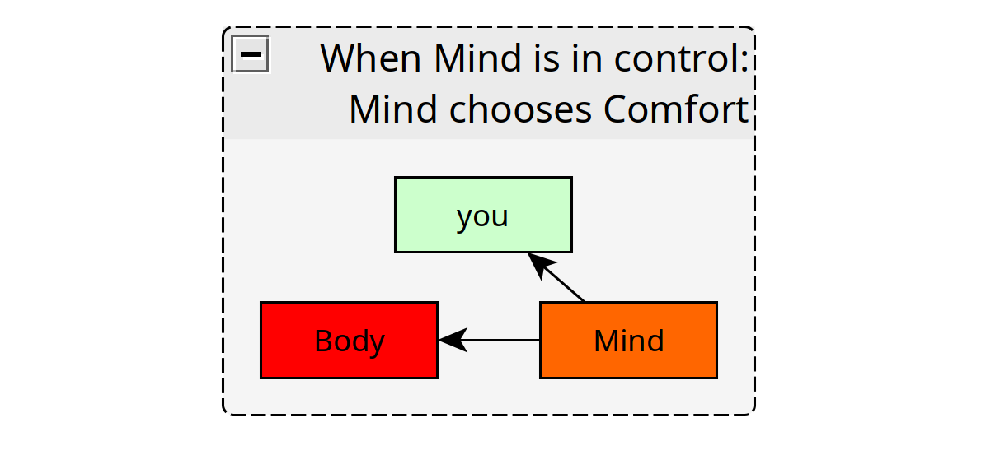
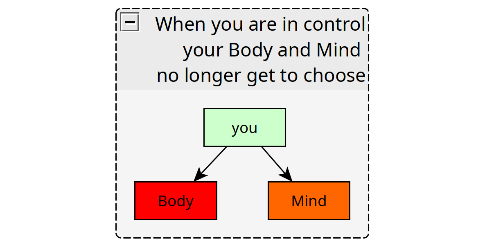

# Discipline over Comfort 

Who is the one in control ? Who is taking the decisions in your life ?

## **When the Body chooses**

Over time, ever since you were born, you gathered a heap of food that you call your body.

Over time, you have let this body of yours do what it wanted or prefered.

The sweet and good-tasting food and drinks, the sweet comfort of the bed, the heater turned up high, or maybe even substances that you didn't need in the first place...

**Now, if you were locked up in an empty room for one week, with just 2 meals per day, could your body remain at ease the entire time ?**

Tell me, are you truly the one in control here ? 

## **When the Mind chooses**

Over time, ever since you were born, you gathered a heap of information from outside, that you call your mind.

Over time, you started to believe that you were things that you have never been, and you have strongly identified with those things.

With those identities that you have gathered, your perception of the world has narrowed, to protect that which you identified with.

With that narrowed view, and with most certainly shame being brought upon ignorance, you have also started to believe, things that you do not truly know.

Few of those beliefs, may include things that you do not truly want, and things that you do not truly need.

**Now, if you are being left in a room for one week with nothing to do, could your mind remain quiet, at ease the entire time ?**

Tell me, are you truly in control here aswell ?

## **You are not this Body, nor this Mind.**

Is this Body a weight that you have to drag every day? Or is it a reliable tool at your disposal to do anything you want ?

**You are not your Body, your Body should not get to decide for you.**

Is this Mind an unstoppable cacophony ? Or is it a platform for you to reflect on the past, act in the present, and project into the future ? 

**You are not your Mind either, your Mind should not get to decide for you either.**

If you want to claim to be the one in control of your life, **Discipline is the answer,** for your Body, and your Mind, before anything else. 

Why does it matter what your Body wants, or what your Mind wants? Should they do their own thing, and not take orders from you ?

**Your tendency to give in to Comfort is what has led you to forsake the control you were supposed to have over your Life.**

