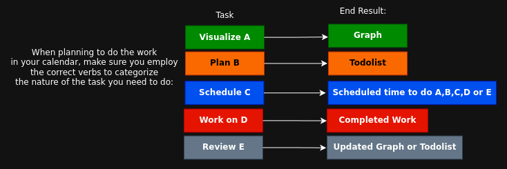

# The General Workflow (Visualize, Plan, Do, and Review the Work)

In this tutorial we're going to explain what the general workflow is, to make sure that you never get lost trying to complete projects.

## **Why is this important ? In which context ?**

Have you ever felt like you were going in circles, or even felt overwhelmed when trying to carry out a project ? 

If you're like me, you've likely been in this situation more than once, especially if your plans include carrying out projects that take thousands of hours to complete.

**You need a general workflow, that is defined from the start, and that you can always go back to, to make sure that you never get lost, while trying to complete a project.**

## First step: Visualize the end goal

Either you know exactly what you're talking about from the start, meaning that the end goal vision is already crystal clear from inside your head, or you're like me and you probably need to make a graph to make sure that your idea is fully detailed (brainstormed) from start to finish.


With a clear graph that details each step, in which order, with all of their relevant characteristics, with meaningful colors, the end goal idea is now set in stone and there's no more ambiguity about it. With a clear graph fully brainstormed, you're now ready to write todolists to achieve the targeted result.

## Second Step: Plan the Work

As covered in [this tutorial](../microworkflow/index.md), the next step is to write what must be done, in the correct order. 

Be warned however, if the project is very complex, you cannot escape the first visualization step. Because to effectively write every todolist properly, you first need to have a clear vision of what you want to achieve, **so if the vision is not clear yet, the todolists you write are bound to lack context and details.**

I faced this myself first-hand at work when i under-estimated the complexity of a given project and i ended up going in circles. So when you realize that you can't do the work because you didn't account for some crucial details, know that it's time to go back to the whiteboard, to clarify the vision of the end goal.


Make sure that **Each todolist must be doable in ONE day.** 

**If the todolist is too big, you are going to feel overwhelmed by it.** It means that you need to split it into other todolists.

This is about segmenting the mountain of work into chunks that you can do. Do not try to take the weight of the entire mount Evrest upon your shoulders, because it'll overwhelm and break you. 

## Third step: Schedule the work

Now that you know what to do, it's time to decide when you're going to do it:

Follow my tutorial on how to use your [calendar](../macrotime/index.md) for productivity, but also don't forget to use the correct verbs when you schedule time to do something, as it will help you to understand what needs to be done:



- **Visualize A**: you need to produce a graph
- **Plan B**: you need to write a todolist
- **Schedule C**: you need to book some time in your calendar 
- **Work on D**: you need to act out what you set out to do in your todolist
- **Review E**: you need to find what was missed in the todolist or graph and update it

That way you're explicit enough in what the nature of the work is, and you wont get lost trying to act it out, clarity on what must be done is paramount to actually get there.

## Fourth Step: Doing the work


The steps are now listed, in chunks that you can action, time to actually do the work.

```
You intend to reach the summit of mount Evrest, so you get in your car and started driving.
The roads that lead up to that peak are all twisted, turning, sharp turns, dangerous roads.

Do you think you're going to reach the summit while only staring at the peak? 
Or do you think you're going to reach the summit while only focusing on the next step in front of you ?
```

The only thing that truly matters for you right now, is reaching the next step that is in front of you right now. 

The rest of the steps are of no consequence to you right now, and especially not the mountain peak. 100% of your attention at any given moment in time must be on reaching that next step.

It is very discouraging to try to do everything at once, because nobody can do everything at once. 

**The success of you reaching your distant destination depends on how much attention you've put into that one next step that was relevant to you at any given point in time along the way.**

## Fifth Step: Reviewing the Work


If at any point in time you're stuck or lost in your work, that can only mean one of 2 things:

- **you either forgot to list a crucial step in the todolist,**
- **or you didn't fully brainstormed the end goal in the visualization graph.**

That means that you either have to go back to the drawing board to adjust the visualization graph, to finish brainstorming the idea completely, or you have to go back to the todolist and the steps you missed.

## Conclusion

And that's it! thanks to this tutorial you now know what the general workflow is, where it starts and where it ends. So if at any point in a given project you're feeling lost or stuck, make sure you remember your workflow and adjust your approach to it properly.

